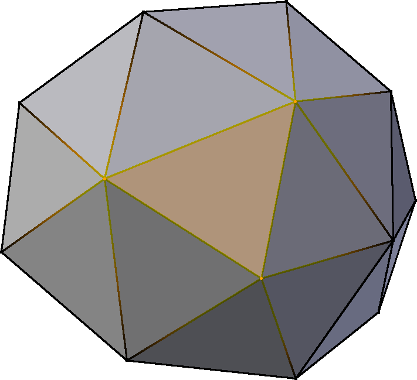
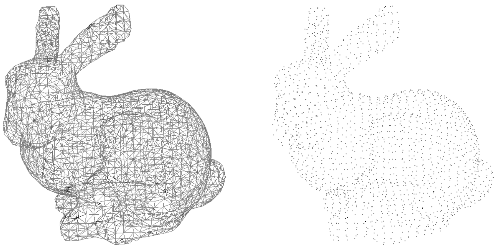
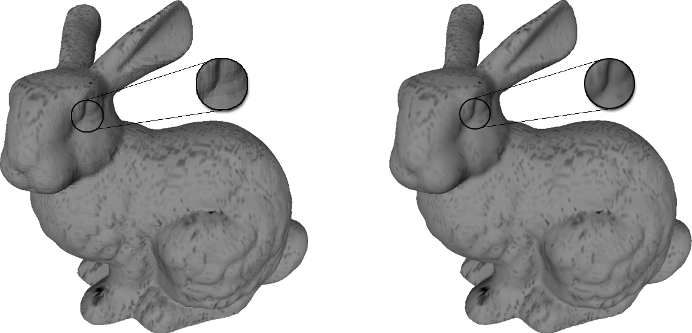
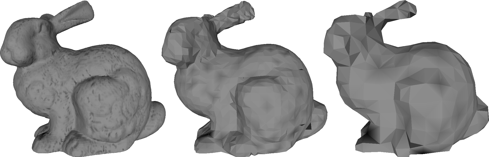

# 3D und Virtual Reality

## Übersicht

Im Gegensatz zu statischen zweidimensionalen Bildern können dreidimensionale Repräsentationen von Objekten aus jeder Richtung betrachtet, skaliert und rotiert werden. Ein Punkt in einem 3D-Modell wird von seiner Lage auf der x-, der y- und der z-Achse eines kartesischen Koordinatensystems beschrieben, wobei die z-Achse in diesem Zusammenhang üblicherweise die Tiefe, seltener die Höhe, angibt.

Virtual Reality (Virtuelle Realität) bezeichnet digitale dreidimensionale Welten, mit welchen in Echtzeit interagiert werden kann.

3D-Inhalte können auf unterschiedliche Weise entstehen: durch manuelle Modellierung, wie Rekonstruktionen von Gebäuden, durch Aufnahme, wie etwa einem 3D-Scan von Objekten, oder durch automatisierte Berechnung aus Fotos, wie etwa Photogrammetrie oder Structure from Motion. Von der Entstehungsweise hängen weitere Angaben für die Dokumentation ab, die über die hier angegebenen hinausgehen. Zusätzlichen Angaben sind in den jeweiligen Abschnitten in dem Kapitel Forschungsmethoden zu finden, wobei vor allem die Abschnitte Bauforschung, Geodäsie, Geodatenanalyse und Materialaufnahme von Interesse sind. Außerdem bieten die Ergebnisse des Projektes 3D ICONS umfangreiche Informationen zur Dokumentation von 3D-Aufnahmemethoden und die anschließende Verarbeitung.

### Langzeitformate

3D-Inhalte sollten in einem offen dokumentierten, textbasierten Format (ASCII) gespeichert werden. Dies ermöglicht bei Bedarf die Rückentwicklung unabhängig von einem bestimmten Programm.

Das zu verwendende Format hängt von der Entstehungsweise und dem Zweck des 3D-Inhaltes ab, da unterschiedliche Formate unterschiedliche Eigenschaften und Elemente speichern, wie beispielsweise Geometrie, Texturen, Lichtquellen oder Standpunkt und Bildausschnitt (auch Viewport genannt). Eine Übersicht über die Speichereigenschaften von den hier empfohlenen 3D-Formaten wird in der Tabelle im Abschnitt Vertiefung gegeben.

Das vom Web3D Consortium entwickelte Format X3D (eXtensible 3D Graphics) ist seit 2006 unter ISO/IEC 19775/19776/19777 zertifiziert und eignet sich sowohl zur Speicherung von einzelnen 3D-Modellen, als auch komplexer 3D-Inhalte, wie etwa Virtual Reality. Es ist das Nachfolgeformat von dem seit 2007 unter ISO/IEC 14772-1 zertifizierten VRML-Format und sollte diesem daher vorgezogen werden.

Ein weiteres für komplexe 3D-Inhalte geeignetes Format ist das von der Khronos Group entwickelte COLLADA (collaborative design activity, DAE), das seit 2012 unter ISO 17506 standardisiert ist.

Das U3D-Format bietet einen ähnlichen Funktionsumfang wie X3D und COLLADA und ist insbesondere für das Teilen von 3D-Inhalten in PDF-Dokumenten gedacht. Es ist nicht für die Langzeitarchivierung geeignet.

Die Formate OBJ, PLY und STL eignen sich nicht für komplexe Szenen mit Lichtquellen oder gar Animationen, bieten aber alle Eigenschaften, um die visuellen Oberflächeneigenschaften eines 3D-Objektes zu speichern.

Aus dem CAD-Bereich stammt das Format DXF, welches neben 2D-Inhalten auch 3D-Inhalte speichern kann. Dieses Format sollte nur verwendet werden, wenn die 3D-Inhalte mit CAD-Software erstellt wurden. In der Industrie werden als alternative Formate auch IGES und STEP verwendet.

Nicht für die Langzeitarchivierung geeignet sind programmspezifische oder binäre Formate, wie beispielsweise FBX, 3DS, MAX, SKP, BLEND, PRC oder NXS.

Um zukünftigen Nutzern einen schnellen Überblick über die 3D-Inhalte zu bieten, ist die zusätzliche Speicherung von Bild- oder Videodateien, die einen ersten Eindruck des Modells vermitteln, zu empfehlen.

Hinweis: Bei der Konvertierung von einem 3D-Format in ein anderes können bestimmte Informationen verloren gehen, wenn sie von dem Zielformat nicht unterstützt werden. Zusätzlich zu dem gewählten Archivierungsformat sollten die originalen Quelldateien, verwendete Texturdateien, Visualisierungen und alle weiteren Dateien, die für die Benutzung und das Verständnis des 3D-Modells relevant sind aufgehoben werden. In den entsprechenden Abschnitten in dem Kapitel Forschungsmethoden sind nähere Details zu finden.

Die Abkürzungen in der folgenden Tabelle geben die unterstützten Eigenschaften der 3D-Formate an: DG = Drahtgittermodell, P = Parametrisch, F = Farbe, X = Textur mittels Bild, B = Bumpmapping, M = Material, V = Viewport und Kamera, L = Lichtquellen, T = Transformationen, G = Gruppierung. Diese Begriffe werden in dem Abschnitt Vertiefung erläutert.

| &nbsp; | Format                                                       | Begründung                                                   |
| ------ | ------------------------------------------------------------ | ------------------------------------------------------------ |
| ✔      | X3D   COLLADA   OBJ    PLY | Das X3D-Format wurde vom Web3D Consortium entwickelt und ist seit 2006 ISO-zertifiziert. Es darf nicht mit dem proprietären Format 3DXML verwechselt werden. Speichert: DG, P, F, X, B, M, V, L, T, G und Animationen.  	COLLADA (.dae) wurde von der Khronos Group entwickelt und ist seit 2012 ISO-zertifiziert. Es basiert auf XML und speichert: DG, P, B-Rep, F, X, B, M, V, L, T, G und Animationen.  	Das offene OBJ-Format wurde von Wavefront Technologies entwickelt und hat eine weite Verbreitung gefunden. Material oder Texturen werden in gesonderten MTL- oder JPG-Dateien gespeichert, die auch archiviert werden müssen. Speichert: DG, P, F, X, B, M und G.  	Das Polygon File Format (acuh Stanford Triangle Format) ist ein einfaches Format, das an der Universität Stanford für Daten von 3D-Scannern entwickelt wurde. Mittels Erweiterungen kännten weitere Eigenschaften gespeichert werden, die aber nicht von jedem Programm unterstützt werden. Für die Langzeitarchivierung sollte die ASCII-Version verwendet werden. Speichert: DG, F, X, B und M. |
| 〰️     | VRML   STL      DXF | Die Virtual Reality Modeling Language ist das Vorgängerformat von X3D. Die jüngste Version wurde 1997 unter dem Namen VRML97 veröffentlicht. Speichert: DG, P, F, X, B, M, V, L, T, G und Animationen.   Das Format STL wurde von 3D Systems entwickelt. Es steht für stereolithography oder Standard Tessellation Language und findet weite Verbreitung im Bereich von 3D-Druckern und digitaler Fabrikation. Die ASCII-Variante des STL-Formats kann nur die Geometrie eines 3D-Modells speichern. Die Binärvariante des Formates ist weniger speicherintensiv und kann mit einer entsprechenden Erweiterung auch Farben des 3D-Modells speichern, ist aber nicht für die Langzeitarchivierung geeignet.   Das von Autodesk entwickelte Drawing Interchange Format stammt aus dem CAD-Bereich und sollte nur für 3D-Inhalte verwendet werden, die mit CAD-Software erstellt wurden. Speichert: DG, P, CSG, B-Rep, F und G. |
| ❌      | U3D     FBX  3DS, MAX SKP  BLEND  PRC   PDF   NXS | Das Universal 3D Format ist ein 2005 von der Ecma standardisiertes 3D-Format, das vom 3D Industry Forum mit Mitgliedern wie Intel und Adobe Systems entwickelt wurde. Dieses Format ist nur für die Integration von 3D-Modellen in ein 3D-PDF relevant. Speichert: DG, F, X, B, V, L, T, G und Animationen.  Ein proprietäres Format von Autodesk, für den Datenaustausch mit anderen kommerziellen 3D-Programmen.  Proprietäre binäre Formate von AutoDesk.  Natives Format von Google SketchUp.  Natives binäres Format von Blender.   PRC (Product Representation Compact) ist ein stark komprimiertes Format für den CAD-Bereich und für die Verwendung in 3D-PDFs, das unter ISO 14739-1 standardisiert ist.  3D-PDFs mit eingebetteten Modellen in U3D oder PRC eignen sich für einen unkomplizierten Datenaustausch, jedoch nicht für die Langzeitarchivierung.  Nexus ist ein von CNR-ISTI offen entwickeltes Format, für die Web-Visualisierung von 3D-Modellen. |

### Dokumentation

Für die Dokumentation von 3D-Inhalten sollten die Leitsätze der [Londoner Charta](http://www.londoncharter.org) berücksichtigt und eingehalten werden. Dabei ist insbesondere *"Leitsatz 4: Dokumentation"* wichtig, dessen erster Absatz lautet:

*"Es sollen genügend Informationen dokumentiert und weitergegeben  werden, um das Verstehen und Bewerten der computergestützten  Visualisierungsmethoden und -ergebnisse in Bezug auf die Zusammenhänge  und Absichten, für die sie eingesetzt werden, zu ermöglichen."*

Dazu gehören unter anderem die Dokumentation der Forschungsquellen,  die zur Erstellung des 3D-Modells herangezogen wurden, die Dokumentation der Prozesse, die im Verlauf der Modellerstellung durchlaufen wurden,  die Dokumentation der angewendeten Methoden und eine Beschreibung der  Abhängigkeitsverhältnisse zwischen den unterschiedlichen Bestandteilen.

Wenn das Dateiformat es erlaubt, sollte ein Teil der Metadaten zusätzlich dort integriert werden. Allerdings kann der Großteil der Metadaten nur extern abgelegt werden.

Die hier angegebenen Metadaten sind als minimale Angabe zu betrachten und ergänzen die angegebenen Metadaten für Projekte und Einzeldateien in dem Abschnitt Metadaten in der Anwendung.

| Metadatum                               | Beschreibung                                                 |
| --------------------------------------- | ------------------------------------------------------------ |
| Anzahl Eckpunkte                        | Aus wie vielen Eckpunkten besteht das 3D-Modell?             |
| Anzahl Polygone                         | Wie viele Polygone hat das 3D-Modell?                        |
| Geometrietyp                            | Welcher Geometrietyp wird verwendet (Drahtgittermodell, parametrisch, CSG, B-Rep etc.)? |
| Maßstab                                 | Welcher Maßstab liegt vor bzw. was stellt eine Einheit dar?  |
| Koordinatensystem                       | Wird ein geographisches Koordinatensystem oder ein beliebiges verwendet? |
| Modellstatus                            | Handelt es sich bei dem Modell um das ursprünglich erzeugte und  unverarbeitete Modell (den Master) oder ist es ein Modell, das mittels  weiterverarbeitenden Schritten, wie Füllen von Löchern, Vereinfachung  oder Glättung aus dem Master erzeugt wurde? |
| Detaillierungsgrad (LOD) oder Auflösung | Wie detailliert ist das Modell oder welche Auflösung wurde beim 3D-Scan verwendet? |
| Ebenen                                  | Werden Ebenen verwendet? Wie viele?                          |
| Farbe und Textur                        | Werden Farben oder Texturen verwendet? Wie werden diese gespeichert? Müssen zusätzliche Texturdateien archiviert werden? |
| Material                                | Informationen über die Materialeigenschaften des Modells und ob sie physikalisch korrekt sind. |
| Licht                                   | Informationen über die Lichtquellen und ob sie physikalisch korrekt sind. |
| Shader                                  | Werden spezielle, erweiterte Shader verwendet?               |
| Animation                               | Ist das Modell animiert? Welche Art von Animation wird verwendet (Keyframe, motion capture)? |
| Externe Dateien                         | Eine Liste aller externen Dateien, die für das Öffnen der Datei notwendig sind (z.B. Texturen). |

Weitere Metadaten sind methodenabhängig und können in den jeweiligen Abschnitten nachgelesen werden.

## Vertiefung

Ein übliches 3D-Modell besteht aus Eckpunkten (vertices), die Polygone beschreiben. Meistens handelt es sich dabei um Dreiecke. Sind die Eckpunkte und die zu den Polygonen gehörenden Kanten erfasst, spricht man von einem Drahtgittermodell (wire-frame model oder mesh). Sind nur die Eckpunkte erfasst, handelt es sich um eine Punktwolke, welche beispielsweise von 3D-Scannern erzeugt wird. Um eine Punktwolke weiter zu verarbeiten, muss diese vorher meist in ein Drahtgittermodell umgewandelt werden.

*Die gelb markierten Eckpunkte beschreiben das hervorgehobene Dreieck in dem 3D-Modell.*

 

Die Inhalte von 3D-Modellen können in drei Kategorien eingeteilt werden: Geometrie, Oberflächeneigenschaften sowie Belichtungs- und Kameraparameter. Zusätzlich kann noch eine Animation oder eine Interaktion hinterlegt sein. Aus diesen Angaben wird die Visualisierung berechnet. Dieser Vorgang wird als Bildsynthese bezeichnet (rendering) und resultiert in statischen Rastergrafiken, Videos oder interaktive Modelle.

 
*Das Stanford Bunny links als Drahtgittermodell und rechts als Punktwolke.*

 

### Geometrie

Die Form eines 3D-Modells kann mit vier verschiedenen Methoden beschrieben werden: durch ein Drahtgittermodell oder Facetten, parametrisch mit mathematisch beschriebenen Kurven und Flächen, mittels geometrischen Körpern, der sogenannten Konstruktiven Festkörpergeometrie, oder durch die begrenzenden Oberflächen, dem sogenannten Begrenzungsflächenmodell.

Drahtgittermodell: Hierbei wird die Form des 3D-Modells durch dessen Eckpunkte beschrieben, welche wiederum eine Reihe von Polygonen bilden, die zusammen die Oberfläche des Modells darstellen. Drahtgittermodelle sind einfach und schnell zu rendern, jedoch sind bei Detailansichten von konkaven oder konvexen Oberflächen immer die Flächen und scharfen Kanten der einzelnen Polygone erkennbar. Mittels sogenannten Shading-Algorithmen kann beim Rendern der Eindruck von gleichmäßigen Oberflächen generiert werden. Jedoch ist dann an der Kontur immer noch die polygonale Herkunft zu erkennen, wie in der Abbildung im Abschnitt Oberflächeneigenschaften dargestellt.

Eine Annäherung an eine gleichmäßige Oberfläche kann auch durch eine größere Anzahl an kleineren Polygonen erzielt werden, was aber zur Folge hat, dass die Dateigröße des Modells wächst.

Parametrische Darstellung: Viele Kurven und Flächen können mathematisch mit wenigen Parametern errechnet werden. Im Bereich der 3D-Grafik werden für die parametrische Darstellung häufig NURBS (Non-Uniform Rational B-Splines, nicht-uniforme rationale B-Splines) verwendet. Die Verwendung von mathematisch beschriebenen Kurven und Flächen erlaubt eine in der Detailliertheit der Oberfläche verlustfreie Skalierbarkeit. Wird ein 3D-Modell mit parametrischen Flächen in einem Format gespeichert, das diese nicht unterstützt, muss das Modell in Polygone umgerechnet werden, was dazu führt, dass Informationen der Oberflächenstruktur verloren gehen, was vergleichbar mit dem Informationsverlust bei der Konvertierung von einer Vektorgrafik in eine Rastergrafik ist.

Konstruktive Festkörpergeometrie: 3D-Modelle können, anstatt durch Eckpunkte, Flächen oder Kurven auch mit Hilfe von geschlossenen geometrischen Körpern konstruiert werden. Dabei kann die Vereinigung, die Differenz oder die Schnittmenge der Körper gebildet werden. Beispielsweise kann ein Verkehrshütchen aus der Vereinigung eines Kegels und eines flachen Quaders konstruiert werden. Daher wird diese Vorgehensweise als Konstruktive Festkörpergeometrie (Constructive Solid Geometry, CSG) bezeichnet. Sie erfordert die Speicherung sowohl der einzelnen geometrischen Körper, als auch der angewendeten Methoden, um eine spätere Bearbeitung der Modelle einfach zu ermöglichen. Insbesondere Dateiformate aus dem CAD-Bereich berücksichtigen dies. Eine Konvertierung von Formaten, die CSG unterstützen, zu denen, die keine unterstützen, führt zu Einschränkungen bei der Bearbeitbarkeit, da nur noch Polygone und deren Eckpunkte verändert werden können. Eine Konvertierung von einem Polygonformat zu einem CSG-Format ist nur schwer möglich.

Begrenzungsflächenmodell: Eine weitere Form der Speicherung der Geometrien von 3D-Modellen aus dem CAD-Bereich stellt das Begrenzungsflächenmodell (Boundary Representation, B-Rep) dar. Dabei wird das Modell durch dessen begrenzende Oberflächen beschrieben.

### Oberflächeneigenschaften

Neben der Form müssen für ein 3D-Modell auch Oberflächeneigenschaften gespeichert werden, die das Aussehen des Modells bestimmen. Neben der Farbe gehören dazu Texturen und Materialeigenschaften, die kombiniert zu einem sehr realistisch wirkenden 3D-Modell führen können.

Jedem Punkt einer Punktwolke oder den Eckpunkten und Polygonen können Farbwerte zugeordnet werden. Texturen können abstrakt als eine auf das Modell aufgebrachte Tapete verstanden werden. Beispielsweise kann auf einen einfachen Zylinder ein Bild von Holzmaserung aufgebracht werden, um einen Baumstamm fotorealistisch darstellen zu können. Dabei wird jedem Punkt im 3D-Modell ein Punkt aus dem zweidimensionalen Bild zugewiesen.

Auch die Materialeigenschaften können in einem 3D-Modell modelliert werden, um dem Objekt die gewünschten Reflexionseigenschaften zuzuweisen, denn ein Holztisch weist bei Beleuchtung andere Eigenschaften auf als ein Glastisch. Hierfür werden in dem Modell verschiedene Parameter gespeichert, welche diffuses Streulicht, spiegelndes Spekularlicht, Umgebungslicht, Transparenz, Lichtbrechung, Lichtemission etc. beschreiben.

Eine weitere Technik, um das Aussehen einer Oberfläche zu beeinflussen ist das Bumpmapping. Dabei werden mittels einer Textur die Normalenvektoren der einzelnen Polygone verändert, was dazu führt, dass die Schattierungen und Reflexionen auf der Oberfläche verändert werden und somit Oberflächenunebenheiten simuliert werden, die geometrisch eigentlich nicht vorhanden sind. Weitere Beispiele ähnliche Techniken sind Normal Maps oder Transparency Maps, welche den Schattenwurf, die Reflektion und die Transparenz eines Objektes beeinflussen können.

*Links: Eine Textur und deren Anwendung auf ein 3D-Modell. Rechts: Mittels Bumpmapping wurde das IANUS-Logo auf ein 3D-Modell aufgebracht. Es erweckt den Anschein einer dreidimensionalen Veränderung der Oberfläche, jedoch hat sich in der Geometrie des Modells nichts verändert, was an den Umrissen zu erkennen ist.*

 

Die Oberflächeneigenschaften werden mit Shadern beim Rendern visuell umgesetzt. Shader (dt. Schattierer) sind Programme, die mittels verschiedener Algorithmen unter Berücksichtigung der Lichtquellen die Farbe für jeden darzustellenden Pixel berechnen, um das Aussehen des 3D-Modells in der gerenderten Darstellung zu bestimmen. Ein Shader kann beispielsweise den Eindruck von gleichmäßigen Oberflächen erzeugen, wie in der Abbildung dargestellt.

*Das linke Modell wurde ohne speziellen Shader gerendert, weshalb die einzelnen Polygone zu erkennen sind. Wird auf das gleiche Modell ein glättender Shader angewendet, entsteht der Eindruck von gleichmäßigen Oberflächen, wie im rechten Teil der Abbildung.*

 

### Belichtungs- und Kameraparameter

Wie einem Nutzer ein 3D-Modell angezeigt wird, hängt von dem Szenenaufbau ab. Dazu gehören die Größe des Viewports, die Positionierung des 3D-Modells darin, die Position der Kamera und die Lichteinstellungen.

Der Viewport ist dabei vergleichbar mit einer Bühne, die den für die Darstellung zur Verfügung stehenden Bildausschnitt in seiner Höhe, Breite und Tiefe definiert. Für die Kamera muss nicht nur die Position, sondern auch die Blickrichtung gespeichert werden.

Werden 3D-Inhalte ohne Licht gerendert, wird ein schwarzes Bild erzeugt. Daher sind Lichtquellen notwendig, um die Szene auszuleuchten. Werden keine Angaben zu Anzahl, Position, Intensität und Art der Lichtquellen gespeichert, bleibt dies dem Nutzer überlassen oder sie werden gegebenfalls automatisch vom Programm gesetzt.

Die Szene kann ein oder mehrere Modelle umfassen, welche auch gruppiert werden können. Gruppierungen sind insbesondere dann notwendig, wenn ein Modell aus mehreren Teilen besteht. Dabei muss außerdem die Lage der Teile zueinander gespeichert werden. Es handelt sich dabei um Transformationen, die Verschiebungen, Drehungen oder Skalierungen der Objekte betreffen.

Bei der Darstellung von umfangreichen Szenen können unterschiedliche Detailstufen für die einzelnen Objekte verwendet werden. Beispielsweise kann eine Mauer im Vordergrund, nahe der Kamera sehr detailliert dargestellt werden, währen ein Baum weit im Hintergrund nur grob angedeutet werden muss, wobei der Detailgrad von 3D-Modellen dabei von der Anzahl der Polygone abhängt. Dieser Detaillierungsgrad wird als "Level of Detail" (LOD) bezeichnet und findet insbesondere dann Anwendung, wenn das Rendern von 3D-Modellen effizienter werden soll.

*Auswirkungen von verschiedenen Detaillierungsgraden (LOD) auf ein 3D-Modell. Das Stanford Bunny mit 69451, 3851 und 948 Polygonen.*

 

### Animation und Interaktion

Für Animation und Interaktion ist die Speicherung von zusätzlichen Parametern erforderlich. Dies muss bei der Wahl eines Archivierungsformates berücksichtigt werden und erfordert zusätzliche Angaben in der Dokumentation. Werden Animationen beispielsweise als Videodateien exportiert, sollten die Hinweise in dem Abschnitt Bewegte Bilder, Videos berücksichtigt werden.

### Speicherung der verschiedenen Eigenschaften

Nicht jedes 3D-Format unterstützt die Speicherung aller eben genannten Eigenschaften. Daher muss bei der Wahl des Speicherformates bedacht werden, welche Eigenschaften unbedingt erhalten bleiben sollen. Beispielsweise ist für ein gescanntes Objekt die Speicherung von Lichtquellen oder Animationen nicht unbedingt erforderlich, wohingegen bei einer Architekturrekonstruktion zur Darstellung von Lichtverhältnissen die Lichtquellen unerlässlich sind.

Eine Übersicht über die Speichereigenschaften der hier empfohlenen Formate zur Langzeitarchivierung gibt die folgende Tabelle. Sie beruht auf "K. McHenry, P. Bajcsy, An overview of 3D data content, file formats and viewers".

Unterstützte Eigenschaften von verschiedenen 3D-Formaten. DG = Drahtgittermodell/Facetten, P = Parametrisch, F = Farbe, X = Textur mittels Bild, B = Bumpmapping, M = Material, V = Viewport und Kamera, L = Lichtquellen, T = Transformationen, G = Gruppierung. Leere Zellen bedeuten entweder fehlende Speichereigenschaften oder es wurden keine Angaben in der jeweiligen Formatspezifikation gefunden.

| Format | Geometrie |      |      | .     | Aussehen |      |      |      | Szene |      |      |      | Anim |
| ------ | --------- | ---- | ---- | ----- | -------- | ---- | ---- | ---- | ----- | ---- | ---- | ---- | ---- |
|        | DG        | P    | CSG  | B-Rep | F        | X    | B    | M    | V     | L    | T    | G    |      |
| X3D    | ✓         | ✓    |      |       | ✓        | ✓    | ✓    | ✓    | ✓     | ✓    | ✓    | ✓    | ✓    |
| COLL.  | ✓         | ✓    |      | ✓     | ✓        | ✓    | ✓    | ✓    | ✓     | ✓    | ✓    | ✓    | ✓    |
| OBJ    | ✓         | ✓    |      |       | ✓        | ✓    | ✓    | ✓    |       |      |      | ✓    |      |
| PLY    | ✓         |      |      |       | ✓        | ✓    | ✓    | ✓    |       |      |      |      |      |
| VRML   | ✓         | ✓    |      |       | ✓        | ✓    | ✓    | ✓    | ✓     | ✓    | ✓    | ✓    | ✓    |
| STL    | ✓         |      |      |       | (✓)      |      |      |      |       |      |      |      |      |
| DXF    | ✓         | ✓    | ✓    | ✓     | ✓        |      |      |      |       |      |      | ✓    |      |
| U3D    | ✓         |      |      |       | ✓        | ✓    | ✓    |      | ✓     | ✓    | ✓    | ✓    | ✓    |

Die Tabelle ist nicht erschöpfend, da es noch viele weitere spezielle Eigenschaften von 3D-Inhalten gibt, die aber oft nur in spezialisierten, häufig proprietären Anwendungen und 3D-Formaten zum Tragen kommen. Daher ist außerdem zu empfehlen, dass die originalen Dateien ebenfalls archiviert werden, falls es sich dabei nicht schon um eines der hier angegebenen Formate handelt.

## Praxis

Im Umgang mit 3D-Inhalten müssen in der Praxis einige Details beachtet werden. Dazu gehören die Hinweise aus der Londoner Charta und dass bei der Konvertierung von einem Format in ein anderes Informationsverlust auftreten kann. Die Weitergabe von 3D-Modellen kann mittels verschiedenen Portalen oder auch mit 3D-PDF erfolgen, deren Erstellung in diesem Abschnitt erläutert wird.

### London Charter

Die Londoner Charta wurde 2006 ins Leben gerufen, um die digitale Visualisierung von Kulturgut so intellektuell und technisch rigoros wie andere etablierte Forschungsmethoden zu machen. Die Londoner Charta strebt danach, strenge Regeln im Umgang mit computergestützten Visualisierungsmethoden zu definieren. Es gibt sechs Leitsätze:

- Leitsatz 1 adressiert den Umgang mit der Londoner Charta.
- Leitsatz 2, Ziele und Methoden, regt dazu an, darüber nachzudenken, ob die computergestützte Visualisierungsmethode auch die geeignetste verfügbare Methode für den gewünschten Zweck ist.
- Leitsatz 3, Forschungsquellen, thematisiert die Auswahl und Dokumentation des Quellmaterials für eine Visualisierung.
- Leitsatz 4, Dokumentation, gibt wertvolle Hinweise darüber, was bei dem Entstehungsprozess des 3D-Inhaltes alles dokumentiert werden sollte, um das Verstehen und den Umgang mit den Inhalten zu erleichtern.
- Leitsatz 5, Nachhaltigkeit, behandelt die langfristige Zukunftsfähigkeit und vor allem die langfristige Benutzbarkeit von 3D-Inhalten.
- Leitsatz 6 thematisiert einen wichtigen Aspekt im Umgang mit Kulturgütern, nämlich den Zugang zum Kulturgut mittels computergestützten Visualisierungen. Auch der Zugang zu den Visualisierungen selbst wird besprochen.

- Londoner Charta: http://www.londoncharter.org/
- Deutsche Fassung der Londoner Charta: http://www.londoncharter.org/fileadmin/templates/main/docs/london_charter_2_1_de.pdf

### Konvertierung

In dem Abschnitt Vertiefung wurden die Speichereigenschaften von verschiedenen 3D-Formaten besprochen und in der Tabelle zusammengefasst. Die Speichereigenschaften spielen insbesondere dann eine Rolle, wenn von einem Format in ein anderes konvertiert werden muss, um beispielsweise von einem proprietären Format verlustfrei zu einem langzeitarchivfähigen offenen Format zu gelangen.

Wenn die Software, mit der das 3D-Objekt erstellt wurde, einen Export in eines der hier empfohlenen Formate zulässt, so ist diese Variante vorzuziehen. In manchen Fällen kann es jedoch sein, dass das gewünschte Zielformat nicht unterstützt wird und zunächst ein Export in ein Zwischenformat vorgenommen werden muss, welches anschließend mit einem weiteren Programm in das Zielformat überführt werden kann. Soll beispielsweise ein 3D-Objekt aus Blender in ein 3D-PDF integriert werden, könnte dieses etwa im OBJ-Format gespeichert werden und anschließend mit MeshLab in U3D konvertiert werden. Mit der ConversionSoftwareRegistry können Programme gefunden werden, die von einem Format in ein anderes konvertieren können, wobei eventuelle Zwischenformate auch berücksichtigt werden. Für die Konvertierung von umfangreichen 3D-Inhalten gibt es auch spezialisierte kommerzielle Programme, wie beispielsweise Polytrans und NuGraph der Firma Okino.

- Blender: http://www.blender.org/
- MeshLab: http://meshlab.sourceforge.net
- ConversionSoftwareRegistry: http://isda.ncsa.illinois.edu/NARA/CSR/php/search/conversions.php
- Okino (Polytrans/Nugraph): http://www.okino.com/

### Weitergabe von 3D-Modellen

Die Weitergabe von 3D-Modellen kann über das Internet erfolgen. Dazu gibt es eigene Dienste, wie beispielsweise Sketchfab, wo 3D-Modelle hochgeladen, veröffentlicht und visualisiert werden können. Zusätzlich kann der Inhalt von Sketchfab auch in andere Webseiten eingebettet werden.

Eine weniger kommerzielle Alternative stellt die Plattform 3DHOP (3D Heritage Online Presenter) dar, die von CNR-ISTI entwickelt wurde und frei zur Verfügung gestellt wird. Der Viewer verwendet ein eigenes Format (Nexus), wodurch auch große Modelle effizient dargestellt werden können.

Eine weitere Möglichkeit, um 3D-Modelle unkompliziert mit Dritten zu teilen, ist die Einbettung in ein 3D-PDF. Dabei können neben dem eigentlichen Modell zusätzliche Informationen in Form von Text, Bildern und Links eingefügt werden. Zusätzliche Programme zur Betrachtung des 3D-PDFs sind in der Regel nicht notwendig, da diese Funktion in Adobe Reader bereits integriert ist und dieser eine breite Anwenderbasis hat. Im Reader können Annotations- und Messwerkzeuge verwendet werden, um Strecken, Radien und Winkel an dem Modell auszumessen.

Ein 3D-PDF kann am komfortabelsten mit Adobe Acrobat Pro erstellt werden. Dabei muss das Modell bereits im U3D-Format vorliegen, welches über "Werkzeuge > Multimedia > 3D-Werkzeug" in das zu erstellende PDF eingefügt werden kann. Die Firma tetra4D arbeitet eng mit Adobe zusammen und bietet neben dem Programm 3DPDF Converter eine Reihe an Plugins für professionelle 3D-Software wie AutoCAD oder Maya an. Eine günstigere Alternative bieten die Produkte von PDF3D. Freie Alternativen gibt zurzeit es wenige und auch nur mit eingeschränktem Umfang. Ein Beispiel wäre CutePDF.

Problematisch ist dabei aber, dass 3D-PDFs aktuell nur mit dem Adobe Reader betrachtet werden können und das Programm aktuell nur für Windows, Mac und Android angeboten wird. Alternativen für Linux fehlen im Moment noch. Bedacht werden muss auch, dass große Modelle viel Arbeitsspeicher benötigen, der nicht auf jedem System vorhanden ist.

- Sketchfab: https://sketchfab.com/

- 3DHOP: http://vcg.isti.cnr.it/3dhop/

- 3D-Modelle in Adobe Reader ansehen: https://helpx.adobe.com/de/acrobat/using/displaying-3d-models-pdfs.html

- 3D-PDFs mit Acrobat erstellen: https://helpx.adobe.com/de/acrobat/using/adding-3d-models-pdfs-acrobat.html

- 3D-PDFs für Europeana erstellen: http://www.carare.eu/rum/Media/Files/3D-Training-Materials

- tetra4D: http://www.tetra4d.com/

- PDF3D: http://www.pdf3d.com/

- CutePDF: http://www.cutepdf.com/

## Quellen

S. Boeykens - E. Bogani, Metadata for 3D models. How to search in 3D model repositories? (2008)
https://lirias.kuleuven.be/bitstream/123456789/202356/1/boeykens-bogani.pdf

K. McHenry - P. Bajcsy, An overview of 3D data content, file formats and viewers (2008)
http://isda.ncsa.illinois.edu/drupal/sites/default/files/NCSA-ISDA-2008-002.pdf

K. McHenry - P. Bajcsy, 3D+Time File Formats. Technical Report NCSA-ISDA10-001  (2010)
http://isda.ncsa.uiuc.edu/peter/publications/techreports/2010/NCSA-ISDA-2010-001.pdf

D. Pletinckx - D. Haskiya, D5.1 Functional specification of requirements for preparing 3D/VR for Europeana (2011)
http://www.carare.eu/eng/content/download/2026/15338/file/D5_1_Functional_specification_3DVR_final.pdf

J. Slick, 3D Basics - Getting started in 3D
http://3d.about.com/od/3d-101-The-Basics/u/3d-Basics-Getting-Started-In-3d.htm

M. Trognitz -- K. Niven -- V. Gilissen, 3D Datasets in Archaeology: A Guide to Good Practice, in: ADS (Hrsg.) Guides to Good Practice (2016)
http://guides.archaeologydataservice.ac.uk/g2gp/3d_Toc

3D ICONS Projekt
http://www.3dicons-project.eu

Stanford Bunny aus dem Stanford Computer Graphics Laboratory
http://graphics.stanford.edu/data/3Dscanrep/

### Formatspezifikationen

- X3D und VRML: www.web3d.org
- COLLADA: www.khronos.org/collada
- OBJ: http://en.wikipedia.org/wiki/Wavefront_.obj_file
- PLY: http://paulbourke.net/dataformats/ply/
- U3D: www.ecma-international.org/publications/standards/Ecma-363.htm
- STL: www.ennex.com/~fabbers/StL.asp
- DXF: http://usa.autodesk.com/adsk/servlet/index?siteID=123112&id=24240325
- DXF 2010: http://images.autodesk.com/adsk/files/acad_dxf1.pdf

### Tools und Programme

- Londoner Charta: www.londoncharter.org
- Deutsche Fassung der Londoner Charta: www.londoncharter.org/fileadmin/templates/main/docs/london_charter_2_1_de.pdf
- Blender: www.blender.org
- MeshLab: http://meshlab.sourceforge.net
- ConversionSoftwareRegistry: http://isda.ncsa.illinois.edu/NARA/CSR/php/search/conversions.php
- Okino (Polytrans/Nugraph): www.okino.com
- Sketchfab: https://sketchfab.com/
- 3DHOP: http://vcg.isti.cnr.it/3dhop/
- 3D-Modelle in Adobe Reader ansehen: https://helpx.adobe.com/de/acrobat/using/displaying-3d-models-pdfs.html
- 3D-PDFs mit Acrobat erstellen: https://helpx.adobe.com/de/acrobat/using/adding-3d-models-pdfs-acrobat.html
- 3D-PDFs für Europeana erstellen: www.carare.eu/rum/Media/Files/3D-Training-Materials
- tetra4D: www.tetra4d.com
- PDF3D: www.pdf3d.com
- CutePDF: www.cutepdf.com
