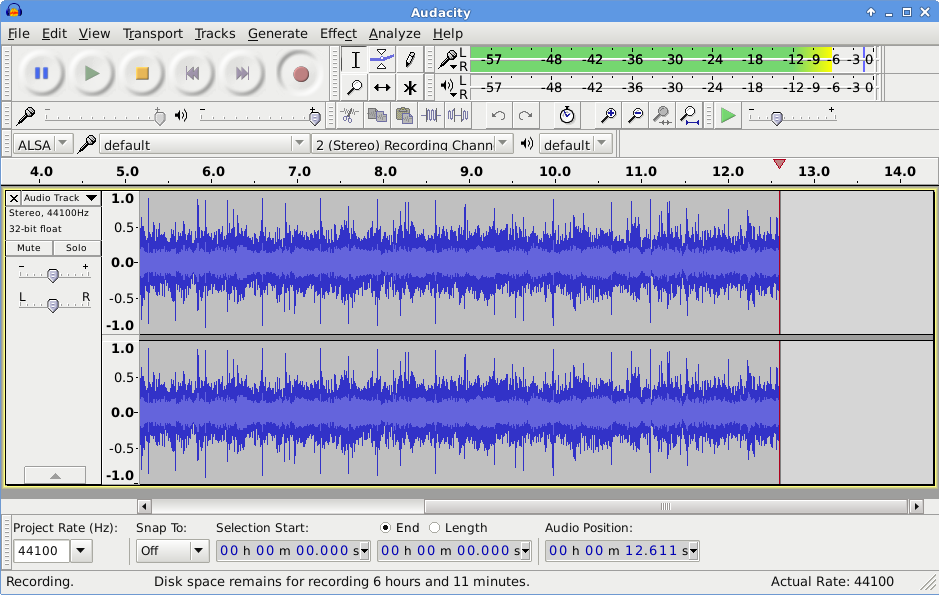

# Audio

## Übersicht

Tonaufnahmen werden in der altertumswissenschaftlichen Forschung eher selten erzeugt. Sie werden für die Aufnahme von Interviews, rekonstruierten Musikinstrumenten im Rahmen der Musikarchäologie oder akustischen Eigenschaften von archäologischen Orten erstellt. Sogar Hörbücher altertumswissenschaftlichen Inhalts existieren mittlerweile.

Eine Audiodatei enthält auditive Inhalte, die durch zusätzliche Komponenten wie Kapiteleinteilungen angereichert sein können. Die zusammenfassende Speicherung aller Inhalte erfolgt in einem Containerformat. Die auditiven Inhalte selbst werden nochmals in einem eigenen Format, dem sogenannten Codec, gespeichert. Je nachdem welches Containerformat verwendet wird, können weitere Informationen, wie Metadaten oder Transkriptionen gespeichert werden.

### Langzeitformate

Da es sich bei den Dateiformaten für digitale Audiodateien um Containerformate handelt, muss bei der Auswahl für die Langzeitarchivierung nicht nur ein passendes Format, sondern auch ein geeigneter Codec gefunden werden. Dabei gelten für die Auswahl des Codecs und des Containerformats die Kriterien, die für die Wahl von Dateiformaten beschrieben werden: Es sollte sich um einen weit verbreiteten, möglichst nicht proprietären und offen dokumentierten Standard handeln, der verlustfreie oder gar keine Kompression anwendet. Außerdem sollte darauf geachtet werden, dass das gewählte Format die Speicherung aller relevanten Elemente der Audiodatei, wie etwa Kapiteleinteilungen, unterstützt.

Da viele Containerformate für Audio nur ein Codec-Format speichern können, werden diese in der Regel unter einem Namen zusammengefasst.

Für die Speicherung von unkomprimierten Audiodaten hat sich lineares PCM (Lineare Puls-Code-Modulation, auch LPCM) als Standard durchgesetzt, das von verschiedenen Containerformaten unterstützt und auch von der IASA (International Association of Sound and Audiovisual Archives) empfohlen wird. Der einzige Nachteil ist der große Speicherplatzbedarf mit etwa 10 MB pro Minute.

Eine verlustfrei komprimierende Alternative für die Langzeitarchivierung stellt der Free Lossless Audio Codec (FLAC) dar, der offen dokumentiert und frei verfügbar ist. FLAC wird beispielsweise von dem Containerformat Matroska unterstützt oder kann als eigenständiges Format verwendet werden.

Das Waveform Audio File Format (WAVE) wurde von Microsoft und IBM als Teil des Resource Interchange File Format (RIFF) entwickelt. Es ist ein offen dokumentiertes aber proprietäres Format, das mehrere Audio-Codecs unterstützt. Aufgrund der weiten Verbreitung wird dieses Format jedoch zusammen mit linearem PCM von der IASA empfohlen und hat sich als Standard de facto durchgesetzt.

Die European Broadcast Union (EBU) hat auf WAVE aufbauend das Format BWF entwickelt, das zusätzlich die Einbettung von Metadaten unterstützt. Für die Langzeitarchivierung sollte dieses Format mit linearem PCM verwendet werden. Für Dateien, die größer als 4 GB sind, hat die EBU das Format RF64/MBWF entwickelt, das zusätzlich die Speicherung von mehr als zwei Tonkanälen erlaubt.

Das Containerformat Matroska (MKA) wird seit 2003 explizit als offenes Containerformat entwickelt, das modernen Ansprüchen genügt und viele verschiedene Codecs enthalten sowie zusätzliche Elemente, wie Kapiteleinteilungen, speichern kann. Das Format basiert auf einer binären Variante von XML, nämlich EBML (Extensible Binary Meta Language), was eine zukünftige flexible Erweiterung erlaubt, jedoch auch sicher stellt, dass ältere Programme weiterhin damit umgehen können. Zusätzlich ist das Format fehlertolerant und kann bis zu einem gewissen Grad auch beschädigte Dateien wiedergeben. Wenn die Audiodaten in linearem PCM oder FLAC gespeichert werden, kann Matroska für die Langzeitarchivierung empfohlen werden.

Aus der Familie der MPEG-Containerformate, die von der Moving Picture Experts Group (MPEG) entwickelt werden und ISO/IEC zertifiziert sind, stammen das MP3- und das AAC-Format. MP3 (MPEG-1 Audio Layer III) wurde schon in MPEG-1 spezifiziert, das seit 1991 unter ISO/IEC 11172 zertifiziert ist. Es handelt sich dabei um einen Audiocodec mit verlustbehafteter Komprimierung, der jedoch eine weite Verbreitung gefunden hat und in einem gleichnamigen Containerformat gespeichert wird.

Advanced Audio Coding (AAC) ist ein Audiocodec, der als Nachfolger von MP3 im Rahmen von MPEG-2 und MPEG-4 spezifiziert wurde und unter ISO/IEC 13818-7 und 14496-3 standardisiert ist. Auch AAC komprimiert verlustbehaftet und kann in einem gleichnamigen Container gespeichert werden oder beispielsweise auch in dem Containerformat MP4. MP3 und AAC sollten nur dann als Langzeitformat für Dateien verwendet werden, wenn diese ursprünglich in dem Format entstanden sind.

Das von Apple entwickelte Audio Interchange File Format (AIFF) ist nicht für die Langzeitarchivierung geeignet, weil es proprietär ist und hauptsächlich nur auf Apple-Systemen Verbreitung gefunden hat. Das von Microsoft entwickelte Windows Media Audio (WMA) ist ebenfalls ein proprietäres Format, das sich wegen der verwendeten verlustbehafteten Kompression nicht für die Langzeitarchivierung eignet. Das Format Ogg wurde vor allem für das Streaming entwickelt und ist aufgrund der verwendeten verlustbehafteten Codecs Opus und Vorbis nicht als Langzeitformat geeignet.

| &nbsp; | Format                                                       | Begründung                                                   |
| ------ | ------------------------------------------------------------ | ------------------------------------------------------------ |
| ✔      | FLAC  WAVE   BWF                       | Free Lossless Audio Codec ist ein verlustfrei komprimierender Codec, der offen dokumentiert und frei verfügbar ist.   Waveform Audio File Format wurde von Microsoft und IBM entwickelt und ist offen dokumentiert aber proprietär. Die Audiodaten sollten als lineares PCM gespeichert werden.   Das Format BWF baut auf WAVE auf und wurde von der EBU entwickelt, um zusätzlich die Einbettung von Metadaten zu unterstützen. Die Audiodaten sollten als lineares PCM gespeichert werden. |
| 〰️     | Matroska   RF64/MBWF   AAC/MP4    MP3  | Ein offenes Containerformat, das eine große Bandbreite von Codecs und ergänzenden Inhalten unterstützt. Die Audiodaten sollten als lineares PCM oder FLAC gespeichert werden.       Wurde von der EBU aus BWF entwickelt, um Dateien zu speichern, die größer als 4 GB sind oder mehr als zwei Tonkanäle beinhalten. Die Audiodaten sollten als lineares PCM gespeichert werden.      Advanced Audio Coding ist der Nachfolger von MP3 und unter ISO/IEC 13818-7 und 14496-3 standardisiert. Er kann unter anderem in den Formaten AAC oder MP4 gespeichert werden. Die Daten werden verlustbehaftet komprimiert, weshalb er nur für Dateien verwendet werden darf, die ursprünglich in diesem Format entstanden sind.       MPEG-1 Audio Layer III ist unter ISO/IEC 11172 zertifiziert und verwendet verlustbehaftete Kompression. MP3 kann nur als Langzeitformat für Dateien verwendet werden, die ursprünglich in diesem Format entstanden sind. |
| ❌      | AIFF    WMA  Ogg                        | Das Audio Interchange File Format (AIFF) von Apple ist nicht für die Langzeitarchivierung geeignet, weil es proprietär ist.  Windows Media Audio ist ein von Microsoft entwickeltes Format mit verlustbehafteter Kompression  Ein von Xiph entwickeltes und offenes Format, das jedoch nicht für die Archivierung geeignet ist, da die Codecs Opus und Vorbis verlustbehaftet komprimieren. |

### Dokumentation

Neben den allgemeinen minimalen Angaben zu Einzeldateien, wie sie in dem Abschnitt Metadaten in der Anwendung gelistet sind, werden für Audiodateien weitere Angaben benötigt, die insbesondere technische Details dokumentieren.

Die technischen Angaben zu Codec, Bitrate, Abtastrate und Abtasttiefe werden zur korrekten Wiedergabe der Datei benötigt und vermitteln einen ersten Eindruck über die Qualität der Datei. Angaben zu Länge, Tonkanälen und weiteren Inhalten sind zur Prüfung auf Vollständigkeit der Datei erforderlich.

Bereits eingebettete Metadaten, wie beispielsweise Exif, oder Bestandteile im Containerformat sollten behalten und archiviert werden. Am besten werden sie in eine eigene Text- oder XML-Datei transferiert und getrennt gespeichert.

| Metadatum       | Beschreibung                                                 |
| --------------- | ------------------------------------------------------------ |
| Beteiligte      | Angabe der Beteiligten, wie etwa Autor, Komponist, Interpret, Interviewpartner etc. |
| Länge           | Dauer der Audiodatei. Diese Angaben sollten konform zu ISO 8601 erfolgen. Beispiel: P3Y6M4DT12H30M5S (3 Jahre, 6 Monate, 4 Tage, 12  Stunden, 30 Minuten und 5 Sekunden) oder T2H2M (2 Stunden und 2 Minuten) |
| Audiocodec      | Angabe des verwendeten Audiocodecs                           |
| Tonkanäle       | Angabe der Anzahl der Tonspuren und Benennung des Systems, z.B. 5 (Dolby 5.1) |
| Bitrate         | Angabe der Datenrate in Bits pro Sekunde, z.B. 666 kbps      |
| Abtastrate      | Angabe der Abtastrate in Hertz, z.B. 44.1 kHz                |
| Abtasttiefe     | Angabe der Anzahl der Quantisierungsstufen als Bittiefe, z.B. 16 bit |
| Weitere Inhalte | Angabe über weitere Inhalte die in dem Containerformat enthalten  sind oder als zusätzliche Datei vorliegen, wie beispielsweise  Transkriptionen |
| Aufnahmegerät   | Herstellername und Modell des Aufnahmegeräts (z.B. eines Analog-Digital-Umsetzers oder einer Kamera) |
| Software        | Name und Versionsnummer der Software mit der die Audiodatei aufgenommen, erstellt oder bearbeitet wurde, wie z.B. Audacity 2.1.2 |

Weitere Metadaten sind methodenabhängig und können in den jeweiligen Abschnitten nachgelesen werden.

## Vertiefung

Die eigentlichen Audiodaten werden in einem eigenen Format gespeichert, dem sogenannten Codec, welcher wiederum in einem Containerformat eingebettet wird. Nähere Erläuterungen dazu sind in dem Kapitel Video in den Unterabschnitten Containerformat sowie Codec und Kompression zu finden.

Die Qualität einer Audiodatei ist zu einem großen Teil von der Abtastrate und Abtasttiefe abhängig. Die Anzahl der Tonkanäle und deren Anordnung werden mittels der Angabe des Tonsystems beschrieben, welche notwendig ist, um die Datei korrekt abzuspielen.

Die Datenmenge von Audiodaten ist nicht nur von der Abtastrate und der Abtasttiefe, sondern auch von der Bitrate abhängig. In dem Kapitel Video wird dieser Begriff in dem Unterabschnitt Datenrate erläutert.
Abtastrate und Abtasttiefe

Mit analoger Technik kann Ton so aufgenommen werden, wie er physikalisch auftritt, nämlich als durchgängige Schallwelle. Um dieses Signal zu digitalisieren muss es in bestimmten Zeitintervallen gemessen und gespeichert werden. Die Zeitintervalle, also die Häufigkeit, in der das Signal gemessen wird, wird als Abtastrate bezeichnet. Je kleiner das Zeitintervall, desto größer die Abtastrate und desto mehr entspricht das digitale Signal dem analogen Signal. Die Abtastrate wird meist in Kilohertz (kHz) angegeben.

Wie genau der gemessene und gespeicherte Wert dann dem ursprünglichen Signal entspricht, hängt von der Messgenauigkeit ab. Diese Messgenauigkeit wird durch die Anzahl der Bits bestimmt und wird als Abtasttiefe bezeichnet. Sie ist vergleichbar mit der Farbtiefe, die in dem Kapitel über Rastergrafiken ab Seite \pageref{RG_Farbtiefe} beschrieben wird. Je größer die Abtasttiefe, desto feiner kann das Signal gemessen werden und die ursprüngliche Tonqualität reproduziert werden.

Eine höhere Abtastrate und eine größere Abtasttiefe führen zu einer originalgetreueren digitalen Repräsentation des Signals.

Der gemessene Wert des Signals kann zwischen zwei Werten der durch die Messgenauigkeit vorgegebenen Messskala liegen, weshalb dieser auf den nächstliegenden Wert gerundet werden muss. Dieser Vorgang wird als Quantisierung bezeichnet.

*Die Abtastung und Quantisierung eines Schallsignals. Das Schallsignal (blau) wird in einem vorgegebenen Intervall (senkrechte Linien) gemessen. Der gemessene Wert wird auf den nächstgelegenen Wert der durch die Abtasttiefe vorgegebenen Skala (horizontale Linien) quantisiert (Kreuze), weshalb die digitale Repräsentation des Signals leicht abweicht.*

 

Puls-Code-Modulation (PCM) bezeichnet das Abtasten eines Signals in einer vorgegebenen Abtastrate und die anschließende Quantisierung des gemessenen Wertes. Die lineare Puls-Code-Modulation verwendet dabei einen immer gleich groß bleibenden Wertebereich, also immer die gleiche Messskala für die abgetasteten Werte.
Tonkanäle und Tonsysteme

Bei der Wiedergabe von Audiodateien, beispielsweise über Kopfhörer, besteht die Möglichkeit Töne nur auf einem der beiden Hörer auszugeben, um einen räumlichen Schalleindruck zu erzeugen. Dafür werden technisch die in der Audiodatei gespeicherten Tonkanäle (Tonspuren) verwendet und an die unterschiedlichen Ausgabegeräte geleitet, wie etwa an den linken und den rechten Kopfhörer.

In einer Audiodatei können eine, zwei oder noch mehr Tonspuren enthalten sein. Dabei kann die intendierte Anordnung der Lautsprecher je nach Anzahl der Kanäle variieren. Bei einer Tonspur wird davon ausgegangen, dass sich das Ausgabegerät vor dem Hörer befindet und bei zwei Tonspuren von zwei Ausgabegeräten links und rechts vom Hörer. Ab drei Kanälen sind mehr als zwei Anordnungen möglich, weshalb die Benennung des Tonsystems oder eine Angabe zur Anordnung notwendig wird.

## Praxis

Dieser Abschnitt vereint Hinweise zum Umgang mit Audiodaten. Es gibt Erläuterungen mit Literatur- und Programmhinweisen über die Ansicht und Extraktion von Metadaten, die Aufnahme, die Wiedergabe und die Transcodierung von Audiodateien. Für die Aufnahme und Digitalisierung von Ton werden Mindestanforderungen spezifiziert und Hinweise auf vertiefende Informationen gegeben.

### Metadaten

Die technischen Metadaten sind in der Regel in dem Header der Datei gespeichert und können von verschiedenen Programmen ausgelesen werden. Ein Programm, das mit vielen Formaten umgehen kann und auch den Export von Metadaten in eine gesonderte Datei erlaubt ist MediaInfo.

Zu den Exportformaten gehören PBCore und EBUCore. Es handelt sich dabei um Metadatenschemata, die speziell für Film und Ton von Public Broadcasting in den USA, beziehungsweise von der European Broadcasting Union (EBU) entwickelt wurden. Die Moving Pictures Experts Group (MPEG) hat MPEG-7 für die Dokumentation von Multimediadateien entwickelt, der insbesondere zur Erweiterung der anderen MPEG-Standards gedacht ist.

Für das Editieren von Metadaten im BWF-Format gibt es das Programm BWF MetaEdit.

- MediaInfo: https://mediaarea.net/MediaInfo
- PBCore: http://pbcore.org/
- EBUCore: https://tech.ebu.ch/MetadataEbuCore
- MPEG-7: http://mpeg.chiariglione.org/standards/mpeg-7
- BWF MetaEdit: https://sourceforge.net/projects/bwfmetaedit/

### Aufnahme und Bearbeitung

*Audacity (audacity.org)*

 

Für die Aufnahme und Bearbeitung von Audiodaten kann das kostenlose Programm Audacity verwendet werden. Audacity gibt es für alle gängigen Betriebssysteme.

Bei der Aufnahme sollte auf eine angemessene Aufnahmequalität geachtet werden. In der Handreichung Empfehlungen zu datentechnischen Standards und Tools bei der Erhebung von Sprachkorpora der DFG werden eine Abtastrate von 22 kHz und eine Abtasttiefe von 16 bit als Mindestanforderungen spezifiziert.  Jedoch ist eine höhere Abtastrate von 48 kHz empfehlenswert, da diese eher der Grenzfrequenz des menschlichen Gehörs entspricht, besser wären sogar 96 kHz. Die Abtastung sollte linear erfolgen.

Welche Abtastrate sich für die gewünschte Aufnahme am besten eignet, kann mittels der Nyquist-Frequenz ermittelt werden. Die Nyquist-Frequenz besagt, dass das originale Signal exakt reproduziert werden kann, wenn die Abtastrate doppelt so hoch wie die höchste Signalfrequenz ist.

- Audacity: http://www.audacityteam.org/
- Handreichung der DFG: http://www.dfg.de/download/pdf/foerderung/grundlagen_dfg_foerderung/informationen_fachwissenschaften/geisteswissenschaften/standards_sprachkorpora.pdf

### Wiedergabeprogramme

Jedes Betriebssystem hat meist schon ein Programm für die Wiedergabe von Audiodateien vorinstalliert. Jedoch können diese Programme nur mit einer begrenzten Auswahl von Containerformaten und Codecs umgehen. Codecs können nachträglich installiert werden, wobei aber auf Kompatibilität mit dem Wiedergabeprogramm geachtet werden muss.

Ein Programm, das mit allen hier vorgestellten Formaten und Codecs umgehen kann, ist der VLC media player. Unter der unscheinbaren Oberfläche verbirgt sich eine Vielzahl an Funktionalitäten und das Programm gibt es für alle gängigen Betriebssysteme.

- VLC media player von VideoLAN: http://www.videolan.org/vlc/index.html

### Transcodierung

Für die Transcodierung, also die Konvertierung von einem Codec in einen weiteren gibt es einige frei verfügbare Programme, wie beispielsweise der bereits genannte VLC media player, der eine leicht verständliche grafische Oberfläche anbietet. Für fortgeschrittene Anwender ist das ebenfalls frei verfügbare FFmpeg zu empfehlen, das komplexere und detailliertere Transcodierungsoptionen erlaubt und auch von der Kommandozeile aus gesteuert werden kann.

- VLC media player von VideoLAN: http://www.videolan.org/vlc/index.html
- FFmpeg: https://www.ffmpeg.org/

### Digitalisierung

Für die Digitalisierung von analogem Audiomaterial gibt es von der IASA konkrete Vorgaben, die eine minimale Abtastrate von 48 kHz und eine minimale Abtasttiefe von 24 Bits empfehlen, um eine möglichst hohe Qualität des Digitalisats zu gewährleisten. Als Formate werden WAVE oder BWF mit linearem PCM vorgegeben. Ausführliche Hinweise sind in den Guidelines on the Production and Preservation of Digital Audio Objects (IASA-TC 04) der IASA zu finden.

Es sollte darauf geachtet werden, dass das originale analoge Material weiterhin erhalten bleibt und die Konsultierung eines darauf spezialisierten Archivs oder Dienstleisters ist ratsam.

## Quellen

Archaeology Data Service, Digital Audio: A Guide to Good Practice
http://guides.archaeologydataservice.ac.uk/g2gp/Audio_Toc

W. Bergmeyer, Audio, In: H. Neuroth -- A. Oßwald -- R. Scheffel -- S. Strathmann -- K. Huth (Hrsg.) nestor Handbuch. Eine kleine Enzyklopädie der digitalen Langzeitarchiverung. Version 2.3 (2010) Kap. 17.6
http://www.nestor.sub.uni-goettingen.de/handbuch

V. Ernst -- J. Kepier -- J. Renz -- A. Romeyke -- T. Bähr, Leitfaden für die digitale Langzeitarchivierung audiovisueller Medien (2016)
http://nbn-resolving.de/urn:nbn:de:0008-2016102107

FADGI (Hrsg.), Guidelines: Embedded Metadata in Broadcast WAVE Files
http://www.digitizationguidelines.gov/guidelines/digitize-embedding.html

IASA (Hrsg.), Guidelines on the Production and Preservation of Digital Audio Objects (IASA-TC 04)
http://www.iasa-web.org/tc04/audio-preservation

JISC (Hrsg.), Infokit: Digital file formats. Audio
http://www.jiscdigitalmedia.ac.uk/infokit/file_formats/digitisation-audio

JISC (Hrsg.), Infokit: Digital file formats. Digital audio formats and compression
http://www.jiscdigitalmedia.ac.uk/infokit/file_formats/digital-audio-formats-and-compression

Koordinationsstelle für die dauerhafte Archivierung elektronischer Unterlagen (Hrsg.) Katalog archivischer Dateiformate: Audiodaten
http://kost-ceco.ch/wiki/whelp/KaD/pages/Audio.html

R. Kromer, On Audio-Visual File Formats (Notizen zur Präsentation 2015)
http://reto.ch/training/2015/20150424/audio.html

Memoriav (Hrsg.), Memoriav Empfehlungen Ton. Die Erhaltung von Tondokumenten (2014)
http://memoriav.ch/wp-content/uploads/2015/02/Empfehlungen_Ton_de.pdf

Y. Trivedi, HTG Explains: What Are the Differences Between All Those Audio Formats? (2011)
http://www.howtogeek.com/howto/40465/htg-explains-what-are-the-differences-between-all-those-audio-formats/

Wikipedia Mehrkanal-Tonsystem (deutsch 05. 2016)
https://de.wikipedia.org/wiki/Mehrkanal-Tonsystem

### Formatspezifikationen

- FLAC: https://xiph.org/flac/format.html
- WAVE: McGill University http://www-mmsp.ece.mcgill.ca/documents/audioformats/wave/wave.html
- WAVE mit LCPM: Library of Congress http://www.digitalpreservation.gov/formats/fdd/fdd000002.shtml
- WAVE als Teil von RIFF: http://www.tactilemedia.com/info/MCI_Control_Info.html
- BWF: http://tech.ebu.ch/docs/tech/tech3285.pdf
- MBWF/RF64: http://tech.ebu.ch/docs/tech/tech3306-2009.pdf
- Matroska: https://www.matroska.org/
- Matroska: Library of Congress http://www.digitalpreservation.gov/formats/fdd/fdd000342.shtml
- Matroska: IETF CELLAR Charter https://datatracker.ietf.org/doc/charter-ietf-cellar/
- MP3 (MPEG-1): http://mpeg.chiariglione.org/standards/mpeg-1
- MPEG-1: Library of Congress http://www.digitalpreservation.gov/formats/fdd/fdd000035.shtml
- AAC (MPEG-4): http://mpeg.chiariglione.org/standards/mpeg-4
- MP4 mit AAC: Library of Congress http://www.digitalpreservation.gov/formats/fdd/fdd000234.shtml

### Tools und Programme

- MediaInfo: https://mediaarea.net/MediaInfo
- PBCore: http://pbcore.org/
- EBUCore: https://tech.ebu.ch/MetadataEbuCore
- MPEG-7: http://mpeg.chiariglione.org/standards/mpeg-7
- BWF MetaEdit: https://sourceforge.net/projects/bwfmetaedit/
- Audacity: http://www.audacityteam.org/
- VLC media player von VideoLAN: http://www.videolan.org/vlc/index.html
- FFmpeg: https://www.ffmpeg.org/
