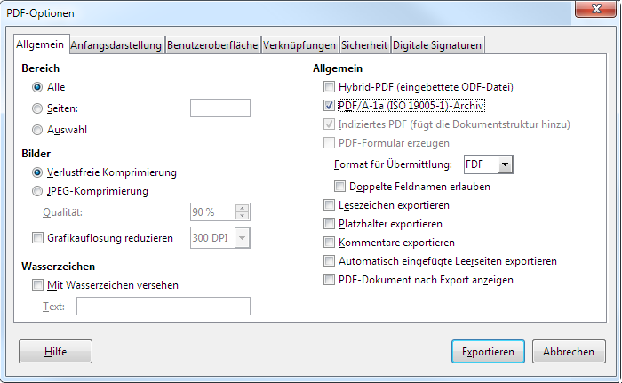
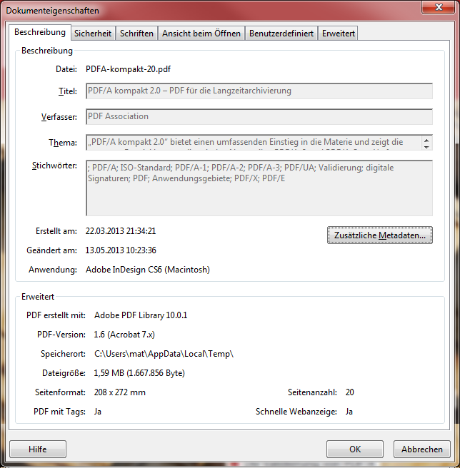
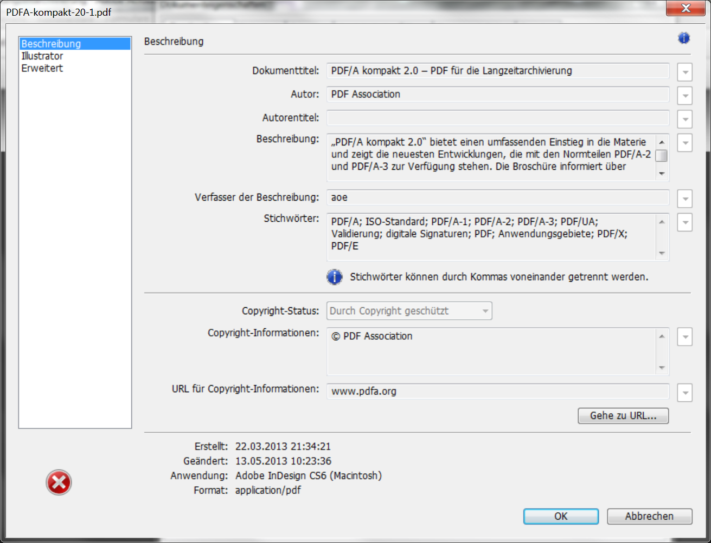

# PDF-Dokumente

## Übersicht

Das PDF (Portable Document Format) wurde 1993 von Adobe Systems entwickelt, um den Datenaustausch zu erleichtern. Es ist ein plattformunabhängiges, offenes Dateiformat, das 2008 mit der Version 1.7 als ISO-Standard zertifiziert wurde und seitdem von der ISO weiter gepflegt wird.

Der große Vorteil von PDFs liegt darin, dass Dateiinhalte unabhängig vom Betriebssystem, dem ursprünglichen Anwendungsprogramm und der Hardwareplattform unverändert dargestellt werden. Das Aussehen von Dokumenten wird, wie bei einem analogen Ausdruck, eingefroren und kann somit angezeigt werden, wie es ursprünglich vom Autor intendiert war. Gleichzeitig sind die Möglichkeiten zur nachträglichen Bearbeitung begrenzt, wodurch eine große Authentizität gewährleistet wird.

Für das Öffnen einer PDF-Datei gibt es verschiedene freie Anwendungen, worin ein Grund für die große Verbreitung und Akzeptanz von PDFs liegt. Viele Programme können Dateien direkt im PDF-Format speichern oder exportieren. Darüber hinaus lassen sich mit Hilfe von zusätzlich installierten Druckertreibern PDF-Dateien aus allen Programmen heraus erzeugen.

### Langzeitformate

Nicht jede Datei mit der Dateierweiterung .pdf ist gleichermaßen für die Langzeitarchivierung geeignet. Für diesen Zweck wurde das PDF/A-Format entwickelt und als ISO-Standard zertifiziert. Es beschreibt in welcher Form bestimmte Elemente in einer PDF-Datei enthalten sein müssen und welche nicht erlaubt sind. Die erste Version der PDF/A-Norm wurde nachträglich um zwei weitere, aufeinander aufbauende Normteile ergänzt. Wird das PDF/A-Format für die Langzeitarchivierung einer Datei verwendet, die nicht nur textuelle Informationen enthält, sollten nach Möglichkeit auch die ursprünglichen Ausgangsdateien in archivierungstauglichen Formaten mitarchiviert werden – entweder als separate Dateien oder integriert in das Container-Format PDF/A-3.

|&nbsp;| Format | Begründung |
|---|---|---|
| ✔ | PDF/A-1 PDF/A-2| PDF/A ist gezielt als stabiles, offenes und standardisiertes Format für die Langzeitarchivierung unterschiedlicher Ausgangsdateien entwickelt worden. |
| 〰️  | PDF/A-3 | PDF/A-3 ist nur dann für die Langzeitarchivierung geeignet, wenn alle eingebetteten Dateien in einem anerkannten Archivformat vorliegen. |
|❌ |andere PDF-Varianten | Viele gängige PDF-Varianten sind nicht für die Langzeitarchivierung geeignet. Stattdessen sollten entweder die Ausgangsdateien in einem passenden Format archiviert oder eine Migration in ein PDF/A-Format vorgenommen werden. |

### Dokumentation

Welche Metadaten für ein PDF-Dokument relevant sind, hängt von dessen Inhalt ab. Bei PDF-Dateien, die nur Text enthalten, sind meist weniger Informationen erforderlich, als bei PDFs, die Bilder, GIS-Karten oder 3D-Modelle enthalten. Die Metadaten können unmittelbar in einem PDF-Dokument im XMP-Format gespeichert werden.

Die hier angegebenen Metadaten sind als minimale Angabe zu betrachten und ergänzen die angegebenen Metadaten für Projekte und Einzeldateien in dem Abschnitt [Metadaten in der Anwendung](/it-empfehlungen/projektphasen/dokumentation/metadaten-in-der-anwendung/).

| Metadatum | Beschreibung |
|---|---|
| Titel | Titel des Dokuments, nicht der Dateiname |
| Autor | Name des Verfassers oder Erstellers der Datei; gegebenfalls Name der Einrichtung |
| Stichwörter | Schlagworte, wie z.B. Periode, Fundstelle oder charakteristische Merkmale. Wenn vorhanden, angemessene Thesauri verwenden |
| Beziehungen | Dateien oder Ressourcen, die mit dem PDF zusammenhängen, insbesondere der Name der Originaldatei, aus der heraus ein PDF erstellt wurde |
| Anwendung | Programm, mit dem der Inhalt ursprünglich erzeugt wurde |
| Datum | Datum der Erstellung oder letzten Änderung der Datei |
| Copyright-Angaben | Angaben zur Person oder Einrichtung, die das Copyright oder die Lizenzrechte an der Datei oder deren Inhalt besitzt |
| Zusätzliche Metadaten |
| Kurzbeschreibung | Kurzbeschreibung über den Inhalt des Dokuments |
| Sprache | Sofern schriftliche Inhalte vorhanden sind, die Sprache angeben. Sprachkennungen nach ISO 639 angeben. |
| Verfasser der Metadaten | Name der Person, welche die Metadaten ausgefüllt hat |

Weitere Metadaten sind abhängig vom Inhalt und der Methoden und können in den jeweiligen Abschnitten nachgelesen werden.

---

## Vertiefung

Eine wesentliche Eigenschaft und Stärke von PDF-Dateien ist die Tatsache, dass sie ganz unterschiedliche Inhalte enthalten können. So lassen sich neben Texten und Navigationshilfen, wie etwa Inhaltsverzeichnisse mit Textankern, auch andere Informationen wie Bilder, Verktorgrafiken, 3D-Visualisierungen, Tabellen, Präsentationen oder GIS-Karten einbinden, die zusammen mit allen ursprünglich verwendeten Layoutmerkmalen gespeichert werden. Daher werden die meisten Publikationen wie elektronische Zeitschriften oder Infomaterialien auf Webseiten üblicherweise als PDF-Dateien zur Verfügung gestellt. Bei der Langzeitarchivierung von Dateien spielt das PDF/A-Format eine besondere Rolle. In dessen Spezifikation wird unter anderem vorgeschrieben, Schriften in das Dokument einzubetten und Farben geräteneutral zu definieren. Auf diese Weise wird gewährleistet, dass das originale Aussehen eines Dokuments wie in der ursprünglichen Anwendung und wie vom Autor intendiert erhalten bleibt. Die Intention von PDF-Dateien ist insofern die Erhaltung der ursprünglichen Darstellung, nicht aber der ursprünglichen Bearbeitungsfunktionalitäten.

Um eine möglichst große Authentizität einer PDF-Datei zu erlangen, sind die Möglichkeiten zur nachträglichen Bearbeitung sehr begrenzt. Es können Kommentare hinzugefügt, Seiten eingebunden oder gelöscht, oder Textstellen geschwärzt werden. Eingeschränkt sind Veränderungen der eigentlichen Inhalte oder des Layouts möglich, wie z. B. Änderungen von Farben in einem Foto oder Umformulierungen von Texten. Als Nachteil ergibt sich daraus, dass die ursprüngliche Funktionalität der nach PDF/A konvertierten Datei verloren geht und eine Nachnutzung der Inhalte wenn überhaupt nur mit Qualitätsverlusten möglich ist. So können beispielsweise tabellarische Daten aus einer PDF-Datei nicht ohne einen zusätzlichen Mehraufwand in eine neue Tabelle übernommen werden, wobei Bearbeitungsfehler auftreten können.

Da aber zunehmend Softwarelösungen existieren, die diese Einschränkungen der nachträglichen Bearbeitung auflösen oder umgehen, wächst der Bedarf an Schutzmechanismen gegen ungewollte Änderungen durch Dritte. Dazu zählen beispielsweise die Festlegung von einfachen Nutzungseinschränkungen, wie etwa die Erlaubnis zum Drucken, zum Kopieren von Inhalten oder zur Bearbeitung der im PDF gespeicherten Metadaten, oder die Vergabe von Passwörtern. Für Dateien, bei denen eine Langzeitarchivierung vorgesehen ist, dürfen allerdings keine Schutzfunktionen verwendet werden, damit sie ohne Hindernisse jederzeit nutzbar sind. Falls notwendig können Einschränkungen als Lizenzhinweise formuliert werden; die Authentizität eines Dokumentes kann durch Signaturen, Zeitstempel und/oder digitale Prüfsummen gewährleistet werden.

### Inhalte

Dateien im PDF-Format können durch unterschiedliche Anwendungen erzeugt werden und daher ganz unterschiedliche Inhalte enthalten und darstellen. Für jede Dateiart gibt es spezifische Aspekte, die es zu beachten gilt, insbesondere dass einige Inhalte nicht mit den Vorgaben von PDF/A vereinbar sind.

Texte: Standardmäßig sind in PDF-Readern bereits 14 Schriftarten verfügbar. Es lassen sich aber auch weitere in ein PDF-Dokument einbetten, um eine korrekte Darstellung zu gewährleisten. Mithilfe von OCR-Software kann in PDF-Dokumenten eine nachträgliche Texterkennung durchgeführt werden.

Bilder: Wie bei normalen Rastergrafiken können auch in PDF-Dateien eingebettete Bilder durch spezielle Kompressionsverfahren in ihrer Speichergröße reduziert und in ihrer Auflösung heruntergerechnet werden. Bei fast allen Verfahren ist dies mit einem Informationsverlust verbunden, der vor allem die Genauigkeit und Qualität der Anzeige betrifft.

Vektorgrafiken: Vektorgrafiken in PDF-Dateien können wie die Ausgangsdateien frei skaliert werden.

3D: Es gibt zwei PDF-Formate, in die 3D-Dateien eingebettet und mit Adobe Reader geöffnet und betrachtet werden können. Auf diese Weise lassen sich auch 3D-Objekte austauschen und mit einfachen Funktionen bedienen, z. B. in der Ansicht drehen, Lichteinstellungen verändern oder Aufsichten und Schnittflächen erzeugen.

### PDF-Varianten

PDF-Dateien sind inzwischen ein sehr weit verbreitetes Austauschformat, das in ganz unterschiedlichen Kontexten Verwendung findet. Um eine gleichbleibende Qualität zu gewährleisten, wurden für die häufigsten Anwendungsfälle mehrere Normen und Standards festgelegt:

- PDF/X - Format für die Übermittlung von Druckvorlagen (seit 2001)
- PDF/A - Format für die elektronische Archivierung (ISO 19005-1 seit 2005)
- PDF/E - Format für technische Dokumente aus den Bereichen Ingenieurwesen, Architektur und Geo-Informationssysteme. Dieses Format besitzt die Fähigkeit zur interaktiven Darstellung von 3D-Objekten. Einzelteile können gedreht, auseinandergezogen, ein- oder ausgeblendet werden (ISO 24517 seit 2008)
- PDF/UA - Richtlinien zum Aufbau eines barrierefreien Dokuments im PDF-Format (seit 2008)
- PDF/VT - Format für den Einsatz im hochvolumigen und Transaktionsdruck (seit 2010)
Mehrere PDF-Standards lassen sich miteinander verbinden. Genügt eine Datei dem PDF/X-Standard, eignet sie sich als digitale Druckunterlage. Erfüllt diese Datei zusätzlich den PDF/UA-Standard, kann sie als barrierefreies PDF von Screenreader-Programmen verarbeitet werden.

### Das Archivierungsformat PDF/A

Von den verschiedenen existierenden PDF-Formaten ist nur das PDF/A-Format ein sicheres und stabiles Archivformat, das speziell für die elektronische Langzeitarchivierung von Dokumenten definiert und publiziert wurde. Die klar festgelegten und als Standard allgemein anerkannten Regeln schreiben vor, welche Bestandteile in einer PDF-Datei enthalten sein müssen und welche nicht zulässig sind, um mit dem PDF/A-Standard konform zu gehen. Während einige Inhaltstypen wie Texte, Bilder, Zeichnungen, Tabellen und Schriften standardkonform in PDF/A-Dateien eingebunden werden können, sind andere Inhalte wie 3D-Objekte, Audio- und Video-Sequenzen, Flash-Animationen oder Scripte nicht erlaubt. Ebenso darf eine PDF/A-Datei keine externen oder dynamischen Inhalte enthalten, die in einem Viewer geladen werden müssen. Beispielsweise werden URL-Links nur als Zeichenkette, nicht aber als aktive Verknüpfung gespeichert. Enthält eine PDF-Datei nicht zulässige Inhalte, kann sie nicht nach PDF/A konvertiert werden. Eine Validierung, ob eine vorliegende Datei dem gültigen PDF/A-Format entspricht, ist über entsprechende Prüfwerkzeuge möglich und wird im Praxisteil beschrieben.

Insgesamt sind aktuell drei, aufeinander aufbauende Versionen von PDF/A-Formaten zu unterscheiden, von denen PDF/A-1 und PDF/A-2 echte Archivformate sind, da sie das Dokument in einem stabilen Zustand konservieren. Bei PDF/A-3 handelt es sich hingegen um einen Container, in den beliebige Dateiformate eingebettet werden können. Der große Vorteil liegt also darin, dass editierbare Originaldateien in das Dokument integriert werden können. Es gibt allerdings keine Garantie, dass die angehängten Dateien auch künftig alle angezeigt werden können. Für die automatische Weiterverarbeitung besteht die Möglichkeit einer Integration von Daten im XML-Format.

Da es bislang keine Vorgabe über die Datenformate gibt, die in eine PDF/A-3-Datei eingebettet werden dürfen - erlaubt sind beispielsweise auch nicht offene, nicht standardisierte und nicht zukunftssichere Formate - hängt die Frage der Archivierbarkeit einer PDF/A-3-Datei vor allem von ihrem Inhalt ab. Es wird daher aktuell diskutiert, ob PDF/A-3 als Format für das Archival Information Package (AIP) nach ISO 14721:2012 OAIS geeignet ist.

Für alle Varianten des PDF/A-Formates gilt, dass Schriften und Zeichen direkt in die Datei eingebettet werden. Ebenso werden Sonderzeichen und Formeln verlässlich dargestellt. Auch Schriftsysteme wie Chinesisch oder Arabisch werden auf allen Geräten richtig wiedergegeben. Für die korrekte Anzeige von Farben werden festgelegte ICC-Profile verwendet. In PDF/A Dokumenten ist grundsätzlich eine Volltextsuche möglich, auch wenn es sich um ein gescanntes Dokument handelt. Zusätzlich kann auch eine digitale Texterkennung (OCR) integriert werden. Über die vergebenen XMP-Metadaten sind erweiterte Suchoptionen verfügbar.

#### PDF/A-1 (seit 2005)

- Bilder, Grafiken, verwendete Schriftzeichen etc. müssen im PDF/A-Dokument selbst eingebettet sein
- präzise, plattformunabhängig kodierte Farbangaben mittels ICC-Profilen
- Verwendung von XMP für Dokument-Metadaten
- keine transparenten Elemente
- keine Kompression
- keine PDF-Ebenen, Aktionen und JavaScript
- kein Passwortschutz
- Einbettung von Signaturen und Hyperlinks möglich
- Konformitätsstufen a und b

#### PDF/A-2 (seit 2011)

identisch zu PDF/A-1 mit zusätzlichen Möglichkeiten:

- erlaubt Kompression mit JPEG2000, transparente Elemente und PDF-Ebenen
- ermöglicht Einbettung von OpenType-Fonts
- unterstützt digitale Signaturen in Übereinstimmung mit den PAdES (PDF Advanced Electronic Signatures)
- Dateianhänge: Einbettung von PDF/A-1 und PDF/A-2 Dateien möglich
- Konformitätsstufen a, b und u

#### PDF/A-3 (seit 2012)

identisch zu PDF/A-2 mit zusätzlichen Möglichkeiten:

- Einbettung von beliebigen Dateien möglich (z. B. die Ursprungsdatei aus der ein PDF/A-3 erstellt wurde)
- keine Gewährleistung, dass die Anhänge zu einem späteren Zeitpunkt verarbeitet werden können

### Konformitätsstufen bei PDF/A

Die Qualität der archivierten Dokumente wird durch verschiedene Konformitätsstufen bezeichnet. Die Stufen sind abhängig von Eingangsmaterial und Verwendungszweck und ihre Bezeichnung wird an das Ende des PDF/A-Formates angehängt, z. B. "PDF/A-1a".

**Stufe b (basic)**: Das Dokument sieht bei späterer Verarbeitung unverändert aus.

**Stufe u (unicode)**: Das Dokument sieht bei späterer Verarbeitung unverändert aus. Zusätzlich wird der gesamte Text in Unicode abgebildet. Es besteht die Möglichkeit, Text zu durchsuchen und zu extrahieren.

**Stufe a (accessible/zugänglich)**: Das Dokument sieht bei späterer Verarbeitung unverändert aus. Der gesamte Text wird in Unicode abgebildet. Es besteht die Möglichkeit, Text zu durchsuchen und zu extrahieren. Zusätzlich bleiben die Struktur des Dokuments und die natürliche Lesereihenfolge erhalten. Das Dokument ist somit barrierefrei und kann mithilfe von Screenreader-Programmen vorgelesen werden.

---

## Praxis

Für die Erstellung von PDF-Dokumenten gibt es eine Vielzahl an Programmen, die in manchen Fällen auch für die Bearbeitung der Metadaten verwendet werden können. Die Validierung klärt die Frage, ob es sich bei einem vorhandenen PDF-Dokument um eine Datei handelt, die auch PDF/A-konform ist.

### Erstellung von PDF-Dokumenten

Eine PDF-Datei lässt sich auf vielfältige Art und Weise erzeugen. Beim Betriebssystem Mac OS X ist die Möglichkeit zur Erstellung einer PDF-Datei über den Druckdialog voreingestellt. Windows bietet diese Möglichkeit nicht immer von Haus aus. Deshalb gibt es ein großes Angebot an kommerzieller und freier Software. Diese wird häufig über die Druckfunktion in die Anwendungen eingebunden, so dass aus beliebigen Programmen heraus über den Druckdialog ein PDF erstellt werden kann. Gescannte Vorlagen lassen sich in der Regel über die Scansoftware direkt als PDF speichern.

Eine weitere Möglichkeit bieten viele Programme über eine Exportschnittstelle. Die Funktionen dazu finden sich in der Regel im Menü unter „Datei > Speichern unter“ oder „Datei > Exportieren“. Als Beispiele von Anwendungssoftware bzw. Produktsuiten mit der Möglichkeit zum direkten PDF-Export sind zu nennen: OpenOffice, LibreOffice, Microsoft Office (ab 2010), Adobe Creative Suite, Framemaker und CorelDraw.

Nur in manchen Fällen lassen sich gezielt Dateien im PDF/A-Format erstellen. Diese Option beim Exportieren von Dateien bieten z. B. LibreOffice (nebenstehende Abbildung) und Microsoft Office oder Systeme, bei denen entsprechende Module zur Erstellung von PDF/A-Dateien installiert wurden. Werden PDF-Dateien über einen Druckdialog erzeugt, sollte individuell überprüft werden, ob die jeweiligen Druckeinstellungen entsprechende Optionen anbieten.

*Speichern im PDF/A-Format in LibreOffice*

PDF-Dateien, die nicht als PDF/A vorliegen oder sich in diesem Format erzeugen lassen, können auch mithilfe von Programmen umgewandelt werden. Als Teil der Adobe Suite ist das Programm Adobe Acrobat Professional weit verbreitet. Es bietet vielfältige Werkzeuge zur Bearbeitung von PDF-Dateien. Dazu gehört auch die Möglichkeit, existierende PDF-Dateien in andere Varianten umzuwandeln. Zusätzlich gibt es ein großes Angebot an Plug-Ins, um die Funktionalitäten zu erweitern, z. B. zur Erstellung von PDFs mit 3D-Inhalten.

-   PDFCreator: [http://de.pdfforge.org/](http://de.pdfforge.org/)
-   FreePDF: [http://freepdfxp.de/index\_de.html](http://freepdfxp.de/index_de.html)
-   PDF-XChange Editor: [www.pdf-xchange.de/pdf-xchange-viewer](http://www.pdf-xchange.de/pdf-xchange-viewer/ )
-   DF Split and Merge (einzelne PDFs zusammenfügen und trennen): [www.pdfsam.org](http://www.pdfsam.org/)

### Validierung: Liegt eine PDF-Datei im PDF/A-Format vor?

Häufig zeigen Viewer von PDF-Dateien unmittelbar an, ob eine Datei im PDF/A-Standard vorliegt oder diese Angabe ist in den Dateieigenschaften einsehbar. Will man aber sicher gehen, ob eine vorliegende Datei mit der Erweiterung .pdf dem PDF/A-Format entspricht, ist eine Validierung, erforderlich. Bei diesem Vorgang werden alle relevanten Bestandteile des Dokuments untersucht und auf PDF/A-Vorgaben getestet. Nur so kann die uneingeschränkte ISO-Konformität gewährleistet werden und entschieden werden, ob eine Datei für die Langzeitarchivierung geeignet ist.

Da PDF/A-Dateien grundsätzlich nicht gegen Bearbeitung geschützt werden können, weil dies gegen die Vorschrift der Zugänglichkeit verstoßen würde, muss eine solche Validierung nach jeder Bearbeitung durchgeführt werden, um nachträgliche, nicht-standardkonforme Veränderungen ausschließen zu können.

Viele Firmen haben sich mittlerweile auf die Archivierung von PDF-Dateien spezialisiert und bieten verschiedene Tools zur Überprüfung oder zur Reparatur von nicht validen Dateien an. Adobe Acrobat Professional bietet mit dem Preflight-Werkzeug (im Menü „Erweitert > Prefligt > Profile > PDF/A-Standard prüfen“) ein Tool zur Validierung an.  Es ist in der nebenstehenden Abbildung dargestellt.Auch mit kostenfreier Software lassen sich Validierungen durchführen. Mit [PDF/A Live! 7.1.6](https://www.intarsys.de/dokumentendownload/pdf-a-live/) kann man ohne Lizenzschlüssel bis zu 50 Dokumente pro Tag überprüfen und bis zu 15 Dokumente konvertieren. Online besteht die Möglichkeit über den [Free PDF/A Validator](http://www.validatepdfa.com/online.htm).

-   Isartor Test Suite: [https://pdfa.org/resource/isartor-test-suite/](https://pdfa.org/resource/isartor-test-suite/)
-   PDF/A Live! 7.1.6: [https://www.intarsys.de/dokumentendownload/pdf-a-live/](https://www.intarsys.de/dokumentendownload/pdf-a-live/)
-   Free PDF/A Validator: [www.validatepdfa.com/online.htm](http://www.validatepdfa.com/online.htm)

### Bearbeitung von Metadaten

Metadaten lassen sich im kostenlosen Adobe Reader unter dem Menü „Datei > Eigenschaften“ anzeigen und bearbeiten, wie die nebenstehende Abbildung verdeutlicht. Zu den hier aufgeführten Angaben für die inhaltliche Kurzbeschreibung gehören vier Felder: Titel, Verfasser, Thema und Stichwörter. Einige technische Informationen wie z. B. Dateigröße, Zeitstempel, Programmversion oder Seitenformat werden bei der Speicherung automatisch erzeugt und können hier ebenfalls eingesehen werden. Nur in Acrobat Professional werden die vollständigen XMP Metadaten angezeigt, die in einem weiteren Reiter um zusätzliche Informationen, wie Beschreibung, Verfasser der Beschreibung oder Copyright-Angaben, ergänzt werden können. Diese zusätzlichen Metadaten sind in der folgenden Abbildung zu sehen.

*Metadaten unter „Dokumenteigenschaften“ in Adobe Acrobat Professional*

*Zusätzliche Metadaten unter „Dokumenteigenschaften“ in Adobe Acrobat Professional*

Neben Adobe Acrobat gibt es weitere Editoren, mit denen sich Metadaten für ein PDF vergeben oder nachträglich ändern lassen. Als uneingeschränkte kostenlose Anwendungen sind für Windows BeCyPDFMetaEdit und für Mac PDFInfo erhältlich. Mit Einschränkungen gibt es für Windows den Hexonic PDF Metadata Editor, der kostenfrei eine Verarbeitung von maximal fünf PDF-Dateien gleichzeitig erlaubt. Das Metadata Extraction Tool kann mit Metadaten von vielen verschiedenen Formaten umgehen.

<!---   BeCyPDFMetaEdit: [www.becyhome.de/becypdfmetaedit/description\_ger.htm](http://www.becyhome.de/becypdfmetaedit/description_ger.htm) Seite existiert nicht mehr --> 
-   PDFInfo: [www.macupdate.com/app/mac/23356/pdfinfo](https://www.macupdate.com/app/mac/23356/pdfinfo/ )
-   Hexonic PDF Metadata Editor: [www.hexonic.de/index.php/hexonic-pdf-metadata-editor](http://www.hexonic.de/index.php/hexonic-pdf-metadata-editor)
-   Metadata Extraction Tool: [http://meta-extractor.sourceforge.net/](http://meta-extractor.sourceforge.net/)

---

## Quellen

H. Bärfuss - M. Winkler, Pflicht und Kür in der Langzeitarchivierung, DOK Technologien, Strategien & Services für das digitale Dokument 5, 2013, 48-51  
[www.pdfa.org/wp-content/uploads/2013/11/DOK.magazin-2013-11-Compliance-D...](http://www.pdfa.org/wp-content/uploads/2013/11/DOK.magazin-2013-11-Compliance-DE.pdf)

O. Drümmer - A. Oettler - D. von Seggern, PDF/A kompakt. Digitale Langzeitarchivierung mit PDF (Berlin 2007)  
[www.pdfa.org/wp-content/uploads/2011/08/PDFA\_kompakt\_pdfa1b.pdf](http://www.pdfa.org/wp-content/uploads/2011/08/PDFA_kompakt_pdfa1b.pdf)

H.-J. Hübner, PDF/A - Update und Dienstleistungen für die Langzeitarchivierung, Präsentation vom 18.06.2013 auf dem Nestor-Praktikertag in Berlin  
[http://files.dnb.de/nestor/veranstaltungen/Praktikertag2013/2013-06-pdfa...](http://files.dnb.de/nestor/veranstaltungen/Praktikertag2013/2013-06-pdfa-huebner.pdf)

K. Krieg, PDF/A und Metadaten: XML, RDF und XMP: Was, wie und woher? Präsentation vom 18.11.2008 beim Nestor-Seminar in Koblenz  

A. Mantke, OpenOffice.org. Export in das PDF\-Dateiformat (2010)  
[www.openoffice.org/de/doc/howto\_2\_0/office/exportpdfformat.pdf](http://www.openoffice.org/de/doc/howto_2_0/office/exportpdfformat.pdf)

A. Oettler, PDF/A kompakt 2.0. PDF für die Langzeitarchivierung. Der ISO-Standard - von PDF/A-1 bis PDF/A-3 (Berlin 2013)  
[www.pdfa.org/wp-content/uploads/2013/05/PDFA-kompakt-20.pdf](http://www.pdfa.org/wp-content/uploads/2013/05/PDFA-kompakt-20.pdf)

PDF/A Competence Center (Hrsg.) TechNote 0008: Predefined XMP Properties in PDF/A-1 (2008)  
[www.pdfa.org/wp-content/uploads/2011/08/tn0008\_predefined\_xmp\_properties...](http://www.pdfa.org/wp-content/uploads/2011/08/tn0008_predefined_xmp_properties_in_pdfa-1_2008-03-20.pdf)

PDF/A Competence Center (Hrsg.) PDF/A Metadaten XMP, RDF & Dublin Core (2011)  
[http://www.pdfa.org/2011/09/pdfa-metadaten-xmp-rdf-dublin-core/](http://www.pdfa.org/2011/09/pdfa-metadaten-xmp-rdf-dublin-core/)

D. von Seggern, PDF/A und XMP Metadaten: Nutzen und Anforderungen, Präsentation vom 8. Juli 2009 zum Webinar  
[www.pdfa.org/wp-content/uploads/2011/09/callas\_webinar\_xmp\_deu.pdf](http://www.pdfa.org/wp-content/uploads/2011/09/callas_webinar_xmp_deu.pdf)

Adobe Acrobat DC. Adobe PDF
[https://acrobat.adobe.com/de/de/products/about-adobe-pdf.html](https://acrobat.adobe.com/de/de/products/about-adobe-pdf.html)

Open Format. Archiving of 3D Documents  
[www.newformat.se](http://www.newformat.se)

PDF/A Flyer (2014)  
[www.pdfa.org/wp-content/uploads/2014/01/Flyer-PDFA-DEU.pdf](http://www.pdfa.org/wp-content/uploads/2014/01/Flyer-PDFA-DEU.pdf)

PDF Association: PDF Competence Center  
[www.pdfa.org](www.pdfa.org)

PDFlib: Die PDF/A-Archivierungsstandards  
[https://www.pdflib.com/de/pdf-know-how/pdfa/die-pdfa-standards/](https://www.pdflib.com/de/pdf-know-how/pdfa/die-pdfa-standards/)

### Formatspezifikationen

-   PDF/A-1 (ISO:2005): [http://www.iso.org/iso/iso\_catalogue/catalogue\_tc/catalogue\_detail.htm?c...](http://www.iso.org/iso/iso_catalogue/catalogue_tc/catalogue_detail.htm?csnumber=38920)
-   PDF/A-2 (ISO 19005-2:2011): [http://www.iso.org/iso/iso\_catalogue/catalogue\_tc/catalogue\_detail.htm?c...](http://www.iso.org/iso/iso_catalogue/catalogue_tc/catalogue_detail.htm?csnumber=50655)
-   PDF/A-3 (ISO 19005-3): [http://www.iso.org/iso/home/store/catalogue\_ics/catalogue\_detail\_ics.htm...](http://www.iso.org/iso/home/store/catalogue_ics/catalogue_detail_ics.htm?csnumber=57229)

### Tools und Programme

-   Adobe Reader: [https://get.adobe.com/de/reader/](https://get.adobe.com/de/reader/)
-   Foxit Reader: [http://www.foxitsoftware.com/Secure\_PDF\_Reader/](http://www.foxitsoftware.com/Secure_PDF_Reader/)
-   Ghostscript, Ghostview and GSview: [http://pages.cs.wisc.edu/~ghost/](http://pages.cs.wisc.edu/~ghost/)
-   PDFCreator: [http://de.pdfforge.org](http://de.pdfforge.org)
-   FreePDF: [http://freepdfxp.de/index\_de.html](http://freepdfxp.de/index_de.html)
-   PDF-XChange Editor: [www.pdf-xchange.de/pdf-xchange-viewer/](http://www.pdf-xchange.de/pdf-xchange-viewer/)
-   PDF Split and Merge: [www.pdfsam.org](http://www.pdfsam.org)
-   Isartor Test Suite: [www.pdfa.org/2011/08/download-isartor-test-suite/](http://www.pdfa.org/2011/08/download-isartor-test-suite/)
-   Free PDF/A Validator: [www.validatepdfa.com/online.htm](http://www.validatepdfa.com/online.htm)
-   PDF/A Live! 6.0: [www.intarsys.de/pdf-produkte/pdfa-live](http://www.intarsys.de/pdf-produkte/pdfa-live)
-   BeCyPDFMetaEdit: [www.becyhome.de/becypdfmetaedit/description\_ger.htm](http://www.becyhome.de/becypdfmetaedit/description_ger.htm)
-   PDFInfo: [www.macupdate.com/app/mac/23356/pdfinfo](http://www.macupdate.com/app/mac/23356/pdfinfo)
-   Hexonic PDF Metadata Editor: [www.hexonic.de/index.php/hexonic-pdf-metadata-editor](http://www.hexonic.de/index.php/hexonic-pdf-metadata-editor)
-   Metadata Extraction Tool: [http://meta-extractor.sourceforge.net/](http://meta-extractor.sourceforge.net/)
