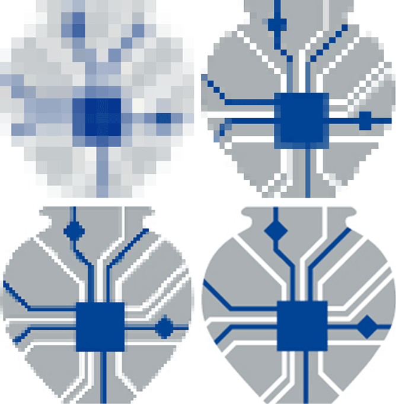

# Bilder – Rastergrafiken

## Übersicht

Bei Rastergrafiken, auch Pixelgrafiken, handelt es sich um digitale Bilder, die mittels rasterförmig angeordneter Bildpunkte, den Pixeln, beschrieben werden. Jedem Pixel ist dabei ein Farbwert zugeordnet. Rastergrafiken haben eine fixe Größe und sind im Gegensatz zu Vektorgrafiken nicht beliebig skalierbar.

Zu den Rastergrafiken gehören: Digitale Fotografien jeder Art, Satellitenbilder, digitalisierte Bilder (Scans), Screenshots sowie digitale Originalbilder und -grafiken.

### Langzeitformate

Alle als Rastergrafiken vorliegenden Roh- und Urfassungen (Master) von Bildern sind in angemessener Qualität und unkomprimiert im baseline TIFF- oder DNG-Format abzuspeichern. Für georeferenziertes digitales Bildmaterial ist zwecks Erhalt der Referenzdaten das Format GeoTIFF zu verwenden.

Nur für Grafiken, nicht für Fotos, eignet sich auch das PNG-Format. Allerdings ist jederzeit das TIFF-Format vorzuziehen. JPEG, bzw. JPG, eignet sich nicht zur Langzeitarchivierung, da es keine verlustfreie Komprimierung anbietet.

Es muss darauf geachtet werden, dass die Bildgröße und -auflösung der originalen Datei erhalten bleibt, wenn in andere Formate umgewandelt wird. Außerdem muss bei der Konvertierung darauf geachtet werden, dass eine verlustfreie Komprimierung verwendet wird. Auch Farbtiefe und Farbraum sollten nach der Konvertierung erhalten bleiben.

Bilder, die Ebenen enthalten, müssen vorher auf eine Ebene reduziert werden. Bei Bedarf, sollten die verschiedenen Ebenen und Komponenten als einzelne Dateien abgespeichert werden.

Hinweis: Wiederholtes Bearbeiten und Abspeichern, führt zu einer allmählichen Abnahme der Qualität. Dieser sogenannte Generationsverlust tritt insbesondere bei der verlustbehafteten Bildkomprimierung auf.

| &nbsp; | Format                                                       | Begründung                                                   |
| ------ | ------------------------------------------------------------ | ------------------------------------------------------------ |
| ✔      | Baseline TIFF, unkomprimiert   DNG    GeoTIFF | TIFF ist quasi ein Standardformat für die digitale Langzeitarchivierung von Bilddateien und unterstützt auch die Speicherung von Metadaten im Exif-Format. Obwohl das Format auch Kompression verwenden kann, kommt für die Langzeitarchivierung nur die unkomprimierte Form in Frage.   Das von Adobe entwickelte Digital Negative Format ist ein offenes Format, das für die Langzeitarchivierung geeignet ist. Damit können RAW-Dateien und deren Metadaten (Exif oder IPTC-NAA) gelesen und gespeichert werden. Außerdem können über XMP weitere Metadaten eingespeist werden.  GeoTIFF basiert auf TIFF und ist besonders für georeferenzierte Bilddaten geeignet, da somit die Referenzdaten erhalten bleiben. |
| 〰️     | PNG                                           | PNG ist eine verlustfreie Alternative zu dem GIF-Format, welches eine verlustbehaftete Kompression verwendet. Es bietet eine Farbtiefe von 32 Bit, einen Alphakanal für Transparenz und verlustfreie Kompression. Allerdings wird nur RGB als Farbraum unterstützt und es können keine Exif-Daten gespeichert werden. Das Format eignet sich nicht für digitale Fotos. |
| ❌      | JPEG   GIF                                    | Trotz einiger Vorzüge, eignet sich das JPEG-Format nicht für die Langzeitarchivierung, da es keine verlustfreie Komprimierung bietet.  GIF kann sowohl statische, als auch animierte Bilder speichern. Da es aber verlustbehaftet komprimiert, wird PNG als Alternativformat empfohlen. |

### Dokumentation

Eingebettete Metadaten, wie beispielsweise Exif, IPTC-NAA oder XMP, sollten behalten und archiviert werden. Am besten werden sie in eine eigene Text- oder XML-Datei transferiert und getrennt gespeichert.

Neben technischen Informationen, die sich hauptsächlich mit der Erstellung der Rastergrafik befassen, sollten vor allem auch beschreibende und administrative Metadaten über das Bild gespeichert werden.

Hinweis: Werden digitale Aufnahmen mit Programmen bearbeitet, welche die eingebetteten Metadaten ignorieren, gehen diese verloren.

Die hier angegebenen Metadaten sind als minimale Angabe zu betrachten und ergänzen die angegebenen Metadaten für Projekte und Einzeldateien in dem Abschnitt Metadaten in der Anwendung.

| Metadatum             | Beschreibung                                                 |
| --------------------- | ------------------------------------------------------------ |
| Identifikator         | Name der Datei, z.B. grabung01.tif                           |
| Bildunterschrift      | Der Titel oder eine passende Bildunterschrift des Bildes     |
| Beschreibung          | Beschreibung des Bildes                                      |
| Urheber               | Name des Fotografen oder Erstellers                          |
| Datum                 | Datum der Erstellung oder letzten Änderung des Bildes        |
| Rechte                | Details zum Urheberrecht                                     |
| Schlagworte           | Schlagworte, wie z.B. Periode, Fundstelle oder charakteristische Merkmale. Wenn vorhanden, angemessene Thesauri verwenden |
| Ort                   | Ortsinformationen zu dem Bild. Möglichst in einem standardisierten  Format angeben, wie z.B. Lat/Long oder Schlagworte aus einem geeigneten  Thesaurus, z.B. Getty Thesaurus of Geographic Names oder GeoNames |
| Dateiformat & Version | z.B. Baseline TIFF 6.0                                       |
| Dateigröße            | Größe der Datei in Bytes                                     |
| Bildgröße             | Maße des Bildes gemessen in Pixeln, z.B. 400px × 700px       |
| Auflösung             | Bildauflösung, gemessen in Punkten pro Zoll (dpi)            |
| Farbraum              | Der in dem Bild verwendete Farbraum, z.B. RGB oder Graustufen |
| Farbtiefe             | z.B. 24 bit oder 8 bit                                       |
| Aufnahmegerät         | Beispielsweise Details zur Kamera oder dem Scanner           |
| Software              | Software mit der das Bild aufgenommen, erstellt oder bearbeitet wurde, wie z.B. Adobe Photoshop CS3 |

Weitere Metadaten sind methodenabhängig und können in den jeweiligen Abschnitten nachgelesen werden.

## Vertiefung

Da eine Rastergrafik mit in einem rechteckigen Raster angeordneten Bildpunkten beschrieben wird und jedem dieser Punkte (Pixel), ein Farbwert zugeordnet wird, gibt es zwei Hauptmerkmale: die Bildgröße und die Farbtiefe. Abhängig von der Bildgröße ist die Auflösung. Hinzu kommen noch weitere Eigenschaften, wie Farbmodell und Farbraum, Komprimierung, Transparenz, Ebenen und Metadaten die hier ausführlicher erklärt werden.

Die einzelnen Eigenschaften können in Abhängigkeit von Quelle und Verwendung der Grafik stark variieren. Es ist praktisch unmöglich, genaue Vorgaben für die einzelnen Einstellungsmöglichkeiten zu machen. Sie sollten im Kontext des Projektes betrachtet werden und ihren Zweck erfüllen. Nichtsdestotrotz werden in diesem Abschnitt Anmerkungen über die Qualität gemacht. Entscheidend für die Nachnutzung von Rastergrafiken ist die Dokumentation, worin auch die Entscheidung für ein bestimmtes Format und dessen Einstellungen begründet werden kann.

### Bildgröße und Auflösung

Die Bildgröße beschreibt den Detaillierungsgrad einer Grafik mittels der Pixelanzahl. Dabei gilt: Je mehr Bildpunkte, desto höher ist auch der Detaillierungsgrad und die Dateigröße. Die Pixelanzahl kann durch die Gesamtanzahl der Bildpunkte, wie beispielsweise in der Digitalfotografie mittels Megapixeln, oder mit der Anzahl der Bildpunkte je Zeile mal der Anzahl der Bildpunkte je Spalte (z.B. 1024 × 768) angegeben werden. Aus der zweiten Darstellungsvariante geht auch das Seitenverhältnis hervor.

*Je mehr Bildpunkte eine Rastergrafik enthält, desto detaillierter wird die Abbildung. Die gleiche Grafik wurde hier mit 16x16, 32x32, 64x64 und 185x185 Pixeln dargestellt.*

 

Umgangssprachlich wird die Bildgröße auch als Bildauflösung bezeichnet. Allerdings hängt die Auflösung von einem physikalischen Wiedergabemedium (z.B. Bildschirm oder ein A4 Ausdruck) ab, wobei die Punktdichte maßgeblich für die Wiedergabequalität ist. Die Punktdichte wird üblicherweise in Punkten (dots per inch; dpi), Pixeln (pixel per inch; ppi) oder Linien (lines per inch; lpi) pro Zoll (inch) angegeben. Soll das Bild nur digital verwendet werden, reicht eine minimale Auflösung von 72dpi aus. Wenn das Bild jedoch gedruckt werden soll, muss mit einer Mindestauflösung von 300dpi gearbeitet werden.

Abhängig von der Aufgabe einer Rastergrafik muss eine geeignete Bildgröße gewählt werden. Dabei sollte bedacht werden, dass die Dateigröße mit dem Detaillierungsgrad steigt, und somit eine Balance zwischen dem benötigtem Detaillierungsgrad und der Dateigröße gefunden werden muss.

### Farbtiefe

Mit der Farbtiefe (engl. auch bit depth) wird die Anzahl der Bits angegeben, die den Farbwert eines Pixels speichern. Ein Bit kann dabei 21, also zwei Farbwerte (z.B. Schwarz und Weiß) speichern. Die Anzahl der darstellbaren Farbwerte steigt mit der Anzahl der Bits exponentiell. So können mit 8 Bits bereits 28 also 256 Farbwerte (üblicherweise Graustufen) und mit 24 Bits schon 224 = 16.777.216 Farbwerte (True color) dargestellt werden. Größere Farbtiefen von 30, 32, 36, 40 und 48 Bit werden hauptsächlich im Scan-, Kino-, TV- und Druckbereich verwendet.

Wie bei der Bildgröße steigt auch hier die Dateigröße mit der Farbtiefe, weshalb nur die minimal notwendige Farbtiefe gewählt werden sollte. Beispielsweise reicht es aus, eine Schwarz-weiß Grafik mit 8-Bit Graustufen zu speichern.

Ein Spezialfall sind indizierte Farben. Dabei wird für ein Pixel nicht direkt der Farbwert, sondern ein Index auf eine Farbe aus einer vorgegebenen Farbtabelle oder Farbpalette gespeichert. Somit können Bilder mit wenigen Farben Speicherplatz einsparen. Beispielsweise bietet das Dateiformat GIF eine Farbtiefe von 8 Bit.

### Farbmodell und Farbraum

Ein Farbmodell ist ein mathematisches Modell, das üblicherweise mit Hilfe von Zahlentupeln beschreibt wie Farben dargestellt werden können. Alle Farben eines Farbmodells können dreidimensional als Farbraum dargestellt werden.

Übliche Farbmodelle sind RGB und CMYK. RGB wird hauptsächlich für die Bildschirmanzeige verwendet, während CMYK im Druckbereich verwendet wird. Insgesamt enthält RGB mehr Farbkombinationen als CMYK, weshalb es sein kann, dass RGB-Grafiken nicht exakt farbtreu gedruckt werden können.

Ein Farbmodell kann auf mehrere Farbräume abgebildet werden, weshalb es für RGB unter anderem die Farbräume sRGB und Adobe RGB gibt. Die eben genannten Farbräume sind genormte, ausreichend große Farbräume, die für die meisten Anwendungen ausreichen.

Die Kombination von Farbtiefe und Farbmodell beschreibt wie viele Bits pro Farbwert zur Speicherung zur Verfügung stehen und wie viele Farben im Endeffekt dargestellt werden. Beispielsweise bietet True Color für RGB, mit einer Farbtiefe von 24 Bit, jeweils 8 Bit für Rot, Grün und Blau. Da man bei CMYK noch einen vierten Wert berücksichtigen muss, hat True Color für CMYK eine Farbtiefe von 32 Bit.

Wenn man im Zweifel ist, ob RGB oder CMYK verwendet werden soll, ist zu empfehlen das RGB-Farbmodell zu verwenden, da damit mehr Farben abgebildet werden können. Bei Bedarf lässt sich der Farbraum nachträglich in CMYK oder in einen indizierte Farbraum konvertieren.

### Komprimierung

Das Ziel einer Komprimierung ist, die Dateigröße für einen bestimmten Zweck zu reduzieren, wie etwa zur Darstellung im Internet. Die Komprimierung von Rastergrafiken kann entweder verlustfrei oder verlustbehaftet erfolgen. Grundsätzlich sollte bei der Speicherung einem Format den Vorzug gegeben werden, das entweder gar keine (z.B. TIFF oder PNG) oder verlustfreie (z.B. GIF, PNG oder TIFF mit LZW) Komprimierung verwendet. Verlustbehaftete Formate, wie etwa JPEG, sollten nur dann verwendet werden, wenn es nicht anders geht (z.B. weil die verwendete Digitalkamera nur dieses Speicherformat bietet) und möglichst bald in ein verlustfreies Format konvertiert werden.

*Visualisierung des Generationsverlustes. Ein Ausschnitt einer JPG-Datei links im originalen Zustand und rechts nach 2000-maliger Speicherung.*

 

Im Umgang mit Rastergrafiken ist es wichtig, sich bewusst zu machen, wann eine Komprimierung erfolgt und in welchem Grad dies passiert. So führt etwa häufiges Bearbeiten und Abspeichern von JPEGs zum sogenannten Generationsverlust, der mit der Verwendung von TIFF-Dateien vermieden werden kann.

TIFF bietet die Möglichkeit, eine verlustfreie Komprimierung mit LZW anzuwenden. Allerdings ist dieses komprimierte TIFF-Format noch nicht für die Langzeitarchivierung erprobt.

### Transparenz

Transparente Elemente in Grafiken werden von vielen Vektorgrafikformaten unterstützt. Da Transparenz üblicherweise mit dem sogenannten Alphakanal gespeichert wird, benötigt man ein Rastergrafikformat, das diesen berücksichtigt, wie z.B. TIFF, PNG oder GIF.

Bei der Konvertierung von einem Format in ein anderes, sollte darauf geachtet werden, ob Transparenz auch unterstützt wird.

### Ebenen

Eine weit verbreitete Funktion von Grafikprogrammen ist die Möglichkeit, verschiedene Bildelemente auf verschiedenen Schichten, den sogenannten Ebenen, zu verteilen. Diese Eigenschaft wird von den meisten Rastergrafikformaten nicht unterstützt.

Wenn die Datei als Rastergrafik gespeichert wird, werden die Ebenen von oben nach unten verschmolzen. Sollen einzelne Ebenen auch getrennt zugänglich sein, kann jede Ebene für sich als eigene Bilddatei zu gespeichert werden.

### Metadaten

Einige Bildformate unterstützen die Speicherung der Metadaten direkt in der Datei. Dazu gehören auch TIFF, DNG und JPEG. Es gibt drei gebräuchliche Metadatenformate bzw. -standards, welche die Informationen jeweils in den Header der Bilddatei schreiben. Der erste für professionelle Arbeitsabläufe gestaltete Standard IIM wurde ab 1995 von Adobe teilweise in Photoshop übernommen. Daraus entwickelte sich dann der heute gebräuchliche IPTC-NAA-Standard. Gleichzeitig führte Adobe aber auch den XMP-Standard ein. Ein weiterer Standard ist Exif, der vor allem von Digitalkameras zur Speicherung der Aufnahmeinformationen verwendet wird.

Etwas problematisch ist, dass jeder Standard die Informationen in den Header der Bilddatei schreibt, weshalb die Gefahr besteht, dass sie sich teilweise überschreiben. Deshalb wird empfohlen, die Metadaten zu extrahieren und in einer gesonderten Textdatei zu speichern. Was für diese gesonderte Datei beachtet werden muss, wird im allgemeinen Abschnitt über Metadaten erläutert.

Die Informationen im Header sollten nicht komplett gelöscht werden, da im Dateiformat gespeicherte Metadaten das Aufkommen von verwaisten Werken verhindern, die keinerlei Rückschlüsse auf den Urheber zulassen.

Die Problematik der drei unterschiedlichen Standards wurde auch von namhaften Herstellern erkannt, weshalb die Metadata Working Group gegründet wurde, welche die Verwendung von Metadaten in Bilddateien vereinheitlichen will. Es soll aber nicht ein neuer Standard geschaffen werden, sondern die Nutzung der bestehenden Standards durch einen übergreifenden Rahmen geregelt werden.

### Anmerkungen zur Qualität

Gerade weil Rastergrafiken ein breites Anwendungsspektrum bieten, können hier keine spezifischen Aussagen zur Qualität gemacht werden. Im Prinzip muss also der Ersteller entscheiden, was für die jeweilige Aufgabe angemessen ist. Dabei sollte aber nicht nur auf die aktuellen konkreten Anforderungen, sondern gerade im Hinblick auf die spätere Verwendung (z.B. Publikation) oder Arbeitsschritte (z.B. Konvertierung) auch auf zukünftige Anforderungen geachtet werden.

Eine große Datei ist nicht gleichbedeutend mit guter Qualität. Andererseits sollte auch nicht zugunsten von Speicherplatz auf die Qualität verzichtet werden.

## Praxis

In diesem Abschnitt sind Hinweise zum Umgang mit Rastergrafiken gesammelt. Neben einem ausführlichen Abschnitt über Digitalfotografie gibt es kürzere Erläuterungen mit Literatur- und Programmhinweisen über das Rastern von Vektorgrafiken, die Konvertierung und Überprüfung von Dateiformaten, das Ergänzen und Extrahieren von Metadaten, die Stapelverarbeitung und Digitalisate.

Außerdem werden einige Angaben über Anforderungen an die benötigte Hardware gemacht.

### Digitalfotografie

Die digitale Fotografie hat bis auf wenige Ausnahmen und spezielle Anwendungen die analoge Fotografie weitgehend abgelöst. Um aber auch hier mit der digitalen Fotografie einen möglichst hohen Standard in Bildqualität und für die Archivierung zu gewährleisten, so wie er aus der analogen Fotografie bekannt ist und sich bewährt hat, bleibt es unerlässlich, Mindestanforderungen an Hard- und Software zu stellen und diese auch einzuhalten.

In diesem Falle ist unter Hardware die Kameraausrüstung und Speichermedium zu verstehen und unter Software die Programme, mit der die Fotos nach der Aufnahme kameraintern bzw. extern zum Bearbeiten bzw. Speichern und zur Langzeitarchivierung aufbereitet werden.

Während der Aufnahme speichert die Kamera Metadaten im standardisiertem Exif-Format und bettet sie in die Bilddatei ein. Diese enthalten u.a. Datum, Uhrzeit, aufnahmespezifische Parameter wie Blende, Verschlusszeit, Brennweite, laufende Nummerierung und evtl. auch GPS-Koordinaten. Um korrekte Exif-Daten zu speichern, müssen Datum und Uhrzeit kameraseitig richtig eingestellt werden.

Je nach Kameramodell und Einstellung können die Bilddaten als unkomprimierte Rohdaten (RAW), bereits interpoliert als unkomprimiertes TIFF oder komprimiert als JPEG auf der Speicherkarte abgelegt werden. Verschiedene Kameramodelle lassen sich so einstellen, dass auf der Speicherkarte gleichzeitig ein RAW und JPEG bzw. TIFF und JPEG abgelegt werden. Diese Methode belegt allerdings sehr viel mehr an Speicherplatz. Einige wenige Kameramodelle gestatten auch das Speichern der Aufnahmen im unkomprimiertem JPEG-Format.

Die kameraabhängigen Rohdaten sind um 30% kleiner als TIFF-Dateien, da ihnen der Datenzuwachs durch die Interpolation fehlt; diese findet erst beim Öffnen der Bilddatei statt. JPEG-Dateien können in Abhängigkeit vom gewählten Kompressionsfaktor bis auf unter 1/10 der Rohdaten-Dateigröße bei entsprechendem Qualitätsverlust komprimiert werden.

Bei der Neubeschaffung einer Kamera ist zu bedenken, dass die Bildqualität einer digitalen Kamera nicht nur von der Auflösung, also der Pixelzahl, abhängig ist. Weitere wichtige Aspekte sind Objektivqualität, Sensorgröße, Rauschverhalten, Dynamikbereich, Farbdarstellung etc. Weiterhin sind auch die Handhabung und die Kompaktheit der Kamera wichtige Auswahlkriterien. Die Kamera sollte die Aufnahmen idealerweise als RAW, DNG oder TIFF speichern.

Sollte nur eine Kamera zur Verfügung stehen, die nur im JPEG-Format speichern kann, so sollte man mit der höchsten Bildqualität fotografieren. Die Bilder müssen zum nächstmöglichen Zeitpunkt in das TIFF-Format konvertiert werden, um dem Generationsverlust vorzubeugen.

Digitale Kameras gibt es in drei prinzipiellen Grundbauarten:

- Kompaktkamera mit optischem Sucher, seitlich versetzt vom Aufnahmeobjektiv angeordnet und mit Display, je nach Modell schwenkbares Display. Das Objektiv ist fest eingebaut. Kein Eindringen von Staub und Fremdkörpern auf den Sensor.
- Systemkamera mit elektronischem Sucher und Okular, fest eingebautes oder auswechselbares Objektiv und rückseitigem fest eingebauten oder schwenkbaren Display. Kann sowohl automatisch, als auch manuell betrieben werden.
- DSLR-Kamera (Digitale Spiegelreflex-Kamera) mit Wechselobjektiven und rückseitigem Display, fest eingebaut oder schwenkbar.

Unabhängig davon, ob es sich um eine digitale Kompakt-, System- oder Spiegelreflexkamera handelt, sind gewisse Ausstattungsmerkmale erforderlich, um geforderte Standards in Bezug auf Bildqualität und Dateiformat einzuhalten. Sowohl die Qualität des Objektives als auch eine evtl. ab Werk eingestellte kamerainterne Datenkompression nehmen direkten Einfluss auf die Bildqualität.

Derzeit gebräuchliche Bildwandlerformate (kurz als Chip bezeichnet) sind:

- Kleiner und bis¼-Format-Chip für Mini-, Kompakt- und Sucherkameras
- ½-Format-Chip für DSLR- und Monitor-Sucher-Kameras mit und ohne Wechselobjektiven
- Vollformat-Chip für DSLR Kameras mit Wechselobjektiven
- Großformat-Chips für Mittelformat-Rückteile, Kamera-Scanner etc.

Das Chip-Format und die Anzahl der Pixel beeinflussen direkt die Schärfeleistung, Kontrastwiedergabe und Farbtrennung.

Die "Normal-Brennweite" des Objektives berechnet sich nach der Diagonale des verwendeten Chips; sie entspricht der Diagonale des Bildwandlers, angegeben in Millimetern. Die Qualität des Objektives beeinflusst ebenfalls direkt die Bildqualität und die effektive Auflösung des Bildwandlers.

In der Regel hat der Bildwandler das Format 3:4, die (theoretische) Auflösung berechnet sich aus der Anzahl der Pixel in Breite × Höhe (z.B.: 1500 × 2000 Pixel entsprechen einer Auflösung von 3 Megapixeln und einer unkomprimierten Bilddatengröße von ca. 9 Megapixel).

Die Angabe des rechnerischen Pixelmaßes kann durchaus um mehr als 10% über der effektiv nutzbaren Pixelzahl liegen. Bei Neubeschaffung einer Kamera sollte derzeit eine effektive Auflösung von mindestens 10 Millionen Pixel nicht unterschritten werden.

Weitere Ausstattungsmerkmale, wie USB-Anschluss zur direkten Datenübertragung von Kamera zum Notebook, Macro-Bereich, schwenkbares Display, externer Blitzanschluss, elektrischer Draht- oder Fernauslöser sind zusätzliche Funktionen, welche die Arbeit mit der digitalen Kamera erheblich erleichtern können.

### Rastern aus Vektorgrafiken

Tritt der Fall ein, dass Grafiken, die ursprünglich als Vektordatei vorlagen, in eine Rastergrafik konvertiert, also gerastert werden sollen, so muss eine geeignete Bildgröße ausgewählt werden, die den gewünschten Anforderungen genügt. Die orginale Vektordatei sollte zu Archivierungszwecken ebenfalls aufbewahrt werden.

Das Rastern kann am besten in dem Programm gemacht werden, in dem die Grafik erstellt wurde. Dazu wählt man entweder die Option Speichern unter oder Export. Die weiteren Einstellungen werden dann üblicherweise von dem Programm abgefragt.

### Stapelverarbeitung

Oft tritt der Fall ein, dass eine ganze Reihe von Bildern mit gleichförmigen Abläufen, wie etwa Umbenennen oder Beschneiden, bearbeitet werden muss. Mittels Stapelverarbeitung (auch Batchverarbeitung) kann dies automatisch und zügig gemacht werden.

Für sogenannte Batch-Jobs bieten die verschiedenen Betriebssysteme eigene Skriptsprachen an, wie etwa Microsoft Batch. Speziell für die Bildverarbeitung gibt es eigene spezialisierte und bedienfreundliche Programme. Beispielsweise ist in der Creative Suite von Adobe das Programm Bridge enthalten, dessen Funktionsumfang beachtlich ist. Eine gern verwendete kostenlose und nicht ganz so umfangreiche Alternative ist IrfanView.

- IrfanView: www.irfanview.de

### Dateiformate konvertieren und überprüfen

Möchte man Bilder von einem Format in ein anderes überführen, so kann man dies am besten mit den üblichen Grafikprogrammen machen. Mittels \emph{Speichern unter} oder der Exportfunktion können die meisten Formate konvertiert werden. Allerdings muss man dabei beachten, dass eingebettete Metadaten aus dem Quellformat auch ins Zielformat überführt werden.

Generell müssen die verschiedenen Bildeinstellungen beachtet werden, weshalb geprüft werden sollte, ob das Zielformat die gewünschten Anforderungen erfüllt.

Neben den Grafikprogrammen findet man im Internet auch zahlreiche Online-Dienste, die Dateikonvertierungen anbieten. Ein Beispiel für so einen Online-Dienst ist Zamzar.

Speziell für digitale Fotos im RAW-Format eignet sich der frei verfügbare DNG Converter von Adobe. Weitere DNG Converter werden von Kameraherstellern zur Verfügung gestellt und sind oft speziell für ein bestimmtes Kameramodell gemacht.

Dateiformate können mit speziellen Programmen überprüft werden. Auch wenn das Dateiformat unbekannt ist, kann ein solches Programm helfen. Ein Programm, das speziell für die Langzeitarchivierung geeignete Datenformate überprüft ist JHOVE. Das Programm bildet die Grundlage für JHOVE2, einem Nachfolger von JHOVE.

- Zamzar: http://www.zamzar.com/url/
- Adobe DNG Converter: https://helpx.adobe.com/de/camera-raw/using/adobe-dng-converter.html
- JHOVE: http://jhove.sourceforge.net/
- JHOVE2: https://github.com/opf-labs/jhove2

### Ergänzen und extrahieren von Metadaten

Technische Metadaten von Bildern werden in vielen Fällen schon bei der Erstellung einer Rastergrafik erzeugt und mit im Dateiformat abgespeichert (z.B. digitale Fotografie oder Scan). Weitere Metadaten können nachträglich hinzugefügt werden. Das kann man beispielsweise für einzelne Bilder in einem Grafikprogramm machen, welches die Funktionalität bietet, wie z.B. Photoshop oder Gimp (für Gimp muss allerdings noch ein Plugin installiert werden). Wenn es um eine sehr große Menge Fotos geht, empfiehlt sich ein eigenes Bildverwaltungsprogramm, wie z.B. Adobe Bridge, FotoWare oder XnView. Eine ausführliche Liste ist auf Wikipedia zu finden.

Für die Archivierung von Bildern ist es empfehlenswert, wenn man die Metadaten extrahiert und in einer eigenen Textdatei oder XML-Struktur unterbringt. Metadaten aus Bildern können aus den Bildverwaltungsprogrammen, wie Adobe Bridge oder FotoWare, exportiert oder mit eigenen Programmen extrahiert werden. Beispielsweise kann man das Metadata Extraction Tool, das ExifTool <!-- oder eines der Tools, die auf forensicswiki.org gelistet sind, -->, verwenden. Es gibt auch die Möglichkeit mit dem ExifViewer die Metadaten online zu extrahieren.

Werden Bilder und deren Metadaten in einer eigenen Datenbank verwaltet, so muss der Abschnitt über Datenbanken für die Langzeitarchivierung berücksichtigt werden.

- Bildverwaltung mit XnView: http://www.xnview.com/
- Liste von Bildverwaltungsprogrammen auf Wikipedia: http://de.wikipedia.org/wiki/Bilderverwaltung#Software
- Metadata Extraction Tool: http://meta-extractor.sourceforge.net/
- ExifTool: http://www.sno.phy.queensu.ca/~phil/exiftool/
<!--- Tools zur Extraktion von Metadaten: http://www.forensicswiki.org/wiki/Document_Metadata_Extraction#Images  Seite existiert nicht mehr-->
- Metadaten online ansehen und extrahieren mit ExifViewer: http://www.exifviewer.org/

### Digitalisate

Für die Digitalisierung von analogen Vorlagen mittels eines Scanners, gibt es ausführliche Hinweise in den DFG-Praxisregeln "Digitalisierung"

Eine kurze Übersicht aus dem oben angegebenen Dokument ist in der folgenden Tabelle zu finden:

| Vorlage                                                      | Auflösung    | Farbtiefe                   |
| ------------------------------------------------------------ | ------------ | --------------------------- |
| Aufsichtsvorlagen (z.B. Fotos) von Farb- und Graustufenabbildungen | min. 300 dpi | Farbe: 24 Bit; Grau: 8 Bit  |
| Durchsichtsvorlagen (z.B. Dias) im Kleinbildformat (24 × 36 cm) | 3000 dpi     | Farbe: 48 Bit; Grau: 16 Bit |
| Die Speicherung erfolgt in Form unkomprimierter Baseline TIFF-Dateien |              |                             |

Die DFG-Praxisregeln beziehen sich teilweise auf die Richtlinien der Federal Agencies Digitization Guidelines Initiative (FADGI), die in englischer Sprache in dem Dokument "Technical Guidelines for Digitizing Cultural Heritage Materials: Creation of Raster Image Master Files" zu finden sind.

Bei der Neubeschaffung eines Scanners muss darauf geachtet werden, dass er die Mindestanforderungen für den jeweiligen Digitalisierungszweck erfüllt.

## Quellen

Archaeology Data Service, Raster Images: A Guide to Good Practice
http://guides.archaeologydataservice.ac.uk/g2gp/RasterImg_Toc

Significant Properties Testing Report: Raster Images
http://www.significantproperties.org.uk/rasterimages-testingreport.html

nestor, Nicht von Dauer: Kleiner Ratgeber für die Bewahrung digitaler Daten in Museen, 2009
http://files.d-nb.de/nestor/ratgeber/ratg01_2_de.pdf

DFG-Praxisregeln "Digitalisierung"
https://www.dfg.de/resource/blob/176108/898bf3574ad0ff3b1db525fa7d04c86c/12-151-v1216-de-data.pdf

Technical Guidelines for Digitizing Cultural Heritage Materials: Creation of Raster Image Master Files
http://www.digitizationguidelines.gov/guidelines/FADGI_Still_Image-Tech_Guidelines_2010-08-24.pdf

D. Metzmacher, Metadaten in Fotos (2006)
http://www.drweb.de/magazin/metadaten-in-fotos/

<!-- Metadata Working Group -- Guidelines for Handling Image Metadata
http://www.metadataworkinggroup.com/pdf/mwg_guidance.pdf  Seite existiert nicht mehr -->

### Formatspezifikationen

- TIFF: http://www.fileformat.info/format/tiff/egff.htm
- DNG: https://web.archive.org/web/20170829200857/http://wwwimages.adobe.com/content/dam/Adobe/en/products/photoshop/pdfs/dng_spec_1.4.0.0.pdf
GeoTiff: <!---http://www.remotesensing.org/geotiff/spec/geotiffhome.html Seite existiert nicht mehr-->
- PNG: http://www.w3.org/TR/PNG/

### Tools und Programme

- Irfanview: http://www.irfanview.de/
- Adobe DNG Converter: http://www.adobe.com/products/photoshop/extend.displayTab2.html\#downloads
- Zamzar: http://www.zamzar.com/url/
- JHOVE: http://sourceforge.net/projects/jhove/
- http://jhove.sourceforge.net/
- JHOVE2: https://github.com/opf-labs/jhove2
- Bildverwaltung mit XnView: http://www.xnview.com/
- Liste von Bildverwaltungsprogrammen auf Wikipedia: https://de.wikipedia.org/wiki/Bilderverwaltung
<!-- - Tools zur Extraktion von Metadaten: http://www.forensicswiki.org/wiki/Document_Metadata_Extraction\#Images Seite existiert nicht mehr --> 
- Metadata Extraction Tool: http://meta-extractor.sourceforge.net/
- ExifTool: http://www.sno.phy.queensu.ca/~phil/exiftool/
- Metadaten online ansehen und extrahieren mit Exifviewer: http://www.exifviewer.org/
