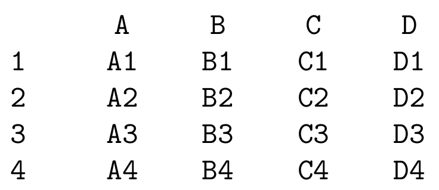
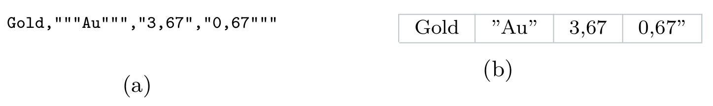
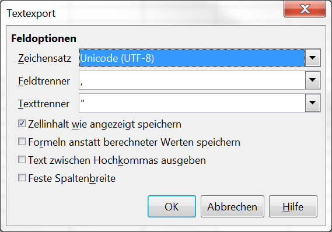

# Tabellen

## Übersicht

Tabellen werden verwendet, um Informationen strukturiert in Zellen zu speichern, die in Zeilen und Spalten angeordnet sind. Im Gegensatz zu analogen Tabellen bieten digitale Tabellen, die mit entsprechenden Programmen erstellt werden, eine Vielzahl an weiteren Funktionalitäten. Beispielsweise können Zellinhalte nach bestimmten Kriterien sortiert, dynamisch mittels Formeln erzeugt oder Grafiken aus den Daten generiert werden. Um solche und andere Funktionen zu erhalten, erfordert die Speicherung besondere Aufmerksamkeit.

### Langzeitformate

Für einfache Tabellen ohne interaktive Elemente wie Formeln oder für Tabellenkalkulationen bei denen es ausreicht die Ergebnisse der Formeln zu speichern, wird ein textbasiertes Format mit Trennzeichen für die Archivierung empfohlen.

Dazu eignet sich beispielsweise das CSV-Format, wobei als Trennzeichen ein Komma (,) und als Textbegrenzungszeichen das Anführungszeichen ('') verwendet werden sollte, um den Vorgaben von RFC 4180 gerecht zu werden. Andere Trennzeichen und Textbegrenzungszeichen können in begründeten Ausnahmefällen ebenfalls eingesetzt werden und müssen entsprechend dokumentiert werden. Als Zeichenkodierung sollte UTF-8 ohne BOM verwendet werden.

Ein alternatives textbasiertes Format für Tabellen ist das TSV-Format, das als Trennzeichen das Tabulator-Zeichen (U+0009) verwendet. Auch TSV-Dateien sollten UTF-8 ohne BOM als Zeichenkodierung verwenden.

Bei Dateien mit mehr als einem Arbeitsblatt (Tabellenkalkulationen), die als CSV- oder TSV-Datei gespeichert werden sollen, muss jedes Arbeitsblatt gesondert gespeichert werden. Dabei gilt für die Dateinamen der Arbeitsblätter, dass der Name des Arbeitsblattes an den Namen der Tabellenkalkulation, am besten durch ein Unterstrich (_) getrennt, angefügt wird (z. B. Tabellenname_Blatt1.csv, Tabellenname_Blatt2.csv usw.).

Tabellenkalkulationen, deren zusätzlichen Funktionalitäten erhalten bleiben sollen, werden am besten in einem offenen auf XML basierenden Format gespeichert, wie beispielsweise XLSX oder ODS. Ersteres ist das Standardformat, das in Microsoft Excel seit 2007 verwendet wird und auch von Microsoft entwickelt wurde. Letzteres ist das Format für Tabellenkalkulationen, welches in OpenOffice oder LibreOffice verwendet wird. ODS ist ein Teil vom OpenDocument Format (ODF) und wurde von einem technischen Komitee unter der Leitung der Organization for the Advancement of Structured Information Standards (OASIS) entwickelt.

Grafiken, die in Tabellenkalkulationen anhand der Daten erstellt wurden, müssen zusätzlich exportiert und gesondert in einem geeigneten Format gespeichert werden. Dies gilt ebenfalls für eingebettete Bilder oder andere Medien. Passende Formate sind beispielsweise in dem Abschnitt Rastergrafiken oder in dem Abschnitt Vektorgrafiken zu finden.

Tabellen können auch im XML-Format gespeichert werden. Es gibt eine ganze Reihe an DTDs oder XSDs, die hier als Grundlage dienen können, wie beispielsweise das Schema der TEI, das OASIS Exchange Table Model oder ISO 12083. Auch das Speichern von Tabellen im HTML-Format ist möglich. In jedem Fall muss die zugrundeliegende DTD oder XSD angegeben und gegebenenfalls mit archiviert werden. Die Dateien sollten UTF-8 ohne BOM als Zeichenkodierung verwenden.

Wenn neben den eigentlichen Daten in den einzelnen Zellen auch das Aussehen der Tabelle archiviert werden soll, kann neben einer CSV-, TSV-, XLSX- oder ODS-Datei zusätzlich eine Version der Tabelle im PDF/A-Format gespeichert werden. Bei der Erstellung von Tabellen sollte aber darauf geachtet werden, dass Informationen nicht nur durch Formatierungsangaben, wie beispielsweise die Farbe von Zellen, vermittelt werden, da je nach gewähltem Format die Formatierungsangaben verloren gehen können.

Hinweis: Obwohl Textverarbeitungsprogramme entsprechende Funktionen bieten, sollten Tabellen auch tatsächlich als Tabellen in einem der hier gelisteten Formate gespeichert werden.

| &nbsp; | Format                                                       | Begründung                                                   |
| ------ | ------------------------------------------------------------ | ------------------------------------------------------------ |
| ✔      | CSV    TSV   ODS   XLSX   XML, HTML    | Das textbasierte CSV-Format sollte mit einem Komma als Trennzeichen und mit Anführungszeichen als Textbegrenzungszeichen verwendet werden. Ausnahmen müssen dokumentiert werden. Die Zeichen sollten in UTF-8 ohne BOM kodiert sein.  TSV (MIME-Type text/tab-separated-values) ist ein textbasiertes Format, welches das Tabulator-Zeichen (U+0009) als Trennzeichen verwendet. Die Zeichen sollten in UTF-8 ohne BOM kodiert sein.  ODS basiert auf XML und ist Teil vom OpenDocument Format. Eingebettete Bilder und Medien müssen gesondert gespeichert werden.  XLSX 	XLSX ist das auf XML basierende Format von Microsoft. Eingebettete Bilder und Medien müssen gesondert gespeichert werden.  XML, HTML 	Tabellen im textbasierten XML- oder HTML-Format können ebenfalls archiviert werden. XML-Dateien benötigen zusätzlich eine DTD-Datei oder das XML Schema. Die Zeichen sollten in UTF-8 ohne BOM kodiert sein. |
| 〰️     | PDF/A   SXC                               | Wenn neben der Daten auch das Aussehen der Tabelle erhalten bleiben soll, eignet sich PDF/A am besten. Zusätzlich sollten die tabellarischen Daten in einem nachnutzbaren Format, wie etwa CSV, gespeichert werden.  SXC ist ein Vorgängerformat von ODS, weshalb letzteres auch bevorzugt werden sollte. |
| ❌      | XLS                                                          | Das XLS-Format von Microsoft eignet sich nicht zur Archivierung, da es proprietär ist und die Inhalte nicht textbasiert gespeichert werden.  |

### Dokumentation

Neben den allgemeinen minimalen Angaben zu Einzeldateien, wie sie in dem Abschnitt Metadaten in der Anwendung gelistet sind, werden für Tabellen und Tabellenkalkulationen weitere Angaben benötigt.

Um die Verständlichkeit einer Tabelle auch für Dritte zu gewährleisten, müssen Name und Zweck der jeweiligen Tabelle und der einzelnen Arbeitsblätter bekannt sein. Jede Spalte benötigt eine Überschrift, und zusätzlich müssen die verwendeten Formatvorgaben, Abkürzungen, Codes, Wertelisten und sonstige Terminologien dokumentiert werden. Um leere Zellen auch explizit als solche zu kennzeichnen, sollte ein vorher festgelegtes Zeichen (z.B. -) eingetragen und dokumentiert werden. Wenn Maßeinheiten nicht direkt aus der Tabelle ersichtlich sind, müssen diese ebenfalls gesondert dokumentiert werden.

Um sicher zu gehen, dass die Tabelle auch vollständig vorliegt, sollten die Anzahl der Spalten, Zeilen und der Arbeitsblätter angegeben werden.

Tabellen in textbasierten Formaten brauchen Angaben zu den verwendeten Trennzeichen, Textbegrenzungszeichen und der Zeichenkodierung.

Für Tabellenkalkulationen müssen bei Bedarf weitere Informationen zu Relationen, Formeln und Makros dokumentiert werden. Eingebettete Medien, wie etwa Bilder, sollten separat gespeichert und archiviert werden und in einer Liste zugehöriger Dateien aufgeführt werden. Dies gilt ebenfalls für Grafiken, die aus den Daten in der Tabellenkalkulation erzeugt wurden.

| Metadatum                                        | Beschreibung                                                 |
| ------------------------------------------------ | ------------------------------------------------------------ |
| Beschreibung der Tabelle oder des Arbeitsblattes | Welchen Zweck verfolgt die Tabelle oder das Arbeitsblatt?    |
| Bezeichnung der Arbeitsblätter                   | Auflistung der Bezeichnungen der Arbeitsblätter.             |
| Spaltenüberschrift                               | Jede Spalte einer Tabelle muss einen Namen haben.            |
| Spaltenbeschreibung                              | Beschreibung und Auflistung der in der jeweiligen Spalte verwendeten Formatvorgaben, Abkürzungen, Codes, Wertelisten, Eingabekonventionen,  Fachvokabulare, Zeichen für leere Zellen oder Maßeinheiten. |
| Anzahl Spalten                                   | Wie viele Spalten enthält die Tabelle?                       |
| Anzahl Zeilen                                    | Wie viele Zeilen enthält die Tabelle?                        |
| Anzahl Arbeitsblätter                            | Anzahl der Arbeitsblätter in einer Tabellenkalkulation.      |
| Trennzeichen                                     | Angabe des verwendeten Trennzeichens bei textbasierten Speicherformaten wie CSV. |
| Textbegrenzungszeichen                           | Angabe des verwendeten Textbegrenzungszeichens bei textbasierten Speicherformaten wie CSV. |
| Zeichenkodierung                                 | Angabe der verwendeten Zeichenkodierung bei textbasierten Speicherformaten wie CSV oder TSV. |
| Relationen                                       | Welche Querverweise gibt es innerhalb der Tabellenkalkulation? |
| Formeln                                          | Welche Formeln werden in der Tabellenkalkulation verwendet?  |
| Makros                                           | Welche Makros gibt es in der Tabellenkalkulation?            |
| Abgeleitete Grafiken                             | Aus den Daten erzeugte Grafiken müssen zusätzlich separat  gespeichert werden und in der Liste zugehöriger Dateien aufgenommen  werden. |
| Sprache                                          | In welchen Sprachen ist das Dokument verfasst? Sprachkennungen nach ISO 639 angeben. |
| Identifikator                                    | Wenn das Dokument bereits veröffentlicht wurde und eine ISBN oder  einen anderen persistenten Identifikator erhalten hat, sollte dieser  angegeben werden. |
| Weitere Dateien                                  | Liste abgeleiteter Grafiken und eingebetteter Medien, wie Bilder,  die zusätzlich separat gespeichert wurden. Liegt eine  Dokumentationsdatei für das Dokument vor, muss diese ebenfalls genannt  werden. |

Weitere Metadaten sind methodenabhängig und können in den jeweiligen Abschnitten nachgelesen werden.

## Vertiefung

Tabellen bestehen in ihrer einfachsten Form aus Zeilen und Spalten, deren Überschneidung eine Zelle bilden, in der ein Wert eingetragen wird. Die Namen der Spalten werden in die erste Zeile, der Kopfzeile (header), eingetragen. In der ersten Spalte, der Vorspalte, können die Zeilenbezeichnungen stehen.

Digitale Tabellen und Tabellenkalkulationen (spreadsheets) bieten erweiterte Funktionalitäten.

Für die Langzeitarchivierung von Tabellen sind strukturierte Textdateien mit Trennzeichen (delimiter separated values), wie CSV- oder TSV-Dateien, gut geeignet. Um Tabellen als XML-Dateien zu speichern, gibt es verschiedene XML Schemata und Dokumenttypdefinitionen.

*In der Tabelle ist die Spalte B blau markiert. Die Zeile 3 ist gelb  markiert. Die grün hervorgehobene Überschneidung aus der Zeile und der  Spalte ist die Zelle B3. Die erste Spalte stellt die Vorspalte und die  erste Zeile die Kopfzeile dar.*

 

### Tabellenkalkulationen

Als Tabellenkalkulation wird sowohl das Programm, als auch die damit erstellte Datei mit einer oder mehreren Tabellen bezeichnet. Im Folgenden ist die resultierende Datei gemeint.

Eine Tabellenkalkulation kann mehrere Tabellen, sogenannte Arbeitsblätter (worksheets oder spreadsheets) enthalten. Die Daten selbst können innerhalb der Tabellenkalkulation verwendet werden, um mittels Formeln neue Daten zu erzeugen oder Grafiken zu erstellen. Dazu erlauben die Programme eine Referenzierung auf Werte in anderen Zellen, die sich auch in einem anderen Arbeitsblatt befinden können. Es handelt sich dabei um Relationen.

Die gängigsten Tabellenkalkulationsprogramme ermöglichen die Erstellung und Verwendung von Makros, mit denen typische Befehlsfolgen und Bedienungsschritte aufgezeichnet und automatisiert wiederholt werden können.

Formatierungsangaben können in digitalen Tabellen und Tabellenkalkulationen ebenfalls vorgenommen werden. Dabei können wie in Textdokumenten nicht nur die Schriftart, Schriftgröße und ähnliches angepasst werden, sondern auch das Aussehen von Zellen, Zeilen und Spalten mittels Angaben zu Rahmenlinien und Hintergrundfarben. Soll der durch die Formatierungsangaben erzeugte optische Eindruck ebenfalls archiviert werden, weil er für das Verständnis der Tabelle zentrale Informationen transportiert, empfiehlt sich eine zusätzliche Speicherung der Tabellenkalkulation als PDF/A-Dokument.

### Strukturierte Textdateien mit Trennzeichen

Tabellen können in einem textbasierten Format gespeichert werden. Dabei handelt es sich um eine Textdatei, die auf eine bestimmte Weise strukturiert ist. Für Tabellen gibt es insbesondere die Formate CSV (comma-separated values) und TSV (tab-separated values), die sich nur geringfügig voneinander unterscheiden. Textbasierte Formate berücksichtigen keine Formatierungsangaben, sondern speichern nur die reinen Werte aus jeder Zelle ab.

*Die Tabelle aus der oberen Abbildung im TSV-Format.*

 

Jede Zeile einer CSV- oder TSV-Datei entspricht der Zeile einer Tabelle. Die einzelnen Zellen werden durch sogenannte Trennzeichen voneinander getrennt. In TSV-Dateien ist dies das Tabulator-Zeichen (U+0009), welches nach dem Standard der Internet Assigned Numbers Authority (IANA) nicht als Inhalt der Zellen erlaubt ist.

Für CSV-Dateien gibt es mit RFC 4180 bisher nur einen De-facto-Standard, der als Trennzeichen ein Komma (,) vorsieht. Da Kommas innerhalb von Zellen auch als Wert erlaubt werden, sind für diesen Fall Anführungszeichen ('') als Textbegrenzungszeichen vorgesehen, die vor und nach der jeweiligen Zelle eingefügt werden. In der Abbildung unten ist links ein Beispiel einer CSV-Datei zu sehen und rechts daneben wie diese in einem Tabellenkalkulationsprogramm dargestellt wird.

*(a) Eine CSV-Datei. In der Spalte 'Gew. (g)' sind die Werte jeweils mit Textbegrenzungszeichen ('') versehen, da innerhalb des Wertes ein Komma verwendet wird. (b) Die CSV-Datei aus a, wie sie in einem Tabellenkalkulationsprogramm dargestellt werden könnte. Die Tabelle stellt Informationen zu Münzen aus dem Münzkabinett der Staatliche Museen zu Berlin dar.*

 

Für den Fall, dass das Textbegrenzungszeichen auch innerhalb einer Zelle verwendet werden soll, sieht das RFC 4180 vor, dass dieses gedoppelt wird und die Zelle zusätzlich von den Textbegrenzungszeichen umschlossen wird. Die Abbildung unten verdeutlicht die Verwendung der Textbegrenzungszeichen in den Zellwerten.

*(a) Eine CSV-Datei, in der Textbegrenzungszeichen ('') innerhalb der Zellen verwendet werden. (b) Die CSV-Datei aus a, wie sie in einem Tabellenkalkulationsprogramm dargestellt werden könnte.*

 

In der Praxis werden auch andere Trennzeichen und Textbegrenzungszeichen in CSV-Dateien verwendet. Beispielsweise ist das Trennzeichen in den von Microsoft Excel gespeicherten CSV-Dateien ein Semikolon (;) statt eines Kommas. Diese Abweichungen von der Empfehlung des RFC 4180 müssen in den Metadaten angegeben werden. Außerdem ist zu beachten, dass die Verwendung von mehreren verschiedenen Trennzeichen oder Textbegrenzungszeichen in einer Datei nicht erlaubt ist.

Das Speichern von Tabellen in strukturierten Textdateien bringt einige Einschränkungen mit sich. Es können keine Formatierungsangaben oder Makros gespeichert werden. Im Gegensatz zu einer Tabellenkalkutalion, wo bei Formeln sowohl die Formel als auch deren Ergebnis gespeichert ist, kann in textbasierten Tabellenformaten entweder nur die Formel selbst oder das Ergebnis gespeichert werden.

Weiterhin ist es nicht möglich verbundene Zellen zu speichern. Bei verbundenen Zellen handelt es sich im Prinzip um einen visuellen Effekt, bei dem eine Zelle die anderen Zellen überdeckt. Dementsprechend wird in einem textbasierten Format der Wert aus den verbundenen Zellen in die erste Zelle aus der Gruppe geschrieben, während die übrigen Zellen leer bleiben. Wird die so gespeicherte Tabelle später wieder geöffnet, ist der visuelle Effekt der verbundenen Zellen nicht mehr sichtbar, was die Abbildung unten verdeutlicht.

*(a) Eine Tabelle mit verbundenen Zellen in einem Tabellenkalkulationsprogramm. (b) Die Tabelle aus a im CSV-Format. Der Wert aus den verbundenen Zellen steht in der ersten der vorher verbundenen Zellen. (c) Wird die CSV-Tabelle aus b wieder in einem Tabellenkalkulationsprogramm geöffnet, werden die Zellen auch nicht mehr als verbunden angezeigt.*

### Tabellen mit Auszeichnungssprachen

Tabellen können auch als Textdatei mit Auszeichnungssprachen wie XML oder HTML gespeichert werden. Allgemeine Eigenschaften von Auszeichnungssprachen werden in dem Kapitel Textdokumente in dem Abschnitt Auszeichnungssprachen beschrieben.

Vom Prinzip her sind Tabellen mit Auszeichnungssprachen ebenfalls strukturierte Textdateien, die aber weitere Angabemöglichkeiten beispielsweise für Metadaten oder verbundene Zellen bieten.

Für das XML-Format gibt es das OASIS Exchange Table Model (DTD) oder das von der TEI speziell für die Geistes-, Sozial- und Sprachwissenschaften entwickelte XSD-Schema. Ersteres stammt von dem Tabellenmodell CALS ab, welches von dem US-Verteidigungsministerium entwickelt wurde.

Speziell für SGML gibt es den Standard ISO 12083, der entwickelt wurde, um Publikationen auszuzeichnen.

Auch HTML und TeX stellen für die Eingabe von Tabellen jeweils eine spezielle Syntax zur Verfügung, was die Abbildung unten veranschaulicht.

*Eine Tabelle (a), wie sie in TeX (b), mit XML (c) und in HTML (d) dargestellt werden könnte.*

 

Wichtig für die Archivierung von Tabellen mit Auszeichnungssprachen ist, dass alle Dateien wohlgeformt und valide sind, also die Regeln der jeweiligen Auszeichnungssprache und deren Grammatik einhalten. Die jeweils verwendeten DTD- oder XSD-Dateien müssen in jedem Fall angegeben werden und gegebenfalls mit archiviert werden. Die Dateien selbst sollten UTF-8 ohne BOM als Zeichenkodierung verwenden.

## Praxis

Dieser Abschnitt liefert Hinweise zum Umgang mit Tabellen und Tabellenkalkulationen in der Praxis und stellt Tabellenkalkulationsprogramme vor. Es wird erläutert, wie Tabellen als CSV- oder TSV-Datei gespeichert und wie Grafiken aus Tabellenkalkulationen exportiert werden können. Für die Bereinigung von Tabellen wird eine automatisierte Lösung vorgeschlagen.

### Tabellenkalkulationsprogramme

Für die Bearbeitung von Tabellen und Tabellenkalkulationen gibt es dezidierte Tabellenkalkulationsprogramme, wie OpenOffice Calc, LibreOffice Calc oder Microsoft Excel. OpenOffice und LibreOffice speichern Tabellenkalkulationen standardmäßig im ODS-Format. Seit 2007 speichert Microsoft Word im XLSX-Format. Beide Formate sind offen dokumentiert, basieren auf XML und sind für die Langzeitarchivierung geeignet.

Aus den Daten erzeugte Grafiken, eingebettete Bilder oder andere Medien sollten zusätzlich als separate Dateien in einem geeigneten Langzeitformat gespeichert werden. Dies stellt sicher, dass die Qualität der ursprünglichen Datei erhalten bleibt, automatisch erzeugte Grafiken nicht verloren gehen und wie ursprünglich intendiert aussehen.

Die Darstellung von Tabellenkalkulationen mit umfangreichen Formatierungsangaben kann auf verschiedenen Computern unterschiedlich ausfallen, was vor allem an unterschiedlichen Einstellungen liegt. Wenn bestimmte Schriftarten auf einem System fehlen, werden sie automatisch ersetzt, was ebenfalls zu unterschiedlichen Darstellungsweisen führt. Wenn eine stabile systemübergreifende Darstellung von Tabellenkalkulationen gewünscht ist, kann dies nur mittels Konvertierung in ein PDF-Dokument gewährleistet werden. Für die Langzeitspeicherung sollte PDF/A verwendet werden. Hinweise zum Erstellen von PDF- und PDF/A-Dokumenten sind im Praxisteil zu PDF-Dokumenten zu finden.

- OpenOffice Calc: https://www.openoffice.org/
- LibreOffice Calc: http://www.libreoffice.org/

### Tabellen als CSV- oder TSV-Dateien speichern

Alle gängigen Tabellenkalkulationsprogramme bieten Exportfunktionen zur Speicherung von Tabellen als CSV- oder TSV-Dateien. Dabei ist zu beachten, dass jeweils nur das aktuell gewählte Arbeitsblatt gespeichert wird und Formatierungsangaben und Makros nicht gespeichert werden. Bei den Formeln wird üblicherweise nur der Ergebniswert gespeichert, wenn keine andere Einstellung vorgenommen wird.

Eine TSV-Datei kann in Microsoft Excel über "Datei > Speichern unter" mit dem Dateityp "Text (Tabstopp-getrennt) (*.txt)" erzeugt werden. Die Datei wird als TXT-Datei gespeichert, erfüllt jedoch alle Anforderungen an eine TSV-Datei.

Für das CSV-Format bietet Microsoft Excel über "Datei > Speichern unter" gleich mehrere Optionen, von denen "CSV (Trennzeichen-getrennt) (*.csv)" verwendet werden sollte, da "CSV (Macintosh) (*.csv)" und "CSV (MS-DOS) (*.csv)" andere problembehaftete Zeichenkodierungen verwenden, die für ältere Systeme gedacht waren. Die von Microsoft Excel erzeugten CSV-Dateien werden standardmäßig mit einem Semikolon (;) als Trennzeichen und Anführungszeichen (") als Textbegrenzungszeichen gespeichert. Da abweichend von den Vorgaben des RFC 4180 als Trennzeichen ein Komma und kein Semikolon verwendet wird, ist in diesem Fall die Angabe des Trennzeichens in den Metadaten notwendig.

Microsoft Excel verwendet ANSI für die Zeichenkodierung der Dateien, weshalb dies nachträglich auf UTF-8 ohne BOM angepasst werden muss. Im Kapitel "Textdokumente" sind im Abschnitt "Einstellen der Zeichenkodierung" nähere Erläuterung dazu zu finden. Dieser Schritt sollte allerdings erst dann erfolgen, wenn die Tabellen nicht mehr mit Excel bearbeitet werden sollen, weil das Programm nicht mit UTF-8 kodierten Dateien umgehen kann und daher die Zeichen nicht richtig darstellt.

*Der Dialog "Textexport" in LibreOffice Calc zur Speicherung von CSV-Dateien.*

 

Wesentlich komfortabler und flexibler ist die Erstellung von CSV-Dateien mit LibreOffice Calc oder OpenOffice Calc. Über "Datei > Speichern unter" wird der Dateityp "Text CSV (.csv) (*.csv)" angeboten. Wird bei der Option "Filtereinstellungen bearbeiten" ein Haken gesetzt, erscheint bei dem Klick auf "Speichern" der Dialog "Textexport" (nebenstehende Abbildung), in dem die Zeichenkodierung bei "Zeichensatz", das Trennzeichen bei "Feldtrenner" und das Textbegrenzungszeichen bei "Texttrenner" ausgewählt werden können.

Mit der Option "Zellinhalt wie angezeigt speichern" wird der Inhalt der Zellen in der CSV-Datei so gespeichert, wie sie zu sehen sind. Wird die Option nicht ausgewählt, werden beispielsweise die Währungssymbole, die mittels Angaben für die Zellformatierung automatisch eingefügt wurden, nicht gespeichert. Die Option "Formeln anstatt berechneter Werten speichern" ermöglicht die Speicherung der eingegebenen Formeln anstatt der Werte.

TSV-Dateien werden in LibreOffice Calc oder OpenOffice Calc zunächst als CSV-Datei angelegt, wobei als Feldtrenner {Tabulator} gewählt wird. Um zu verdeutlichen, dass es sich um eine TSV-Datei und nicht um eine CSV-Datei handelt, sollte die Dateiendung nachträglich manuell geändert werden.

### Grafiken exportieren

Grafiken, die in Tabellenkalkulationsprogrammen mittels der eingetragenen Daten erzeugt wurden, müssen für die Archivierung der Tabelle zusätzlich als gesonderte Bilddatei in einem geeigneten Format gespeichert werden. Passende Formate sind in den Kapiteln "Rastergrafiken" und "Vektorgrafiken" beschrieben.

Der Export von Grafiken funktioniert bei LibreOffice Calc mit einem Klick mit der rechten Maustaste auf die Grafik. In dem erscheinenden Menü gibt es den Eintrag "Als Bild exportieren". Es erscheint ein Speicherdialog für die Grafik in dem verschiedene Formate zur Auswahl stehen. Wird die Grafik als Rastergrafik gespeichert, muss vorher auf eine geeignete Größe der Grafik geachtet werden, indem sie beispielsweise vorher in der Tabellenkalkulation vergrößert wird.

Eine alternative Exportmethode, die auch in OpenOffice Calc und Microsoft Excel funktioniert, ist das Zwischenspeichern der Grafik und anschließende Speichern in einem dezidierten Grafikprogramm. Die Grafik kann in dem Grafikprogramm bearbeitet und angepasst werden, bevor sie gespeichert wird. Auch hier muss beim Speichern auf eine geeignete Größe des Bildes geachtet werden.

Die oben beschriebenen Schritte müssen für alle Grafiken in der Tabellenkalkulation wiederholt werden, was bei Tabellenkalkulationen mit vielen Grafiken ein langwieriger Vorgang sein kann. Für diesen Fall bietet sich die Option an, die gesamte Tabellenkalkulation mittels "Datei > Speichern unter" als HTML-Datei ("Webseite" oder "HTML-Dokument") in einem gesonderten Ordner zu speichern. In dem Ordner werden alle Grafiken als PNG- oder JPG-Datei abgelegt. Bei dieser Exportvariante ist zu beachten, dass die erzeugten Einzelbilder eventuell Mängel in der Qualität aufweisen.

### Bereinigung von Tabellen

Bei Tabellen, die über einen längeren Zeitraum von mehreren Bearbeitern gepflegt werden, können trotz festgelegter Vorgaben Inkonsistenzen auftreten. Solche Inkonsistenzen können beispielsweise darin bestehen, dass für die Materialbeschreibung mal "Silber" und mal "Ag" verwendet wird. Bei einer automatisierten statistischen Auswertung könnte das zu Verzerrungen führen. Für solche Fälle kann das frei verfügbare Programm OpenRefine verwendet werden. Es ermöglicht die Aufdeckung und Bereinigung von Inkonsistenzen in Tabellen. Darüber hinaus bietet es Funktionen, um die Daten zusätzlich über Transformationen oder durch externe Webinhalte anzureichern.

- OpenRefine: http://openrefine.org/

## Quellen

Archaeology Data Service, Databases and Spreadsheets: A Guide to Good Practice
http://guides.archaeologydataservice.ac.uk/g2gp/DbSht_Toc

T. Hicks, Should We Be Using ISO 12083?, The Journal of Electronic Publishing 3, 1998, 4
http://quod.lib.umich.edu/j/jep/3336451.0003.407?view=text;rgn=main

Research Data Management Service Group, Preparing tabular data for description and archiving
http://data.research.cornell.edu/content/tabular-data

### Formatspezifikationen

- ODT: https://www.oasis-open.org/standards\#opendocumentv1.2
- XSLX: ECMA-376 http://www.ecma-international.org/publications/standards/Ecma-376.htm
- CSV: RFC 4180 https://tools.ietf.org/html/rfc4180
- TSV: IANA: http://www.iana.org/assignments/media-types/text/tab-separated-values
- XML: OASIS (Hrsg.) Standards/Specs: Table Models https://www.oasis-open.org/specs/tablemodels.php
- XML: OASIS (Hrsg.) XML Exchange Table Model Document Type Definition https://www.oasis-open.org/specs/tm9901.html
- XML: TEI (Hrsg.) P5: Guidelines for Electronic Text Encoding and Interchange http://www.tei-c.org/release/doc/tei-p5-doc/en/html/FT.html
- HTML: W3C: http://www.w3.org/TR/html401/struct/tables.html
- ISO 12083: http://www.iso.org/iso/catalogue_detail.htm?csnumber=20866
- TeX: https://en.wikibooks.org/wiki/LaTeX/Tables
-

### Tools und Programme

- OpenOffice Calc: https://www.openoffice.org/
- LibreOffice Calc: http://www.libreoffice.org/
- OpenRefine: http://openrefine.org/
