# Bilder – Vektorgrafiken und CAD-Daten

## Übersicht

Vektorgrafiken sind Grafiken, die mittels grafischer Primitiven, wie beispielsweise Linien, Punkte, Polygone, Kreise und Kurven beschrieben werden. Sie sind daher im Gegensatz zu Rastergrafiken ohne Qualitätsverlust beliebig skalierbar. Zeichnungen von Scherben, Isometrische Darstellungen von Objekten oder aus CAD- oder GIS-Anwendungen exportierte Pläne werden häufig als Vektorgrafik angelegt oder gespeichert.

Auch bei Daten, die mittels CAD entstehen, handelt es sich um Vektordaten mit grafischen Primitiven, die in den entsprechenden Programmen zusätzliche Funktionalitäten bieten, die speziell auf architektonische und technische Zeichnungen zugeschnitten sind. CAD-Daten können sowohl in 2D als auch in 3D vorliegen und werden in den Altertumswissenschaften meist für Zeichnungen von Ausgrabungen, archäologische Karten oder architektonische Pläne verwendet.

Dieser Abschnitt beschäftigt sich mit der Archivierung von zweidimensionalen Vektorgrafiken und CAD-Daten. Die Archivierung von GIS-Daten wird in dem eigenen Abschnitt GIS beschrieben. Hinweise zur Archivierung von dreidimensionalen Objekten sind in dem Abschnitt 3D und Virtual Reality zu finden.

### Langzeitformate

Für zweidimensionale Vektorgrafiken ist das vom W3C entwickelte und seit 2001 auch empfohlene Format Scalable Vector Graphics (SVG) für die Langzeitarchivierung geeignet, da es ein XML-basiertes, offen dokumentiertes Format ist, eine weite Verbreitung gefunden hat und als MIME-Type image/svg+xml registriert ist. Die aktuelle Version ist 1.1. Neben grafischen Primitiven, geometrischen Formen, Text und eingebetteten Rastergrafiken können SVG-Dateien auch Skripte und Animationen enthalten. Mit Hilfe des Gruppierungselementes <d> können Ebenen ausgezeichnet werden, wobei dieses Element in der Praxis auch für andere Zwecke genutzt wird. Umfassende Metadaten können in einem eigens dafür vorgesehenen Bereich gespeichert werden. Speziell für mobile Geräte gibt es die Variante SVG Tiny 1.2. Das W3C arbeitet seit 2012 an SVG 2, das in absehbarer Zeit die Version 1.1. ablösen soll. SVG-Dateien können auch komprimiert mittels gzip als SVGZ gespeichert werden, wobei dies nicht für die Archivierung zu empfehlen ist. Auch von der Verwendung von Skripten sollte für die Archivierung abgesehen werden.

Computer Graphics Metafile (CGM) ist unter ISO/IEC 8632 standardisiert, wurde 1986 entwickelt und zuletzt 1999 aktualisiert. CGM kann umfangreiche grafische Informationen und geometrische Primitiven speichern, ist inzwischen jedoch für viele Bereiche veraltet, weshalb SVG für die Archivierung verwendet werden sollte. Das W3C hat 2001 die Variante WebCGM veröffentlicht, die zusätzliche Funktionalitäten für die Verwendung im Internet enthält. Die aktuellste und empfohlene Fassung von WebCGM ist Version 2.1.

Speziell für CAD-Daten gibt es kein Format, das uneingeschränkt für die Langzeitarchivierung zu empfehlen ist. Ein Grund dafür ist die immerwährende und schnelle Entwicklung von CAD-Software, die sich auch auf die Ausgabeformate auswirkt und zu einer hohen Heterogenität und mangelnden Interoperabilität der Datenformate führt. Durch die weite Verbreitung des von der Firma Autodesk vertriebenen Programms AutoCAD haben die von Autodesk entwickelten Dateiformate DXF und DWG eine weite Verbreitung in der Archäologie und Bauforschung gefunden und sich de facto als Standard durchgesetzt.

Das Drawing Interchange Format (DXF, aktuelle Version v.u.28.1.01) wurde von Autodesk entwickelt, um den Austausch von CAD-Dateien zwischen AutoCAD und anderen Programmen zu ermöglichen. Dabei wurde das Format so gestaltet, dass es möglichst alle in einer Datei enthaltenen Informationen speichern kann, ohne dass dafür die Optimierungen des proprietären DWG-Formates von Autodesk enthüllt werden müssen. Neue Versionen von DXF werden fast jedes Jahr veröffentlicht und durch neue Funktionalitäten angereichert. Für die jüngsten DXF-Versionen stellt Autodesk die Spezifikationen frei zur Verfügung, wobei allerdings ab Release 13 (v.u13.1.01) manche Bereiche ungenügend spezifiziert sind, so dass unter Umständen nicht alle Funktionen in anderen Programmen umgesetzt und unterstützt werden. DXF gibt es sowohl in einer textbasierten ASCII-Variante, als auch als Binärformat, wobei für die Archivierung erstere bevorzugt werden sollte. Maße werden von DXF nicht unterstützt, weshalb die Angabe des Maßstabes und der Zeicheneinheiten erforderlich ist.

DWG (abgeleitet vom englischen drawing) ist das native Speicherformat von AutoCAD und weder offen dokumentiert noch standardisiert. Mit jeder neuen Version von AutoCAD wird auch eine neue Version des DWG-Formates veröffentlicht. Da AutoCAD aber eine so weite Verbreitung gefunden hat, wird dieses Format auch von anderen CAD-Programmen unterstützt. Eine frei verfügbare nachkonstruierte Spezifikation wird von der Open Design Alliance zur Verfügung gestellt.

Für die Archivierung von CAD-Dateien sollten bis zur Etablierung von geeigneten Archivformaten neben dem Originalformat auch Versionen der Datei als DXF und als DWG vorgehalten werden. Um eine möglichst hohe Nachnutzbarkeit zu gewährleisten, sollte eine ältere verbreitete Version der Formate verwendet werden, wie beispielsweise DWG 2010 (AC1024) und DXF 2010 (AC1024).

Für alle Vektorgrafiken und insbesondere für CAD-Daten gilt die zusätzliche Empfehlung, verschiedene Druckansichten in geeigneten Formaten, wie etwa PDF/A, zu speichern. Dadurch bleibt das intendierte Aussehen der Ursprungsgrafik erhalten, auch wenn die direkte Bearbeitbarkeit verloren geht. Jedoch können Vektorgrafiken größtenteils auch wieder aus einer PDF/A-Datei extrahiert werden. Nähere Informationen zu dem Format sind im Abschnitt über PDF-Dokumente zu finden.

Externe zugehörige Dateien müssen ebenfalls in einem geeigneten Archivformat gespeichert werden.

PostScript (PS) ist eine Sprache zur Beschreibung von Seiten, die von Adobe entwickelt wurde, und einen Grundstein des PDF-Formates bildet. Darauf aufbauend wurde das Format Encapsulated PostScript (EPS) entwickelt, das neben der Beschreibung in PostScript auch eine eingebettete Datei enthält, die eine Vorschau auf den Inhalt der Datei ermöglicht. Die Vorschaudatei wird jedoch nicht einheitlich gespeichert, was zu einer eingeschränkten Interoperabilität von EPS führt. Ferner kann EPS keine Ebenen und Transparenz speichern. Für die Langzeitarchivierung sollte daher SVG oder PDF/A verwendet werden.

Proprietäre Formate für Vektorgrafiken, wie etwa die Formate AI von Adobe Illustrator und INDD von Adobe InDesign, sind nicht für die Langzeitarchivierung geeignet. Dies trifft ebenfalls auf das von Autodesk entwickelte Format DWF zu, da es primär für Visualisierungen gedacht ist und nicht für den vollständigen Datenaustausch. In der Industrie werden als alternative offene Austauschformate auch IGES und STEP für CAD-Daten und IFC für Gebäudedatenmodellierung verwendet.

| &nbsp; | Format                                                       | Begründung                                                   |
| ------ | ------------------------------------------------------------ | ------------------------------------------------------------ |
| ✔      | SVG                                                          | Ein XML-basierter offener Standard vom W3C. Für die Archivierung sollte unkomprimiertes SVG 1.1 ohne script bindings verwendet werden. |
| 〰️     | WebCGM   DXF    DWG    PDF/A   | Vom W3C 2001 als Variante von CGM veröffentlicht, um die Verwendung im Internet zu ermöglichen. Wenn es verwendet wird, dann  in Version 2.1, wobei SVG für die Langzeitarchivierung besser geeignet ist.  Das Drawing Interchange Format wurde von Autodesk entwickelt und ist offen dokumentiert. Da Maße nicht gespeichert werden, ist die Angabe des Maßstabes und der Zeicheneinheiten erforderlich. Um eine hohe Nachnutzbarkeit zu erlauben, sollte eine ältere Version, wie etwa DXF 2010 (AC1024), verwendet werden.  Ist ein proprietäres Format von Autodesk und sollte nur verwendet werden, wenn eine Speicherung in DXF einen erheblichen Funktionsverlust darstellen würde. Um eine hohe Nachnutzbarkeit zu erlauben, sollte eine ältere Version, wie etwa DWG 2010 (AC1024), verwendet werden.  PDF/A ist für die langfristige Speicherung von zweidimensionalen Vektorgrafiken und Druckansichten von CAD-Daten geeignet. Jedoch bleibt nur das Aussehen erhalten. Nähere Informationen zu dem Format sind im Abschnitt über PDF-Dokumente ab Seite \pageref{pdf-dokumente} zu finden. |
| ❌      | CGM  PS, EPS   AI, INDD  DWF | Ist unter ISO/IEC 8632 standardisiert, jedoch veraltet. Stattdessen sollte SVG verwendet werden.  Encapsulated PostScript beruht auf PostScript, einer Sprache zur Beschreibung von Seiten für den Druck, die von Adobe entwickelt wurden. Für die Archivierung sollte SVG oder PDF/A verwendet werden.  Proprietäre Formate von Adobe Illustrator und Adobe InDesign sind nicht für die Langzeitarchivierung geeignet.  Wurde von Autodesk für die Visualisierung von CAD-Daten entwickelt und ist nicht für die Langzeitarchivierung geeignet. |

### Dokumentation

Neben den allgemeinen minimalen Angaben zu Einzeldateien, wie sie in dem Abschnitt Metadaten in der Anwendung aufgelistet sind, werden für Vektorgrafiken und insbesondere für CAD-Daten weitere Angaben benötigt.

Neben technischen Informationen sollten vor allem auch beschreibende und administrative Metadaten über die Datei erfasst werden. Dabei können manche Metadaten auch Bestandteil der Grafik selbst sein, wie beispielsweise eine Legende, die über Zeichnungskonventionen für verwendete Strichstärken oder Farben Auskunft gibt.

Zur Dokumentation von CAD-Daten gehören unter anderem die Angabe der Quellen oder Messdaten, die zur Erstellung der Zeichnung herangezogen wurden, die Dokumentation der wesentlichen Arbeitsschritte, die im Verlauf der Erstellung durchlaufen wurden, die Dokumentation der angewendeten Methoden und eine Beschreibung der Abhängigkeitsverhältnisse zwischen den unterschiedlichen Bestandteilen, wie etwa den Ebenen.

| Metadatum             | Beschreibung                                                 |
| --------------------- | ------------------------------------------------------------ |
| Identifikator         | Name der Datei, z.B. grabung01.dxf                           |
| Dateiformat & Version | z.B. DXF Release 14                                          |
| Farbraum              | Der in dem Bild verwendete Farbraum, z.B. RGB oder Graustufen |
| Farbtiefe             | z.B. 24 bit oder 8 bit                                       |
| Bildunterschrift      | Der Titel oder eine passende Unterschrift                    |
| Beschreibung          | Beschreibung der Datei                                       |
| Urheber               | Name des Erstellers oder der Bearbeiter                      |
| Datum                 | Datum der Erstellung oder letzten Änderung der Datei         |
| Rechte                | Details zum Urheberrecht                                     |
| Schlagworte           | Schlagworte, wie z.B. Periode, Fundstelle oder charakteristische Merkmale. Wenn vorhanden, angemessene Thesauri verwenden |
| Ort                   | Ortsinformationen zu der Datei. Möglichst in einem standardisierten  Format angeben, wie z.B. Lat/Long oder Schlagworte aus einem geeigneten  Thesaurus, z.B. Getty Thesaurus of Geographic Names oder GeoNames |
| Software              | Angaben zu Software (inklusive Plug-ins) und Version mit der die Datei erstellt oder bearbeitet wurde, wie z.B. Autodesk AutoCAD 2012 |
| Externe Dateien       | Eine Liste aller externen zugehöriger Dateien, wie etwa Messdaten, Rastergrafiken oder eingebundener Datenbanken |
| Maßstab               | Angabe zum verwendeten Maßstab bzw. was eine Zeicheneinheit darstellt |
| Koordinatensysteme    | Falls vorhanden, verwendetes Koordinatensystem oder Kartenprojektion angeben |
| Konventionen          | Dokumentation der Bedeutung von Farben, Linienstärken, Linientypen, Füllarten etc. |
| Ebenen                | Angabe der Ebenen, deren Inhalt und der Konventionen für deren Benennung und Befüllung |
| Aufnahmemethode       | Angabe zur verwendeten Methode zur Datengewinnung            |
| Messgenauigkeit       | Angaben zur Messgenauigkeit des Aufnahmegerätes              |
| Aufnahmegerät         | Beispielsweise Details zum Laserscanner                      |

Weitere Metadaten sind methodenabhängig und können in den jeweiligen Abschnitten nachgelesen werden.

## Vertiefung

Vektorgrafiken werden mittels grafischer Primitive und ihrer geometrisch-mathematischen Eigenschaften exakt beschrieben. Ein Kreis kann zum Beispiel mittels der Lage seines Mittelpunktes und dessen Radius definiert und dargestellt werden. Zusätzlich können weitere Parameter für Linienstärke, Linienfarbe oder Füllfarbe festgelegt werden, die das Aussehen der Grafik beeinflussen. Im Gegensatz dazu wird in einer Rastergrafik die Form eines Kreises mittels einzelner Pixel angenähert und gespeichert.

Der benötigte Speicherplatz ist bei Rastergrafiken daher meist größer, was in der Abbildung oben verdeutlicht wird, in der für einen Kreis mit einem Durchmesser von 3cm im SVG-Format nur 1 kB Speicherplatz, im PNG-Format aber bereits 2 kB benötigt werden. Ein weiterer Vorteil von Vektorgrafiken ist, dass diese ohne Qualitätsverlust und Erhöhung des Speicherbedarfs beliebig skalierbar sind, während Rastergrafiken eine festgelegte Größe besitzen. Daher werden bei einer Vergrößerung von Rastergrafiken die einzelnen Bildpunkte sichtbar und bei einer Verkleinerung Bildpunkte verschmolzen, wodurch die Informationsdichte reduziert wird. Jedoch eignen sich Vektorgrafiken nicht für kleinteilige Bilder mit Farbabstufungen und -verläufen, wie sie etwa bei Fotografien auftreten.

Im folgenden Abschnitt werden außerdem die Vorteile von Ebenen zur Strukturierung einer Vektordatei und die Besonderheiten von CAD-Daten erläutert. Auch die Unterschiede zwischen CAD-Daten und GIS-Daten werden näher beleuchtet.

Ganz allgemein können Vektordaten auf drei unterschiedlichen Wegen erzeugt werden:

- Erzeugung aus Messdaten - Gemessene Punkte können beispielsweise in ein CAD-Programm importiert und dort zu einem Modell zusammengefügt werden.
- Direkte Erzeugung - Manuelle Erstellung der Datei in einem Grafikprogramm.
- Vektorisierung - Umwandlung einer Rastergrafik oder einer analogen Vorlage in eine Vektorgrafik, entweder durch manuelles Nachzeichnen oder mittels automatisierter Verfahren.

### Grafische Primitive

Die für die Beschreibung von Vektorgrafiken verwendeten grafischen Primitive können in sechs Gruppen zusammengefasst werden:

- Punkte und Marker - Beschreiben einen bestimmten Punkt innerhalb der Vektorgrafik. Mittels Markern in Form von Symbolen können diese Punkte auch identifiziert werden.
- Pfade - Verbinden zwei oder mehr Punkte mittels gerader Linien (Polylinien) oder Kurven
- Kurven oder Splines - Kurven können mathematisch beschrieben werden und in Pfaden verwendet werden. Meist werden Bézierkurven unterstützt, jedoch sind auch weitere Varianten, etwa NURBS möglich.
- Geschlossene Pfade - Geschlossene Pfade, oder Polygone, sind Pfade, die den gleichen Anfangs- und Endpunkt besitzen. Der eingeschlossene Bereich kann als Fläche gefüllt werden.
- Einfache Geometrien - Häufig verwendete Formen, wie Rechtecke, Kreise oder Ellipsen.
- Text - Textzeichen mit einer ganzen Reihe von Eigenschaften, wie Schriftart, -größe und -farbe.

Nicht alle grafischen Primitive werden von jedem Vektorformat unterstützt, was bei der Konvertierung von einem Format in ein weiteres berücksichtigt werden muss. Dies gilt insbesondere für programmspezifische grafische Primitive

### Aussehen grafischer Primitive

Den grafischen Primitiven einer Vektorgrafik oder CAD-Datei können verschiedene Eigenschaften zugewiesen werden, die das Aussehen beziehungsweise die Darstellung der Primitive beeinflussen. Mittels dieser Aussehens- oder Layoutattribute können beispielsweise die Strichstärke, der Linientyp, die Farbe oder die Transparenz festgelegt und dabei auf Punkte, Linien oder Flächen angewandt werden, was in untenstehender Abbildung dargestellt wird. Je nach Anwendungsprogramm sind auch komplexe Pinsel oder variable Strichstärken möglich.

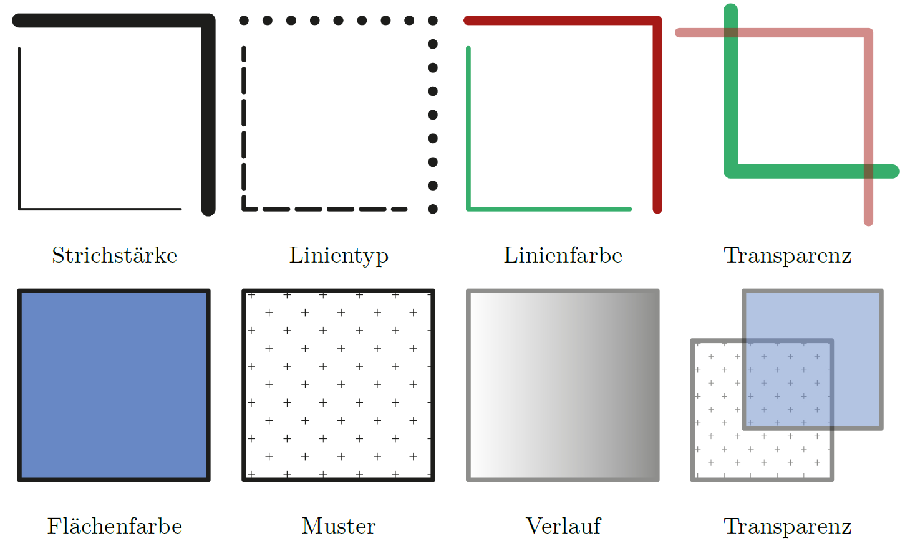
*Beispiele für Layoutattribute grafischer Primitiven mit verschiedenen Eigenschaften für Strichstärke, Linientyp, Farbe und Transparenz.*

 

Die Anwendung von Aussehensattributen beeinflusst nicht die geometrische Form eines Pfades selbst, was bedeutet, dass das Aussehen eines Pfades nicht immer deckungsgleich mit dessen geometrischer Form sein muss, wie die untenstehende Abbildung verdeutlicht.

*Bei der Verwendung von (a) Pinseln und variablen Strichstärken, (b) Linientypen als Pinsel oder der Ausrichtung der Kontur nach (c) außen oder (d) innen wird die geometrische Form eines Pfades (rot dargestellt) nicht verändert.*

 

### Bildstruktur und Ebenen

Zusätzlich zu den grafischen Bestandteilen wird in Vektorgrafiken auch die Bildstruktur, also die Hierarchie der einzelnen Elemente untereinander, gespeichert. Dazu zählt beispielsweise, ob eine Linie über oder unter einem anderen Objekt verläuft, wie die Elemente gruppiert sind oder in welchen Ebenen sie angeordnet sind.

Ebenen (engl. layer, daher auch Layer) in der Bildbearbeitung kann man mit durchsichtigen Folien vergleichen, die verschiedene Elemente eines Bildes enthalten und übereinander gelegt werden, um zusammen den gesamten Bildinhalt wiederzugeben. Ebenen dienen der Strukturierung von Zeichnungen, indem beispielsweise grafische Primitive mit ähnlicher inhaltlicher Bedeutung oder ähnlichem Aussehen zusammengefasst und gemeinsam ein- und ausgeblendet werden können. In der Regel bildet die Ebenenhierarchie auch die Objekthierarchie ab, sodass Elemente auf der obersten Ebene alle anderen Elemente der darunter liegenden Ebenen verdecken können.

### CAD

Eine besondere Form der Vektordaten stellen CAD-Daten dar, wobei der Begriff CAD für computer aided design (dt. rechnerunterstützte Konstruktion) steht. CAD-Programme sind auf das computerunterstützte Konstruieren spezialisiert und berücksichtigen die Besonderheiten des technischen Zeichnens. Im Bereich der Altertumswissenschaften werden die Programme vor allem für architektonische Zeichnungen oder zur Weiterverarbeitung von Ergebnissen von Objektvermessungen genutzt.

Mittels CAD-Programmen können technische Zeichnungen erstellt werden, die mit zusätzlichen Informationen angereichert werden können, etwa durch Daten einer eingebundenen Datenbank oder Tabelle. Sie bieten spezielle Funktionalitäten, wie beispielsweise die automatische Berechnung von Volumina, die Erzeugung verschiedener Ansichten und Schnitte oder eine Such- und Filtermöglichkeit.

In CAD-Programmen ist in der Regel jedes Objekt in einem lokalen Koordinatensystem dreidimensional bestimmt, bei zweidimensionalen Zeichnungen nehmen sämtliche z-Koordinaten lediglich den Wert Null an. Durch das Einfügen von Passpunkten oder die Verwendung eines globalen geografischen Koordinatensystems wie UTM, kann für die Objekte im CAD auch eine Georeferenzierung, also ein an der Erde orientierter Raumbezug, realisiert werden.

Der Unterschied zwischen CAD-Daten und Vektorgrafiken im Allgemeinen, besteht in dem eher technischen Charakter ersterer und dem Schwerpunkt auf Gestaltung und Design letzterer.

### Unterschiede von CAD und GIS

In der Vergangenheit erfolgte die Verarbeitung archäologischer Objekte, die mit geodätischen Methoden aufgemessen wurden, traditionell in analogen Karten. Um diese zu erstellen, bilden originäre Messdaten die Grundlage für die Konstruktion grafischer Elemente. Im Ergebnis entsteht ein kartographisches Abbild der Realwelt, welches primär die (geo-)räumlichen Zusammenhänge der Objekte veranschaulicht und durch die Wahl gebräuchlicher Zeichenschlüssel sowie ergänzender Texte zusätzliche ("semantische") Informationen kodiert. Die Interpretation der Karte durch einen Nutzer erfolgt auf der Grundlage seiner Erfahrungen bei der kartographischen Kommunikation, ggf. unterstützt durch die Erläuterung des Zeichenschlüssels in einer Legende, und seines domänenspezifischen Wissens. Eine inhaltliche Strukturierung konnte lediglich durch die Zerlegung des Karteninhaltes in übereinanderliegende transparente Folien erreicht werden, wobei diese Zerlegung weniger durch Erfordernisse der kartographischen Kommunikation als vielmehr durch technische (z.B. Druckverfahren) oder organisatorische Rahmenbedingungen (z.B. unterschiedliche Zuständigkeiten) getrieben war.

Diese Herangehensweise wurde mit dem Aufkommen von CAD-Systemen nahezu 1:1 übernommen. Dies hat unmittelbare Auswirkungen auf die CAD-Systemen zugrundeliegende Modellierung: Die abzubildenden Objekte der realen Welt werden unmittelbar als Grafikelemente modelliert, also mittels geometrischer Elemente wie Punkte, Linien, Flächen oder 3D-Körper, die mit einer Darstellungsvorschrift verknüpft sind.

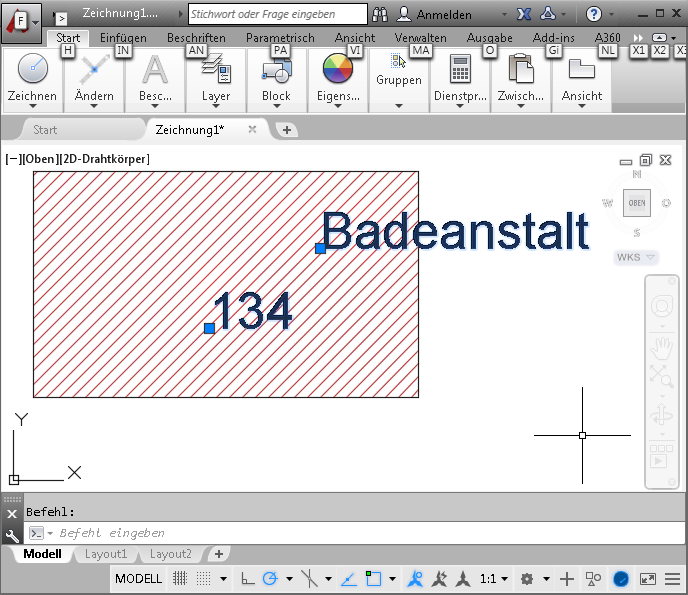
*Ein Gebäude in CAD.*

 

Betrachtet man beispielsweise ein Gebäude der realen Welt (nebenstehende Abbildung), so besteht dessen digitale Repräsentation in einem CAD-System möglicherweise aus:

- einer Umringslinie der Fläche mit:
  - Koordinaten: x1, y1 ; ... ; xn, yn;
  - Flächenfüllung bzw. -schraffur: z.B. rot
  - Umring: z.B. schwarz, durchgezogen, 1 mm breit
- einem Text neben oder in der Fläche mit:
  - Textposition xt, yt
  - Inhalt "Badeanstalt"
  - Schriftart Arial und weiteren Textparametern
- einem weiteren Text innerhalb der Fläche, der vorrangig als Verknüpfungselement beispielsweise zu Tabellen oder händisch geführten Notizen dient, mit:
  - Textposition xt, yt
  - Inhalt "134"
  - Schriftart Arial und weiteren Textparametern

Dabei ist in einer typischen CAD-Modellierung der Text nicht mit der Fläche verknüpft, weshalb sich der Kontext lediglich aus der visuellen Nähe des Textes zur Gebäudefläche ergibt.

Paradoxerweise wird das Gebäude mit Datenelementen abgebildet, die größtenteils keine Eigenschaften eines Gebäudes sind, wie beispielsweise die Strichstärke. Dieser Modellierungsansatz ist auf die Belange einer kartographischen Präsentation zugeschnitten und dafür ausreichend. Gleichzeitig sind gravierende Nachteile dieses Modellierungsansatzes sowie Limitationen von CAD-Systemen offensichtlich, die sich in zwei Punkten zusammenfassen lassen:

- Thematische Informationen können nur eingeschränkt abgebildet werden: Die Fähigkeiten der Integration zusätzlicher Informationen sind auf den Zeichenschlüssel (z.B. Farbgebung), weitere Texte und die Zuordnung zu thematischen Ebenen begrenzt. Weitere Eigenschaften der Gebäude, wie etwa Baujahr, lassen sich nicht lesbar darstellen und werden in externe Speicher wie Tabellen oder Datenbanken ausgelagert. Realweltobjekte können zudem nur eingefügt werden, wenn sie eine Geometrie besitzen.
- Fehlende Analysemöglichkeiten:
  - Aufgrund der Modellierung grafischer Elemente: Dass die Fläche beispielsweise ein Gebäude oder gar ein Gebäude vom Typ "Badeanstalt" repräsentiert, ist nicht als Information abrufbar.
  - Aufgrund fehlender Verknüpfungen: Es besteht keinerlei Bezug zwischen der Fläche und beispielsweise der Ziegelei, aus der das Baumaterial stammt (außer es wird ein weiterer Text eingefügt).
  - Aufgrund eingeschränkter Analysefähigkeiten von CAD-Systemen: Beispielsweise gehört die Analyse räumlicher Beziehungen nicht zur Funktionalität dieser Programme.
  - Aufgrund der physischen Datenablage: Eine projektübergreifende Auswertung ist nicht möglich, da Daten in der Regel nur in Dateien und nicht in Datenbanksystemen vorliegen.

Die oben genannten Limitationen von CAD-Systemen lassen sich durch den Einsatz von Geoinformationssystemen (GIS) überwinden:

- Die Fähigkeit, thematische Eigenschaften von Realweltobjekten abzubilden ist praktisch unbegrenzt und nicht an das Vorhandensein von Geometrie gebunden.
- Der zugrundeliegende Modellierungsansatz bildet die fachlich relevanten Eigenschaften der Realweltobjekte (und nicht deren Transformation auf Grafikelemente) ab.
- Objekte im GIS lassen sich beliebig verknüpfen, sodass Beziehungen abfragbar sind.
- GIS unterscheiden sich von CAD-Systemen durch das Vorhandensein vielfältiger Analysewerkzeuge, z.B. zur Pufferbildung, zur geometrischen Verschneidung von Objekten oder für Sichtbarkeitsanalysen.
- GIS-Daten werden zumeist in Datenbanken persistiert, in denen praktisch beliebig viele Projekte abgelegt werden können.

Das Gebäude aus der Abbildung oben wäre im GIS modelliert:

- als Objekt (ID=134) der Klasse "Gebäude"
- mit den selbstbezogenen Eigenschaften:
  - Nutzung = "Badeanstalt"
  - Baujahr = 1865
  - Geometrie = Fläche (x1,y1 ; ... ; xn,yn)
- mit der fremdbezogenen Eigenschaft:
  - Baumaterial stammt aus Ziegelei "Rheinzabern".

In einer objektrelationalen Geodatenbank könnte eine Implementierung dieses Modells durch die Tabellen "gebaeude" und "liferant_baumaterial" beschrieben werden. Auf der Grundlage dieser Modellierung lassen sich Karten (oder Listen) mit allen Gebäuden erzeugen, die beispielsweise folgende beliebig kombinierbare Kriterien erfüllen:

- die zwischen 1850 und 1870 gebaut wurden
- deren Ziegel in der Ziegelei "Rheinzabern" gebrannt wurden
- deren straßengebundener Abstand von der Ziegelei mehr als 50 km beträgt.

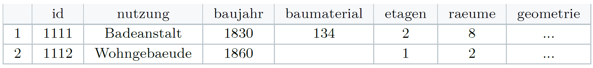
*Tabelle "gebaeude".*

 

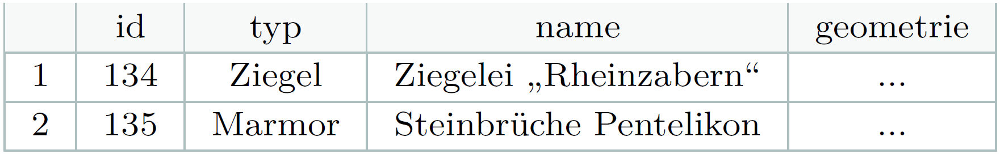
*Tabelle "liferant_baumaterial".*

 

## Praxis

Im Folgenden sind Hinweise zum Umgang mit Vektorgrafiken und CAD-Daten gesammelt. Es werden Hinweise und geeignete Programme für die Erstellung von Vektorgrafiken vorgestellt, ebenso wie für die Erstellung und Bearbeitung von CAD-Daten. Programme für die reine Anzeige von CAD-Daten werden ebenfalls genannt. Für das Arbeiten mit Ebenen werden Empfehlungen gegeben und auf Richtlinien verwiesen. Praktische Hinweise zu Daten mit Raumbezug werden thematisiert, sowie für das Rastern von Vektorgrafiken und das Vektorisieren von Rastergrafiken und analogen Vorlagen. Erläutert werden zudem die zu beachtenden Aspekte bei der Vorbereitung zum Druck von Vektorzeichnungen und bei der Konvertierung von Vektorformaten. Abschließend wird auf dem Umgang mit CAD-Daten in Geoinformationssystemen eingegangen.

### Erstellung von Vektorgrafiken

Die Erstellung von Vektorgrafiken ähnelt dem gestalterischen Zeichnen auf einem Blatt Papier. Mit dem Anlegen von Pfaden und dem Erstellen von Objekten auf einer festgelegten Zeichenfläche entstehen auf intuitive Weise Zeichnungen. Sofern es sich nicht um eine CAD-Zeichnung handelt, wird auf die dritte Dimension und auf ein globales Koordinatensystem verzichtet. Die Koordinaten der Objekte sind in der Regel relativ auf eine der Ecken der veränderbaren Zeichenfläche bezogen. Sämtliche Objekte setzen sich aus Markern oder Pfaden, also aus grafischen Primitiven zusammen, denen veränderbare Layoutattribute zugewiesen werden können.

Die Gestaltungsmöglichkeiten sind in Grafikprogrammen weitaus umfangreicher als in CAD-Programmen, da beispielsweise die Einstellungsmöglichkeiten für die Layoutattribute Strichstärke, Linientyp und -farbe bei weitem größer sind. In Grafikprogrammen können komplexe Pinsel, variable Strichstärken und eigene Muster für Flächenfüllungen und Linientypen sehr einfach und frei erstellt werden, sodass hohe gestalterische Ansprüche umgesetzt werden können.

Neben dem Marktführer Adobe Illustrator sind auch einige Open-Source-Grafikprogramme verfügbar. Von diesen ist Inkscape die einzige freie Software, die einen ähnlichen Funktionsumfang wie Adobe Illustrator aufweist. Zwar kann es den Marktführer nicht gänzlich ersetzen, ist dafür aber einfacher zu bedienen und es lassen sich ähnlich komplexe Vektorgrafiken erstellen. Hervorzuheben ist, dass Inkscape das derzeit beste freie Programm für die Vektorisierung von Rastergrafiken ist. Vectr ist ein freies Grafikprogramm von geringer Komplexität. Es ist sehr einfach zu verwenden und eignet sich ideal für das Erstellen von Logos oder Icons. SVG-Edit ist eine freie Web-App, mit der man SVG-Dateien öffnen und in beschränktem Umfang bearbeiten kann. Alle genannten Programme verwenden das Standardformat SVG und sind für Windows, MacOS und Linux verfügbar.

- Inkscape: https://inkscape.org/en/
- Vectr: https://vectr.com
- SVG-Edit: https://code.google.com/archive/p/svg-edit/downloads

### Erstellung und Bearbeitung von CAD-Daten

Ähnlich zu der Arbeitsweise in Grafikprogrammen werden auch in CAD-Programmen Pfade erstellt und bearbeitet, denen in geringerem Umfang Layoutattribute zugewiesen werden können. In den meisten CAD-Programmen wird nicht unmittelbar maßstäblich, also in einer Druckansicht gezeichnet, sondern in einem Modellbereich. Hier wird mit einer bestimmten Einheit in 1:1 gezeichnet, sodass für die Länge von Pfaden die absoluten Werte eingetragen werden. Für den PDF-Export oder Ausdruck einer CAD-Zeichnung muss anschließend ein Maßstab gewählt werden, der sich auch auf die Layoutattribute der Pfade auswirkt.

Neben dem Marktführer AutoCAD von Autodesk existieren viele kostenpflichtige Programme, die sich zum Teil auf verschiedene Fachgebiete spezialisiert haben (z.B. ArchiCAD für Architektur). Die meisten der kommerziellen Programme bieten Funktionen an, die weit über das zweidimensionale Zeichnen hinausgehen und hier nicht weiter berücksichtigt werden (3D-Modellierung (siehe auch Abschnitt "3D und Virtual Reality"), Building Information Models (BIM), Render-Engine etc.).

Für die rein zweidimensionale Anwendung existieren einige Open-Source- oder Freeware-Programme, von denen FreeCAD auch im dreidimensionalen Bereich verwendet werden kann. Der Großteil der freien Software wird unter der GPL-Lizenz veröffentlicht.

LibreCAD verfügt über die wichtigsten Grundfunktionen einer CAD-Software, wie das Arbeiten mit Ebenen oder dem Zeichnen in einem Raster und unterstützt das DWG-Format.

FreeCAD ist eines der umfangreichsten, freien CAD-Programme. Es bietet ähnliche Funktionen wie die kommerziellen Anbieter, wie zum Beispiel das parametrische Modellieren und verfügt über echte 3D-Solids und Meshes. Das zweidimensionale Zeichnen wird ebenfalls mit einer Vielzahl an Funktionen unterstützt. Ein weiterer Vorteil des Programms ist seine Modularität, sodass auch komplexe, von Nutzern programmierte Erweiterungen frei hinzugefügt werden können. FreeCAD unterstützt das gängige Austauschformat DXF.

QCAD ist das umfangreichste 2D-CAD Programm, welches frei verfügbar ist. Für das rein zweidimensionale Zeichnen ist dieses Programm mit allen nötigen Funktionen ausgestattet und ist ebenfalls sehr modular aufgebaut, sodass Plug-ins problemlos installiert werden können. Das DWG-Format wird ebenfalls unterstützt.

Alle drei Programme sind für Windows, Mac OS und Linux verfügbar.

- LibreCAD: http://librecad.org/cms/home.html
- FreeCAD: http://www.freecadweb.org/
- QCAD: http://www.qcad.org/

### Anzeige von CAD-Daten

Neben Programmen zur Erstellung und Bearbeitung von CAD-Daten, existieren Programme, die CAD-Daten anzeigen, konvertieren und drucken können. Sie sind vom Zweck und Funktionsumfang vergleichbar zu den Viewern für PDF-Daten und eignen sich für ein schnelles Anschauen, Drucken oder Austauschen von CAD-Zeichnungen. Teigha Viewer ist eine kommerzielle Software, mit der in beschränktem Umfang die Zeichnung auch bearbeitet werden kann. Der Viewer ist für Windows, Mac OS und Linux verfügbar.

DWG TrueView ist ein freies Programm von Autodesk, welches DWG-Zeichnungen anzeigt, ohne dass man sie verändern kann. Allerdings wird die Konvertierung und das Erstellen von Druckansichten und damit das Drucken von DWG-Zeichnungen ermöglicht. Es ist nur für Windows verfügbar.

- Teigha Viewer: https://www.opendesign.com/guestfiles
- DWG TrueView: http://www.autodesk.com/products/dwg/viewers

### Ebenen

Für die Strukturierung und Arbeitsorganisation von Zeichnungen sind Ebenen (Layer) in der Arbeit mit Grafikprogrammen und CAD-Programmen das wichtigste Werkzeug. Ebenen können unter anderem ein- und ausgeblendet, gesperrt und transparent gemacht werden. Die Eigenschaften einer Ebene werden auf die in ihr enthaltenen Objekte übertragen, sodass Strichstärken, Linientypen, Füllfarben oder ähnliches in den Ebeneneigenschaften ausgewählt und verändert werden können.

Welche Objekte einer gemeinsamen Ebene zugeordnet werden sollen, muss im Einzelfall entschieden werden, wobei bereits zu Beginn eines Vorhabens Regeln für die Benennung und Strukturierung von Layern aufgestellt und dokumentiert werden sollten. Beispielsweise ist es für grafische Arbeiten sinnvoll, Objekte mit gleichen Layoutattributen einer Ebene zuzuweisen.

Die Einstellungsmöglichkeiten für Ebeneneigenschaften, zur Veränderung des Aussehens der darauf enthaltenen Elemente, sind in Grafikprogrammen wie Adobe Illustrator oder Inkscape deutlich umfangreicher als in CAD-Programmen. Ähnlich wie in Bildbearbeitungsprogrammen, können hier Ebenen visuell ineinander kopiert und multipliziert werden, oder mit Spezialeffekten und Masken versehen werden.

Generell sollten für die Ebenen Namen verwendete werden, die selbsterklärend sind und für die ähnliche Prinzipien gelten wie für die beschriebenen Regeln für die Dateibenennung. Die Layernamen sollten also sprechend und eindeutig sein, möglichst ohne Sonderzeichen, Umlaute und Leerzeichen auskommen, sowie den auf den Layern gespeicherten Objekten auf diesem Wege eine Semantik mitgeben. Falls Abkürzungen oder bestimmte Konventionen in den Namen verwendet werden, wird eine eigene Dokumentation für die Archivierung notwendig.

Außerdem sollte eine sinnvolle Sortierung oder Gruppierung der Ebenen vorgenommen werden. Die Verwendung einer fein granularen Layerstruktur, klar getrennt nach der Bedeutung der abgelegten Objekte, ist nicht nur eine wichtige Vorbereitung zur Datenkonvertierung und Nachnutzung durch andere, sondern ermöglicht es auch Einsicht in die Struktur der Zeichnung zu erhalten und individuell Bestandteile ein- oder auszublenden. Beispielsweise können auf einem Layer nur Geometrien mit einer Nutzungsart, wie z.B. Wirtschaftsgebäude oder nur  Hausnummern angelegt werden. Im Extremfall liegt auf jedem Layer genau ein "Fachobjekt" mit seinen Bestandteilen. Der Layername könnte hierbei die eindeutige Bezeichnung bzw. die ID des Objektes darstellen. Dies erleichtert spätere Zuordnungen und Datenverknüpfungen, ist jedoch im Fall systembedingter Begrenzung der Layeranzahl nicht vollständig durchsetzbar. Eine zu große Ebenenmenge sollte jedoch zugunsten der Handhabbarkeit der Datei vermieden werden.

Ein Beispiel für die Aufteilung von Objekten unterschiedlicher Charakteristiken auf verschiedenen Ebenen und deren Dokumentation bietet das Projekt Aegaron, in dem für die bereitgestellten Zeichnungen von altägyptischen Bauwerken über hundert Ebenen verwendet werden, die beispielsweise Objekte nach Material, Entstehungszeit oder Erhaltungszustand unterscheiden.

Vorgaben für die Ebenenstruktur und deren Inhalte und Eigenschaften gibt es ebenfalls von unterschiedlichen Landesdenkmalämtern, die am Ende dieses Abschnittes gelistet sind. Sollen eigene Vorgaben verwendet werden, müssen diese Dokumentiert werden.

Bei der Konvertierung in ein anderes Format, muss die Übernahme der Layerstruktur in dem neuen Format vorab getestet werden, da Ebenen in unterschiedlichen Formaten gar nicht (beispielsweise bei der Konvertierung in eine Rastergrafik im JPEG-Format) oder anders (beispielsweise bei der Übernahme in ein GIS) verarbeitet werden. Auch bei der Konvertierung von einem Vektorformat in ein anderes Vektorformat sollte die korrekte Übernahme der Ebenen überprüft werden.

- Projekt Aegaron: https://aegaron.ucla.edu/
- Bayern (S. 35): http://www.blfd.bayern.de/medien/dokuvorgaben_august_2016.pdf
- Berlin: https://www.berlin.de/landesdenkmalamt/_assets/pdf-und-zip/service/grabungsstandard-2024-2025.pdf?ts=1704063605
<!-- - Hamburg (S. 5- 6): http://www.amh.de/index.php/18259 Seite existiert nicht mehr -->
- Hessen (Anlage 2): http://hessen-archaeologie.de/Gesetzl_-Bestimmungen/Grabungsrichtlinien-2015/grabungsrichtlinien-2015.html
- Niedersachsen: https://denkmalpflege.niedersachsen.de/service/dokumentation/fachinformation-archaeologie-145712.html
<!-- - Österreich: (S. 22): http://www.bda.at/downloads/1990/Richtlinien Seite existiert nicht mehr -->

### Raumbezug

Im CAD wird der Raumbezug üblicherweise durch die Lage relativ zum geometrischen Ursprung (0,0,0) des kartesischen Koordinatensystems definiert. Der Maßstab ergibt sich durch die Festlegung der Zeichnungseinheiten und des Zeichnungsmaßstabes, welcher in der Regel 1:1 beträgt. Alternativ kann aber auch ein globales Koordinatensystem, z.B. UTM definiert werden.

Wenn im CAD möglich und für den Zeichnungsgegenstand sinnvoll, sollte ein globales Koordinatenreferenzsystem definiert und verwendet werden, um alle CAD-Elemente in diesem System lagerichtig und maßstabsgetreu zu erzeugen. Jedoch unterstützen nicht alle CAD-Programme diese Möglichkeit und einige ältere Programme können nicht mit großen Koordinaten, wie sie beim Gauß-Krüger- oder UTM-System vorkommen, arbeiten.

Bei der Wahl eines örtlichen oder lokalen Bezugssystems müssen in diesem örtlichen System eine angemessene Anzahl von in einem übergeordneten globalen, nationalen oder regionalen Lagesystem bekannten Passpunkten eingetragen sein (für zweidimensionale Zeichnungen mindestens 2, ansonsten 3; weitere sind zur Kontrolle nützlich), die möglichst gut verteilt sein sollten. Der Unverwechselbarkeit wegen sollten sie auf einem separaten Layer liegen und mit den übergeordneten Koordinaten beschriftet sein. Das übergeordnete Lage- und Höhensystem, die Zeicheneinheiten sowie der Maßstab sind ebenfalls in geeigneter Form anzugeben. Über diese Passpunkte kann die CAD-Zeichnung beispielsweise in das Koordinatenreferenzsystem eines GIS transformiert werden. Empfohlen wird auch hier die Arbeit im Maßstab 1:1 mit der Zeichnungseinheit Meter.

### Rastern von Vektorgrafiken

Wenn Grafiken, die als Vektordatei vorliegen, in eine Rastergrafik konvertiert, also gerastert werden sollen, muss eine geeignete Bildgröße ausgewählt werden, die den gewünschten Anforderungen genügt. Beispielsweise wird ein Logo für eine Webseite andere Anforderungen an Größe und Auflösung haben als ein CAD-Plan, der ausgedruckt werden soll. Dabei sollte die originale Vektordatei zu Archivierungszwecken immer aufbewahrt werden.

Das Rastern kann am besten in dem Programm gemacht werden, in dem die Grafik erstellt wurde. Dazu wählt man entweder die Option Speichern unter oder Export. Die weiteren Einstellungsmöglichkeiten hängen von dem jeweiligen Programm ab.

### Vektorisierung von Rastergrafiken und analogen Zeichnungen

Für Rastergrafiken mit einer niedrigen Auflösung, oder die durch Komprimierung (z.B. im JPEG-Format) einen starken Generationenverlust erlitten haben oder die aus anderen Gründen von schlechter Qualität sind, bietet es sich zur Verbesserung der Zeichnung an, diese zu vektorisieren und gegebenenfalls anschließend wieder zu rastern. Auch für die Analyse in GIS kann eine Vektorisierung von Rastergrafiken notwendig sein.

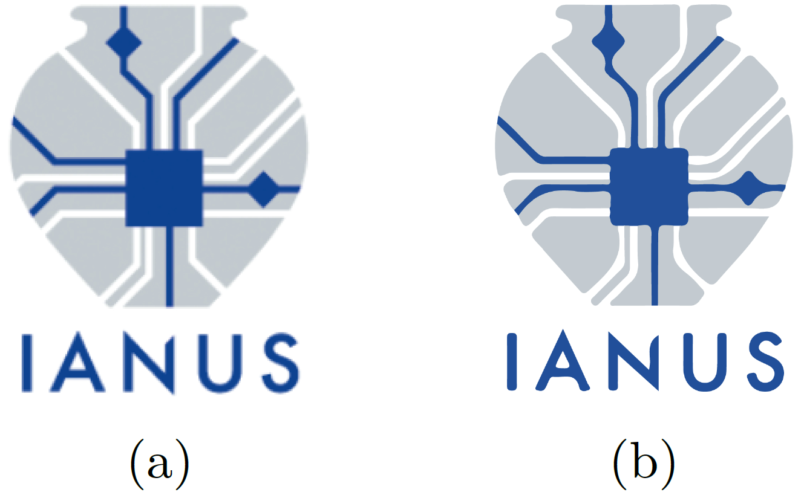
*Das IANUS-Logo (a) als Rastergrafik mit geringer Auflösung und (b) nach der Vektorisierung.*

 

Grafikprogramme wie Adobe Illustrator und Inkscape bieten Werkzeuge zum automatisierten Nachzeichnen von Bildern an. Hierfür können Rastergrafiken in den Programmen geöffnet werden, welche dann die verschiedenen Farbbereiche der Bilddatei in entsprechend farbig gefüllte und geschlossene Pfade umwandeln (nebenstehende Abbildung). In den Einstellungsmöglichkeiten der Vektorisierungswerkzeuge kann unter anderem Einfluss auf die zu berücksichtigenden Farbbereiche genommen werden, sodass die Ergebnisse eine unterschiedlich hohe Bildtreue aufweisen. Hierbei ist zu beachten, dass eine möglichst hohe Genauigkeit zu einer sehr großen Anzahl von Pfaden führt, was sich wiederum negativ auf die Performanz des Programms und die Handhabbarkeit der Vektordatei auswirkt.

Insbesondere bei der Digitalisierung von analogen Zeichnungen ist es oft erforderlich, diese zu vektorisieren, um sie in CAD- oder anderen Grafikprogrammen weiterbearbeiten zu können. Dazu werden sie in der Regel eingescannt und als Rastergrafiken gespeichert. Das oben beschriebene Vektorisierungsverfahren würde die Strichstärken einer Planzeichnung als farbige Flächen interpretieren und deshalb Linien als geschlossene Pfade mit farbiger Füllung darstellen (Abbildung unten). In den meisten Programmen kann deshalb auch die Option ausgewählt werden, dass die Mittellinien der Strichstärken von einer Zeichnung ermittelt werden. So erhält man Pfade, die mit einer Kontur belegt sind, die wiederum den Strichstärken der Planzeichnung entsprechen. Allerdings führen diese Ergebnisse nicht zu vollwertigen Vektorzeichnungen, denn die Linien der Zeichnung werden nur durch Kurven angenähert. Ein Kreis wird zum Beispiel nach der Vektorisierung als Kurve gespeichert und nicht als ein Objekt, welches durch einen Radius beschrieben wird (Abbildung unten). Um Rastergrafiken mit Zeichnungen in vollwertige Vektorgrafiken umzuwandeln, bedarf es nach wie vor einer manuellen Bearbeitung, indem die Ergebnisse einer automatischen Vektorisierung nachgebessert werden. Mittels eines Digitalisierstifts kann eine analoge Zeichnung ohne die Nachbearbeitung von Scans direkt in eine Vektordatei umgezeichnet werden. Trotz einer Vielzahl an immer genauer arbeitender (größtenteils kostenpflichtiger) Vektorisierungssoftware hat sich ein kleiner Markt aus Dienstleistern etabliert, die händisch qualitätvolle CAD-Zeichnungen erstellen.

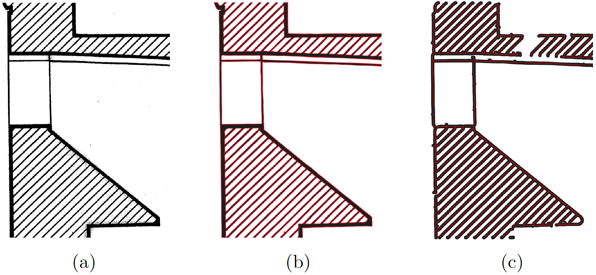
*Ausschnitt eines Grundrisses (a) als Rastergrafik mit geringer Auflösung, (b) mit vektorisierten Flächen und (c) mit vektorisierten Mittellinien. Die Pfade sind rot dargestellt*

 

Mittels Potrace, das auch in Inkscape integriert ist, können Rastergrafiken unter Windows, Mac OS und Linux vektorisiert werden. Neben einer kostenpflichtigen Desktop-Version für Windows und Mac OS bietet Vector Magic auch ein online verfügbares Tool zur Vektorisierung an. Ein Programm, dass auf die Vektorisierung im CAD-Bereich spezialisiert ist, ist das für Windows verfügbare WinTopo, das es als freie und kostenpflichtige Variante gibt.

- Potrace: http://potrace.sourceforge.net/
- Vector Magic: http://vectormagic.com/home
- WinTopo: http://www.softsoft.net/wintopo/index.htm

### Datenerfassung

Bei der Erstellung und Verarbeitung von Vektordateien, wie etwa Daten im CAD, sollten folgende Empfehlungen Berücksichtigung finden, um eine spätere Weiterverarbeitung oder Analyse (insbesondere mit einem GIS) zu vereinfachen und eine nachträgliche Aufbereitung zu vermeiden.

- Objektfang

  - Beim Digitalisieren ist immer mit Objektfang (Snapfunktion) zu arbeiten, um vorhandene Stützpunkte zu fangen und so eine Reihe der unten aufgeführten Fehler zu vermeiden.

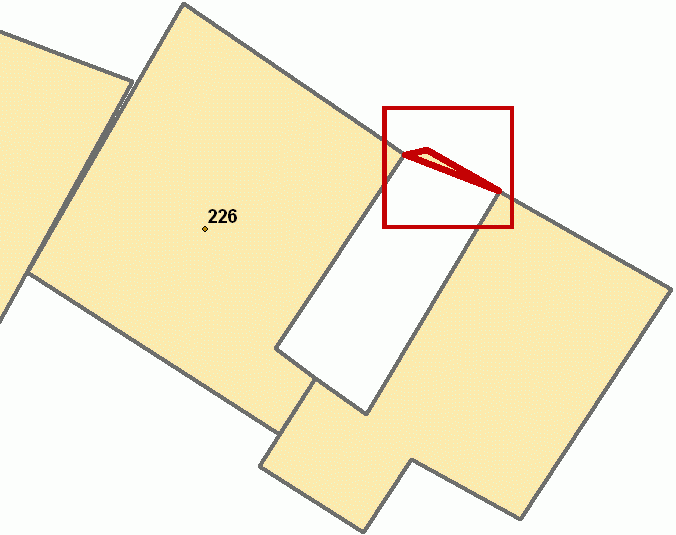
*Splitterpolygon.*

 

- Flächen

  - Splitterpolygone vermeiden: Splitterpolygone sind kleinste Flächen. Sie entstehen meist am Rand oder an Ecken von anderen Flächen durch ungenaues Digitalisieren (kein Objektfang, geringe Zoomstufe).

    Häufig finden sich solche Polygone auch zwischen aneinander liegenden Flächen, wie in nebenstehender Abbildung und untenstehender sichtbar. Durch Nutzung des Objektfangs und Digitalisierung der Flächenobjekte als geschlossene Polylinien sind diese Fehler vermeidbar.

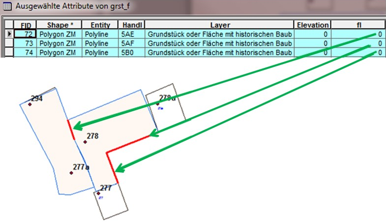
*Splitterpolygone am Rand und zwischen Flächen.*

 

  - Vermeidung von Lücken und Überlappungen: Bei Flächen, welche einen geschlossenen Flächenverbund darstellen, wie z.B. Nutzungsarten, dürfen keine Lücken oder Überlappungen auftreten. Dies würde im GIS zu fehlerhaften Nachbarschaftsanalysen oder Verschneidungen führen.

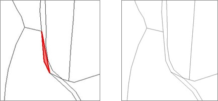
*Links Lücke im Datenbestand (rot), rechts bereinigt.*

 

  - Schließen von Polylinien: Jedes flächenhafte Objekt sollte als eine einzelne geschlossene Polylinie digitalisiert werden, damit es in einem GIS als eine Fläche übernommen werden kann (als Negativbeispiel dient die Abbildung zu Polylinien).
- Linien

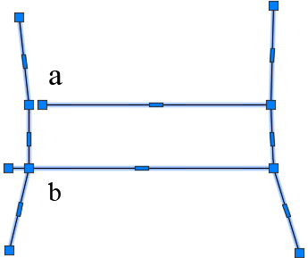
*(a) Under-, (b) Overshot mit Stützpunkten.*

 

  - Vermeiden von Under- und Overshots: Als Under- und Overshot werden Linien bezeichnet, welche einen Kreuzungspunkt mit einer anderen Linie nicht ganz erreichen oder über diesen hinausgehen, was nebenstehende Abbildung zeigt. Insbesondere bei Analysen in Netzwerken (z.B. Straßen und Wege, Kanäle oder Leitungen) kommt es hierbei zu Fehlern, welche durch entsprechende Digitalisiersorgfalt vermieden werden können (siehe auch Punkt "Regeln für sich kreuzende Linien").

  - Regeln für sich kreuzende Linien: An echten Kreuzungen (z.B. von zwei Straßen oder bei der Zusammenführung zweier Abwasserkanäle) müssen digitalisierte Linien ineinander einmünden, damit in einem GIS an dieser Stelle ein Knotenpunkt erzeugt wird, der dann in späteren Netzwerkanalysen vom Programm korrekt interpretiert werden kann. In jedem anderen Fall, also wenn kein tatsächlicher Kreuzungspunkt vorhanden ist, sich die Leitungen oder Strecken also nicht tatsächlich berühren (z.B. Straßenbrücke oder Unterführung), werden durchgehende Polylinien verwendet. Hier entsteht im GIS kein Knotenpunkt.

  - Digitalisierrichtung: Die Digitalisierrichtung gibt die Richtung vom Startpunkt einer Linie zum Endpunkt an und sollte für Linien gleicher Art immer einheitlich gewählt werden (z.B. in Fließrichtung).

  - Vermeiden von Lücken: In einer CAD-Zeichnung gibt es häufig Linien, welche durchgehende Objekte darstellen, aber von Signaturen unterbrochen sind, wie beispielsweise ein Baum in einer Hecke oder ein Abwasserkanal, welcher durch einen Schacht "durchbrochen" ist (Abbildung unten). Bei der Datenübernahme ins GIS entstehen hier Linienfragmente, welche entsprechend überarbeitet und zu einem linienhaften Objekt zusammengeführt werden müssen. Diese Linien sollten demzufolge bereits im CAD als durchgehende Polylinien gezeichnet werden.

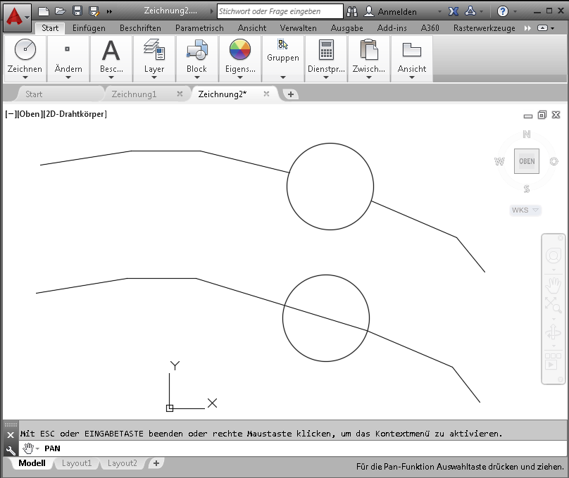
*Fehlerbehaftete Digitalisierung (Lücke in Linienzug, oben), korrekte Digitalisierung (durchgehender Linienzug, unten)*

 

- Texte
  - Platzierung des Basispunktes: Werden Texte genutzt, um Objekteigenschaften darzustellen und zu transportieren, ist bei der Textplatzierung darauf zu achten, dass in jedem Fall der Textbasispunkt und nicht unbedingt der Text in der zugehörigen Fläche zu liegen kommt. Die Punktlage entspricht dabei dem Basis- oder auch Bezugspunkt des Textes im CAD.

### Erstellen von Plan- oder Schnittzeichnungen für den Druck

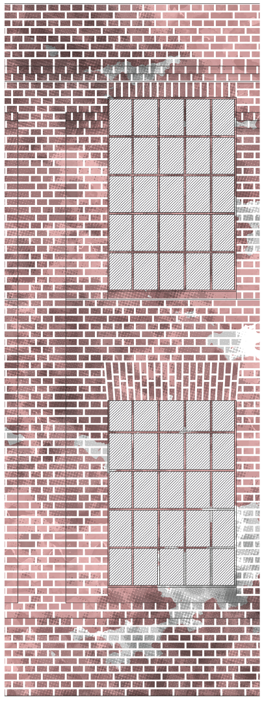
*"Aquarellierte" Ziegelfassade in einem Grafikprogramm. (Tim Scheuer und Felix Martin)*

 

Für die grafische Ausarbeitung von Plan- oder Schnittzeichnungen historischer Bauwerke oder Ausgrabungen für den Druck hat sich eine schrittweise Anwendung von CAD-Programmen und Grafikprogrammen bewährt. Dazu werden zunächst die Rohdaten aus Aufmaßen am besten in CAD-Programmen weiterbearbeitet, um voll ausdifferenzierte Zeichnungen erstellen zu können.

Wenn die Rohdaten in der CAD-Datei soweit aufbereitet wurden, dass den Pfaden lediglich die Aussehensattribute zugewiesen werden müssen, kann die DWG-Datei mit einem Grafikprogramm weiterverarbeitet werden, da dieses mehr Möglichkeiten für die grafisch ansprechende Ausarbeitung von Zeichnungen bietet. Auch wenn lediglich eine Darstellung mit verschiedenen Strichstärken und Linientypen erwünscht ist, ist es ratsam diese in einem Grafikprogramm zuzuweisen. Insbesondere wenn dicke Strichstärken verwendet werden ist es wichtig, diese beispielsweise bei geschnittenen Objekten auf der Innenseite der Pfade anzutragen, sonst würden die Objekte im Druck in ihrer Maßhaltigkeit verfälscht werden (Abbildung unten). Darüber hinaus können Pläne in Grafikprogrammen zum Beispiel "aquarelliert" oder mit Schatten ergänzt werden (nebenstehende Abbildung).

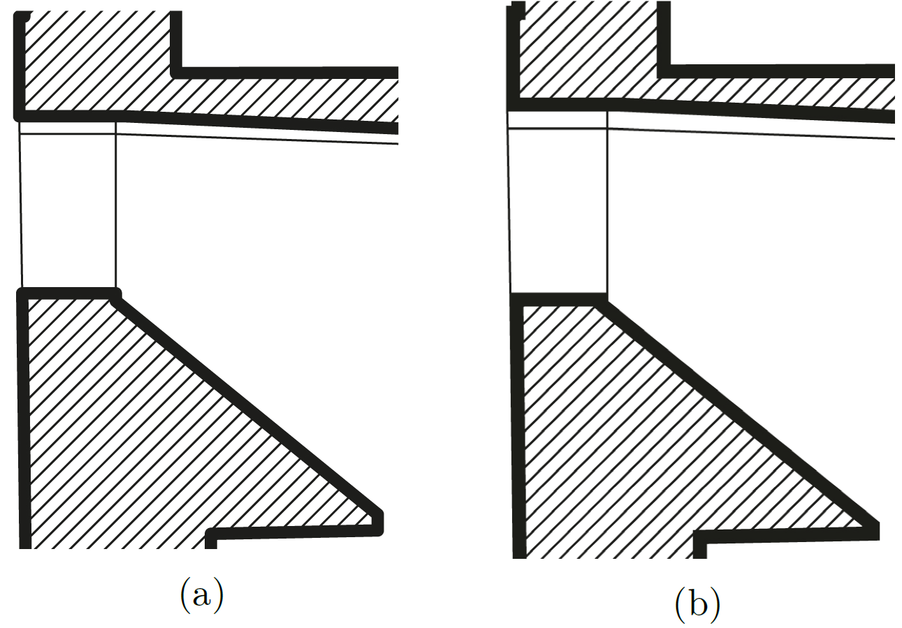
*(a) Verfälschte Bauteilabmessungen bei Konturantrag auf der Mitte des Pfades. (b) Korrekte Bauteilabmessungen bei Konturantrag auf der Innenseite des Pfades.*

 

Für den Druck ist der Maßstab der angestrebten Zeichnung zu beachten, um gegebenenfalls Details auszublenden, die nicht gedruckt werden sollen. Ansonsten besteht die Gefahr, dass in dem Ausdruck, oder in der PDF-Datei die Strichstärken verschmelzen und so die Zeichnung unleserlich wird (Abbildung unten).

![(a) Strichdifferenzierung im Maßstab 1:50. Für Bauaufnahmen ist das Anlegen der Strichstärken in diesem Maßstab zu empfehlen. (b) Strichdifferenzierung im Maßstab 1:100. Die Strichstärken können gegenüber der 1:50-Zeichnung gleich bleiben. Details sollten auf einem separaten Layer liegen und ausgeschaltet werden. (c) Strichdifferenzierung im Maßstab 1:200. Die Strichstärken sollten nun mindestens halbiert werden (links) (d) Strichdifferenzierung im Maßstab 1:500. Die Strichstärken sollten weiter verringert werden. (Ausschnitt einer Bauaufnahme des Palazzo del Giardino, Sabbioneta (Italien). Aus: J. Pieper (Hrsg.): Sabbioneta -- Atlasband, Aachen 2017, S. 196.)](./_media/vektor_massstaeblichkeitCAD-web.png)
*(a) Strichdifferenzierung im Maßstab 1:50. Für Bauaufnahmen ist das Anlegen der Strichstärken in diesem Maßstab zu empfehlen. (b) Strichdifferenzierung im Maßstab 1:100. Die Strichstärken können gegenüber der 1:50-Zeichnung gleich bleiben. Details sollten auf einem separaten Layer liegen und ausgeschaltet werden. (c) Strichdifferenzierung im Maßstab 1:200. Die Strichstärken sollten nun mindestens halbiert werden (links) (d) Strichdifferenzierung im Maßstab 1:500. Die Strichstärken sollten weiter verringert werden. (Ausschnitt einer Bauaufnahme des Palazzo del Giardino, Sabbioneta (Italien). Aus: J. Pieper (Hrsg.): Sabbioneta -- Atlasband, Aachen 2017, S. 196.)*

 

In der Praxis kann die Erstellung von Planzeichnungen in verschiedenen Maßstäben sinnvoll sein, wie es beispielsweise in dem Projekt Aegaron praktiziert wird. Hier werden Zeichnungen sowohl in einem Maßstab zur Verfügung gestellt, der für den Ausdruck im A4-Format optimiert ist als auch in einem idealen Maßstab, der alle in der Zeichnung enthaltenen Details zeigt. Zusätzlich bietet das Projekt für manche Zeichnungen auch Standardmaßstäbe wie 1:100, 1:250, 1:500 und 1:2000 an, sofern die Messgenauigkeit der Ausgangsdaten dies zulässt.

### Dateiformate konvertieren

Sollen Vektordateien von einem Format in ein anderes überführt werden, sollte dies am besten mit dem Programm erfolgen, in dem die Datei erzeugt wurde. Mittels Speichern unter oder der Exportfunktion können die meisten Formate konvertiert werden.

Generell muss darauf geachtet werden, dass das Zielformat die gewünschten Anforderungen erfüllt, wie beispielsweise die korrekte Darstellung von Ebenen und der verwendeten grafischen Primitiven inklusive ihrer Layoutattribute. Auch muss auf die korrekte Einbindung von referenzierten externen Inhalten geachtet werden.

Neben den Programmen mit denen die Datei erstellt wurde, können auch Online"=Dienste, die Dateikonvertierungen anbieten, verwendet werden. Ein Beispiel ist Zamzar.

- Zamzar: http://www.zamzar.com/url/

### CAD-Daten für die Verwendung in GIS vorbereiten

Werden archäologische Daten mit Raumbezug zunächst in CAD-Systemen aufbereitet und sollen diese später in einem GIS analysiert und weiterverarbeitet werden, ist eine Überführung der CAD-Daten in GIS-Daten notwendig. Dieser Prozess besteht aus zwei Teilprozessen: möglichst gute Abbildung des CAD-Datenmodells auf das GIS-Datenmodell (Mapping) sowie Übernahme und Anpassung der einzelnen Elemente aus der CAD-Datei.

Dies impliziert zum einen, dass es vor Beginn der CAD-Arbeiten bereits ein GIS-Datenmodell oder entsprechende Vorüberlegungen hierzu gibt. Zum anderen steht einem in der Komplexität prinzipiell unbeschränkten Datenmodell im GIS ein sehr begrenztes im CAD gegenüber. Das im CAD-System vorhandene Datenmodell kann folgendermaßen zusammengefasst werden:

- geometrische Primitive (im Wesentlichen Punkte, Einzellinien, Polylinien, Kreise und Kreisbögen, Splines, 3D-Flächen und -Körper),
- Texte
- Blöcke bzw. Zellen
- Layer
- Darstellungsstile

Insgesamt muss eingeschätzt werden, dass die Realisierung des Überführungsprozesses generell aufwändig, fehleranfällig, nur teilweise automatisierbar ist und eine GIS-Expertise erfordert. Aufgrund der Vielzahl möglicher Kombinationen von CAD-Systemen, CAD-Austauschformaten, CAD-Versionen, den zahlreichen Produkten zur Datenkonvertierung und insbesondere wegen der jeweils unterschiedlichen GIS-Datenmodelle werden im konkreten Anwendungsfall Anpassungen erforderlich sein. In jedem Fall bietet es sich an, mit den eingesetzten Softwareprodukten und mit repräsentativen Testdaten bereits im Vorfeld eine Probekonvertierung durchzuführen, um Probleme und Nacharbeiten bei einem fertig digitalisierten Datenbestand zu minimieren.

Zur Veranschaulichung des Überführungsprozesses kann das Beispiel aus der Abbildung aus "Unterschiede von CAD und GIS" herangezogen werden:

- Mapping des Datenmodells:
  - Im GIS ist zunächst eine Klasse "Gebäude" mit den Attributen "Id", "Nutzung", "Baujahr" und "Geometrie" anzulegen.
  - Zweckmäßigerweise würde man eine Klasse "Lieferant_Baumaterial"  mit den Attributen "Id", "Typ", "Name" und ggf. "Geometrie" anlegen.
  - Zusätzlich ist ein Raumbezug zu definieren, welchem alle Instanzen des Modells unterliegen werden.
- Übernahme der Instanzen:
  - Die Geometrie der Grafik (Gebäudefläche) kann, wenn sie entsprechend vorbereitet wurde, direkt in das GIS übernommen werden, womit i.d.R. eine Transformation des Datenformates (z.B. DXF nach Shape) sowie - in einem weiteren Schritt - des (meist ursprünglich lokalen) Koordinatensystems verbunden ist.
  - Die Texte mit den ID’s sind, beispielsweise als Punkt-Shape, im GIS zu importieren und über Verschneidungen den Flächen zuzuordnen. Dies muss wegen der verbleibenden Unsicherheit bei der Platzierung der Texte bzgl. der Flächen visuell kontrolliert werden.
  - Die Texte mit dem Gebäudetyp sind, wiederum beispielsweise als Punkt-Shape, im GIS zu importieren. Wenn die Zuordnung der Texte zu den Gebäuden größtenteils eindeutig ist, kann versucht werden, mittels GIS-Funktionalität Gebäudeflächen und Text-Punkte zuzuordnen ("Finde zu jeder Gebäudefläche den nächstliegenden Text-Punkt." Auch dies muss visuell kontrolliert werden.
  - Übernahme der Gebäude-Excel-Tabelle im GIS und automatisierte Verknüpfung mit den bestehenden Gebäude-Objekten über die ID.
  - Übernahme der Lieferant_Baumaterial-Tabelle im GIS und händische oder automatisierte Verknüpfung mit den bestehenden Gebäude-Objekten über die ID.

Um den Prozess der Datentransformation zwischen CAD- und GIS-Welt hinsichtlich der genannten Aspekte (Minimierung Aufwand, Sicherstellung Qualität, Erhöhung Automatisierungsgrad) zu optimieren, werden nachfolgend Empfehlungen formuliert. Da in den verschiedenen CAD-Systemen unterschiedliche Begrifflichkeiten für ähnliche Funktionalitäten verwendet werden, werden zur Vereinheitlichung an AutoCAD angelehnte Bezeichnungen genutzt.

Raumbezug: Da CAD-Systeme und GIS unterschiedliche Ansätze zur Definition des Raumbezugs verfolgen, sollte dieser schon vor der ersten Digitalisierung vorgenommen werden, um spätere geometrische Transformationen des CAD-Datenbestandes korrekt durchführen zu können.

Um bei der Datenkonvertierung Probleme zu vermeiden, sollte am besten schon im CAD-System das Koordinatenreferenzsystem entsprechend dem Zielkoordinatenreferenzsystem im GIS definiert und alle CAD-Elemente in diesem System lagerichtig und maßstabsgetreu erzeugt werden. Die Zeichnungseinheiten betragen dabei Meter.

Wurde im CAD-System ein örtliches Bezugssystem verwendet, müssen darin ausreichend und gut verteilte Passpunkte für das übergeordnete Lagesystem eingetragen sein. Über diese Passpunkte kann die CAD-Zeichnung in das Koordinatenreferenzsystem des GIS transformiert werden. Weitere Hinweise dazu sind in dem Abschnitt "Raumbezug" zu finden.

Layer: Die CAD-Layerstruktur bleibt bei der Datenübernahme nicht erhalten. Das resultiert aus der Tatsache, dass im GIS nur Geometrien eines Geometrietyps auf einem Layer abgelegt werden können, es im CAD diesbezüglich aber keine Beschränkung gibt. Trotzdem bringt eine wohldurchdachte Layerstruktur auch für die Datenkonvertierung Vorteile: Layernamen werden üblicherweise als Attribute der Geometrien ins GIS übernommen und lassen sich dort gut in automatisierten Prozessen bei der Datennachbearbeitung auswerten. Und durch die Verwendung einer fein granularen Layerstruktur, klar getrennt nach der Bedeutung der abgelegten Objekte, werden spätere Zuordnungen und Datenverknüpfungen  erleichtert. Hinweise dazu sind in dem Abschnitt "Ebenen" zu finden.

Geometrie: Der im GIS beabsichtigte Geometrietyp sollte bereits im CAD verwendet werden. Dabei sind einfache Geometrietypen zu bevorzugen. Geordnet nach den einzelnen Geometrietypen gilt zu beachten:

- Linestrings (GIS) sind nicht als Einzellinien, sondern als Polylinien zu erfassen. Einzellinien, welche zu einem Fachobjekt, z.B. zu einer Mauer gehören, müssten anderenfalls im GIS entsprechend nachbearbeitet und zu einer Linie verschmolzen werden.
- Polygone sind im GIS Flächen. Hierfür stehen im CAD verschiedene auch komplexe Geometrietypen, wie z.B.  Regionen oder Volumenkörper mit Höhe 0 zur Verfügung. Die korrekte Übernahme muss im Einzelfall getestet werden. Stattdessen sind für Flächen geschlossene Polylinien zu bevorzugen, sodass eine Fläche im CAD durch genau eine geschlossene Polylinie dargestellt wird.
- Zur Veranschaulichung der Problematik soll Abbildung unten} dienen, in der ein flächenhaftes Objekt mehrere Polylinien enthält. Im GIS ist das Objekt nicht als Fläche umgesetzt, sondern als vier Einzellinien, die jeweils die gleiche Areal-ID enthalten. Dadurch sind Analysen bezogen auf die Fläche, wie die Abfrage der Flächengröße, oder lagebezogene Abfragen (z.B. "Gib alle Funde aus, welche innerhalb des Areals liegen.") nicht möglich. Auch die Identifizierung des Areals durch Anklicken der Fläche entfällt: Stattdessen muss eine der Begrenzungslinien angewählt werden.

*(a) Ein Ausgrabungsareal als CAD. Die Detailansicht (b) zeigt mehrere zusätzliche Linien, die beim Digitalisieren erzeugt wurden, um die "Fläche" zu schließen. Die nach der Übernahme ins GIS entstandene Attributtabelle (c) verdeutlicht, dass das Objekt nicht als Fläche, sondern als vier das Areal-Objekt bildende Einzellinien gespeichert ist.*

 

- Splines werden in GIS häufig nicht unterstützt und sollten daher vermieden werden. Alternativ kann man vor der breiten Verwendung prüfen, ob Splines mit der verwendeten Software brauchbar umgesetzt werden, da eine Umsetzung als Polylinien mit geringem Stützpunktabstand nicht immer erwünscht und sinnvoll ist.
- Für Blöcke, also zu einem komplexen Objekt zusammengesetzte Einzelobjekte, wie etwa Symbole, können keine allgemeingültigen Empfehlungen ausgesprochen werden. Hier sollte ebenfalls vor der Verwendung getestet werden, ob die Blöcke vor der Datenkonvertierung zerlegt werden müssen oder nicht.
- Bei Schraffuren kann es passieren, dass diese in Einzellinien zerlegt in GIS importiert werden. Daher sollten Schraffuren möglichst vermieden oder auf separaten Layern abgelegt werden. In jedem Fall sollte die Schraffur von einer geschlossenen Polylinie begrenzt sein.
- Punkte liegen im CAD im Wesentlichen in zwei verschiedenen Arten vor:
  - Punkte, welche im betrachteten Maßstab punktförmige Geoobjekte darstellen, z.B. Baum oder Scherbe
  - Punkte, welche zur Positionierung von Text dienen

- Erstere dürfen nicht verschoben werden, da sonst ihr Raumbezug verändert und damit falsch wird, wohingegen letztere im Grunde genommen frei positionier- und verschiebbar sind, um ein ansprechendes Kartenlayout zu erhalten. Dementsprechend ist darauf zu achten, dass beide Arten strikt getrennt werden, was beispielsweise mit unterschiedlichen Layern erzielt werden kann.

Texte: Während Texte im CAD ein wichtiges Element darstellen, sind sie im GIS als selbständige Elemente in der Regel nicht vorgesehen. Sie werden generell bei Bedarf aus Attributwerten der Geoobjekte automatisiert generiert. Vergleichbar mit CAD-Texten sind am ehesten sog. Annotations, welche genutzt werden, um die Karte anzureichern. Sie gehören als solche aber nicht zum GIS-(Daten-)Modell. CAD-Texte werden insbesondere genutzt, um Attributwerte ins GIS zu transportieren. Klassische Beispiele hierfür sind der eindeutige Objektbezeichner (bzw. Objekt-ID) oder Hausnummern. Diese Texte werden im GIS zu Punktobjekten mit dem Textinhalt als Attribut gewandelt. Mittels GIS-Funktionalität können diese Punkteigenschaften - korrekte Platzierung der ursprünglichen Texte vorausgesetzt - anderen Objekten zugeordnet werden, z.B. die Hausnummer dem Gebäude-Objekt, in welchem sie platziert ist. Ob mehrzeilige Texte korrekt konvertiert werden, sollte im Vorfeld durch Tests geklärt werden.

In untenstehender Abbildung werden die Übernahme von CAD-Texten im GIS als Punkte und mögliche Probleme veranschaulicht, die in jedem Fall manuelle Nacharbeit nach sich ziehen.

![(a) Aus CAD übernommene Hausnummern werden im GIS als Punkt mit Punktbeschriftung übernommen. Problematisch sind die doppelten Hausnummern mit identischer Punktlage (199a, 200a, 202, 203b) oder doppelte Hausnummern mit unterschiedlichen Punktlagen (202a). Im Ausschnitt (b) wurden die Punkte mit Gebäuden überlagert, was verdeutlicht, dass es Gebäude ohne zugeordnete Hausnummer gibt und dass der Punkt mit der Hausnummer 78 nicht innerhalb eines der Gebäude liegt und die Zuordnung zu einem Gebäude nicht eindeutig möglich ist.](./_media/vektor_hausnummern-web.png)
*(a) Aus CAD übernommene Hausnummern werden im GIS als Punkt mit Punktbeschriftung übernommen. Problematisch sind die doppelten Hausnummern mit identischer Punktlage (199a, 200a, 202, 203b) oder doppelte Hausnummern mit unterschiedlichen Punktlagen (202a). Im Ausschnitt (b) wurden die Punkte mit Gebäuden überlagert, was verdeutlicht, dass es Gebäude ohne zugeordnete Hausnummer gibt und dass der Punkt mit der Hausnummer 78 nicht innerhalb eines der Gebäude liegt und die Zuordnung zu einem Gebäude nicht eindeutig möglich ist.*

Höhen: Mit dem jetzigen Stand der Technik sind GIS in aller Regel 2,5D-Systeme. Damit kann jedes Objekt im GIS eine oder mehrere Höhen besitzen. Es gibt auch Produkte, welche mit echten 3D-Objekten, z.B.  Volumenkörpern, arbeiten und diese visualisieren. Jedoch muss man berücksichtigen, dass eine echte und schrankenfreie 3D-Integration im GIS noch nicht vollzogen wurde. Im CAD liegen die Geometrien entweder als 2D-Geometrien mit oder ohne Höhe(n) vor, wobei auch Null (0) eine Höhe darstellen kann. Im Gegensatz dazu sind echte 3D-Geometrien entweder Volumenkörper oder 3D-Oberflächen. Alle bisher getroffenen Aussagen beziehen sich auf 2D-Geometrien. Haben diese Höhen (z-Werte), so werden diese im GIS ebenfalls als z-Wert interpretiert und bedürfen keiner weiteren Bearbeitung. 3D-Geometrien werden im Rahmen dieses Beitrages nicht behandelt.

Externe Dokumente: Hierbei sind insbesondere zu unterscheiden:

- Externe referenzierte Zeichnungsdateien: Die Nutzung dieser sollte durch vorherige Tests bestätigt werden.
- Externe strukturierte Dokumente mit zusätzlichen Objektinformationen: Liegen diese in Tabellen oder Datenbanken vor, lassen sich die enthaltenen Daten später einfach im GIS verknüpfen. Voraussetzung hierbei ist, dass evtl. vorhandene Konventionen für Spaltennamen im GIS eingehalten werden. Außerdem muss jeder Datensatz der externen Tabelle einen eindeutigen Schlüssel haben, welcher sich in der CAD-Zeichnung, z.B. als Text am entsprechenden Objekt wiederfindet.

Neben der manuellen Übernahme und Aufbereitung von CAD-Daten gibt es auch Möglichkeiten, sich durch entsprechende Software unterstützen zu lassen. Beispielsweise stellt die Fa. ESRI für den Datenaustausch zwischen AutoCAD und ArcGIS mit der ESRI Mapping Specification for DWG ein Framework für Software-Entwickler zur Verfügung, welches Programmierstrukturen und -Methoden für die Integration von GIS-Anwendungsschema, Attributdaten und Koordinatensystem in eine DWG-/eine DXF-Datei definiert. Entsprechend angepasste CAD-Dateien können seit ArcGIS 9.3 aus ArcGIS heraus exportiert werden. Mit ArcGIS for AutoCAD steht eine entsprechende freie plug-in-basierte Implementierung für AutoCAD zur Verfügung.

Weiterhin kann spezielle sog. ETL-Software (ETL: Extrahieren, Transformieren und Laden) die Möglichkeit bieten, den gesamten Prozess der Datenkonvertierung, insbesondere das Mapping der Datenmodelle,  komfortabel zu unterstützen. Das wohl prominenteste ETL-Produkt  mit dem Schwerpunkt Geodaten ist die Feature Manipulation Engine (FME) der Firma Safe Software Inc. Im Open Source Bereich findet man mit GeoKettle oder HALE entsprechende Software.

- ESRI Mapping Specification for DWG: http://webhelp.esri.com/arcgisdesktop/9.3/pdf/Mapping_Specification_for_DWG.pdf
- ArcGIS for AutoCAD: http://www.esri.com/software/arcgis/arcgis-for-autocad
- FME: http://www.safe.com/
- GeoKettle: https://sourceforge.net/projects/geokettle/
- HALE: https://wetransform.to/halestudio/

## Quellen

AEGARON (Hrsg.) Ancient Egyptian Architecture Online.
https://aegaron.ucla.edu/

Archaeology Data Service, Vector Images: A Guide to Good Practice
http://guides.archaeologydataservice.ac.uk/g2gp/VectorImg_Toc

A. Ball, Preserving Computer-Aided Design (CAD), DPC Technology Watch Report 13-02 April 2013 (2013)
http://dx.doi.org/10.7207/twr13-02

D. Bibby -- R. Göldner, CAD-Daten, in: AG Archivierung (Hrsg.), Ratgeber zur Archivierung digitaler Daten, Version 1.0 (2011)
https://www.landesarchaeologien.de/fileadmin/mediamanager/004-Kommissionen/Archaeologie-und-Informationssysteme/Archivierung/Ratgeber_Archivierung_V1.0.pdf

CADexchange (Hrsg.), Empfehlung CAD-Datenformate (2011)

A. Cocciolo, Digitally Archiving Architectural Models and Exhibition Designs: The Case of an Art Museum,  Practical Technology for Archives 4, 2015
https://practicaltechnologyforarchives.org/issue4_cocciolo/

M. Coyne -- D. Duce -- B. Hopgood -- G. Mallen --  M. Stapleton, The Significant Properties of Vector Images (2007)

D. Duce -- B. Hopgood -- M. Coyne -- M. Stapleton -- G. Mallen, SVG and the Preservation of Vector Images (2008)
http://www.svgopen.org/2008/papers/40-SVG_and_the_Preservation_of_Vector_Images/

H. Eiteljorg, II, The CSA CAD Guide for Archaeologists and Architectural Historians (08. 2010)
http://www.csanet.org/inftech/cadgd/cadgd.html

D. Evans, PostScript vs. PDF
https://web.archive.org/web/20160413212438/https://www.adobe.com/print/features/psvspdf/

K. Green -- K. Niven -- G. Field, Migrating 2 and 3D Datasets: Preserving AutoCAD at the Archaeology Data Service, ISPRS International Journal of Geo-Information 5, 44, 2016
http://dx.doi.org/10.3390/ijgi5040044

S. Kirch, Archäoinformatik -- Digitale Archäologie. Informationstechnologien und Visualisierungstechniken in der Archäologie (2010)
https://web.archive.org/web/20160413212438/https://www.adobe.com/print/features/psvspdf/

Koordinationsstelle für die dauerhafte Archivierung elektronischer Unterlagen (Hrsg.) Katalog archivischer Dateiformate: Vektorgrafiken
http://www.kost-ceco.ch/wiki/whelp/KaD/pages/Vektorgrafiken.html

Vereinigung der Landesdenkmalpfleger in der Bundesrepublik Deutschland (Hrsg.), Empfehlungen zum Umgang mit digitalen Baudokumentationen für eine Langzeitarchivierung, Arbeitsblatt Nr. 30 (2009)
http://www.denkmalpflege-forum.de/Download/Nr30.pdf

W3C (Hrsg.), About SVG. 2d Graphics in XML (2004)
https://www.w3.org/Graphics/SVG/About.html

H. Wright, Archaeological Vector Graphics and SVG: A case study from Cricklade, Internet Archaeology 20, 2006
http://dx.doi.org/10.11141/ia.20.1

Wikipedia Computer Graphics Metafile (englisch, 10. 2016)
https://en.wikipedia.org/wiki/Computer_Graphics_Metafile

Wikipedia Scalable Vector Graphics (deutsch, 10. 2016)
https://de.wikipedia.org/wiki/Scalable_Vector_Graphics

### Formatspezifikationen

- SVG 1.1: https://www.w3.org/TR/SVG/
- SVG 1.1: Library of Congress http://www.digitalpreservation.gov/formats/fdd/fdd000020.shtml
- SVG 2.0: https://www.w3.org/TR/SVG2/
- SVG Tiny 1.2: https://www.w3.org/TR/SVGTiny12/
- CGM: http://standards.iso.org/ittf/PubliclyAvailableStandards/index.html
- WebCGM 2.1: https://www.w3.org/TR/webcgm21/
- DXF: http://usa.autodesk.com/adsk/servlet/index?siteID=123112&id=24240325
- DXF 2010: http://images.autodesk.com/adsk/files/acad_dxf1.pdf
- DWG: Open Design Alliance https://www.opendesign.com/files/guestdownloads/OpenDesign_Specification_for_.dwg_files.pdf
- EPS: https://www.adobe.com/at/creativecloud/file-types/image/vector/eps-file.html

### Tools und Programme

- Inkscape: https://inkscape.org/en/
- Vectr: https://vectr.com
- SVG-Edit: https://code.google.com/archive/p/svg-edit/downloads
- LibreCAD: http://librecad.org/cms/home.html
- FreeCAD: http://www.freecadweb.org/
- QCAD: http://www.qcad.org/
- Teigha Viewer: https://www.opendesign.com/guestfiles
- DWG TrueView: http://www.autodesk.com/products/dwg/viewers
- Projekt Aegaron: https://aegaron.ucla.edu/
- Bayern (S. 35): http://www.blfd.bayern.de/medien/dokuvorgaben_august_2016.pdf
- Berlin (S. 11, S. 16): https://www.opendesign.com/files/guestdownloads/OpenDesign_Specification_for_.dwg_files.pdf
<!-- - Hamburg (S. 5- 6): http://www.amh.de/index.php/18259 Seite existiert nicht mehr-->
- Hessen (Anlage 2): https://www.opendesign.com/files/guestdownloads/OpenDesign_Specification_for_.dwg_files.pdf
- Niedersachsen (Anlage 7): https://www.opendesign.com/files/guestdownloads/OpenDesign_Specification_for_.dwg_files.pdf
<!-- - Österreich: (S. 22): http://www.bda.at/downloads/1990/Richtlinien Seite existiert nicht mehr -->
- Potrace: http://potrace.sourceforge.net/
- Vector Magic: http://vectormagic.com/home
- WinTopo: http://www.softsoft.net/wintopo/index.htm
- Zamzar: http://www.zamzar.com/url/
- ESRI Mapping Specification for DWG: http://webhelp.esri.com/arcgisdesktop/9.3/pdf/Mapping_Specification_for_DWG.pdf
- ArcGIS for AutoCAD: http://www.esri.com/software/arcgis/arcgis-for-autocad
- FME: http://www.safe.com/
- GeoKettle: https://sourceforge.net/projects/geokettle/
- HALE: https://wetransform.to/halestudio/
