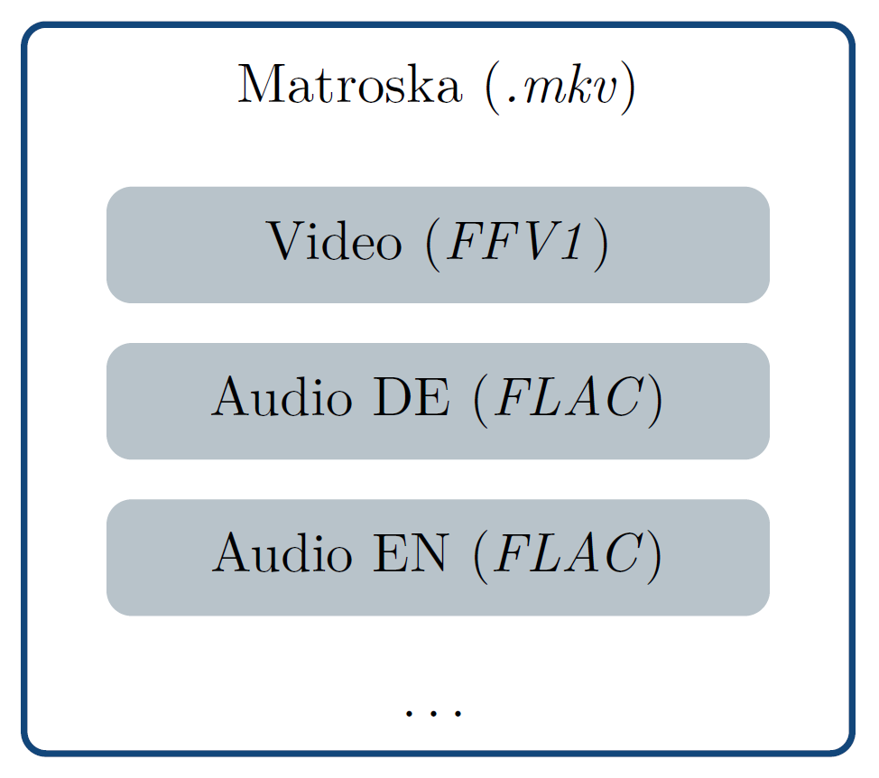
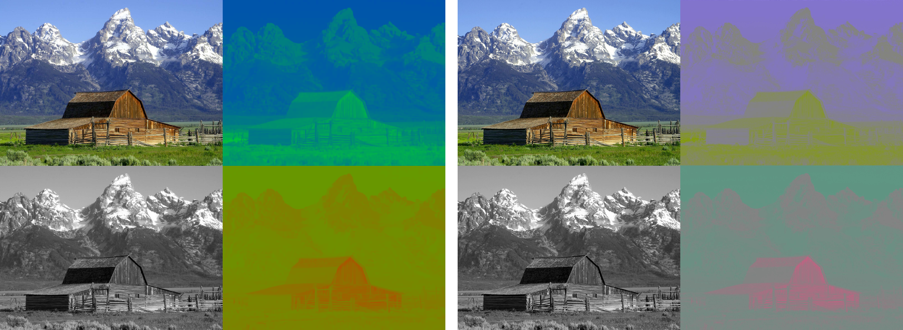
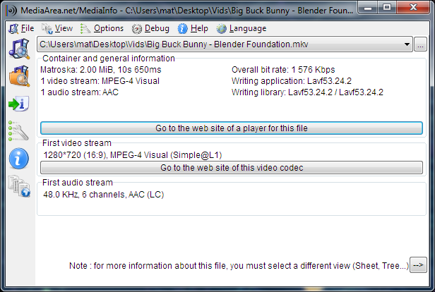
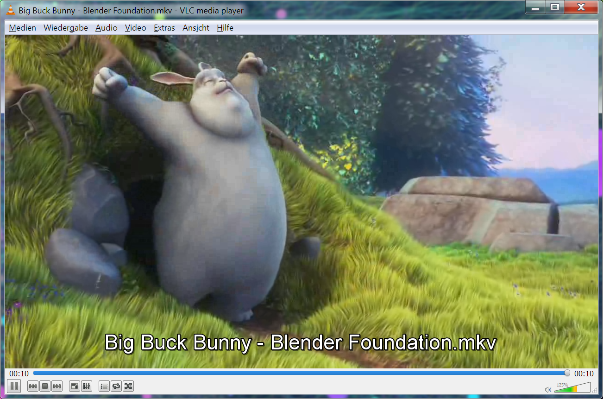

# Video

## Übersicht

Videos sind in der altertumswissenschaftlichen Forschung vergleichsweise wenig verbreitet und dienen vor allem der Dokumentation von Arbeitsabläufen, Visualisierung von Ergebnissen oder publikumswirksamen Medienauftritten.

Eine digitale Videodatei enthält sowohl visuelle als auch auditive Inhalte. Diese sind jeweils in einem eigenen Format, dem sogenannten Codec, gespeichert und werden in einem Containerformat zusammengeführt. Je nachdem welches Containerformat verwendet wird, können weitere Informationen, wie Metadaten oder Untertitel gespeichert werden. Zu beachten ist, dass es sich bei manchen Containerformaten gleichzeitig um Codecs handeln kann. Die Digitalisierung von analogem Film- und Videomaterial ist nicht Gegenstand dieser Empfehlungen.

### Langzeitformate

Bei der Auswahl für die Langzeitarchivierung von digitalen Videos muss nicht nur ein passendes Format, sondern auch ein geeigneter Codec gefunden werden. Dabei gelten für die Auswahl des Codecs und des Containerformats die Kriterien, die für die Wahl von Dateiformaten beschrieben werden: Es sollte sich um einen weit verbreiteten, möglichst nicht proprietären und offen dokumentierten Standard handeln, der verlustfreie oder gar keine Kompression anwendet. Außerdem sollte darauf geachtet werden, dass das gewählte Format die Speicherung aller relevanten Elemente des Videos, wie beispielsweise Untertitel, unterstützt.

Das Containerformat Matroska (MKV) erfüllt alle Anforderungen an ein Archivformat. Es wird seit 2003 explizit als offenes Containerformat entwickelt, das modernen Ansprüchen genügt und viele verschiedene Codecs enthalten sowie zusätzliche Elemente, wie Untertitel, speichern kann. Das Format basiert auf einer binären Variante von XML, nämlich EBML (Extensible Binary Meta Language), was eine zukünftige flexible Erweiterung erlaubt, jedoch auch sicherstellt, dass ältere Programme weiterhin damit umgehen können. Zusätzlich ist das Format fehlertolerant und kann bis zu einem gewissen Grad auch beschädigte Dateien wiedergeben. Zusammen mit den Codecs FFV1 für Video und FLAC für Audio wird eine Standardisierung bei der IETF angestrebt, weshalb diese Kombination empfohlen wird.

Motion JPEG 2000 (MJ2) ist ein speziell für die Archivierung entwickeltes Containerformat, das unter ISO/IEC 15444-3:2007 zertifiziert und als MIME-Type video/mj2 registriert ist. Es verwendet einen eigenen Codec, JPEG 2000, der jedes Einzelbild verlustfrei mit JPEG 2000 komprimiert. Zugehörige auditive Inhalte werden von Motion JPEG 2000 ebenfalls unterstützt. Das Format ist rechenintensiv und nicht vollständig lizenzfrei, weshalb es besser sein kann den JPEG 2000 Codec in einem anderen Containerformat, wie beispielsweise MXF zu verwenden. Außerdem ist zu Beachten, dass MJ2 auch verlustbehaftete Varianten kennt, die für die Archivierung nicht verwendet werden sollten. Motion JPEG 2000 darf nicht mit dem MPEG-Containerformat oder dem verlustbehafteten Motion JPEG (M-JPEG) verwechselt werden.

Die Familie der MPEG-Containerformate wird von der Moving Picture Experts Group (MPEG) entwickelt und ISO/IEC zertifiziert. Es gibt mehrere Generationen von Standards, darunter MPEG-1 (MPG), MPEG-2 (MPG) oder MPEG-4 (MP4), die entsprechend unterschiedliche Eigenschaften aufweisen. Die Standards beschreiben nicht nur Containerformate, sondern auch Codecs für Video und Audio. MPEG-1 ist seit 1991 unter ISO/IEC 11172 zertifiziert und beschreibt einen Standard für verlustbehaftete Komprimierung von Audio- und Videodaten, der eine gute Qualität und weite Verbreitung hat. MPEG-1 ist insbesondere für das Audioformat MP3 bekannt, eignet sich aber nicht für die Langzeitarchivierung. Der ebenfalls verlustbehaftete Nachfolger, MPEG-2, ist unter ISO/IEC 13818 zertifiziert und hat eine weite Verbreitung in dem Containerformat MPEG-TS (TS) für Rundfunkübertragungen oder auf DVDs gefunden. MPEG-2 kann nur als Langzeitformat für Dateien verwendet werden, die ursprünglich in diesem Format entstanden sind und nicht mehr bearbeitet werden.

Der unter ISO/IEC 14496 zertifizierte MPEG-4-Standard weist eine höhere Effizienz in der Komprimierung und eine höhere Qualität der Videodaten als seine Vorgänger auf. Er verwendet den Codec H.264/MPEG-4 AVC, der meistens verlustbehaftet verwendet wird, jedoch auch eine kaum verwendete verlustfreie Variante hat. Dieser Codec bietet eine hohe Bildqualität, weshalb er eine weite Verbreitung auf Blu-ray Discs, als Aufnahmeformat oder für das Streaming über das Internet gefunden hat. Teil 14 der MPEG-4-Spezifikation definiert das Containerformat MP4, das auch als MIME-Type video/mp4 registriert ist. Wird dieses Format mit dem H.264-Codec verwendet, kann es zur Langzeitarchivierung verwendet werden, wenn dies entweder dem Ursprungsformat der Videodatei entspricht oder verlustfreie Kompression verwendet wird.

Das Containerformat Material eXchange Format (MXF) ist ein offenes Format, das für den Austausch von auditiven und visuellen Inhalten entwickelt wurde und durch eine Reihe von Standards der Society of Motion Picture and Television Engineers (SMPTE) beschrieben wird. MXF wird vor allem im Bereich Kino und Fernsehen verwendet, wo jeweils spezialisierte Varianten verwendet werden, die nicht immer vollständig untereinander kompatibel sind. MXF ist als MIME-Type application/mxf registriert. Zusammen mit der verlustfreien Variante des Codecs JPEG 2000 stellt MXF eine für die Langzeitarchivierung geeignete Variante dar.

Es gibt eine große Zahl an weiteren Containerformaten, wie etwa MOV und ASF/WMV. Sie eignen sich aber nicht für die langfristige Videoarchivierung, da es sich dabei um proprietäre Formate handelt. Bei Audio Video Interleave (AVI) handelt es sich ebenfalls um ein proprietäres Format, es wird jedoch von einigen Archiven als Archivformat verwendet, da es sich um ein einfaches und robustes Format mit einer großen Verbreitung handelt. Die Formate Ogg und Flash wurden vor allem für das Streaming von Videos entwickelt und sind aufgrund der verwendeten verlustbehafteten Codecs nicht als Langzeitformate geeignet.

Die Wahl des Containerformates hängt von dem zu verwendenden Codec ab, da nicht jeder Codec in jedem Container verwendet werden kann. Bekannte und verbreitete Codecs werden nachfolgend beschrieben.

Der Nachteil bei unkomprimierten Videodateien ist, dass sie sehr viel Speicherplatz (teilweise mehrere GB pro Filmminute) beanspruchen und auch für die Wiedergabe entsprechend leistungsfähige Hardware benötigen. Eine Alternative ist die Verwendung von Codecs mit verlustfreier Kompression, wie etwa FFV1, oder HuffYUV und Lagarith. Der FFmpeg Video Codec 1 (FFV1) wurde im Rahmen des FFmpeg-Projektes entwickelt, ist offen dokumentiert, hat eine weite Verbreitung gefunden und komprimiert sehr gut und schnell. Diese Eigenschaften machen ihn zu einem empfehlenswerten Codec für die Langzeitarchivierung. HuffYUV und dessen Abspaltung Lagarith wurden eigens für Windows-Systeme entwickelt, weshalb diese nicht für die langfristige Archivierung empfohlen werden können.

Einige Codecs können sowohl verlustfrei als auch verlustbehaftet komprimieren. Dazu gehören: Dirac/Schroedinger, JPEG 2000, H.264/MPEG-4 AVC und H.265/MPEG-H (HEVC). Dirac/Schroedinger wurde beim BBC entwickelt, ist jedoch nicht sehr performant und wird von nur wenigen Programmen unterstützt, weshalb er aktuell nicht für die Archivierung empfohlen werden kann. Bei der Verwendung von JPEG 2000 muss darauf geachtet werden, dass die verlustfrei komprimierende Variante verwendet wird, da dieser Standard auch verlustbehaftet komprimieren kann. H.264/MPEG-4 AVC kann in einer verlustfreien Variante verwendet werden, wenn das entsprechende Programm dies unterstützt. Die verlustbehaftete Variante von H.264/MPEG-4 AVC kann nur für die Archivierung von Dateien verwendet werden, die in diesem Codec entstanden sind und nicht mehr bearbeitet werden. Seit 2013 gibt es den Codec High Efficiency Video Coding (HEVC, auch H.265/MPEG-H), der als Nachfolger für H.264 gedacht ist, jedoch noch nicht vollständig spezifiziert ist. Daher und aus patentrechtlichen Gründen ist dieser Codec nicht für die Archivierung zu empfehlen.

Neben den oben erwähnten Codecs gibt es weitere, jedoch verlustbehaftete Codecs, wie M-JPEG, Theora und DV. Im Gegensatz zu JPEG 2000 ist der Codec Motion JPEG (M-JPEG) nicht für die langfristige Archivierung von Videodaten geeignet, da dieser keine verlustfreie Komprimierung unterstützt. Theora ist der für Ogg-Dateien entwickelte Codec. DV ist ein Codec für digitale Videos auf Videokasetten, der mit der Ablösung von Kasetten durch andere Speichermedien obsolet wird. Theora und DV sind keine geeigneten Codecs für die Langzeitarchivierung.

Hinweise auf geeignete Audioformate und dazugehöriger Metadaten sind in dem Kapitel Audio zu finden.

| &nbsp; | Format                                                       | Begründung                                                   |
| ------ | ------------------------------------------------------------ | ------------------------------------------------------------ |
| ✔      | Matroska (MKV)                                               | Ein offenes Containerformat, das eine große Bandbreite von Codecs und ergänzenden Inhalten unterstützt. Für die Archivierung können die Codecs FFV1 für Video und FLAC für Audio empfohlen werden. Weitere geeignete Codecs für Matroska sind H.264/MPEG-4 AVC und MPEG-2. |
| 〰️     | Motion JPEG 2000 (MJ2)  MP4      MXF    MPEG-2  | Motion JPEG 2000 verwendet den Codec JPEG 2000 und ist unter ISO/IEC 15444-3:2007 zertifiziert.   Der unter ISO/IEC 14496 zertifizierte MPEG-4-Standard verwendet den Codec H.264/MPEG-4 AVC, der meistens verlustbehaftet verwendet wird, jedoch auch verlustfrei komprimieren kann. Das Containerformat MP4 ist als MIME-Type video/mp4 registriert. Wird dieses Format mit dem H.264-Codec verwendet, kann es zur Langzeitarchivierung verwendet werden, wenn dies entweder dem Ursprungsformat der Videodatei entspricht oder verlustfreie Kompression verwendet wird.  Das Containerformat Material eXchange Format (MXF) ist ein offenes Format, das durch eine Reihe von Standards der SMPTE beschrieben wird. MXF ist als MIME-Type application/mxf registriert. Zusammen mit der verlustfreien Variante des Codecs JPEG 2000 stellt MXF eine für die Langzeitarchivierung geeignete Variante dar.  MPEG-2 ist unter ISO/IEC 13818 zertifiziert und komprimiert verlustbehaftet. MPEG-2 kann nur als Langzeitformat für Dateien verwendet werden, die ursprünglich in diesem Format entstanden sind und nicht mehr bearbeitet werden. |
| ❌      | MPEG (weitere Varianten)  AVI   MOV   ASF/WMV  Ogg   Flash | Mit Ausnahme von MPEG-4 und MPEG-2 können andere MPEG-Varianten nicht für die Langzeitarchivierung empfohlen werden.   Audio Video Interleave ist ein von Microsoft entwickeltes proprietäres Format mit einer weiten Verbreitung. Es eignet sich nicht für die Langzeitarchivierung.  Ein verbreitetes proprietäres Format von Apple, das in QuickTime verwendet wird und nicht für die Langzeitarchivierung geeignet ist.  Ein proprietäres Format von Microsoft, das nicht für die Langzeitarchivierung geeignet ist.  Ein von Xiph entwickeltes und offenes Format für das Streaming von Videos, das jedoch nicht für die Archivierung geeignet ist.  Ein von Macromedia und dann von Adobe entwickeltes Format für das Streaming von Videos. Es ist nicht für die Langzeitarchivierung geeignet. |

### Dokumentation

Neben den allgemeinen minimalen Angaben zu Einzeldateien, wie sie in dem Abschnitt Metadaten in der Anwendung gelistet sind, werden für Videos weitere Angaben benötigt, die insbesondere technische Details dokumentieren.

Die technischen Angaben zu Bildformat, Seitenverhältnis, Bildfrequenz, Bitrate und Codec werden zur korrekten Wiedergabe der Datei benötigt. Angaben zu Länge, Tonkanälen, Profilen und weiteren Inhalten sind zur Prüfung auf Vollständigkeit der Datei erforderlich.

Bereits eingebettete Metadaten, wie beispielsweise Exif, oder Bestandteile im Containerformat sollten behalten und archiviert werden. Am besten werden sie in eine eigene Text- oder XML-Datei transferiert und getrennt gespeichert.

| Metadatum                      | Beschreibung                                                 |
| ------------------------------ | ------------------------------------------------------------ |
| Länge                          | Dauer des Videos. Diese Angaben sollten konform zu ISO 8601 erfolgen. Beispiel: P3Y6M4DT12H30M5S (3 Jahre, 6 Monate, 4 Tage, 12  Stunden, 30 Minuten und 5 Sekunden) oder T2H2M (2 Stunden und 2 Minuten) |
| Bildgröße und Seitenverhältnis | Maße des Bildes gemessen in Pixeln, z.B. $1280px \times 720px$, und  Angabe des Seitenverhältnisses für die korrekte Darstellung im  Verhältnis Breite zu Höhe, z.B.: 16:9 |
| Bildfrequenz                   | Angabe der Bildfrequenz in Bildern pro Sekunde, z.B. 25      |
| Bitrate Video                  | Angabe der Datenrate in Bits pro Sekunde, z.B. 863 kbps      |
| Farbraum                       | Angabe des verwendeten Farbraums, z.B. YUV                   |
| Farbtiefe                      | z.B. 8 bit oder 10 bit                                       |
| Farbunterabtastung             | Angabe der verwendeten Farbunterabtastung, z.B. 4:2:0        |
| Videocodec                     | Name und Version des verwendeten Videocodecs und welche Kompression verwendet wird |
| Audiostreams                   | Anzahl der enthaltenen Audiostreams                          |
| Audiocodec                     | Angaben zu den verwendeten Audiocodecs je enthaltenen Audiostreams |
| Bitrate Audio                  | Angabe der Datenrate in Bits pro Sekunde je enthaltenen Audiostreams, z.B. 666 kbps |
| Abtastrate                     | Angabe der Abtastrate in Hertz je enthaltenen Audiostreams, z.B. 44.1 kHz |
| Tonkanäle                      | Angabe über Anzahl der Tonkanäle je enthaltenen Audiostreams |
| Profil                         | Wenn ein bestimmtes Videoprofil für ein Containerformat verwendet wurde, bitte angeben. |
| Weitere Inhalte                | Angabe über weitere Inhalte, die in dem Containerformat enthalten  sind oder als zusätzliche Datei vorliegen, wie beispielsweise Untertitel |
| Aufnahmegerät                  | Herstellername und Modell des Aufnahmegeräts (z.B. eine Kamera) |
| Software                       | Name und Versionsnummer der Software, mit der das Video aufgenommen, erstellt oder bearbeitet wurde, wie z.B. Adobe Premiere Pro CC (2015.1) |

Weitere Metadaten sind methodenabhängig und können in den jeweiligen Abschnitten nachgelesen werden.

## Vertiefung

Die Informationen für Bild und Ton von Videos werden jeweils in einem eigenen Format gespeichert, dem sogenannten Codec, welche in einem Containerformat zusammengeführt werden.

Das Bildformat von Videodateien ist nicht nur von der Anzahl der Pixel, sondern auch von dem Seitenverhältnis abhängig. Analog zu Rastergrafiken werden Videos in einem Farbraum mit einer bestimmten Farbtiefe gespeichert. Eine Besonderheit dabei ist die Farbunterabtastung, die zur verlustbehafteten Reduzierung der Datenmenge angewendet werden kann. Die Datenmenge ist außerdem von der Bitrate abhängig, die variabel oder konstant sein kann.

### Containerformat

*Das Containerformat Matroska enthält einen Video- und zwei Audiostreams. Die Punkte deuten an, dass weitere Inhalte möglich sind. Der verwendete Codec für den Film ist FFV1, der für beide Tonspuren FLAC.*

 

In der Regel handelt es sich bei Multimediaformaten, zu denen Videodateien zählen, um Containerformate, die mehrere verschiedene Inhalte zusammenfassen. Zu den Inhalten gehört neben dem eigentlichen Bildinhalt auch begleitender Ton. Zusätzlich können Untertitel, strukturierende Angaben, wie etwa Kapiteleinteilungen, oder allgemeine Metadaten enthalten sein. Dabei wird jeder dieser Inhalte in einem eigenen Format gespeichert. Formate für die visuellen und auditiven Inhalte werden Codecs genannt. In der nebenstehenden Abbildung ist ein Videocontainer mit einem Video- und zwei Audiostreams veranschaulicht.

Es gibt eine große Zahl an Containerformaten, die für unterschiedliche Anforderungen entwickelt wurden und daher auch jeweils einen unterschiedlichen Funktionsumfang aufweisen. Beispielsweise können manche Formate, wie beispielsweise Motion JPEG 2000, nur mit einem oder wenigen Codecs umgehen, während andere Formate, wie etwa Matroska (MKV), so gut wie jeden existierenden Video- und Audiocodec speichern können. Das bedeutet auch, dass eine MKV-Datei nicht gleich einer anderen MKV-Datei ist, da sie unterschiedliche Codecs enthalten kann.

Ob eine Mediendatei geöffnet und wiedergegeben werden kann hängt nicht nur davon ab, ob das verwendete Wiedergabeprogramm mit dem Containerformat umgehen kann, sondern auch, ob die verwendeten Codecs unterstützt werden. Die Dateiendung gibt dabei nur über das Containerformat Auskunft, während die darin enthaltenen Codecs erst durch Öffnen der Datei oder mittels Analyseprogrammen ermittelt werden können.

Das Zusammenführen der einzelnen Komponenten in ein Containerformat wird als Multiplexing oder Muxing bezeichnet, während das Aufsplitten der Inhalte eines Containers Demultiplexing oder Demuxing genannt wird.

### Codec und Kompression

*Ablauf einer Transcodierung. Die Quelldatei wird entpackt (Demultiplexing). Die einzelnen Video- und Audioinhalte werden zunächst decodiert und anschließend im Zielcodec codiert. Schließlich werden die Einzelinhalte in der Zieldatei verpackt (Multiplexing).*

 

Für die Speicherung der eigentlichen Film- und Toninhalte von Videos in den Containerformaten gibt es eigene Codecs, die definieren wie die Datenströme gespeichert und gelesen werden.

Der Begriff Codec setzt sich aus den englischen Wörtern coder (Codierer) und decoder  (Decodierer) zusammen. Die Konvertierung von einem Codec in einen anderen wird Transcodierung genannt und wird schematisch in der nebenstehenden Abbildung dargestellt.

Codecs bieten immer eine Kompression der Daten, die entweder verlustbehaftet oder verlustfrei erfolgen kann. Dabei verwenden die Codecs unterschiedliche Verfahren an, die grob in Intraframe- und Interframe-Kompression unterteilt werden können. Intraframe-Kompression beschränkt sich auf die Komprimierung der Daten eines Einzelbildes, während bei der Interframe-Kompression über eine ganze Videosequenz hinweg komprimiert wird. Letzteres hat den Nachteil, dass eventuell auftretende Fehler nicht nur ein Einzelbild, sondern eine ganze Sequenz an Bildern korrumpieren.

Die einzelnen Codecs werden durch einen FourCC (Four Character Code) im Header der Datei oder des Dateiteils identifiziert. Es handelt sich dabei um einen vier Byte langen Bezeichner, der aus ASCII-Zeichen besteht und somit auch für Menschen lesbar und erkennbar ist, wie beispielsweise FFV1 für FFV1 oder MJ2C für Motion JPEG 2000.

Videodaten können auch unkomprimiert in einem Container gespeichert werden, jedoch muss dabei beachtet werden, dass es verschiedene Varianten gibt, die nicht unbedingt untereinander kompatibel sind und im schlechtesten Fall sogar nur von spezifischen Programmen verarbeitet werden können. Daher sind zumindest weitere Angaben über Farbtiefe, Auflösung und Bildfrequenz erforderlich. Der Nachteil von unkomprimierten Videodateien ist, dass sie sehr viel Speicherplatz (teilweise mehrere GB pro Filmminute) beanspruchen.

Da nicht jeder Codec in jedem Container verwendet werden kann, hängt die Wahl des Codecs von dem zu verwendenden Containerformat ab.

### Bildgröße und Seitenverhältnis

Für die Bildgröße von digitalen Videos gilt im Prinzip das Gleiche, wie für die Bildgröße von Rastergrafiken, die in dem Abschnitt Bildgröße und Auflösung beschrieben wird.

Zusammen mit der Bildgröße sollte immer das Seitenverhältnis angegeben werden, da aufgrund des analogen Ursprungs von einigen Videoformaten die Pixel nicht in jedem Fall quadratisch sind und für die Darstellung entsprechend umgerechnet werden müssen. Das Seitenverhältnis bezieht sich auf die Darstellung des Bildes und wird als Verhältnis von Breite zu Höhe angegeben, wie beispielsweise 4:3 für SD PAL.

Wenn ein analoges Video digitalisiert wird, muss darauf geachtet werden, dass das ursprüngliche Bild nicht verzerrt oder beschnitten wird, also das Seitenverhältnis gleich bleibt. Bei der Wiedergabe kann das Bild in das Format des Wiedergabemediums durch sogenanntes Pillarboxing eingefügt werden, wobei schwarze Ränder in Kauf zu nehmen sind. Ein typisches Beispiel hierfür ist die Wiedergabe von Videokassetten mit dem Verhältnis 4:3 auf Breitbildmonitoren mit einem Seitenverhältnis von 16:9.

*Das Bild links im Seitenverhältnis 4:3 wurde rechts mittels Pillarboxing in das Seitenverhältnis 16:9 übertragen, wodurch links und rechts davon schwarze Balken zu sehen sind. (Blender Foundation)*

 

### Farbinformationen

Was Farbtiefe und Farbraum bedeutet, wird in dem Kapitel über Rastergrafiken in dem Abschnitt Farbtiefe und in dem Abschnitt Farbmodell und Farbraum erläutert.

Speziell für die Farbdarstellung auf selbstleuchtenden Geräten wurden eigene Farbmodelle entwickelt, zu denen YUV, YCbCr und YPbPr mit jeweils drei Kanälen gehören. Dabei beschreibt der erste Kanal, das Y, die Helligkeit der einzelnen Bildpunkte (Luma oder auch Luminanz). Der Y-Kanal wird somit für die Übertragung eines Schwarz-Weiß-Bildes verwendet. Der Farbanteil (Chroma oder Chrominanz) wird jeweils mit den zwei übrigen Kanälen (U & V, Cb & Cr oder Pb & Pr) repräsentiert.

*Links die Aufteilung eines Bildes in die drei Kanäle Y, U und V. Auf der rechten Seite wurde das Bild in die drei Kanäle Y, Cb und Cr aufgeteilt. (Wikimedia Commons)*

 

Da das menschliche Auge Farben im Vergleich zu Helligkeiten schlechter auflösen kann, wird eine Reduzierung in der Auflösung von Farbanteilen schlechter wahrgenommen. Wenn also der Y-Kanal vollständig übertragen wird, während die beiden Farbkanäle jeweils reduziert übertragen werden, ist optisch für den Menschen kein Unterschied in der Schärfe feststellbar. Diesen Umstand macht sich die Farbunterabtastung (engl. chroma subsampling) zunutze, die im Folgenden und in der untenstehenden Abbildung kurz erläutert wird.

Farbunterabtastung wird meist durch drei Zahlen dargestellt, die jeweils mit einem Doppelpunkt voneinander getrennt werden, wie beispielsweise 4:2:0. Die erste Ziffer bezieht sich auf die Luminanz, die als Referenz für die weiteren Ziffern verwendet wird. Es handelt sich dabei üblicherweise um eine Vier.

Die zweite Ziffer beschreibt die horizontale Abtastung beider Farbkanäle im Verhältnis zur Luminanz. Handelt es sich dabei um eine Vier, wird die Chrominanz vollständig abgetastet, während eine Zwei bedeutet, dass die Chrominanz in der Horizontalen nur halb so oft, wie die Luminanz abgetastet wird.

Die dritte Ziffer bezieht sich auf die vertikale Abtastung. Wenn die dritte Ziffer gleich der zweiten Ziffer ist, wird keine vertikale Farbunterabtastung angewendet. Wenn die dritte Ziffer eine Null ist, findet eine vertikale Farbunterabtastung im Verhältnis 2:1 beider Farbkanäle statt.

Eine vierte Ziffer, die immer den gleichen Wert der ersten Ziffer hat, wird verwendet, wenn zusätzlich Transparenz kodiert werden soll.

![Schematische Darstellung der Farbunterabtastung. Bei 4:4:4 werden die Informationen aller drei Kanäle vollständig abgetastet. Bei 4:2:2 wird der Y-Kanal vollständig und im U- und V-Kanal jeweils nur jeder zweite Pixel jeder Zeile gelesen. Bei 4:2:0 wird der Y-Kanal ebenfalls vollständig gelesen, während die Farbkanäle U und V jeweils nur zur Hälfte in der Horizontalen und in der Vertikalen gelesen werden, also nur jeder zweite Pixel in jeder zweiten Zeile. Werden die drei Kanäle zusammengerechnet, weisen die Gesamtbilder optisch kaum sichtbare Unterschiede auf.](./_media/video_farbunterabtastung.png)
*Schematische Darstellung der Farbunterabtastung. Bei 4:4:4 werden die Informationen aller drei Kanäle vollständig abgetastet. Bei 4:2:2 wird der Y-Kanal vollständig und im U- und V-Kanal jeweils nur jeder zweite Pixel jeder Zeile gelesen. Bei 4:2:0 wird der Y-Kanal ebenfalls vollständig gelesen, während die Farbkanäle U und V jeweils nur zur Hälfte in der Horizontalen und in der Vertikalen gelesen werden, also nur jeder zweite Pixel in jeder zweiten Zeile. Werden die drei Kanäle zusammengerechnet, weisen die Gesamtbilder optisch kaum sichtbare Unterschiede auf.*

 

### Datenrate

Die Datenrate, gibt an wie viele Daten in einer bestimmten Zeitspanne übertragen oder gelesen werden. Bei digitalen Videos wird die Datenrate in Bits pro Sekunde gemessen, weshalb hier auch von Bitrate gesprochen wird.

Wenn eine konstante Bitrate (constant bitrate, CBR) angewendet wird, wird pro Sekunde immer die gleiche Datenmenge übertragen, was zur Folge haben kann, dass komplexe Bildinhalte an Qualität verlieren. Bei der Anwendung einer variablen Bitrate (variable bitrate, VBR) variiert die Menge der übertragenen Daten je nach Komplexität des Bildinhaltes, was eine höhere Bildqualität zur Folge hat. Da bei der VBR ruhige und einfache Bildübergänge und -inhalte mit einer niedrigen Datenrate gespeichert werden, kann der Speicherplatzverbrauch verringert werden.

In den meisten Codecs wird eine variable Bitrate verwendet.

## Praxis

In diesem Abschnitt sind Hinweise zum Umgang mit Videodateien gesammelt. Es gibt Erläuterungen mit Literatur- und Programmhinweisen über die Ansicht und Extraktion von Metadaten, die Wiedergabe und die Transcodierung von Videos. Zur Digitalisierung von Filmmaterial können nur allgemeine Hinweise gegeben werden.

### Metadaten

Die technischen Metadaten der Containerdatei sind in der Regel in dessen Header gespeichert. Weitere Metadaten können in den Video- und Audiostreams gespeichert sein. Diese Daten können von verschiedenen Programmen ausgelesen werden. Ein Programm, das mit vielen Formaten umgehen kann und auch den Export von Metadaten in eine gesonderte Datei erlaubt ist MediaInfo.

*Die Übersichtsseite von MediaInfo für eine analysierte MKV-Datei.*

 

Zu den Exportformaten gehören PBCore und EBUCore. Es handelt sich dabei um Metadatenschemata, die speziell für Film und Ton von Public Broadcasting in den USA, beziehungsweise von der European Broadcasting Union (EBU) entwickelt wurden. Die Moving Pictures Experts Group (MPEG) hat MPEG-7 für die Dokumentation von Multimediadateien entwickelt, der insbesondere zur Erweiterung der anderen MPEG-Standards gedacht ist.

- MediaInfo: https://mediaarea.net/MediaInfo
- PBCore: http://pbcore.org/
- EBUCore: https://tech.ebu.ch/MetadataEbuCore
- MPEG-7: http://mpeg.chiariglione.org/standards/mpeg-7

### Wiedergabeprogramme

Jedes Betriebssystem hat meist schon ein Programm für die Wiedergabe von Videodateien vorinstalliert. Jedoch können diese Programme nur mit einer begrenzten Auswahl von Containerformaten und Codecs umgehen. Codecs können nachträglich installiert werden, wobei aber auf Kompatibilität mit dem Wiedergabeprogramm geachtet werden muss.

Ein Programm, das mit allen hier vorgestellten Formaten und Codecs umgehen kann, ist der VLC media player. Unter der einfach gehaltenen Oberfläche verbirgt sich eine Vielzahl an Funktionalitäten und das Programm gibt es für alle gängigen Betriebssysteme.

- VLC media player von VideoLAN: http://www.videolan.org/vlc/index.html

*VLC media player*

 

### Transcodierung

Für die Transcodierung von einem Codec in einen weiteren gibt es einige frei verfügbare Programme, wie beispielsweise der bereits vorgestellt VLC media player, der eine leicht verständliche grafische Oberfläche anbietet. Auch das frei verfügbare Programm Handbrake ist für mehrere Betriebssysteme verfügbar und bietet eine grafische Oberfläche, ist jedoch im Gegensatz zu VLC nur auf die Transcodierung spezialisiert.

Für fortgeschrittene Anwender ist das ebenfalls frei verfügbare FFmpeg zu empfehlen, das komplexere und detailliertere Transcodierungsoptionen erlaubt und auch von der Kommandozeile aus gesteuert werden kann.

- VLC media player von VideoLAN: http://www.videolan.org/vlc/index.html
- Handbrake: https://handbrake.fr/
- FFmpeg: https://www.ffmpeg.org/

### Digitalisierung und Aufnahme

Die Digitalisierung von Film- und Videomaterial ist angesichts der beinahe unüberschaubaren Menge an analogen Film- und Videoformaten nicht Gegenstand dieser Empfehlungen.

Im Allgemeinen sollte darauf geachtet werden, dass das originale analoge Material weiterhin erhalten bleibt. Bei der Digitalisierung muss auf größtmögliche Qualität und Originaltreue geachtet werden, wobei vor allem Farbwiedergabe und Seitenverhältnis unverändert bleiben sollten. Die Konsultierung eines darauf spezialisierten Archivs oder Dienstleisters ist hierbei ratsam.

Die Aufnahmen neuer Videos sollten digital erfolgen, da diese die Analogtechnik inzwischen an Qualität meist übertrifft. Dabei sollten die Audiodaten in linearem PCM oder FLAC aufgenommen werden und die Videodaten entweder unkomprimiert, als FLAC oder in möglichst hochqualitativem H.264/MPEG-4 AVC gespeichert werden. Von der DFG gibt es weitere Hinweise in der Handreichung Empfehlungen zu datentechnischen Standards und Tools bei der Erhebung von Sprachkorpora.

## Quellen

Archaeology Data Service, Digital Video: A Guide to Good Practice
http://guides.archaeologydataservice.ac.uk/g2gp/Video_Toc

W. Bergmeyer, Multimedia/Komplexe Applikationen, in: H. Neuroth -- A. Oßwald -- R. Scheffel -- S. Strathmann -- K. Huth (Hrsg.) nestor Handbuch. Eine kleine Enzyklopädie der digitalen Langzeitarchiverung. Version 2.3 (2010) Kap. 17.4
http://www.nestor.sub.uni-goettingen.de/handbuch

G. Blood, Refining Conversion Contract Specifications: Determining Suitable Digital Video Formats for Medium-term Storage. (2011)
http://www.digitizationguidelines.gov/audio-visual/documents/IntrmMastVidFormatRecs_20111001.pdf

P. Bubestinger -- H. Lewetz -- M. Jaks, The archivist's video codec and container FAQ (2013)
http://download.das-werkstatt.com/pb/mthk/info/video/FAQ-digital_video_archiving.html

P. Bubestinger -- H. Lewetz -- M. Jaks, Comparing video codecs and containers for archives (2015)
http://download.das-werkstatt.com/pb/mthk/info/video/comparison_video_codecs_containers.html

B. Devlin, MXF -- The Material Exchange Format, in: EBU Technical Review (2002)
http://www.ebu.ch/en/technical/trev/trev_291-devlin.pdf

B. Devlin, MXF. What is it, how does it work, and why hasn't it solved the world's problems yet? (2012)
http://www.tvtechnology.com/research-&-standards/0114/mxf/262167

DFG Handreichung Empfehlungen zu datentechnischen Standards und Tools bei der Erhebung von Sprachkorpora
http://www.dfg.de/download/pdf/foerderung/grundlagen_dfg_foerderung/informationen_fachwissenschaften/geisteswissenschaften/standards_sprachkorpora.pdf

V. Ernst -- J. Kepier -- J. Renz -- A. Romeyke -- T. Bähr, Leitfaden für die digitale Langzeitarchivierung audiovisueller Medien (2016)
http://nbn-resolving.de/urn:nbn:de:0008-2016102107

equasys (Hrsg.), Color Formats (2015)
http://www.equasys.de/colorformat.html

Koordinationsstelle für die dauerhafte Archivierung elektronischer Unterlagen (Hrsg.) Katalog archivischer Dateiformate: Videodaten
http://kost-ceco.ch/wiki/whelp/KaD/pages/Video.html

C. Lacinak, A Primer on Codecs for Moving Image and Sound Archives. 10 Recommendations for Codec Selection and Management (2010)
http://www.avpreserve.com/wp-content/uploads/2010/04/AVPS_Codec_Primer.pdf

E. Lorrain, A short guide to choosing a digital format for video archiving masters (2014)
https://www.scart.be/?q=en/content/short-guide-choosing-digital-format-video-archiving-masters

Memoriav (Hrsg.), Digitale Archivierung von Film und Video: Grundlagen und Orientierung (2015)
https://www.scart.be/?q=en/content/short-guide-choosing-digital-format-video-archiving-masters

G. Pearson -- M. Gill, An Evaluation of Motion JPEG 2000 for Video Archiving, in: Proceedings IS&T Archiving 2005 vom 26. bis 29. April in Washington, D.C. (Washington, D.C. 2005) 237-243
http://dancearchivalproject.wikispaces.asu.edu/file/view/MJ2_video_archiving.pdf

C. Poynton, Chroma subsampling notation (2008)
http://www.poynton.com/PDFs/Chroma_subsampling_notation.pdf

D. Sauter, Video, In: H. Neuroth -- A. Oßwald -- R. Scheffel -- S. Strathmann -- K. Huth (Hrsg.) nestor Handbuch. Eine kleine Enzyklopädie der digitalen Langzeitarchiverung. Version 2.3 (2010) Kap. 17.5
http://www.nestor.sub.uni-goettingen.de/handbuch

K. van Malssen, Digital Video Preservation and Oral History, in: D. Boyd -- S. Cohen -- B. Rakerd -- D. Rehberger (Hrsg.) Oral History in the Digital Age (Washington, D.C. 2012)
http://dancearchivalproject.wikispaces.asu.edu/file/view/MJ2_video_archiving.pdf

FFV1 vs other formats for preservation, Diskussion in Google Gruppe
https://groups.google.com/forum/#!topic/archivematica/HulV96gJ0go

What is a FOURCC? (englisch, 04. 2016)
http://www.fourcc.org/fourcc.php

Wikipedia Bitrate (deutsch, 04. 2016)
https://de.wikipedia.org/wiki/Bitrate

Wikipedia MPEG-4 (englisch, 04. 2016)
https://en.wikipedia.org/wiki/MPEG-4

Filmausschnitte aus Big Buck Bunny von der Blender Foundation (2008)
http://www.bigbuckbunny.org/

### Formatspezifikationen

- Matroska: https://www.matroska.org/
- Matroska: Library of Congress http://www.digitalpreservation.gov/formats/fdd/fdd000342.shtml
- Matroska: IETF CELLAR Charter https://datatracker.ietf.org/doc/charter-ietf-cellar/
- Motion JPEG 2000: https://jpeg.org/jpeg2000/
- Motion JPEG 2000: Library of Congress http://www.digitalpreservation.gov/formats/fdd/fdd000127.shtml
- Motion JPEG 2000: RFC 3745 http://www.ietf.org/rfc/rfc3745.txt
- Motion JPEG 2000: R. Kromer, Glossareintrag JPEG 2000 http://avpres.net/Glossar/JPEG2000.html
- MPEG: http://mpeg.chiariglione.org/
- MPEG-1: http://mpeg.chiariglione.org/standards/mpeg-1
- MPEG-1: Library of Congress http://www.digitalpreservation.gov/formats/fdd/fdd000035.shtml
- MPEG-2: http://mpeg.chiariglione.org/standards/mpeg-2
- MPEG-2: Library of Congress http://www.digitalpreservation.gov/formats/fdd/fdd000335.shtml
- MPEG-4: http://mpeg.chiariglione.org/standards/mpeg-4
- MPEG-4: Library of Congress http://www.digitalpreservation.gov/formats/fdd/fdd000037.shtml
- MPEG-4: RFC 4337 http://www.ietf.org/rfc/rfc4337.txt
- MXF: SMPTE 377-1 http://dx.doi.org/10.5594/SMPTE.ST377-1.2011
- MXF: Library of Congress http://www.digitalpreservation.gov/formats/fdd/fdd000013.shtml
- MXF: RFC 4539 http://www.ietf.org/rfc/rfc4539.txt
- FFV1: http://www.ffmpeg.org/~michael/ffv1.html

### Tools und Programme

- MediaInfo: https://mediaarea.net/MediaInfo

- PBCore: http://pbcore.org/

- EBUCore: https://tech.ebu.ch/MetadataEbuCore

- MPEG-7: http://mpeg.chiariglione.org/standards/mpeg-7

- VLC media player von VideoLAN: http://www.videolan.org/vlc/index.html

- Handbrake: https://handbrake.fr/

- FFmpeg: https://www.ffmpeg.org/
