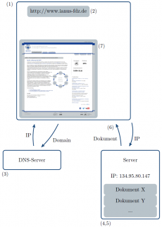
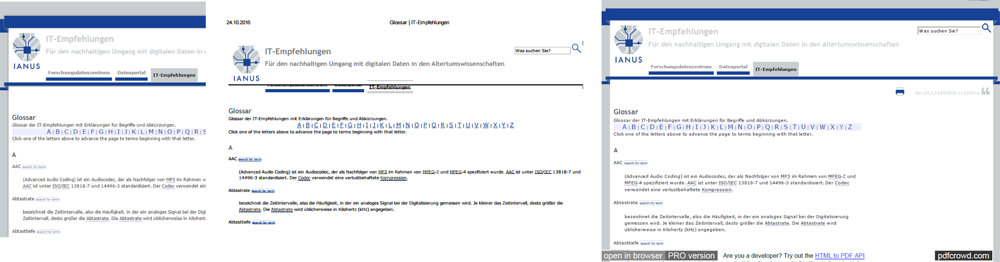
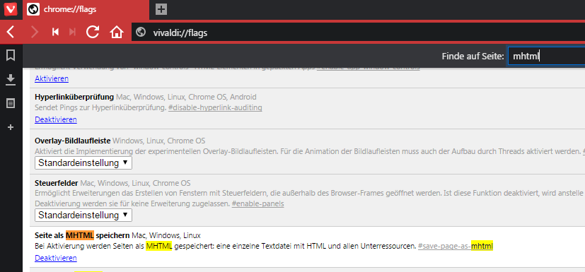
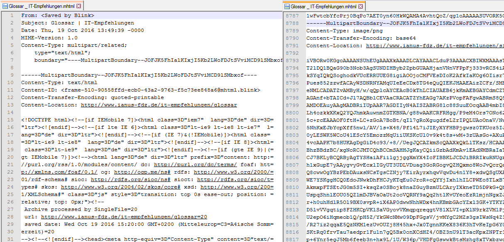
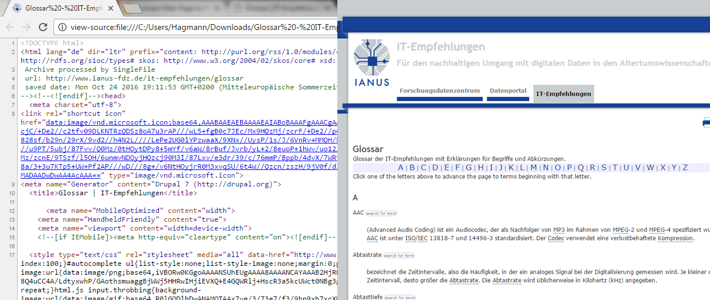
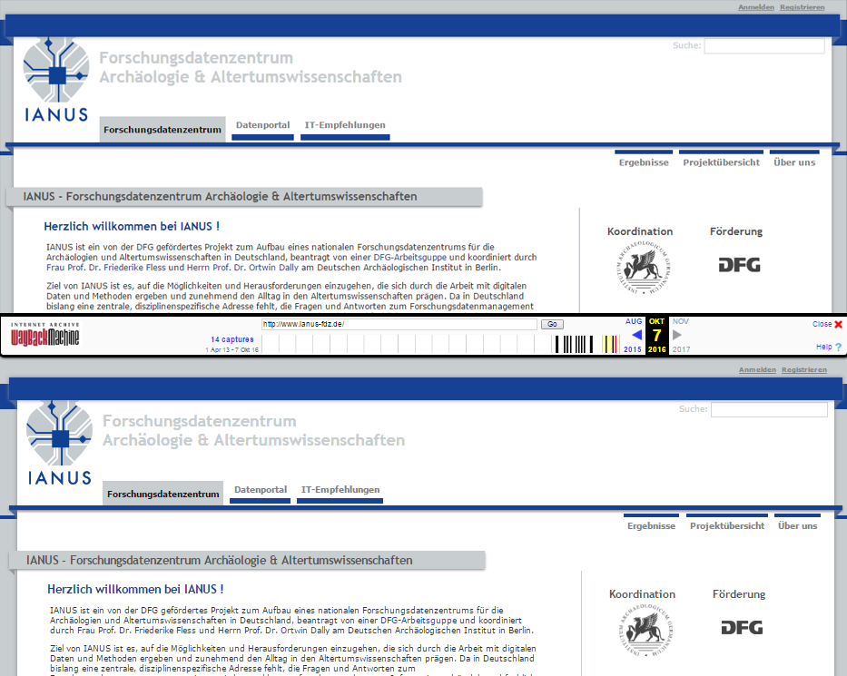

# Websites

## Übersicht

Eine Webseite stellt eine Ressource aus strukturiertem Text im World Wide Web (WWW) dar und besteht in ihrer einfachsten Form aus einer HTML-Datei. Sie kann via Hyperlinks mit beliebig vielen weiteren Ressourcen  vernetzt sein. Webseiten sind ein integraler Bestandteil des WWW im Internet. In der Regel ist eine Webseite Teil einer Website, bzw. eines Webauftrittes, also eines zusammengehörenden Paketes von miteinander vernetzten Webseiten und weiteren Ressourcen.

In der altertumswissenschaftlichen Forschung können Webseiten für die Öffentlichkeit zugängliche Informationen beinhalten, wie etwa  Blogbeiträge oder ausführliche Projektbeschreibungen.

Der vorliegende Artikel beschäftigt sich vornehmlich mit der  Archivierung einzelner Webseiten und nicht mit der Archivierung ganzer  Websitesysteme. Um umfangreiche Websites mit mehreren Webseiten zu  archivieren, empfehlen sich Online-Speicherdienste, spezialisierte  Internetarchive oder dezidierte Softwarelösungen.

### Langzeitformate

Webseiten können archiviert werden, wenn die nötigen Nutzungsrechte  der Inhalte vorliegen. Die Archivierung kann dabei auf verschiedene  Arten erfolgen:

- Speicherung als statisches PDF mit zugehörigen Ressourcen
- lokale Speicherung als HTML oder MHTML mit zugehörigen Ressourcen
- Speicherung bei einem spezialisierten Internetarchiv

Als Optimum ist die Langzeitarchivierung einer Webseite in einer Form, die möglichst wenig Informationsverlust garantiert und einfach  umzusetzen ist, anzustreben. Webseiten bestehen zum einen aus mindestens einer strukturierten HTML-Datei, zum anderen aus beliebig vielen via Hyperlinks mit der HTML-Datei verbundenen Ressourcen, die teilweise auf demselben Webserver gespeichert sind, aber auch von jedem anderen Ort im Internet bezogen werden können. Dies stellt jedoch nur den theoretisch sehr  einfachen Aufbau dar, praktisch bestehen Webseiten aus einer Vielzahl an weiteren strukturierten Textdateien, die etwa das Design der Website regeln (CSS-Dateien) und können zudem über verschiedenste von anderen Websites bezogene und  auf der Webseite eingebettete Inhalte (Videos, 3D-Modelle, interaktive  Karten etc.) verfügen. Eine der Hauptintentionen jedweder Webseite ist  es verschiedene Informationen nach einem vorgegebenen Design in einer  bestimmten Abfolge und einem bestimmten Layout dem Nutzer zu vermitteln, vergleichbar zu einer gedruckten Seite in einem Buch. Bei der  Archivierung muss beachtet werden, dass für Webseiten teilweise  Dateiformate verwendet werden,die für die Langzeitarchivierung dezidiert ungeeignet sind, etwa JPEGs.

Generell empfiehlt es sich, die der Webseite zugrundeliegenden Daten  (z.B. Text und Bilder) als Einzeldateien jeweils separat in einem  geeigneten Archivformat zu archivieren. Nähere Informationen zu den  Archivierungsformaten sind in den entsprechenden Kapiteln zu finden.  Auch werden nicht alle multimedialen Inhalte, Webanwendungen (z.B. Web-GIS) oder über externe Dienste eingebettete Inhalte mit jeder  Archivierungsmethode gespeichert, weshalb in solchen Fällen besonderes  Augenmerk auf die Auswahl der zu verwendenden Methode gelegt werden  muss.

Eine Webseite kann als PDF mit Hilfe des Webbrowsers und eines PDF-Generators als PDF-Datei gespeichert und anschließend mit entsprechender Software in ein archivierbares PDF/A-Datei konvertiert werden. Informationen dazu finden sich im Abschnitt [PDF-Dokumente](/it-empfehlungen/dateiformate/pdf-dokumente). Diese Methode führt praktisch immer zu Änderungen des ursprünglichen Layouts. Jedoch können mittels Plug-ins im Webbrowser oder bestimmten Softwareprogrammen Webseiten unter großteiliger Wahrung des Layouts als PDF gespeichert werden. Abschließend muss auch hier eine Konvertierung in das PDF/A-Format vorgenommen werden. Multimediale Inhalte (Videos, 3D-Objekte etc.) werden mit dieser Methode nicht gespeichert.

Die lokale Speicherung einer Webseite aus dem WWW mittels eines Webbrowsers ist einfach möglich und wird durch alle aktuellen Webbrowser unterstützt. Hierbei gilt es jedoch, bestimmte Speicherformate zu  beachten, da nicht alle in den Webbrowsern verfügbaren Formate für die  Archivierung geeignet sind. Für die Strukturierung und Formatierung von  Webseiten werden üblicherweise die Hypertext Markup Language (HTML) oder die Extensible Hypertext Markup Language (XHTML), sowie Cascading Style Sheets (CSS) verwendet. Es handelt sich dabei um Standards, die vom W3C entwickelt und empfohlen werden, weshalb diese in den Versionen HTML5, XHTML5 und CSS 3 für die Archivierung empfohlen werden können.

Es bietet sich hier also die Möglichkeit der Speicherung der Webseite als HTML- oder XHTML-Datei an. HTML-Dateien (und XHTML) archivieren den strukturierten Text und die Hyperlinks, jedoch nicht  die verknüpften Ressourcen (z.B. Bilder, multimediale Inhalte oder  externe Inhalte), zudem wird hierdurch nicht das Design der Webseite,  welches durch CSS geregelt wird, übernommen, da die entsprechenden Dateien nicht  gespeichert werden. Um auch die verknüpften und für das Design benötigte Ressourcen zu speichern, können diese automatisch in einen zusätzlichen lokalen Ordner geladen werden. In der Regel handelt es sich dabei um HTML/XHTML- und CSS-Dateien, Grafiken, JavaScript-Dateien sowie gegebenenfalls Java Applets und Multimedia-Dateien.

Die lokale Speicherung einer Webseite in einer einzigen Datei wird mittels MIME HTML (MHTML) ermöglicht. Es handelt sich um ein textbasiertes Format, das in RFC 2557 spezifiziert wird. In der Regel werden bei MHTML-Dateien das Layout und alle Hyperlinks vollständig übernommen. Auch hier muss  das Speichern von eingebetteten Inhalten gegebenenfalls gesondert  vorgenommen werden.

Das offen dokumentierte Mozilla Archive Format (MAFF) ermöglicht ebenfalls die Speicherung einer Webseite in Form einer  einzelnen Datei. Dabei werden die einzelnen Bestandteile in einem ZIP-Container gespeichert. Da dieses Format aktuell nur von Mozilla Firefox  unterstützt wird, sollte für die Archivierung jedoch ein anderes Format  vorgezogen werden. Ähnlich verhält es sich mit dem Format Webarchive, das derzeit jedoch nur durch Appels Safari Webbrowser unterstützt wird und daher nicht empfohlen werden kann.

Auch HTML-Dateien mit Data-URIs ermöglichen die Speicherung einer gesamten Webseite meist unter Beibehaltung des Layouts in einer einzigen Datei. Data-URIs  ermöglichen es, Ressourcen in HTML einzubetten und sind in RFC 2397 definiert. Es handelt sich dabei um eine spezielle Syntax, mit der binäre Daten als ASCII-Zeichenketten kodiert werden. Da Ressourcen als Data-URIs, wie beispielsweise  Bilder, direkt und in menschenunlesbarer Form in die Datei integriert  werden, können diese nicht nachgenutzt werden, weshalb von einer  Speicherung als HTML mit Data-URIs für die Archivierung abgesehen werden sollte.

Eine andere häufig praktizierte, jedoch eindeutig nicht empfohlene  Möglichkeit, stellt die Speicherung von Webseiten in der Form von  Screenshots dar. Screenshots werden in der Regel im PNG- oder JPEG-Format gespeichert. Dies hat drei Nachteile: (1) Die Konvertierung erfolgt oft in das JPEG-Format, das zur Archivierung nicht geeignet ist. (2) Die Speicherung als Rastergrafik kann in manchen Fällen aufgrund einer zu niedrigen Auflösung zu Qualitätsverlusten führen. Außerdem wird Text nicht mehr als solcher erkannt und gespeichert. (3) Die Konvertierung der Webseite in eine Grafik führt dazu, dass sämtliche Hyperlinks desintegriert werden.

Es besteht zwar hinsichtlich der Punkte (1) und (2) die Möglichkeit, mit entsprechender Software eine Texterkennung und anschließende Speicherung als PDF/A durchzuführen, jedoch können hinsichtlich Punkt (3) dadurch keine Hyperlinks wiederhergestellt werden.

Ein anderer Ansatz ist die Archivierung einer Webseite über einen  spezialisierten Archivierungsdienst. Solche werden etwa durch die  Bayerische Staatsbibliothek (mit Anmeldung) oder die Organisation Internet Archive angeboten. Hier werden die Webseiten auf einem Server des Archivierungsdienstes gespeichert und können auf diesen Plattformen wiederum über das WWW abgerufen werden. Diese Dienste sind auch zur  Archivierung ganzer Websites geeignet. Für die Archivierung ganzer  Websites gibt es das Format Web ARChive (WARC), das seit 2009 als ISO 28500 standardisiert ist und von dem International Internet Preservation Consortium aufbauend auf dem Format ARC entwickelt wurde. In einer WARC-Datei werden alle Seiten, Ressourcen und weitere Komponenten einer Website gespeichert.

Hinweis: Angaben zur Archivierung von Programmen in JavaScript sowie Java (Java-Applets) finden sich im Kapitel Eigene Programme und Skripte, Ausführungen zu  multimedialen Inhalten (z.B. 3D-Objekte, Audio oder Video) in den  entsprechenden Kapiteln.

| &nbsp; | Format                                                       | Begründung                                                   |
| ------ | ------------------------------------------------------------ | ------------------------------------------------------------ |
| ✔      | PDF/A-1, PDF/A-2 <br /><br />HTML und XHTML<br /><br /><br /><br />MHTML<br /><br /><br />WARC | PDF/A ist gezielt als stabiles, offenes und standardisiertes Format für die Langzeitarchivierung unterschiedlicher Ausgangsdateien entwickelt worden.<br /><br />HTML- und XHTML-Dateien können als streng strukturierte Textdokumente, die vom W3C standardisiert sind, problemlos archiviert werden. Die Datei sollte wohlgeformt und in UTF-8 ohne BOM kodiert sein. Es sollte möglichst HTML5 verwendet werden. Zusätzliche Dateien, wie CSS, JavaScript oder andere strukturierte Textformate müssen ebenfalls archiviert  werden. Eingebettete Ressourcen müssen gesondert archiviert werden.<br /><br />MHTML-Dateien können als strukturierte Textdokumente mit genauen Spezifikationen für die Archivierung verwendet werden. Die Archivierung von eingebetteten Inhalten muss gegebenenfalls gesondert erfolgen.<br /><br />Web ARChive ist als ISO 28500 standardisiert und dient als Containerformat für mehrere Webseiten einer Website. |
| 〰️     | [MAFF](https://ianus-fdz.de/it-empfehlungen/glossar#MAFF)<br /><br /><br /><br />HTML mit Data URIs | Das Format ermöglicht die Speicherung einer ganzen Webseite samt aller zugehöriger Ressourcen komprimiert und verlustfrei in einem ZIP Container und eignet sich zur Langzeitarchivierung, solange die einzelnen Ressourcen selbst in archivfähigen Formaten vorliegen und Hyperlinks entsprechend aktualisiert werden.<br /><br />HTML-Dateien können als strukturierte Textdokumente, die weit verbreiteten Konventionen folgen und aufgrund der integrierten DTD, die die verwendete Struktur beschreibt, problemlos archiviert werden. Data URIs sind ebenso spezifiziert. |
| ❌      | andere PDF-Varianten<br /><br /><br />Screenshots<br /><br /><br />Webarchive | Viele gängige PDF-Varianten sind nicht für die Langzeitarchivierung geeignet. Stattdessen sollten entweder die Ausgangsdateien in einem passenden Format archiviert oder eine Migration in ein PDF/A-Format vorgenommen werden.<br /><br />Screenshots eignen sich nur für die Dokumentation der Optik der  Webseite, jedoch nicht für die Archivierung der Inhalte, da diese als Rastergrafik gespeichert werden und so kaum nachnutzbar sind.<br /><br />Ist ein Format von Apple, das derzeit auch nur von Safari unterstützt wird. Es ist nicht für die Archivierung geeignet. |

### Dokumentation

HTML, XHTML und MHTML verfügen über einen eigenen Dokumentenkopf, in dem verschiedene Metadaten eingebettet werden können. Es sollten Angaben zur verwendeten Zeichenkodierung, dem Titel des Dokumentes, dem/der AutorIn sowie Stichwörter gemacht werden. Ergänzende Metadaten können zusätzlich mit Hilfe eines Kommentars in den Kopfdaten der Datei eingefügt werden. Auch in CSS-Dateien können Metadaten als Kommentar eingetragen werden.

Die hier angegebenen Metadaten sind als minimale Angabe zu betrachten und ergänzen die angegebenen Metadaten für Projekte und Einzeldateien in dem Abschnitt Metadaten in der Anwendung.

| Metadatum             | Beschreibung                                                 |
| --------------------- | ------------------------------------------------------------ |
| Titel                 | Titel der Webseite                                           |
| Kurzbeschreibung      | Kurze Beschreibung des Inhaltes.                             |
| Stichwörter           | Schlagworte, die den Inhalt beschreiben.                     |
| Autor                 | Name des Verfassers oder Erstellers der Datei.               |
| Erstellungsdatum      | Datum der Erstellung der Datei, also der Archivierung der Webseite. |
| Bearbeitungsdatum     | Datum der letzten Bearbeitung der Webseite.                  |
| Abschaltung Webserver | Datum an dem die Webseite zum letzten Mal online verfügbar war. |
| URI                   | Internetadresse der archivierten Webseite.                   |
| Identifikator         | Wenn das Dokument bereits veröffentlicht wurde und einen Persistent Identifier erhalten hat, sollte dieser angegeben werden. |
| Sprache               | Angabe der im Dokument verwendeten Sprachen. Sprachkennungen nach ISO639 angeben. |
| Rechte                | Details zum Urheberrecht.                                    |
| Standard              | Name und Version des verwendeten Standards, z.B. HTML5 und CSS 3. |
| Zeichenkodierung      | Angabe der verwendeten Zeichenkodierung, z.B. UTF-8 ohne BOM. |
| Beziehungen           | Dateien oder Ressourcen, die mit der Datei zusammenhängen, wozu auch frühere Versionen gehören. Bei der Archivierung einer Website mit mehreren Webseiten müssen die Beziehungen der einzelnen Seiten  untereinander dokumentiert werden, beispielsweise mit einer Sitemap. |
| Versionsnummer        | Angabe der Dateiversion, bezogen auf den Inhalt. z.B. 1.3.   |
| Software              | Name und Version der für die Archivierung der Seite verwendeten Programme |
| weitere Dateien       | Liste von eingebetteten Medien, die zusätzlich separat gespeichert  wurden. Liegt eine Dokumentationsdatei für das Dokument vor, muss diese  ebenfalls genannt werden. |

## Vertiefung

Das Internet verbindet weltweit verschiedene Computer-Netzwerke. Systeme wie das WWW als Internetdienst ermöglichen dabei den Austausch der Daten. Das WWW selbst ist wiederum ein System aus Hypertexten und Hypermedia im Internet, das via HTTP als Protokoll kommuniziert. Eine Webseite ist in der Regel eine HTML-Datei mit Verweisen, die als Hyperlinks entweder auf andere Stellen im selben Dokument oder auf beliebig viele weitere Ressourcen im WWW verweist. Webseiten bilden die einzelnen Bestandteile einer Website und können sowohl als Homepage (resp. Startseite) als auch in Form jeder beliebigen anderen Seite innerhalb einer Website enthalten sein. Webseiten als HTML-Dokumente können nicht ausschließlich nur im WWW auftreten, sondern etwa auch lokal vorliegen.

### Grundsätzliche Funktionsweise

Das generelle Vorgehen zum Abrufen einer Webseite in Form einer HTML-Datei kann schematisiert wie folgt beschrieben werden: Nach dem Öffnen des Webbrowsers (1) erfolgt die Eingabe der URI (z.B. http://www.ianus-fdz.de/) bzw. der Klick auf einen Hyperlink (2). Dies bewirkt, dass der Webbrowser anhand der in der URI enthaltenen Domain (z.B. www.ianus-fdz.de) die Internet Protocol (IP) Adresse von einem Domain Name System (DNS) Server bezieht (3); den Datenaustausch regelt das Transmission Control Protocol (TCP). Jedes Gerät, mit dem eine Internetverbindung hergestellt werden kann, verfügt über eine IP-Adresse, die eine eindeutige Identifikation des Gerätes ermöglicht. Anhand der IP-Adresse fragt nun der Webbrowser als Web-Client um das gewünschte HTML-Dokument beim entsprechenden Web-Server, auf dem das Dokument gespeichert ist, an (4). Der Web-Server stellt nun das angeforderte HTML-Dokument zur Verfügung (5), welches vom Webbrowser empfangen (6) und dargestellt wird (7). Siehe dazu die nebenstehende Abbildung.


*In dem Webbrowser (1) erfolgt die Eingabe der URI oder der Klick auf einen Hyperlink (2). Der Webbrowser bezieht die IP-Adresse vom DNS-Server (3). Mit der IP-Adresse wird beim entsprechenden Web-Server das gewünschte Dokument angefragt und zur Verfügung gestellt (4,5). Das angeforderte Dokument wird vom Browser empfangen (6) und dargestellt (7).*

Dies ist nur ein grundsätzlicher Überblick hinsichtlich der wichtigsten Elemente. Ausführlichere Informationen finden sich auf https://wiki.selfhtml.org/wiki/Grundlagen. Zur Geschichte des Internets und WWW existieren zahlreiche Abhandlungen, siehe hierfür etwa detailliert https://wiki.selfhtml.org/wiki/Grundlagen/Entstehung_des_Internet.

### Webbrowser

Ein Webbrowser ist ein Computerprogramm zum Abrufen sowie Darstellen von Ressourcen (HTML-Dokumente, multimediale Inhalte, ganze Webanwendungen etc.) und ist die Schnittstelle zwischen dem Nutzer und dem "WWW". Er ermöglicht das sequenzielle Abrufen und Betrachten von Webseiten unter Verwendung von Hyperlinks im WWW (surfen), wobei es keine Rolle spielt, ob eine anzuzeigende Ressource über das WWW oder lokal zur Verfügung gestellt wird. Für die Darstellung der Ressourcen können Plug-ins herangezogen werden. Ein Webbrowser ermöglicht zudem die Speicherung von Dateien und Programmen aus dem Internet auf dem Computer. Heutige Webbrowser unterstützen die Anzeige mehrerer Fenster gleichzeitig in Form von Tabs (Registerkarten, Reiter). Beliebte aktuelle Webbrowser sind Google Chrome, Mozilla Firefox, Microsoft Internet Explorer, Apple Safari und Opera: http://www.w3schools.com/browsers/

### URIs

Uniform Resource Identifiers (URI, einheitlicher Bezeichner für Ressourcen) ermöglichen die Identifikation einer Ressource (z. B. einer Webseite oder eines PDF-Dokumentes) im Internet. Im Bereich des WWW treten URIs vor allem als Uniform Resource Locators (URL, einheitlicher Quellenanzeiger, also die eigentlichen "Internetadressen", z. B. http://www.ianus-fdz.de/) undUniform Resource Names (URN, einheitlicher Name für Ressourcen) auf: URLs definieren dabei im WWW den Ort einer Ressource, URNs benennen die Ressource selbst. Eine URN kann mit einer oder mehreren URLs verknüpft sein, etwa wenn dieselbe Ressource an verschiedenen Speicherorten verfügbar ist. Unter anderem verwenden Nationalbibliotheken URNs als Persistente Identifikatoren zur Kennzeichnung von Onlinepublikationen: Die Deutsche Nationalbibliothek hat beispielsweise das Dokument "Policy für die Vergabe von URNs im Namensraum urn:nbn:de" mit der URN <urn:nbn:de:101-2012121200> ausgestattet. Man benötigt für gewöhnlich einen URN-Resolver, der die zum URN gehörige(n) URL(s) anzeigt, um an die gewünschte Ressource zu gelangen. Die Deutsche Nationalbibliothek bietet einen solchen unter der URI http://nbn-resolving.org/ an, wo für die URN <urn:nbn:de:101-2012121200> (= "Name")  die URL http://d-nb.info/1029114455/34 (= "Adresse") angegeben wird. Detaillierte Informationen zu URIs, URLs, URNs und persistenten Identifikatoren sind in dem "Abschlussbericht Testbed 'Persistent Identifiers'" zu finden.

### Webseiten

Unter der Verwendung von HTML, CSS, JavaScript sowie weiteren Ressourcen, z. B. Rastergrafiken, Vektorgrafiken, Video- oder Audiodateien werden Webseiten erstellt. Die einzelnen Ressourcen können in verschiedenen Ordnern oder sogar an verschiedenen Orten liegen. Eine Webseite besteht hierbei aus drei grundsätzlichen Schichten: der Struktur, dem Layout und dem Verhalten. Die Struktur bzw. der Aufbau wird durch HTML organisiert, CSS definiert das Layout der Webseite und JavaScript bestimmt, wie sich die Webseite bei Interaktionen des Nutzers verhält. Weitere Informationen dazu finden sich auf https://wiki.selfhtml.org/wiki/HTML/Tutorials/Trennung_von_Inhalt,_Pr%C3%A4sentation_und_Verhalten

#### HTML

Bei Hypertext Markup Language (HTML) handelt es sich um eine Auszeichnungssprache, durch die Dokumente strukturiert beschrieben werden können. HTML kann zur Erstellung von Webseiten aber auch zur Erstellung von lokalen Dokumenten verwendet, ausgedruckt oder mit Hilfe synthetischer Stimmen barrierefrei für Menschen mit Sehbeeinträchtigungen auf Audio-Systemen ausgegeben werden. Webbrowser visualisieren die Auszeichnungsbefehle unter eventueller Berücksichtigung von CSS-Dateien und machen so das Dokument menschenlesbar. Ein Kernelement von HTML ist die Verfügbarkeit von Verweisen in Form von Hyperlinks, durch die andere Stellen im selben Dokument, aber auch andere Ressourcen im WWW und im Internet aufgerufen werden können.

Der aktuelle Standard für HTML-Dateien ist HTML5 und wird mit einer Dokumenttypdeklaration am Beginn der HTML-Datei angegeben. Da HTML im ASCII-Zeichensatz verfasst wird, eignen sich Text-Editoren bzw. spezialisierte HTML-Editoren zur Bearbeitung. HTML5 verwendet als Standardzeichensatz UTF-8, was auch beibehalten werden sollte.

Das Grundgerüst einer HTML Datei besteht aus:

- Der Dokumenttypdeklaration in der Form ```<!DOCTYPE html>``` für HTML5.
- Dem HTML-Wurzelelement ```<html>```, welches den Inhalt der HTML-Datei umklammert.
- Dem Kopfelement ```<head>```, welches die Kopfdaten (z.B. das verpflichtende Titelelement) beinhaltet. Auch ist hier der geeignete Ort für allgemeine Kommentare zum HTML Dokument (z.B. Metadaten). Die Kopfdaten werden im Browser nicht angezeigt.
- Dem Titelelement ```<title>``` als Teil des ```<head>```, welches verpflichtend anzugeben ist.
- Dem Körperelement ```<body>```, das den anzuzeigenden Inhalt enthält.

Dieser Aufbau gestaltet sich in HTML folgendermaßen:

```html
<!DOCTYPE html>
<html>
    <head>
        <title></title>
    <!-- Kommentare -->
    </head>
    <body>
        anzuzeigender Inhalt
    </body>
</html>
```

Bei HTML-Dokumenten können zusätzliche Informationen wie z.B. Metadaten als Kommentare an beliebiger Stelle eingegeben werden, wie etwa der ```<head>```-Bereich. Kommentare werden durch die Zeichenfolge ```<!-- eingeleitet und durch die Zeichenfolge -->``` abgeschlossen. Sie werden von einem Webbrowser generell nicht angezeigt, können jedoch mittels eines Texteditors dargestellt werden.

Ein kurzes Beispieldokument mit rudimentären Metadaten in HTML, das in einem Webbrowser den Text "Testüberschrift: Dies ist ein einfaches Beispiel" anzeigt, könnte wie folgt aussehen:

```html
<!DOCTYPE html>
<html>
    <head>
        <meta charset="utf-8">
        <meta name="description" content="Ein Beispieldokument">
        <meta name="keywords" content="example, html, dai, ianus">
        <meta name="author" content ="Dominik Hagmann">
        <title>Beispieldokument</title>
        <!-- Weitere Metadaten: Erstellt: 11.2016, Lizenz: CC-BY -->
    </head>
    <body>
        <h1>Testüberschrift: </h1>
        <p>Dies ist ein einfaches Beispiel.</p>
    </body>
</html>
```

#### CSS

Cascading Style Sheets (CSS) dienen zur Formatierung von HTML- und XML-Dokumenten. HTML-Dokumente besitzen einige vom jeweiligen Browser vorgegebene Formatierungen, etwa hinsichtlich der Gestaltung der Überschriften oder der Hyperlinks. Mittels CSS können deutlich umfangreichere Designs erzeugt werden; CSS-Dateien, die die Formatierung regeln, sind für professionelles Web-Design von höchster Bedeutung. CSS ermöglicht die Formatierung aller HTML-Elemente sowie zahlreicher weiterer Bestandteile, die nicht in HTML enthalten sind. Wahlweise kann mittels CSS global das gesamte Design auf einmal bestimmt oder aber auch die Formatierung einzelner HTML-Objekte individuell definiert werden. Für CSS eignen sich dieselben Editoren wie für HTML.

Durch einen Selektor wird in der CSS-Datei ein Element angewählt und der Wert der Eigenschaft definiert. Dies geschieht in der Form "`Selektor \{Eigenschaft : Wert; \}"'. Folgendes Beispiel färbt alle Buchstaben eines Absatzes blau ein:

```css
p {color: blue; }
```

#### JavaScript

Bei JavaScript (nicht zu verwechseln mit den Programmiersprachen Java und JScript) handelt es sich um eine Implementation der Skriptsprache ECMAScript und ist die am weitesten verbreitete Programmiersprache für Webseiten. Mittels JavaScript können Webseiten um Zusatzfunktionen ergänzt werden. Dabei kann der JavaScript Code abhängig von dessen Einsatzzweck direkt in der HTML-Datei im Head oder Body eingebettet oder in einer separaten Datei mit der Endung .js vorhanden sein. Allgemein empfiehlt es sich, JavaScript extern als js-Datei zu speichern und in dem HTML-Dokument mittels einer Skriptreferenz darauf zu referenzieren.

JavaScript stattet Webseiten mit Elementen aus, durch die der User mit der Webseite interagieren kann. Ein Beispiel für eine solche Interaktion auf einer Webseite ist, per Mausklick auf einen Button den Inhalt von Textabschnitten zu ändern: http://www.w3schools.com/js/tryit.asp?filename=tryjs_whereto_head. In diesem Beispiel ist das Skript in HTML eingebettet:

```html
<!DOCTYPE html>
<html>
    <head>
        <script>
            function myFunction() {
                document.getElementById("Beispiel").innerHTML=
                    "... der nun verändert wurde ;-)";
            }
        </script>
    </head>
    <body>
        <h1>Beispiel zu JavaScript</h1>
        <p id="Beispiel">Dies ist der ursprüngliche Text...</p>
        <button type="button" onclick="myFunction()">
            Bitte drücken
        </button>
    </body>
</html>
```

Ist der Code in einer separaten Datei gespeichert, benötigt man eine Skriptreferenz:

```html
<script src="Beispielskript.js"></script>
```

Aufgrund des Umfangs wird nicht weiter auf JavaScript im Speziellen eingegangen. Weiterführende Informationen finden sich beispielsweise auf https://wiki.selfhtml.org/wiki/JavaScript/Tutorials/Einstieg

### Dynamische Websites

Wenn die angezeigten Inhalte einer Webseite aus einer zugrunde liegenden Datenbank stammen, handelt es sich um eine dynamische Webseite. Bei dem Besuch einer dynamischen  Webseite wird also nicht ein fertiges statisches HTML-Dokument abgerufen, sondern ein anzuzeigendes HTML-Dokument wird ad-hoc und individuell aus den Einträgen in der Datenbank generiert. Mit Hilfe von Content-Management-Systemen (CMS), wie beispielsweise Joomla, Drupal, Typo3 oder WordPress, können die Inhalte solcher Websites auch ohne HTML-Kenntnisse verwaltet und gepflegt werden.

Für die Archivierung von vollständigen CM-Systemen gelten umfangreichere Anforderungen, als bei der Archivierung einzelner, zum Zeitpunkt des Aufrufes, statischer Webseiten daraus. Es muss beispielsweise entschieden werden, ob der gesamte Funktionsumfang der Website oder lediglich die darin enthaltenen Informationen gesichert werden sollen.


## Praxis

In diesem Abschnitt werden Programme und Editoren vorgestellt, um eine Webseite zu bearbeiten.  Neben einer allgemeinen Übersicht der Archivierungsmöglichkeiten, wird auf die verschiedene Möglichkeiten eingegangen, um Webseiten als PDF, MHTML, MAFF oder HTML mit Data-URIs zu archivieren. Auch Archivierungsmöglichkeiten für gesamte Websites werden vorgestellt, sowie einige Hinweise zu Screenshots gegeben. Zahlreiche Hinweise finden sich auch im Praxisabschnitt des Kapitels Textdokumente.

### Editoren

Um HTML, CSS und JavaScript Dateien von Webseiten zu bearbeiten, wird ein Texteditor benötigt. Eine ausführliche Übersicht bietet der Abschnitt Praxis im Kapitel Textdokumente. Zusätzlich zu den dort besprochenen Editoren existieren spezielle Editoren für das Webdesign, unter Umständen mit WYSIWYG-Modi, bzw. mächtige Code-Editoren, die umfangreiche Möglichkeiten zur Codeerstellung bieten, jedoch oftmals auch das nötige Hintergrundwissen hinsichtlich der verwendeten Sprache und deren Syntax verlangen. Ein Beispiel für einen WYSIWYG-Editor ist Adobe Muse CC, Beispiele für professionelle Code-Editoren sind Adobe Dreamweaver CC und Sublime Text von Jon Skinner wobei es sich jeweils um proprietäre Softwarelösungen handelt. Die Systeme von Adobe sind für Windows und Mac OS verfügbar, Sublime Text zusätzlich für Linux.

Frei verfügbare Alternativen stellen Aptana Studio, SeaMonkey und  BlueGriffon dar, die alle für Windows, Mac OS und Linux verfügbar sind. Aptana Studio bietet Werkzeuge zur Erstellung von HTML, CSS und JavaScript. SeaMonkey und BlueGriffon haben einen WYSIWYG-Editor.

- Adobe Muse CC: https://www.adobe.com/at/products/muse.html
- Adobe Dreamweaver CC: https://www.adobe.com/at/products/dreamweaver.html
- Sublime Text: https://www.sublimetext.com
- Aptana Studio: http://www.aptana.com
- Seamonkey: http://www.seamonkey-project.org
- BlueGriffon: {http://www.bluegriffon.org

### Archivierungsmethoden

Die Archivierung einer Webseite wird schnell und einfach durch ihre Konvertierung in eine PDF-Datei und anschließende Speicherung als PDF/A-Datei bewerkstelligt. Sie kann auf unterschiedliche Weise mittels des Webbrowsers, durch eigene Online-Konvertierungsdienste oder spezielle Softwareprogramme erfolgen.

Alternativ kann eine Speicherung und Archivierung der Webseite als HTML-Datei mit Data URIs, MHTML-Datei oder MAFF-Container vorgenommen werden. Hierbei ist zu beachten, dass nicht alle Webbrowser alle Formate unterstützen bzw. ein vorhergehendes Entpacken der komprimierten Webseite nötig ist. Eine Übersicht der unterstützten Formate für aktuelle Webbrowser ist in den folgenden Tabellen gegeben.

| Webbrowser                              | Data-URI | MAFF | MHTML | PDF  |
| --------------------------------------- | -------- | ---- | ----- | ---- |
| Chrome (54.0.x)                         | ✓        | (✓)* | ✓     | ✓    |
| Edge                                    | ✓        | (✓)* | ✕     | ✓    |
| Firefox (49.0.x)                        | ✓        | ✓    | (✓)** | ✓    |
| Internet Explorer (11.x)                | ✓        | (✓)* | ✓     | ✓    |
| Opera (40.0.x)                          | ✓        | (✓)* | ✓     | ✓    |
| Safari (10.0.x)                         | ✓        | (✓)* | (✓)** | ✓    |
| Vivaldi (1.4.x)                         | ✓        | (✓)* | ✓     | ✓    |
| *vorheriges Entpacken **PlugIn benötigt |          |      |       |      |

| Webbrowser                                     | Data-URI | MAFF | MHTML | PDF  |
| ---------------------------------------------- | -------- | ---- | ----- | ---- |
| Chrome (54.0.x)                                | (✓)*     | (✓)* | ✓**   | ✓    |
| Firefox (49.0.x)                               | ✕        | ✓    | ✓*    | ✓    |
| Internet Explorer (11.x)                       | ✕        | ✕    | ✓     | ✓    |
| Opera (40.0.x)                                 | ✕*       | ✕    | ✓     | ✓    |
| Safari (10.0.x)                                | ✕        | ✕    | ✕     | ✓    |
| Vivaldi (1.4.x)                                | ✕        | ✕    | ✓**   | ✓    |
| *PlugIn benötigt **MHTML muss aktiviert werden |          |      |       |      |

Eine weitere Methode stellt die Archivierung der Webseite durch spezielle Archivierungsdienste (z.B. Internet Archive https://archive.org/web/) dar.

Allen Methoden ist gemein, dass sie für gewöhnlich keine multimedialen (und extern von anderen Webseiten) eingebundene Inhalte (Video, 3D-Modelle) in die PDF-Datei integrieren. Derartige Inhalte müssen in der Regel separat archiviert werden.

### Archivierung als PDF

Jeder Webbrowser ermöglicht das Ausdrucken einer Webseite, durch Verwendung eines PDF-Druckers. Anschließend  kann das PDF in PDF/A konvertiert werden. Nähere Informationen zur Generierung von PDF-Dateien findet sich im Praxisteil des Kapitels PDF-Dokumente.

Diese Methode stellt sicher, dass alle Informationen der angezeigten Webseite (exklusive multimedialer Inhalte, etwa Videos oder eingebettete 3D-Modelle) gespeichert und anschließend archiviert werden kann. Je nach Webseite, Webbrowser und PDF-Drucker variiert das Ergebnis jedoch hinsichtlich der Übernahme des Layouts. Meist können direkt im Browser oder in den Einstellungen des PDF-Generators für den Ausdruck typische Parameter konfiguriert werden: Druck der gesamten Webseite oder eines Auszugs, definiert durch die Seitenzahlen, Hoch- oder Querformat, Druck in Farbe oder Graustufen/Schwarz-Weiß, Papierformat, Seitenränder, Auflösung, Hintergrundgrafiken, Kopf- und Fußzeilen (diese enthalten in der Regel das Datum des Ausdrucks und die URI der ausgedruckten Webseite). Eingeschränkte Formatierungen können besonders durch die Anpassung der Ränder, des verwendeten Papierformats und dessen Orientierung vorgenommen werden.

Spezielle Plug-Ins für Webbrowser ermöglichen es, die Webseite auch unter Beibehaltung des Layouts als PDF-Datei zu speichern. Sie bieten oftmals umfangreiche Optionen hinsichtlich der gewünschten PDF-Datei, so z.B. die Speicherung als ein langes, durchgehendes Dokument im Format der Webseite, was die Adaptierung der Webseite auf ein bestimmtes Format (z.B. A4) und die damit verbundene Aufsplittung der Webseite in ein mehrseitiges PDF-Dokument obsolet macht. Anschließend kann diese wieder in eine PDF/A konvertiert werden. Je nach verwendetem Webbrowser und Plug-in sowie besuchter Webseite können die Ergebnisse zwischen Original und Kopie variieren. Den PDF-Dateien werden zudem meistens Angaben zum verwendeten Plug-in in Form eines Wasserzeichens hinzugefügt. Derzeit aktuelle Plug-ins sind etwa "Firefox Web2PDF Converter", "Save as PDF" sowie "FireShot". Das Angebot an solchen Plug-ins ist sehr vielfältig, umfangreich und schnelllebig; diese und weitere Plug-ins können von den jeweiligen auf Webbrowsererweiterungen spezialisierten Onlinestores der einzelnen Anbieter bezogen werden.

Eine weitere Möglichkeit bietet die Konvertierung einer Webseite durch einen Online-Konvertierungsdienst, etwa Web2PDF. Nach der Eingabe der URI der zu konvertierenden Webseite wird ein PDF-Dokument generiert und zum Download angeboten. Je nach Webseite und Konvertierungsdienst können die Ergebnisse zwischen Original und Kopie variieren. Den PDF-Dateien werden zudem meistens Angaben zum verwendeten Plug-in in Form eines Wasserzeichens hinzugefügt. Im Anschluss an den Download kann die PDF-Datei zu einer PDF/A-Datei konvertiert und archiviert werden.


*Das Glossar der IT-Empfehlungen als Screenshot (links), als mit dem Browser erzeugte PDF-Datei (mitte) und als mittels dem "`Save as PDF"'-Plug-in erzeugtes PDF (rechts).*

Spezielle (kommerzielle) Programme wie die Literaturverwaltungssoftware Citavi beherrschen ebenso das Speichern von Webseiten unter Beibehaltung des Layouts als PDF. Auch bietet etwa Adobe Acrobat Pro DC eine Option zur Konvertierung von Webseiten in ein PDF-Dokument.

<!-- - Mozilla Firefox "Firefox Web2PDF Converter": https://addons.mozilla.org/en-US/firefox/addon/web2pdf-converter Seite existiert nicht mehr --> 
- Mozilla Firefox "Save as PDF": https://addons.mozilla.org/de/firefox/addon/save-as-pdf
- Mozilla Firefox "FireShot2: https://addons.mozilla.org/de/firefox/addon/fireshot
- Google Chrome "Save as PDF": https://chrome.google.com/webstore/detail/save-as-pdf/kpdjmbiefanbdgnkcikhllpmjnnllbbc
- Google Chrome "FireShot": https://chrome.google.com/webstore/detail/capture-webpage-screensho/mcbpblocgmgfnpjjppndjkmgjaogfceg
- Web2PDF: http://www.web2pdfconvert.com
- Swiss Academic Software Citavi: https://www.citavi.com/de/index.html
- Adobe Acrobat Pro DC: https://acrobat.adobe.com/at/de/acrobat.html


### Archivierung als MHTML

MHTML-Dateien können mit Webbrowsern erstellt und geöffnet werden. Auch mit Texteditoren können MHTML-Dateien angesehen werden. Jedoch benötigen Firefox und Safari noch ein Plug-in. Bei den Webbrowsern Chrome und Vivaldi muss zuvor MHTML in den experimentellen Funktionen aktiviert werden: Bei Chrome wird hierfür chrome://flags/, bei Vivaldi vivaldi://flags in die Adresszeile eingegeben und die entsprechende Funktion aktiviert. Ein Neustart des Webbrowsers wird danach benötigt. Im Head der MHTML-Dateien können Metadaten mittels eines Texteditors eingetragen werden. Der Inhalt wie auch das Layout und alle Hyperlinks werden bei MHTML-Dateien in der Regel vollständig übernommen.


*Einstellungen im Webbrowser Vivaldi*

<br/>


*Der Quellcode einer MHTML-Datei. Rechts ist der Code einer eingebetteten Grafik zu sehen.*

<br/>

<!-- - Google Chrome "Archiveror": https://chrome.google.com/webstore/detail/archiveror/cpjdnekhgjdecpmjglkcegchhiijadpb Seite existiert nicht mehr -->
- Google Chrome "Save As MHTML": https://chrome.google.com/webstore/detail/save-as-mhtml/eomfifclcdpkaghkehajpolkdnkmegfa
- Google Chrome "In Google Drive speichern": https://chrome.google.com/webstore/detail/save-to-google-drive/gmbmikajjgmnabiglmofipeabaddhgne
- Mozilla Firefox "Mozilla Archive Format, with MHT and Faithful Save": https://addons.thunderbird.net/en-us/seamonkey/addon/mozilla-archive-format/

### Archivierung als MAFF-Datei

Die Speicherung einer Webseite als MAFF-Datei wird derzeit nur von Mozilla Firefox mittels des Plug-ins "Mozilla Archive Format, with MHT and Faithful Save" unterstützt. MAFF-Dateien können nur von Mozilla Firefox mit diesem Plug-in geöffnet werden. Alle weiteren, aktuellen Webbrowsern können MAFF_Dateien öffnen, indem sie mittels eines Datenkompressionsprogramms entpackt werden.

- Mozilla Firefox "Mozilla Archive Format, with MHT and Faithful Save":https://addons.thunderbird.net/en-us/seamonkey/addon/mozilla-archive-format/

### Archivierung als HTML mit Data-URI

Alle aktuellen Webbrowser können HTML-Dateien mit Data-URIs öffnen. Derzeit beherrscht nur der Webbrowser Google Chrome die Speicherung von Webseiten als HTML-Dateien mit Data-URIs mittels des Plug-ins "`SingleFile"'. Eine alte Version des gleichen Plug-ins existiert auch für frühere Versionen des Webbrowsers Opera.  Im Head der HTML-Dateien mit Data-URLs können Metadaten mittels eines Texteditors eingetragen werden. Der Inhalt wie auch das Layout und alle Hyperlinks werden bei HTML-Dateien mit Data-URIs in der Regel vollständig übernommen.



Links der Quellcode einer HTML-Datei mit Data-URIs. Rechts die Darstellung im Browser. Eindeutig erkennbar ist die vollständige Übernahme des Inhalts samt der Hyperlinks sowie die vollständige Übernahme des Designs. Der blau unterstrichene Codeblock ist eine Data-URI eines Bildes.

- Google Chrome "SingleFile": https://chrome.google.com/webstore/detail/mpiodijhokgodhhofbcjdecpffjipkle

### Archivierung von Websites

Webseiten können durch Websitearchivierungsdienste archiviert werden, wie sie durch die Bayerische Landesbibliothek (auf Antrag) oder Internet Archive angeboten werden. Dabei erfolgt die Speicherung einer Webseite auf einem Server dieser Dienste und kann über das Internet abgerufen werden. Man gibt dazu die URI der zu archivierenden Seite  bei dem Archivierungsdienst an und wird kurz darauf auf die archivierte Seite unter einer neuen URI weitergeleitet. Es kann sowohl die einzelne Webseite als auch die gesamte (oder ein Großteil) der gesamten Website archiviert werden. Metadaten müssen separat z.B. in Form einer XML-Datei, die auch den Link zur archivierten Seite enthält, gespeichert werden. Da Websitearchivierungsdienste wie Internet Archive das WWW auch selbstständig durchsuchen und Websites archivieren, kann die zu archivierende Webseite bereits auf dieser Plattform gesichert worden sein. Dies wird durch die Archivierungsdienste jedoch gesondert ausgewiesen und hindert nicht daran, die Webseite zusätzlich ein weiteres Mal zu archivieren. Plug-ins wie "`Archiveror"' für <!-- Google Chrome oder --> Mozilla Firefox ermöglichen die Archivierung einer Webseite direkt aus dem Browser heraus auf Internet Archive.


*Screenshot der Webseite von IANUS in Google Chrome im Vollbild (oben) und ein Abbild der Webseite auf Internet Archive. Eindeutig erkennbar ist die vollständige Übernahme des Inhalts samt der Hyperlinks sowie die vollständige Übernahme des Designs.*

Dezidierte Softwarelösungen wie Wget oder Heritrix ermöglichen den automatisierten Abruf aller zu einer Website gehörenden Komponente. Sie wurden primär für Linux entwickelt, können aber auch auf anderen Betriebssystemen verwendet werden. Beide sind frei verfügbar und können die gefundenen Ressourcen als WARC-Datei speichern.

<!-- - Google Chrome "Archiveror": https://chrome.google.com/webstore/detail/archiveror/cpjdnekhgjdecpmjglkcegchhiijadpb Seite existiert nicht mehr -->
- Mozilla Firefox "Archiveror": https://addons.mozilla.org/en-US/firefox/addon/archiveror
- Dienst der Bayrischen Landesbibliothek: https://www.babs-muenchen.de/index.html?c=workflows_web
- Internet Archive mit Wayback Machine: https://archive.org/web
- Wget: https://www.gnu.org/software/wget
- Heritrix: https://webarchive.jira.com/wiki/display/Heritrix/Heritrix

### Screenshots von Webseiten

Die Speicherung von Webseiten in der Form von Screenshots ist nicht für die Archivierung geeignet, ist aber ein gutes Hilfsmittel, um das ursprüngliche Aussehen der Webseite zu dokumentieren. Screenshots können mit Hilfe der Screenshot-Funktion des Computers, spezieller Screenshot Software (z.B. Microsofts Snipping Tool) oder durch eigene, auf die Verarbeitung von Webseiten spezialisierte Plug-ins für Webbrowser erzeugt werden. Während für gewöhnlich mit der Screenshot Funktion des Computers der gesamte Bildschirm bzw. aktive Fenster und mit Screenshot Softwarelösunge zusätzlich einzelne Bildauschnitte als Grafiken gespeichert werden können, fertigen erwähnte Plug-ins einen Screenshot der gesamten Webseite oder eines ausgewählten Teiles davon an. Screenshots werden durch die erwähnten Funktionen und Programme in der Regel im PNG- oder JPEG-Format gespeichert.

## Quellen

U. Ackermann -- C. Berner -- N. Elbert -- J. Kett -- K. K. Koçer -- N. von der Hude -- M. Wiegand, , Policy für die Vergabe von URNs im Namensraum urn:nbn:de (2012)
http://d-nb.info/1029114455/34

N. Brügger, Archiving Websites. General Considerations and Strategies (Aarhus 2005)
http://cfi.au.dk/fileadmin/www.cfi.au.dk/publikationer/archiving_underside/archiving.pdf

Archaeology Data Service –- Digital Antiquity, Documents and Digital Texts: A Guide to Good Practice. Section 2. Creating Texts and Documents
https://archaeologydataservice.ac.uk/help-guidance/guides-to-good-practice/basic-components/documents-and-digital-texts/creating-texts-and-documents/general-considerations/

Archaeology Data Service –- Digital Antiquity, Documents and Digital Texts: A Guide to Good Practice. Section 3. Archiving Texts and Documents
<!-- https://archaeologydataservice.ac.uk/help-guidance/guides-to-good-practice/basic-components/documents-and-digital-texts/introduction-to-documents-and-texts/deciding-what-to-archive/ Seite existiert nicht mehr -->

DOI (Hrsg.), DOI Handbook
https://www.doi.org/hb.html

A. Rauber -- H. Liegmann, Webarchivierung zur Langzeiterhaltung von Internet-Dokumenten, in: H. Neuroth -- A. Oßwald -- R. Scheffel -- S. Strathmann -- K. Huth (Hrsg.) nestor Handbuch. Eine kleine Enzyklopädie der digitalen Langzeitarchiverung. Version 2.3 (2010) Kap. 17.9
http://www.nestor.sub.uni-goettingen.de/handbuch

S. M. Schafer, HTML, XHTML, and CSS Bible 4 (Indianapolis 2008)

M. Schäfer, Einführung in JavaScript – Deutschsprachige Dokumentation der Programmiersprache JavaScript
http://molily.de/js/

SELFHTML-Wiki, Glossar
https://wiki.selfhtml.org/wiki/Kategorie:Glossar

M. Trognitz, Abschlussbericht Testbed "`Persistent Identifiers"' (2013)

W3C (Hrsg.), CSS
https://www.w3.org/Style/CSS

W3C (Hrsg.), DOM
https://www.w3.org/DOM

W3C (Hrsg.), HTML
https://www.w3.org/html

W3C
https://www.w3.org/

W3schools
http://www.w3schools.com/default.asp
Formatspezifikationen

- HTML: https://www.w3.org/TR/html5
- XHTML: https://www.w3.org/TR/html5
- CSS: https://www.w3.org/TR/2011/REC-CSS2-20110607
- MHTML: RFC 2557 https://tools.ietf.org/html/rfc2557
<!-- - WARC 0.9: http://archive-access.sourceforge.net/warc/warc_file_format-0.9.html Seite existiert nicht mehr --> 
- WARC: ISO 28500 http://www.iso.org/iso/iso_catalogue/catalogue_tc/catalogue_detail.htm?csnumber=44717
- WARC: Library of Congress http://www.digitalpreservation.gov/formats/fdd/fdd000236.shtml
- MAFF: http://maf.mozdev.org/maff-specification.html
- Data-URI: RFC 2397 https://tools.ietf.org/html/rfc2397
- WWW: RFC 7540 https://tools.ietf.org/html/rfc7540
- FTP: RFC 959 https://tools.ietf.org/html/rfc959
- HTTP: RFC 7540 https://tools.ietf.org/html/rfc7540
- HTTP: https://html.spec.whatwg.org/multipage
- URI, URL : RFC 3986 https://tools.ietf.org/html/rfc3986
- URN: RFC 2141 https://tools.ietf.org/html/rfc2141
- Java: https://docs.oracle.com/javase/specs
- Java: http://docs.oracle.com/javase/specs/jls/se8/html/index.html
- JavaScript: http://www.ecma-international.org/ecma-262/5.1
- JavaScript: http://ecma-international.org/ecma-402/1.0/index.html

Tools und Programme

- Adobe Muse CC: https://www.adobe.com/at/products/muse.html
- Adobe Dreamweaver CC: https://www.adobe.com/at/products/dreamweaver.html
- Sublime Text: https://www.sublimetext.com
- Aptana Studio: http://www.aptana.com
- Seamonkey: http://www.seamonkey-project.org
- BlueGriffon: http://www.bluegriffon.org
<!-- - Mozilla Firefox "Firefox Web2PDF Converter": https://addons.mozilla.org/en-US/firefox/addon/web2pdf-converter Seite existiert nicht mehr --> 
- Mozilla Firefox "Save as PDF": https://addons.mozilla.org/de/firefox/addon/save-as-pdf
- Mozilla Firefox "FireShot": https://addons.mozilla.org/de/firefox/addon/fireshot
- Google Chrome "Save as PDF": https://chrome.google.com/webstore/detail/save-as-pdf/kpdjmbiefanbdgnkcikhllpmjnnllbbc
- Google Chrome "FireShot": https://chrome.google.com/webstore/detail/capture-webpage-screensho/mcbpblocgmgfnpjjppndjkmgjaogfceg
- Web2PDF: http://www.web2pdfconvert.com
- Swiss Academic Software Citavi: https://www.citavi.com/de/index.html
- Adobe Acrobat Pro DC: https://acrobat.adobe.com/at/de/acrobat.html
<!-- - Google Chrome "Archiveror": https://chrome.google.com/webstore/detail/archiveror/cpjdnekhgjdecpmjglkcegchhiijadpb Seite existiert nicht mehr -->
- Mozilla Firefox "Archiveror": https://addons.mozilla.org/en-US/firefox/addon/archiveror
- Google Chrome "Save As MHTML": https://chrome.google.com/webstore/detail/save-as-mhtml/eomfifclcdpkaghkehajpolkdnkmegfa
- Google Chrome "In Google Drive speichern": https://chrome.google.com/webstore/detail/save-to-google-drive/gmbmikajjgmnabiglmofipeabaddhgne
- Mozilla Firefox "Mozilla Archive Format, with MHT and Faithful Save": https://addons.mozilla.org/de/firefox/addon/mozilla-archive-format
- Dienst der Bayrischen Landesbibliothek: https://www.babs-muenchen.de/index.html?c=workflows_web
- Internet Archive mit Wayback Machine: https://archive.org/web
- Wget: https://www.gnu.org/software/wget
- Heritrix: https://webarchive.jira.com/wiki/display/Heritrix/Heritrix
