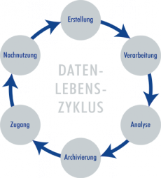

# Der Lebenszyklus von Forschungsdaten

Die Anforderungen an das Management von Forschungsdaten gehen weit über die Langzeitarchivierung, einer Kernaufgabe von IANUS, hinaus. Daher soll im Folgenden kurz auf das Konzept des Datenlebenszyklus eingegangen werden.

Forschungsdaten haben im Allgemeinen eine deutlich längere Lebensdauer als die Projekte, in denen sie entstanden sind. Auch nach Ablauf von Förderungsphasen kann es sein, dass Forscher weiterhin an den Daten arbeiten oder sie werden in Folgeprojekten weiter verarbeitet und ergänzt. Die Daten können auch von anderen Wissenschaftlern unter Berücksichtigung neuer Forschungsfragen wiederverwendet werden. Somit können aus bereits gesammelten Forschungsdaten neue Daten entstehen. Dieser Kreislauf wird mit dem sogenannten Datenlebenszyklus beschrieben.

In der gegenwärtigen Praxis ist der Datenlebenszyklus oft unterbrochen, da nur einige wenige Daten ihren Weg in eine Publikation finden. Die übrigen Daten geraten auf den lokalen Speichermedien der Forscher in Vergessenheit oder werden komplett gelöscht und stehen somit einer Nachnutzung nicht mehr zur Verfügung. Diese Tatsache gilt es für die Zukunft zu verbessern und im Idealfall vollständig zu vermeiden.

Der hier vorgestellte Datenlebenszyklus beruht auf dem des [UK Data Archive](http://data-archive.ac.uk/create-manage/life-cycle). Er beschreibt sehr vereinfacht und idealtypisch die Abfolge der einzelnen Phasen im Zyklus aus einem eher praktischen Umgang mit Forschungsdaten. Es gibt auch andere komplexere Modelle, die einen anderen Blickwinkel beschreiben, wie etwa das [Curation Lifecycle Model](https://www.dcc.ac.uk/guidance/curation-lifecycle-model/), das verschiedene Tätigkeitsfelder bei der Erhaltung und Pflege der Daten beschreibt, und das [Data Curation Continuum](http://www.dlib.org/dlib/september07/treloar/09treloar.html), das vor allem auf die technischen Bedingungen eingeht und Daten unter dem Gesichtspunkt der Nutzergruppen, von privat bis öffentlich, beschreibt.

In jeder Phase des Datenlebenszyklus gelten unterschiedliche Schwerpunkte mit ihren eigenen Implikationen, die im Folgenden umrissen werden. In dem Kapitel [Projektphasen](https://ianus-fdz.de/it-empfehlungen/projektphasen/index) werden die wichtigsten Aspekte dann ausführlich behandelt.

## Erstellung

Vor der eigentlichen Erstellung von neuen Daten muss schon die Projektplanung erfolgt und die Fragestellung formuliert sein, die maßgeblich bestimmen, wie die gesammelten und erzeugten Daten letztendlich aussehen sollen. Ein Bestandteil der Planung muss auch das [Datenmanagement](https://ianus-fdz.de/it-empfehlungen/projektphasen/datenmanagement/index) sein, um vorab festzulegen, welche Formate und Benennungsregeln verwendet werden sollen, wie die Speicherung und Sicherung der Daten und die Vernetzung von Daten und Projektmitarbeitern untereinander aussehen soll. Bereits vorhandene relevante Daten sollten lokalisiert und berücksichtigt werden.

Schon während der Erstellung der Forschungsdaten erfolgt idealerweise die Beschreibung der Daten, da diese besonders im Hinblick auf die spätere Nachnutzung für die Verständlichkeit eine elementare Rolle spielt. Beispielsweise müssen die technischen Parameter der verwendeten Aufnahmegeräte so früh wie möglich dokumentiert werden.

## Verarbeitung

Sobald die Daten erhoben wurden, können sie verarbeitet werden. Dazu gehören verschiedene Abläufe, wie etwa Digitalisierung, Übersetzung, Überprüfung, Validierung, Bereinigung und andere Verarbeitungsformen mittels Programmen. Für einige Anwendungen oder im Hinblick auf eine spätere Veröffentlichung, kann eine Anonymisierung notwendig sein. Auch gilt es festzuhalten, wie Ausgangsdaten verändert und bearbeitet wurden.

Außerdem ist die Beschreibung von Forschungsdaten ein wichtiger Aspekt für die Archivierung, um die Verständlichkeit für die spätere Nachnutzung deutlich zu erhöhen. Während der Verarbeitung von Forschungsdaten spielt die Verwaltung und Speicherung der Daten eine große Rolle, da gewährleistet werden muss, dass mit der richtigen Version gearbeitet wird und notfalls auch Sicherheitskopien zur Verfügung stehen.

## Analyse

Durch die Analyse und Interpretation der Forschungsdaten werden die Forschungsergebnisse gewonnen, die dann in Publikationen veröffentlicht werden. In der Regel sind die den neuen Erkenntnissen zugrunde liegenden Daten aber nur ein kleiner Bestandteil einer solchen Publikation. Jedoch werden alle Daten benötigt, um die Analyseergebnisse vollständig nachvollziehen zu können.

## Archivierung

Die Archivierung von Forschungsdaten beinhaltet die Auswahl und Umwandlung der einzelnen Dateien in geeignete Formate und deren Speicherung auf einem für die Archivierung geeigneten Medium. Die Erstellung und Speicherung von Backups gehört ebenfalls dazu.

Eine wesentliche Rolle bei der Archivierung spielt sowohl die strukturierte als auch die freie Beschreibung der Forschungsdaten, da diese Informationen darüber enthalten, wie und durch wen die Daten gewonnen wurden, welche Geräte dabei Verwendung fanden, wie diese konfiguriert waren und was die Daten bedeuten.

## Zugang

Da das Ziel einer Datenarchivierung immer die Nachnutzbarkeit von Inhalten ist, sollten archivierte Daten im Rahmen rechtlicher Rahmenbedingungen verbreitet und Dritten ein Zugriff auf diese gewährt werden. Den Zugriff auf die Daten kann man mit verschiedenen Zugriffsrechten steuern, die es beispielsweise nur einer eingeschränkten Gruppe von Nutzern erlauben auf die Daten zuzugreifen. Bevor die Daten zugänglich gemacht werden, sollte man dafür sorgen, dass das Urheberrecht geklärt und gekennzeichnet ist.

Durch die Zugriffsgewährung wird die Sichtbarkeit von eigenen Forschungsleistungen erhöht.

## Nachnutzung

Archivierte Daten, die zugänglich gemacht wurden, können für eigene Forschungsvorhaben kostenlos wiederverwendet und neuen Analysen unterzogen werden. Durch die Nachnutzung wird die Nachprüfbarkeit von Ergebnissen im Sinne der guten wissenschaftlichen Praxis erleichtert.
