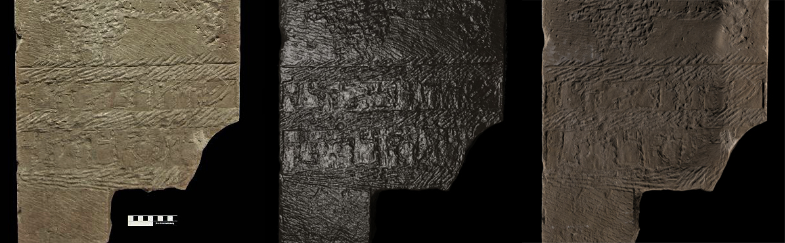
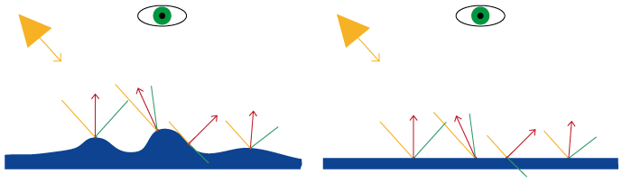
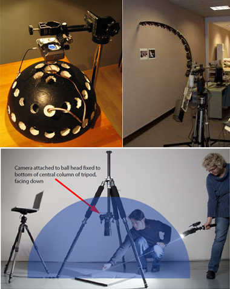

# Reflectance Transformation Imaging (RTI)

## Übersicht

Reflectance Transformation Imaging (RTI) ist eine computergestützte Fotografiermethode, mit der von einem Objekt mehrere Bilder mit fixierter Kameraposition und
variablen Beleuchtungspositionen gemacht werden. Anschließend werden die Aufnahmen vom Computer zu einem Polynomial Texture Map (PTM) zusammengerechnet. In der
resultierenden Datei kann die Position der Lichtquelle verändert werden, um beispielsweise die Oberfläche des aufgenommenen Objekts im Schräglicht untersuchen
zu können.

RTI wurde erst 2001 entwickelt und hat inzwischen eine weite Verbreitung für die Dokumentation von Objekten mit flachen Oberflächen, wie etwa Felsbilder,
Inschriften oder Münzen, gefunden, da hochauflösende Ergebnisse mit vergleichsweise günstiger Ausrüstung erzielt werden können.

### Langzeitformate

Die Aufnahmen für RTI erfolgen mit einem Fotoapparat, weshalb man es bei der Archivierung hauptsächlich mit Rastergrafiken zu tun hat. Ausführliche Hinweise zu
geeigneten Langzeitformaten sind in dem Kapitel [Rastergrafiken](/it-empfehlungen/dateiformate/rastergrafiken) zu finden.

Zusätzlich müssen die resultierenden softwareabhängigen Dateien für die Archivierung berücksichtigt werden. Die Formate für RTI wurden in den
Hewlett-Packard-Laboratories entwickelt und von Cultural Heritage Imaging (CHI) erweitert und ergänzt.

**Ausgangsformat 	Begründung**

| Status️ | Ausgangsformat | Begründung                                                                                                                                                                                                                                                         |
|---------|----------------|--------------------------------------------------------------------------------------------------------------------------------------------------------------------------------------------------------------------------------------------------------------------|
| ✔️      | DNG            | Originale Aufnahmen in RAW, sollten als DNG gespeichert werden.                                                                                                                                                                                                    |
| ✔️      | TIFF           | Originale Aufnahmen, die nicht in RAW aufgenommen wurden, sollten als TIFF gespeichert werden. Vor der Prozessierung erheblich bearbeitete Aufnahmen (z.B. Freistellung des Objektes), sollten in einem gesonderten Ordner ebenfalls als TIFF gespeichert werden.  |

**Prozessierungsformat 	Begründung**

| Status️ | Ausgangsformat | Begründung                                                                                                                                                                                                           |
|---------|----------------|----------------------------------------------------------------------------------------------------------------------------------------------------------------------------------------------------------------------|
| ✔️      | JPG            | Programme zur Erzeugung von RTI-Dateien benötigen meist JPG-Dateien. Auch die von den Programmen erzeugten Zwischenbilder werden als JPG gespeichert. Für diese Dateien ist die Archivierung im JPG-Format zulässig. |
| ✔️      | XML            | Alle Einstellungen werden in einer automatisch erzeugten XML-Datei gespeichert.                                                                                                                                      |
| ✔️      | LP             | In der textbasierten LP-Datei (light position file) werden die Positionen der Lichtquelle für jedes einzelne Bild gespeichert. Sie wird automatisch erzeugt, kann aber auch manuell erstellt werden.                 |

**Ergebnisformat 	Begründung**

| Status️ | Ausgangsformat | Begründung                                                                                                                                                                                                                    |
|---------|----------------|-------------------------------------------------------------------------------------------------------------------------------------------------------------------------------------------------------------------------------|
| ✔️      | PTM            | Das Format Polynomial Texture Map wurde in den Hewlett-Packard-Laboratories entwickelt und speichert für jedes Pixel eine Funktion, mit der die Farbwerte des Pixels in Abhängigkeit der Lichtquelle errechnet werden können. |
| ✔️      | RTI            | Das RTI-Format wurde von CHI entwickelt und bietet im Vergleich zu PTM erweiterte Funktionalitäten im *RTIViewer* von CHI.                                                                                                    |
| ✔️      | XMP            | Der *RTIViewer* von CHI erlaubt das Annotieren der Dateien, um beispielsweise besondere Bildbereiche hervorzuheben. Diese Informationen werden in einer textbasierten XMP-Datei gespeichert.                                  |

### Ordnerstruktur

Zwar kann eine PTM- oder RTI-Datei ohne zusätzliche Dateien verwendet werden, jedoch sollte für die Nachnutzbarkeit und Nachvollziehbarkeit das gesamte Datenpaket archiviert werden. Dabei sollten alle Daten nicht alle in einem einzigen Ordner, sondern in einer sinnvollen Ordnerstruktur abgelegt werden. In der folgenden Tabelle wird eine solche Struktur vorgeschlagen und auch die entsprechenden Dateitypen darin aufgelistet.

Die Benennung der Ordner ist hier als Vorschlag zu betrachten. Dabei muss berücksichtigt werden, dass einige Ordner und Dateien von der Software erzeugt werden und diese auch so belassen werden sollten, um wieder mit dem Programm geöffnet werden zu können. Die Struktur orientiert sich an den Vorgaben von Cultural Heritage Imaging (CHI) und der von dem Programm RTIBuilder erzeugten Dateistruktur.

Die gesamten Aufnahmen sollten in einem übergeordneten Verzeichnis mit dem Projektnamen gespeichert werden. Für jedes aufgenommene Objekt muss ein eigener Unterordner angelegt werden, der idealerweise eine eindeutige Bezeichnung des Objektes, wie etwa die Inventarnummer, in der Benennung enthält. In dem übergeordneten Verzeichnis können Dokumentationsdateien abgelegt werden.

```
📁 Projekt RTI-Aufnahmen
  📄 dokumentation
  📁 Inventarnummer 001
  📁 Inventarnummer 002
    📄 .xml
    📁 original-captures
      📄 .dng / .tiff
    📁 edited-captures
      📄 .tiff
    📁 jpeg-exports
      📄 .jpg
    📁 cropped-files
      📄 .jpg
    📁 assembly-files
      📄 .jpg
      📄 .lp 
    📁 finished-files
      📄 .ptm
      📄 .rti
      📄 .xmp
    📁 Inventarnummer 003
```

In dem übergeordneten Verzeichnis sind alle Aufnahmen enthalten. Außerdem können hier auch Dokumentationsdateien abgelegt werden. Pro Aufnahme entsteht ein Ordner. Neben den verschiedenen Unterordnern enthält dieser auch eine Projektdatei im XML-Format.

`original-captures` enthält die unveränderten Originalaufnahmen im DNG- oder TIFF-Format.

`edited-captures` (optional) enthält überarbeitete Aufnahmen im TIFF-Format.

`jpeg-exports` enthält die Bilder, aus denen das Ergebnis erzeugt wird. Die JPG-Bilder werden entweder aus den Dateien in 'original-captures' oder in 'edited-captures' erzeugt.

`cropped-files` wird automatisch erzeugt. Er enthält JPG-Dateien, die bei der Verwendung der Zuschnittsfunktion als Zwischenergebnis gespeichert werden.

`assembly-files` wird automatisch erzeugt. Er enthält JPG-Dateien, welche die Ausleuchtung des Objektes repräsentieren und eine LP-Datei, in der die Position der Lichtquellen gespeichert werden.

`finished-files` wird automatisch erzeugt und enthält die resultierenden RTIs und PTMs. Werden die Dateien im RTIViewer annotiert, entstehen zusätzlich XMP-Dateien.

### Dokumentation

Neben den allgemeinen minimalen Angaben zu Einzeldateien, wie sie in dem Abschnitt [Metadaten in der Anwendung](/it-empfehlungen/projektphasen/dokumentation/metadaten-in-der-anwendung) beschrieben sind, erfordern RTI-Daten Angaben, die Aufschluss über die Aufnahmemethode, deren Umstände und über die Prozessierung der Daten geben. Zusätzlich können weitere Angaben zu dem Projekt als ganzes notwendig sein, um etwa genauere Angaben zu den aufgenommenen Objekten zu machen. Hinweise hierfür sind ebenfalls in dem Abschnitt [Metadaten in der Anwendung](/it-empfehlungen/projektphasen/dokumentation/metadaten-in-der-anwendung) beschrieben.

Speziell für die freihändige RTI-Aufnahme mittels Highlight-RTI gibt es von Cultural Heritage Imaging einen Shooting-Log, der in angepasster Form auch für andere Aufnahmemethoden verwendet werden kann. Eine Vorlage hierfür wird online in den IT-Empfehlungen zur Verfügung gestellt. Es empfiehlt sich diese Übersicht schon während der Aufnahme der einzelnen Objekte auszufüllen.

| Metadatum                 | Beschreibung                                                                                                                                                                                               |
|---------------------------|------------------------------------------------------------------------------------------------------------------------------------------------------------------------------------------------------------|
| Kamera und Objektiv       | Modell und Name der verwendeten Kamera sowie Details zum verwendeten Objektiv.                                                                                                                             |
| Kamerafilter              | Auflistung aller für die Aufnahme verwendeten Filter, wie etwa Graufilter oder Infrarotfilter.                                                                                                             |
| Aufnahmemethode           | Angabe der Methode, die für die RTI-Aufnahme verwendet wurde. Beispielsweise feste Kuppel oder Highlight-RTI (H-RTI).                                                                                      |
| Radius oder Schnurlänge   | Radius der verwendeten Kuppel oder des Armes. Wenn H-RTI angewandt wurde, muss die Länge der Schnur angegeben werden. Die Angabe erfolgt in cm.                                                            |
| Größe der Sphäre          | Durchmesser in cm oder mm der verwendeten Sphäre, wenn H-RTI angewandt wurde.                                                                                                                              |
| Lichtquelle               | Anzahl und Typ der Lichtquelle, sowie deren Einstellungen. Beispielsweise Canon Speedlite 580 EX II, 1/4 Leistung.                                                                                         |
| Projektordner             | Name des Verzeichnisses in dem alle Aufnahmeordner gespeichert werden.                                                                                                                                     |
| Verzeichnisname           | Der Name des Verzeichnisses in dem die originalen Aufnahmen, prozessierten Bilder und Ergebnisdateien liegen.                                                                                              |
| Objektbezeichnung         | Eindeutige Bezeichnung des Objektes, wie beispielsweise die Inventar- oder Fundnummer.                                                                                                                     |
| Beschreibung              | Kurze Beschreibung des Objektes.                                                                                                                                                                           |
| Farbkarte                 | Wenn eine Farbkarte verwendet wurde, soll angegeben werden, ob sie in jedem Bild vorhanden ist oder nur in einem separaten Bild. Wenn ein Farbprofil verwendet wurde, kann dieses hier angegeben werden.   |
| Testbilder                | Angabe der Dateinamen aller nicht für die Erstellung der RTI-Datei verwendeten Bilder, die jedoch weiterhin beibehalten werden, wie beispielsweise das Bild mit der Farbkarte.                             |
| Aufnahmeteam              | Vor- und Nachnamen der Personen, die an der Aufnahme beteiligt waren.                                                                                                                                      |
| Rechte                    | Lizenz der Aufnahme, z.B. CC-BY 3.0                                                                                                                                                                        |
| Notizen                   | Weitere Angaben zum Aufnahmeaufbau und besonderen Vorkommnissen.                                                                                                                                           |
| Software                  | Name und Version der zur Erzeugung der RTI-Daten verwendeten Software, beispielsweise RTIBuilder Version 2.0.2.                                                                                            |
| Anzahl der Bilder         | Zahl der für das finale RTI verwendeten Bilder.                                                                                                                                                            |
| Weitere Dateien           | Liste weiterer Dateien, wie beispielsweise des Shooting-Logs oder Dokumentation der verwendeten Software.                                                                                                  |

## Vertiefung

Reflection Transformation Imaging (RTI) erzeugt Polynomial Texture Maps (PTMs), in denen für jedes Pixel Informationen über die Reflexionseigenschaften der Oberfläche gespeichert werden. Die erzeugten interaktiven Dateien werden aus einer Vielzahl von Bildern errechnet, wobei in jedem Bild die Kameraposition unverändert ist, während die Richtung, aus der das Licht kommt, jeweils wechselt.

Mit speziellen Viewer-Programmen können die Daten angesehen werden und die aufgenommenen Objekte interaktiv aus jeder Richtung beleuchtet werden. Da es sich aber nicht um eine 3D-Datei handelt, können die Objekte nicht bewegt werden. Jedoch bieten die Programme zusätzlich unterschiedliche Algorithmen, um bestimmte Oberflächeneigenschaften, wie Kanten oder Risse, optisch hervorzuheben, die unter natürlichen Bedingungen nicht oder nur schwer erkennbar sind.

Für die Erstellung von RTI-Daten können unterschiedliche Aufnahmemethoden verwendet werden, die unterschiedliche Ausrüstung voraussetzen, wobei das Grundprinzip dahinter jeweils immer das gleiche ist.


*Ausschnitt der Rückseite der Grabstele TA 1029 mit reichsaramäischer Inschrift des Verstorbenen (Tayma, Saudi-Arabien). Links ein Foto. In der Mitte der gleiche Ausschnitt als RTI mit 'Specular Enhancement', rechts mit 'Static Multi Light'. (Foto: Mirco Cusin; RTI: Martina Trognitz, Max Haibt; DAI-Orient-Abteilung)*

### Polynomial Texture Map

Ein Polynomial Texture Map (PTM) ist eine Repräsentationsform von Bildern mit Hilfe von Funktionen, statt einzelner Farbwerte. Im Gegensatz zu Rastergrafiken werden für die einzelnen Pixel von PTMs nicht nur feste Farbwerte gespeichert, sondern zusätzlich eine Funktion, die mit Hilfe der Parameter lu und lv die Leuchtdichte der Oberfläche berechnet. Die Leuchtdichte bestimmt wie das menschliche Auge eine Oberfläche wahrnimmt, also ob sie besonders hell, dunkel, spiegelnd oder matt erscheint.

Die Parameter lu und lv spezifizieren, wo sich eine punktförmige Lichtquelle befindet. Wird die Lichtquelle bewegt, ändern sich die Parameter und somit auch der errechnete Farbwert für den jeweiligen Pixel. Somit kann ein PTM simulieren, wie ein Objekt bei wechselnder Beleuchtungsrichtung aussieht.

Ganz vereinfacht lässt sich das Prinzip hinter RTI in der untenstehenden Abbildung visualisieren. Für jeden Punkt einer dreidimensionalen Oberfläche kann eine Normale bestimmt werden. An dieser Normale wird einfallendes Licht im gleichen Winkel reflektiert (Reflexionsgesetz). Da die Kamera sich in einer festen Position befindet, die Richtung aus der das Licht kommt ebenfalls bekannt ist und es einen Bilderstapel mit unterschiedlichen Lichtpositionen gibt, kann für jeden Bildpunkt eine Oberflächennormale berechnet werden. Wird die fertige RTI-Datei betrachtet und die Beleuchtung geändert, können die angezeigten Farbwerte der einzelnen Punkte anhand des gespeicherten Farbwertes, der errechneten Normalen und dem Einfallswinkel berechnet und ausgegeben werden.


*Rechts sind auf einer dreidimensionalen Oberfläche für vier Punkte die Normalen (rot) eingezeichnet, an denen einfallendes Licht (gelb) reflektiert wird (grün). Links ist diese Obefläche als PTM dargestellt, in dem für die Punkte jeweils die Oberflächennormalen gespeichert sind. So entsteht ein optischer 3D-Effekt, der an sich aber nicht in der Datei hinterlegt ist.*

### Aufnahmemethoden

Das Grundprinzip für RTI-Aufnahmen besteht in der immer gleich bleibenden Position der Kamera in Bezug auf das Objekt und der wechselnden Position der Lichtquelle. Bei der Lichtquelle muss der Abstand zu dem Objekt immer der gleiche sein, um eine konstante Lichtintensität zu gewährleisten, und zusammen betrachtet sollten die jeweiligen Positionen so gewählt werden, dass sie gleichmäßig um das Objekt herum verteilt sind. Für die Positionierung der Lichtquellen wurden unterschiedliche Methoden und Ausrüstungsteile entwickelt, die in der nebenstehenden Abbildung zusammengefasst dargestellt sind.

Bei der Aufnahme mit einer Kuppel (engl. dome) wird eine Kuppel so über das Objekt platziert, dass dieses in der Mitte liegt. Die Kamera wird ebenfalls mittig der Kuppel direkt über dem Objekt platziert. An der Kuppel können mehrere Lichtquellen, wie etwa LEDs befestigt sein, wobei bei jedem Bild jeweils nur eine eingeschaltet wird. Es gibt auch Kuppeln, die statt fest eingebauter Lichtquellen nur Markierungen für eine manuelle Platzierung der Lichtquelle haben. Die Position der Lichtquellen ergeben sich aus den Abmessungen der Kuppel und müssen in dem Programm eingetragen werden.


*Oben links eine einfache Kuppel für RTI-Aufnahmen. Rechts daneben ein gebogener Arm, der um das Objekt rotiert werden kann. Unten ist in den Aufbau von CHI eine imaginäre Kuppel projiziert. (Hewlett-Packard-Laboratories und CHI)*

Eine vereinfachte Form der Kuppel sind gebogene Arme, mit daran befestigten Lichtquellen, wie etwa externe Blitzgeräte. Dieser Arm kann um das Objekt herum rotiert werden, so dass am Ende der Aufnahme eine kuppelförmige Verteilung der Lichter erzielt wird. Auch hier kann die Position der Lichtquellen aus den Abmessungen des Armes und dem Rotationswinkel berechnet werden.

Eine sehr flexible Methode, Highlight-RTI, wurde von Cultural Heritage Imaging entwickelt. Hierfür wird nur ein Blitzgerät (oder eine andere Lichtquelle) benötigt, an dem eine Schnur befestigt wird, mit deren Hilfe man das Gerät so ausrichten kann, dass der Abstand immer gleich ist und das Licht auch direkt auf das Objekt gerichtet ist. Auf diese Weise kann man sich an einer imaginären Kuppel entlang orientieren. Um die Position der Lichtquelle errechnen zu können, wird neben das Objekt eine schwarz glänzende Kugel platziert, die auch auf jedem Bild zu sehen sein muss. Aus den Reflexionspunkten des Lichtes an der Kugel kann das Programm dann die Richtung, aus der das Licht kommt, berechnen.

## Praxis

In diesem Abschnitt werden Programme vorgestellt, mit denen RTI-Daten erstellt und betrachtet werden können.

### Erstellung von RTI-Daten

Für die Aufnahme und Erstellung von RTI-Daten gibt es zwei frei verfügbare Programme. Das eine ist das *PTM Fitter Programm*, welches an den Hewlett-Packard-Laboratories entwickelt wurde und zugleich auch das erste Programm ist, dass diese Art von Daten erstellen konnte. Es kann auf allen gängigen Betriebssystemen verwendet werden. Das zweite Programm, *RTIBuilder*, stammt von CHI und ist für Windows und Mac verfügbar. CHI stellt weitere Materialien zur Erstellung von RTI-Daten zur Verfügung und deren Webangebot dient als zentrale Anlaufstelle für alles rund um RTI. Sie bieten ebenfalls ein Forum für aktive Anwender an.

- RTIBuilder: http://culturalheritageimaging.org/What_We_Offer/Downloads/Process/index.html
- Weiteres Material von CHI: http://culturalheritageimaging.org/What_We_Offer/Downloads/
- PTM Fitter Program <!-- http://www.hpl.hp.com/research/ptm/downloads/download.html Seite existiert nicht mehr -->

### Ansicht von RTI-Daten

RTI-Daten können nur mit speziellen Viewer-Programmen betrachtet werden. Von den Hewlett-Packard-Laboratories gibt es die frei verfügbare *PTM Viewer Application*, die auf Windows, Mac und Linux verwendet werden kann. Das Team von CHI bietet den *RTIViewer* an, der ebenfalls frei verfügbar ist und auf Windows und Mac läuft. Er bietet erweiterte Funktionalitäten, wie beispielsweise die Annotation von Dateien.

Für eine Präsentation der Daten auf Webseiten kann der *WebRTIViewer* empfohlen werden, der an dem Visual Computing Laboratory von CNR-ISTI in Pisa entwickelt wurde.

- PTM Viewer Application <!-- http://www.hpl.hp.com/research/ptm/downloads/download.html Seite existiert nicht mehr --> 
- RTIViewer: http://culturalheritageimaging.org/What_We_Offer/Downloads/View/index.html
- WebRTIViewer: http://vcg.isti.cnr.it/rti/webviewer.php

## Quellen

Cultural Heritage Imaging:  
http://culturalheritageimaging.org/

Hewlett-Packard-Laboratories, PTM 
<!-- http://www.hpl.hp.com/research/ptm/ Seite existiert nicht mehr -->  

S. Duffy -- P. Bryan -- G. Earl -- G. Beale -- H. Pagi -- E. Kotouala, Multi-light Imaging for Heritage Applications (2013)  
https://www.historicengland.org.uk/images-books/publications/multi-light-imaging-heritage-applications/

T. Malzbender -- D. Gelb -- H. Wolters, Polynomial Texture Maps, in: Proceedings of ACM Siggraph 2001 (2001)  
DOI: https://doi.org/10.1145/383259.383320

### Formatspezifikationen

- PTM <!-- http://www.hpl.hp.com/research/ptm/downloads/PtmFormat12.pdf Seite existiert nicht mehr -->
- RTI: http://forums.culturalheritageimaging.org/index.php?app=core&module=attach&section=attach&attach_id=81

### Tools und Programme

- RTIBuilder: http://culturalheritageimaging.org/What_We_Offer/Downloads/Process/index.html
- Weiteres Material von CHI: http://culturalheritageimaging.org/What_We_Offer/Downloads/
- PTM Fitter Program <!-- http://www.hpl.hp.com/research/ptm/downloads/download.html Seite existiert nicht mehr -->
- PTM Viewer Application <!-- http://www.hpl.hp.com/research/ptm/downloads/download.html Seite existiert nicht mehr -->
- RTIViewer: http://culturalheritageimaging.org/What_We_Offer/Downloads/View/index.html
- WebRTIViewer: http://vcg.isti.cnr.it/rti/webviewer.php
