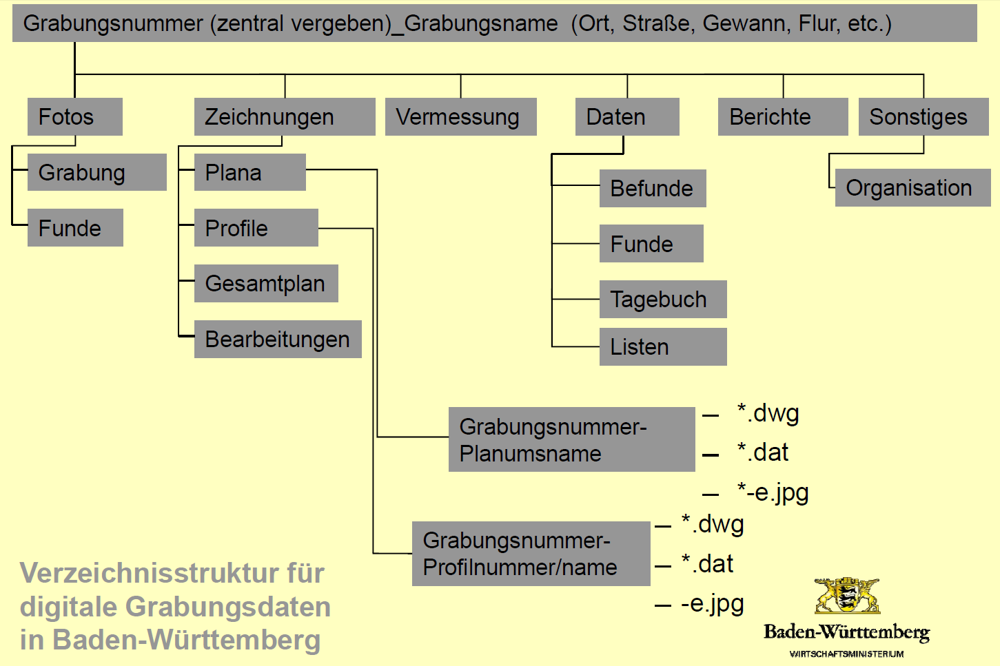

# Empfehlungen für eine Ordnerstruktur

Die Organisation der Ordnerstruktur kann sich anhand der angewandten Prozesse oder an den Ergebnissen orientieren. Im ersten Fall bildet die Struktur zeitliche und methodische Prozesse der Daten ab, was zu einer besseren Nachvollziehbarkeit der Arbeitsschritte führt. Im zweiten Fall orientiert sich die Ordnerstruktur an den fachlichen Ergebnissen, was die inhaltliche Nachvollziehbarkeit verbessert.

Bei der Planung einer Ordnerstruktur spielen weitere Kriterien eine Rolle. Abhängig von dem Umfang und der Dauer des Projektes, kann sich die Ordnerstruktur beispielsweise am Thema, dem Material, dem Jahr, dem Bearbeiter oder den einzelnen Arbeitsschritten orientieren. Dabei sollte beachtet werden, dass die Dateiablage nicht zu verzweigt ist, da die maximale Pfadlänge, die sich aus allen enthaltenden Ordnernamen und dem Dateinamen zusammensetzt, in Windows auf 260 Zeichen begrenzt ist.

Ganz allgemein kann die oberste Hierarchie der Dateiablage nach folgenden Kriterien unterteilt werden:

- Ort
- Fundplatz, Monumente oder Denkmäler
- Aktivität
- Projekt

Für weitere Hierarchieebenen können folgende Kriterien berücksichtigt werden:

- Verfahren, wie Prospektion, Voruntersuchung oder Hauptuntersuchung
- Arbeitsschritte mit Bezug auf Zeit, Typ und Kennung
- Fachliche Inahlte, wie Befunde, Funde, Proben, Bauwerke, Berichte oder Tagebuch
- Methodik, wie Vermessung, Foto, Zeichnung oder Photogrammetrie
- Räumliche Spezifizierung, wie Planum, Schnitt oder Surveyfläche
- Administration

Zusätzlich sollte eine Unterscheidung zwischen originalen Daten (Rohdaten), sekundären und finalen Daten erfolgen, um Prozesse transparent abzubilden. Dies ist auch für die zu archivierenden Daten relevant, da bei der Auswahl der Daten überholte oder temporäre Dateien und Dubletten in der Regel nicht berücksichtigt werden.

Anwendungsgebiete mit mehreren voneinander abhängigen Dateikomplexen, wie zum Beispiel 3D-Scanning oder RTI-Fotografie, erfordern eigene Dateiablagen. Diese werden in den entsprechenden Abschnitten im Kapitel [Forschungsmethoden](https://www.ianus-fdz.de/it-empfehlungen/forschungsmethoden) beschrieben.

## Praxisbeispiele

In diesem Abschnitt werden drei Beispiele für Dateiablagen vorgestellt, die aus Baden-Württemberg, Hamburg und Österreich stammen. Das Landesdenkmalamt von Baden-Württemberg verwendet eine Dateiablage, die an der analogen Ordnerstruktur einer Grabung orientiert ist. Sie wird in der folgenden Abbildung veranschaulicht.

_"Diese Struktur ist in den oberen Ebenen rigide genug, um für Ordnung und Datendisziplin zu sorgen und gleichzeitig weiter unten flexibel genug, um den unausweichlichen Eigenarten der einzelnen Archäologen Rechnung tragen zu können._

_Die Grabungs- oder Vorgangsnummer, die zentral vergeben wird, ist wichtig. Sie beschreibt nicht nur die Ausgrabung, sie ist auch die Inventar-Stammnummer aller Funde, die auf dieser Grabung gefunden werden. Insofern ist sie die Schnittstelle zum zentralen Fundarchiv des Archäologischen Landesmuseums. Die Ausgräber werden aber nicht allein gelassen. Mit der Datenstruktur werden Anleitungen geliefert, die beschreiben, was wohin gehört. Damit wird tatsächlich eine gewisse Einheit im Land erreicht." \[aus: D. Bibby, Digitale Datenstruktur auf Ausgrabungen und Archivierung digitaler Grabungsdaten. Praxis und Praxisversuche aus Baden-Württemberg, ANachr 14 2009, 159-163.\]_

Auch die nachträgliche Strukturierung von bereits vorhandenen digitalen Dateiablagen ist relativ einfach, da Klartextinhaltsverzeichnisse in der obersten Ebene des Verzeichnisses abgelegt werden können, welche die Eigenheiten der Grabung und die strukturellen Abweichungen beschreiben.

Der Aktenplan des Archäologischen Museums Hamburg wurde für ein analoges Projektarchiv entwickelt, lässt sich jedoch mit wenigen Anpassungen auch gut auf eine digitale Dateiablage anwenden.

**Aktenplan des Archäologischen Museums Hamburg**

|||
|---|---|
|Datenträger (nur analog) ||
|Berichte ||
| &nbsp; |  Grabungsbericht |
| &nbsp; |  Zwischenberichte |
| &nbsp; |  Anlagen Zwischenberichte |
|  Vermessung ||
| &nbsp; |  Vermessungspläne |
| &nbsp; |  Vermessungsunterlagen |
| &nbsp; |  Vermessungsprotokolle |
|  Grabungsplänge ||
| &nbsp; |  Zeichnungsliste |
| &nbsp; |  Übersichtpläne |
| &nbsp; |  Einzelpläne |
| &nbsp; |  Arbeitspläne |
| &nbsp; |  Handzeichnungen und Skizzen |
|  Tagebuch ||
| &nbsp; |  Tagebuchausdruck (oder digitale Datei) |
| &nbsp; |  Notizen |
|  Befunddokumentation ||
| &nbsp; |  Befundliste |
| &nbsp; |  Befundkatalog |
| &nbsp; |  Notizen |
|  Funddokumentation ||
| &nbsp; |  Fundliste |
| &nbsp; |  Inventarliste |
| &nbsp; |  Schriftwechsel |
|  Probendokumentation ||
| &nbsp; |  Probenliste |
| &nbsp; |  Schriftwechsel |
|  Fotodokumentation ||
| &nbsp; |  Fotoliste |
| &nbsp; |  Miniaturausdruck (oder originale Dateien) |
|  Dokumente ||
| &nbsp; |  Pläne |
| &nbsp; |  Dokumente und Texte |
| &nbsp; |  Schriftwechsel |
| &nbsp; |  Pressespiegel |

Das Bundesdenkmalamt in Österreich hat in seinen Richtlinien eine verpflichtende Ordnerstruktur veröffentlicht, die in einem übergeordneten Ordner mit der Kennung und Benennung der Maßnahme abgelegt wird. Bemerkenswert an dieser Ordnerstruktur ist die sehr flache Hierarchie ohne verschachtelte Ordner, die ein Hinzufügen weiterer benötigter Ordner in der gleichen Ebene zulässt.

Für die Dateien 01-03 sind in den Richtlinien detaillierte Angaben über den erwarteten Inhalt zu finden. Dies gilt in etwas geringerem Umfang für die übrigen Ordner.

**Ordnerstruktur des Bundesdenkmalamtes Österreich**

| | |
|---|---|
|  01 Deckblatt |
|  02 Bericht - Teil A |
|  03 Bericht - Teil B |
|  04 Technische Daten |
|  05 SE-Liste (Liste der Stratigrafischen Einheiten) |
|  06 SE-Protokollblätter |
|  07 Objektlisten |
|  08 Objektgruppenlisten (fakultativ) |
|  09 Planliste |
|  10 Fundliste |
|  11 Grabungs- bzw. Prospektionsprotokoll |
|  12 Vermessungsunterlagen |
|  13 Originalmessdaten und/oder Metadaten Prospektion |
|  14 Maßnahmenpolygon |
|  15 Technischer Gesamtplan |
|  16 Detailpläne |
|  17 Fotodokumentation |
|  18 Matrix |
|  19 Konservatorische Maßnahmen |
|  20 Sonstige Daten |
