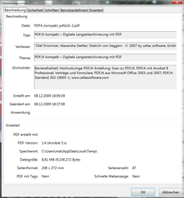

# Speicherung von Metadaten

Für eine strukturierte Speicherung von Metadaten gibt es verschiedene Möglichkeiten und Wege, die einerseits von dem Zeitpunkt (synchron mit der Datenerhebung oder im Nachhinein) und andererseits von der Art der Metadatenerfassung (manuell oder automatisiert) abhängen.

Grundsätzlich sollten Metadaten so früh wie möglich, also bereits bei der Generierung von neuen digitalen Objekten oder am Anfang eines neuen Forschungsvorhabens vergeben werden, auch wenn diese noch nicht vollständig angegeben werden können. Somit wird vermieden, dass Informationen im Nachhinein nicht mehr nachgetragen werden können, da sie vergessen wurden oder sich nicht mehr ermitteln lassen. Eine regelmäßige Aktualisierung und kontinuierliche Metadatenpflege ist ratsam und für manche Daten, wie etwa 3D-Scans oder Geodaten auch erforderlich.

Abhängig vom verwendeten Dateiformat können Metadaten auch direkt in eine Datei integriert werden. Dies kann teilweise automatisiert erfolgen, wie beispielsweise bei digitalen Fotos. Hier werden von der Kamera automatisch technische Angaben zu Dateiformat, Verschlusszeit, Blendenöffnung, Farbinformationen usw. direkt in der Bilddatei hinterlegt. Je nach Gerät können über die Voreinstellungen auch deskriptive Informationen wie Fotograf, Aufnahmedatum, Land etc. hinzugefügt werden. Ähnliche Verfahren zur automatischen Metadatenerzeugung sind auch bei Vermessungsgeräten üblich. Die durch Geräte generierten Metadaten werden unmittelbar in einem besonderen Bereich und auf standardisierte Weise in der resultierenden Datei gespeichert, etwa bei Fotos im Format Exif im Header der Datei.

Mit Hilfe von editierbaren Dateieigenschaften können auch in anderen Dateiformaten, wie etwa DOCX, ODT oder PDF, Metadaten direkt im Header gespeichert werden. Dabei ist jedoch eine manuelle Eingabe mit Hilfe der passenden Software erforderlich. Diese Informationen können über die Eigenschaften einer Datei angezeigt und teilweise verändert und ergänzt werden, was in der nebenstehenden Abbildung für ein PDF-Dokument zu sehen ist. Bei der Auswahl von Anwendungen sollte darauf geachtet werden, ob diese spezifischen Metadaten entweder als separate Datei exportiert oder ob sie mit den Dateien, in denen sie enthalten sind, auch unabhängig von der ursprünglichen Software geöffnet werden können.

Beispiel der Metadaten eines PDF-Dokumentes im Programm Adobe Reader. Die Metadaten können unter "Datei > Eigenschaften" angezeigt und verändert werden.

Bei textbasierten (insbesondere XML-basierten) Dateiformaten oder Textdateien, die Auszeichnungssprachen verwenden (wie etwa SVG-, HTML- oder XML-Dateien), können Metadaten leicht mittels Auszeichnungselementen im Header der Datei integriert werden. Konkrete Hinweise für die Bearbeitung und Ergänzung von Metadaten für bestimmte Dateiformate sind in den entsprechenden Abschnitten im Kapitel [Dateiformate](https://www.ianus-fdz.de/it-empfehlungen/dateiformate) zu finden. Auch Hinweise für die Extraktion von Metadaten in separate Dateien sind ebenfalls in den entsprechenden Abschnitten zu finden.

Für Dateiformate, in denen kein eigener Metadatenbereich vorgesehen ist, oder für übergeordnete projekt- und methodenbezogene Metadaten, ist eine Speicherung in separaten Dateien oder Systemen erforderlich. Hierfür eignen sich Tabellen und Datenbanken, da diese die Erfassung mithilfe spezifischer Eingabemasken, einer gezielten Suche und einer strukturierten Sicherung von Metadaten erleichtern. Zusätzlich erlauben sie eine (Teil-)Automatisierung der Metadaten, wie etwa die automatische Speicherung des Datums der letzten Bearbeitung eines Datensatzes und den Namen des Bearbeiters. Ein weiterer Vorteil der Erfassung von Metadaten in Tabellen oder Datenbanken besteht in der effizienten Bearbeitung von Merkmalen, die für mehrere Dokumente identisch sind, wie beispielsweise der gleiche Maßstab für alle Zeichnungen eines Projektes.

Bei der Speicherung von Metadaten in separaten Dateien muss in besonderer Weise darauf geachtet werden, dass die Beziehungen zwischen beiden Einheiten eindeutig und aktuell sind. Wird etwa bei den Metadaten der Name einer Datei zur Identifizierung verwendet, muss sichergestellt werden, dass dieser einmalig ist (ggf. in Kombination mit seinem Speicherort) und dass im Falle der Umbenennung der Datei der Eintrag auch bei den Metadaten aktualisiert wird.

Die Erfassung von Metadaten in einer Freitextdatei sollte vermieden werden, da diese meist nicht automatisiert durch Computer überprüft und verarbeitet werden können.

Bei Dokumenten mit Textinhalt können beschreibende Metadaten auch automatisch erzeugt werden, indem nach charakteristischen Zeichenketten gesucht wird und Schlag- und Stichworte extrahiert werden. Allerdings reicht die Qualität einer automatischen Erschließung bislang nicht an eine manuelle und intellektuelle Metadatenvergabe heran, da maschinell nicht nur sinnvolle Deskriptoren herausgefiltert werden.

Für die Übergabe von Dateien und Metadaten an ein Langzeitarchiv gilt die Empfehlung, die Metadaten sowohl in den Originaldateien selbst als auch in einem separaten, strukturierten und textbasierten Dokument vorzuhalten: in den Originaldateien selbst, um keine verwaisten, also undokumentierten Werke zu erzeugen, und als separate Textdatei, um eine automatisierte Verarbeitung und den Austausch von Referenzangaben zu vereinfachen.
