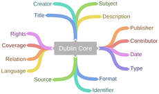
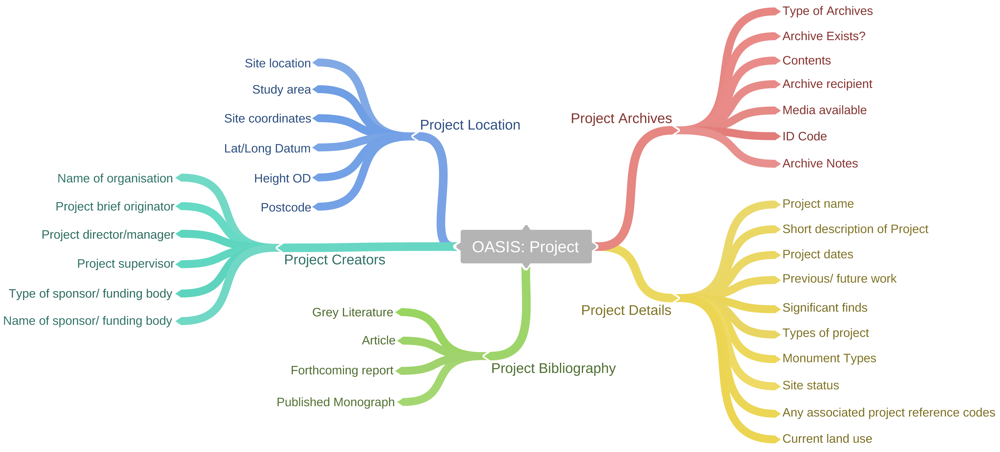
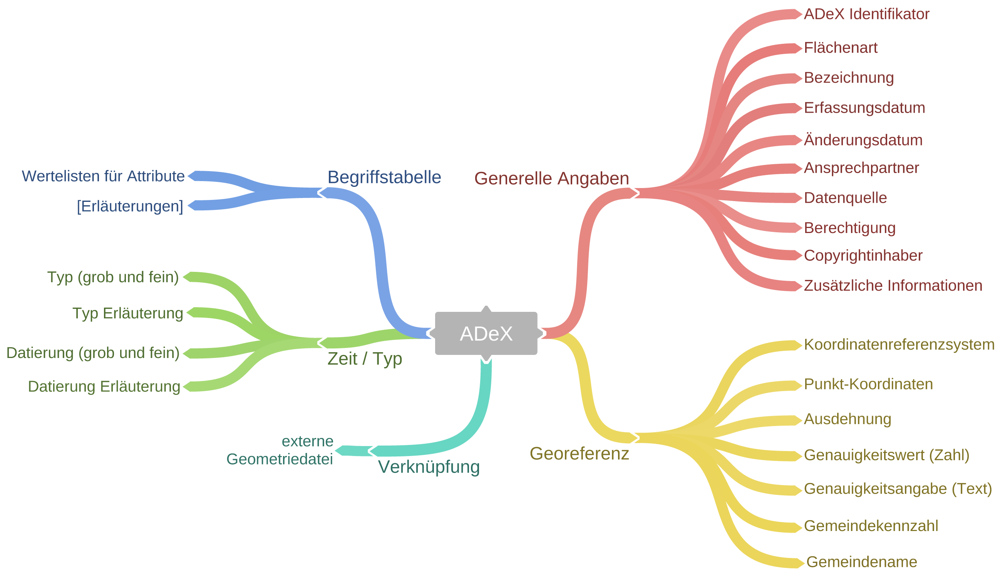
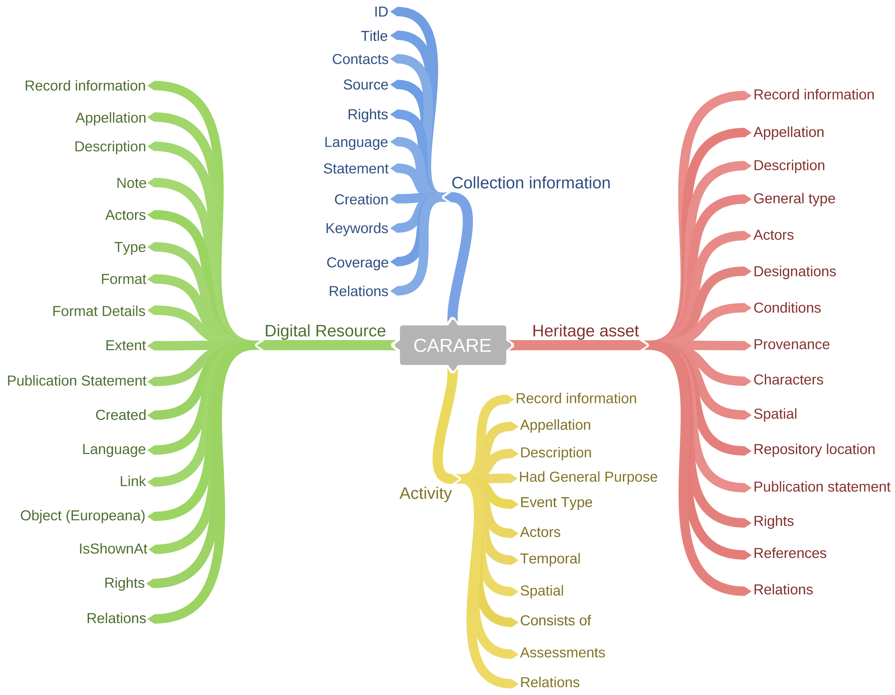
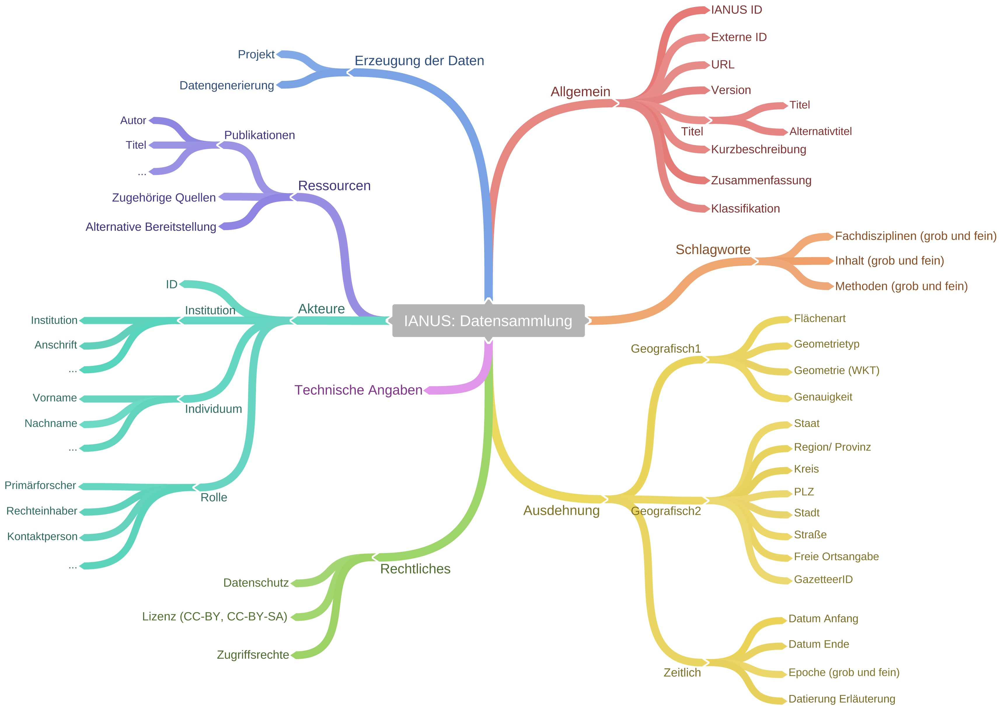

# Strukturierung von Metadaten

Die Struktur und der Umfang von Metadaten sind wesentliche Faktoren, um diese sinnvoll nutzen zu können. Die Art und Weise, wie die verschiedenen Informationen erfasst und organisiert werden, spielen dabei eine zentrale Rolle, ob sie von einer unbeteiligten dritten Person richtig verstanden werden und ob die Angaben automatisiert verarbeitet werden können.

Um die Struktur und den Umfang von Metadaten verbindlich zu beschreiben und vorzugeben, werden Metadatenschemata verwendet. Ein Metadatenschema gibt den Inhalt und die Gliederung von Metadaten vor, also die zu verwendenden Metadaten-Kategorien. Beispielsweise kann eine Publikation mit den Attributen Autor - Jahr - Titel - Reihe - Verlag - Erscheinungsort und Schlagworte beschrieben werden, die dann mit den entsprechenden Informationen gefüllt werden. Diese Minimalbeschreibung kann je nach Anforderungen erweitert werden, etwa um die Elemente Sprache - Seitenzahl - Abbildungszahl - Auflage und ISBN-Nummer.

In einem Metadatenschema wird zudem für einzelne Informationen die Genauigkeit (die Granularität) der erwarteten Information festgelegt, also ob beispielsweise für das Attribut "Autor" eine freie Texteingabe ausreichend ist oder ob eine Aufteilung in die Teilattribute Anrede - Titel - Vorname(n) und Nachname sowie eine Referenz zu einer Personennormdatei erforderlich ist.

Für den Austausch von Metadaten zwischen verschiedenen technischen Systemen besitzen die zugrunde liegenden Schemata eine zentrale Bedeutung. Sollen Informationen aus unterschiedlichen Quellen miteinander in Beziehung gesetzt werden, so dass sie gemeinsam ausgewertet werden können, müssen die jeweils eingetragenen Werte auf der Ebene ihrer semantischen Bedeutung miteinander verknüpft und abgeglichen werden. Das heißt, dass neben dem eigentlichen Wert (z. B. die Zeichenkette "Pompeji") auch das Attribut angegeben werden muss, also die Eigenschaft, die durch den Wert beschrieben wird (z. B. "Fundort", "Aufbewahrungsort" oder "Publikationsort").

Für viele Bereiche, wie etwa Medienarchive, Bibliotheken oder Museen, gibt es langjährige Erfahrungen im Umgang mit Metadaten und es wurden spezifische Metadatenschemata entwickelt. Zu Beginn eines Projektes sollte geprüft werden, ob relevante Metadatenschemata bereits existieren oder sogar vorgegeben werden und bei der Erzeugung von eigenen Metadaten berücksichtigt werden sollten. Je internationaler und standardisierter ein verwendetes Schema ist, desto eher ist die Austauschbarkeit von Metadaten mit anderen Systemen gewährleistet. Sofern sich unterschiedliche Metadaten auf ein gemeinsames Metadatenschema abbilden (_mappen_) lassen, können sie in ein drittes System importiert und dort gemeinsam geöffnet werden.

Die 15 Kernfelder von **Dublin Core** Version 1.1. (Grafik erstellt mit coggle.it.)

Für deskriptive Metadaten ist das unter ISO 15836 zertifizierte Metadatenschema **Dublin Core** (in der nebenstehenden Abbildung) am weitesten verbreitet. Es verfügt in der Version 1.1 über folgende 15 Kernfelder: _Title_ (Titel) - _Creator_ (Ersteller) - _Subject_ (Thema) - _Description_ (Beschreibung) - _Publisher_ (Verleger) - _Contributor_ (Mitwirkender) - _Date_ (Datum) - _Type_ (Typ) - _Format_ (Format) - _Identifier_ (Identifikator) - _Source_ (Quelle) - _Language_ (Sprache) - _Relation_ (Beziehung) - _Coverage_ (Umfang) - _Rights_ (Rechte).

Im Laufe der Jahre wurde dieses grundlegende Set noch erweitert. Das aktuelle Set, "_The **Dublin Core** Metadata Initiative (DCMI) Metadata Terms_", und die Beschreibung der einzelnen Attribute kann [online](http://dublincore.org/documents/dcmi-terms/) abgerufen werden.

Eine besondere Relevanz im archäologischen und altertumswissenschaftlichen Kontext haben folgende Standards erlangt:

- Online AccesS to the Index of archaeological investigationS (**OASIS**), veröffentlicht von English Heritage. Es wurde für den Nachweis von archäologischen Projekten und Maßnahmen in Großbritannien entwickelt. Das Schema liegt aktuell in Version 1.3 vor. Neben den in der untenstehenden Abbildung dargestellten fünf Themenbereichen können auch weitere spezielle Angaben wie etwa zu Arealen, Geophysik, Geologie und Artefakten gemacht werden.  

**OASIS** in Version 1.3. Neben den abgebildeten Themenbereichen sind auch Attribute für weitere spezialisiertere Informationen vorgesehen. (Grafik erstellt mit coggle.it.)

- Archäologischer DateneXport-Standard (**ADeX**), wurde von der "Kommission Archäologie und Informationssyteme" beim Verband der Landesarchäologen entwickelt. Der Standard wurde für den Austausch archäologischer Fachdaten zwischen Landesämtern und anderen Institutionen erarbeitet. Die aktuelle in der Abbildung unten dargestellte Version ist 2.0, die auch den Austausch von komplexen Geometrien mittels externer Geometriedaten (SHP oder MIF) ermöglicht. **ADeX** ist bewusst als einfaches Austauschformat mit den Teilen "Generelles", "Georeferenz" und "Typ und Zeit" unter Berücksichtigung internationaler Standards, wie etwa CIDOC-CRM, gestaltet. Dies gewährleistet eine hohe Austauschbarkeit.  

**ADeX** in Version 2.0, das für eine hohe Kompatibilität auf detailliete Informationen verzichtet. (Grafik erstellt mit coggle.it.)

- Connecting Archaeology and Architecture in Europeana (**CARARE**) in Version 2.0. Es wurde als archäologiespezifisches Datenmodell unter Berücksichtigung verschiedener europäischer Standards von Europeana und dem Project 3D-ICONS entwickelt. Die Abbildung unten verdeutlicht, dass in dem Schema Informationen zur Sammlung (_Collection information_), zum physischen Objekt (_Heritage asset_), zur digitalen Ressource (_Digital resource_) und zur Aktivität (_Activity_) definiert werden.  

**CARARE 2.0.** (Grafik erstellt mit coggle.it.)

- Das Metadatenschema von IANUS in der Abbildung unten wurde ebenfalls für Daten aus dem Bereich der Archäologien und Altertumswissenschaften entwickelt und orientiert sich an bereits vorhandenen Standards.  

Eine vereinfachte Darstellung des Metadatenschemas von IANUS. (Grafik erstellt mit coggle.it.)

Darüberhinaus gibt es weitere internationale Standards und institutionelle Vorgaben:

- CIDOC Conceptual Reference Modell (CIDOC CRM) wurde von der Arbeitsgruppe "Dokumentationsstandards" im Internationalen Komitee für Dokumentation (CIDOC) des internationalen Museumsverbandes (ICOM) erarbeitet. Es dient der Strukturierung und formalen Beschreibung von Informationen, Konzepten und Relationen im Bereich des Kulturerbes. Seit 2006 ist CIDOC CRM unter ISO 21127 standardisiert. Für CIDOC-CRM gibt es zusätzlich die im Rahmen von ARIADNE entwickelten Erweiterungen CRMarchaeo, CRMba, CRNdig und CRMgeo, die eine Relevanz für die Archäologie haben. Sie werden in dem Ariadne Reference Model zusammengefasst.
- Das Lightweight Information Describing Objects (LIDO) wurde als Austauschformat für bewegliche Objekte in Museen von Arbeitsgruppen innerhalb von CIDOC entwickelt.
- Historic Environment Records oder MIDAS Heritage aus Großbritannien.
- Vorgaben verschiedener Denkmalämter. Weitere Informationen dazu sind in dem Abschnitt [Grabungsdokumentation](/it-empfehlungen/projektphasen/dokumentation/grabungsdokumentation) zu finden.
